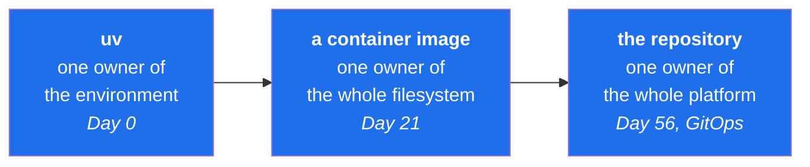

# 1.1 — Why one tool owns the environment

## One-line answer

Almost every "it works on my machine" bug has the same root cause — **more than one thing believes
it is in charge of which program runs your code and what is installed for it** — so the first
decision of this curriculum is to give exactly one tool that job, permanently.

---

## The story

🎬 **The scene.** Someone joins a team on a Monday. They are handed a laptop and a page of setup
instructions. They follow it. Everything works. They write a little code, run it, see the right
answer, and go home pleased.

😬 **The naive fix.** On Tuesday nothing works. The same command, in the same folder, on the same
laptop, now says it cannot find a piece of software that was definitely there yesterday. So they do
the obvious thing: they install it again. It says it is already installed. They install it a third
time, in a different way, from a different place. Now two other things are broken.

💥 **Why it fails.** There are four copies of the language on that laptop. One arrived with the
operating system. One came from the official download page. One was bundled inside a data-science
bundle they installed in their first hour. One is hidden inside the code editor. Each copy keeps its
own separate shelf of add-on software. When you type the name of the language, the machine does not
choose thoughtfully — it walks down a list of folders that it keeps, in order, and runs **the first
one it finds**. Installing almost anything can quietly reorder that list.

So on Monday the word meant copy number two, which had the add-on. On Tuesday, after an unrelated
install, the same word means copy number four, which does not.

💡 **The insight.** Nothing was broken. The word was ambiguous, and an ambiguous word gives a
different answer depending on when you ask it. The bug was never in the code — **the bug was that
two things were allowed to answer the same question.**

That person is not junior or careless. This happens to everyone, repeatedly, for years, and the
industry's entire packaging and container ecosystem is a response to it.

---

## The idea in plain language

Some words that will now appear constantly, each defined the first time you meet it.

**The interpreter** is the actual program that reads your Python code and does what it says. It is a
file on disk — on this machine, one of them lives at
`C:\Users\<you>\AppData\Local\Programs\Python\Python312\python.exe`. There can be many of these,
they can be different versions, and they do not know about each other.

**`PATH`** is a list of folders that the operating system keeps, in order. When you type a command
name, the system looks in each folder in that list, in order, and runs the **first** matching
program it finds. `PATH` is why typing `python` works at all — and it is why what `python` *means*
can change without you doing anything deliberate.

**Site-packages** is the shelf of add-on libraries belonging to *one particular interpreter*. Each
interpreter has its own. Installing a library puts it on one shelf. If tomorrow you are running a
different interpreter, you are reading a different shelf, and the library is "missing" even though
nothing was deleted.

**A virtual environment** is a small folder that contains a link to one interpreter and a private
shelf for that project only. It exists so that two projects on the same machine can want two
different, incompatible versions of the same library without fighting. It is not magic and not a
sandbox — it is a folder with a shelf in it.

**Dependency resolution** is the act of working out a set of library versions that can all coexist.
If your project wants library A, and A wants B version 2 or newer, and something else wants B
version 1, someone has to notice and decide. That someone is a resolver.

**A lockfile** is the written-down result of that decision: the exact version of every library that
was chosen, including the ones you never asked for directly, so the same set can be installed again
later and produce the identical shelf.

### The actual problem

Each of those five concepts historically had its own tool, and any of them could disagree with the
others:

| Job | The old way |
| --- | --- |
| Get an interpreter | download an installer, or a system package manager, or a version manager |
| Make a virtual environment | one tool |
| Install libraries onto its shelf | a second tool |
| Resolve compatible versions | often nothing at all — first-come-first-served |
| Write down what was chosen | a third tool, if anyone remembered |

Five tools, five opinions, and no single one of them able to see the whole picture. The "works on my
machine" bug is what it looks like when those five disagree.

**The fix is not a better tool for each job. The fix is one tool that does all five**, so there is
only one answer to "which interpreter, with which libraries, at which versions?" — and it is written
down in the repository rather than living in someone's memory.

That tool, for this curriculum, is `uv` ([1.3](1.3-uv-the-one-binary.md)).

### The same idea, three times, at three scales

This is worth noticing now because it is the shape of the next two hundred days:



A container is this same lesson applied to the entire filesystem instead of one language. GitOps
(Day 56) is this same lesson applied to an entire cluster: one place is authoritative, everything
else reconciles to it. **You are not learning a Python tool today. You are learning the shape of
every good answer in this field**, on the smallest possible example.

---

## Why Kriya needs it

Day 97 is *"Reproducible training — seeds, environments, and a run you can run again in a year"*, and
Day 107 is *"Reproducing a six-month-old prediction — the audit request, answered."*

Both are impossible without today. A trained model is a function of three things: the code, the data,
and **the environment it was trained in**. A model trained with one version of a numerical library
and scored with another can silently produce different numbers — not an error, just different
answers. If you cannot state exactly which libraries were installed at training time, you cannot
reproduce the model, and "why did the model say that?" becomes unanswerable.

The lockfile you commit today is what makes Day 107 a lookup instead of an apology.

---

## The mechanism

Look at the actual state of this machine. This is not a hypothetical.

```bash
uv python list | grep -i "3.12"
```

**Line by line:**

- `uv python list` asks `uv` to report every Python interpreter it can see — the ones it manages
  itself, the ones already installed on the system, and the ones it could download on request. It
  reads rather than changes anything, which is why it is safe to run first.
- `| grep -i "3.12"` filters that list to the lines mentioning 3.12. The `-i` makes the match
  case-insensitive, which costs nothing and avoids a surprise if the format ever capitalises
  differently. Filtering matters because the unfiltered list is long enough to hide the point.

Observed on **2026-08-24**:

```text
cpython-3.12.13-windows-x86_64-none    <download available>
cpython-3.12.12-windows-x86_64-none    C:\Users\nisha_gnzw\AppData\Roaming\uv\python\cpython-3.12-windows-x86_64-none\python.exe
cpython-3.12.10-windows-x86_64-none    C:\Users\nisha_gnzw\AppData\Local\Programs\Python\Python312\python.exe
graalpy-3.12.0-windows-x86_64-none     <download available>
```

**Three different 3.12 interpreters are in play on this one machine**, and they are not the same
program: `3.12.12` is managed by `uv`, `3.12.10` was installed by hand at some earlier point, and
`3.12.13` exists but is not here yet. Each of the two present ones has its own separate shelf.

Now the ambiguity, made concrete:

```bash
python -c "import sys; print(sys.executable)"
uv run python -c "import sys; print(sys.executable)"
```

**Line by line:**

- `python -c "…"` runs whatever the bare word `python` currently resolves to through `PATH` — the
  ambiguous question.
- `import sys; print(sys.executable)` makes the interpreter report **its own path on disk**. This is
  the single most useful diagnostic in Python, because it turns "which Python is this?" from a guess
  into a fact. `sys.executable` is the running interpreter's own file, not a configured value, so it
  cannot lie to you.
- `uv run python …` is the unambiguous form: `uv run` first makes sure the project's environment
  matches the lockfile, then runs the command **inside it**. Same code, different question — "the
  project's interpreter" rather than "whatever `PATH` says today".

Observed:

```text
C:\Users\nisha_gnzw\AppData\Local\Programs\Python\Python312\python.exe
c:\Users\nisha_gnzw\OneDrive\Desktop\Projects\ops\.venv\Scripts\python.exe
```

**Two different programs, from the same shell, seconds apart.** The first is 3.12.10 with whatever
was ever installed into it. The second is 3.12.12 with exactly the shelf this repository's lockfile
describes. Nothing is misconfigured — this is simply what an ambiguous question looks like when you
finally ask it precisely.

---

## When it breaks

Ask the system interpreter for something that lives on the project's shelf:

```text
C:\Users\nisha_gnzw\AppData\Local\Programs\Python\Python312\python.exe: No module named pytest
```

That is the real message, produced on this machine on 2026-08-24 by running `python -m pytest
--version` — the *bare* `python`, not `uv run python`.

**What it says:** no module named pytest.
**What it actually means:** you asked the wrong interpreter. `pytest` is installed — on the other
shelf. Notice the message helpfully prints the full path of the interpreter that could not find it,
which is the whole diagnosis sitting in plain sight.

**The smallest fix:** put `uv run` in front.

```bash
uv run python -m pytest --version
```

**Line by line:** `uv run` resolves the project environment first and then executes `python -m
pytest --version` inside it, so the command reaches the interpreter whose shelf actually holds
`pytest`. `-m pytest` runs pytest as a module of *that* interpreter rather than as a loose program
found on `PATH` — which matters, because a `pytest` command on `PATH` may belong to a completely
different interpreter than the one you think you are testing.

**The fix that is not a fix:** `pip install pytest`. It will appear to work. It installs `pytest`
onto whichever shelf the ambiguous `python` currently points at, making the symptom disappear
without removing the ambiguity — so it comes back later, on a different day, wearing a different
library's name. **Making a symptom vanish without removing its cause is the most common way an
environment becomes unmaintainable.**

---

## In production

**What a professional does differently.** They never rely on `PATH` inside anything automated. A CI
job, a container entrypoint, a cron job and a Kubernetes `command:` all name the interpreter
explicitly or go through a launcher that pins it. The interactive shell is the *only* place a bare
`python` is acceptable, and even there most people stop typing it.

**What degrades at scale.** On one laptop, ambiguity costs you an afternoon. On a team of thirty, it
costs a recurring meeting: everyone's environment drifts independently, so bugs stop reproducing and
"works on my machine" becomes a genuine, expensive disagreement about reality. The cost is not the
debugging — it is that people stop trusting failures, which is far worse.

**The failure that only shows with real traffic.** The nastiest version is not a missing library. It
is a *present* library at a different version. Nothing errors. A number changes in the fourth decimal
place. Your model's outputs shift slightly, your tests still pass because they assert ranges, and six
weeks later someone asks why the offline number and the production number disagree by half a percent.
Day 120 (*skew — the training/serving difference that only ever shows up in production*) is that
story told properly.

**The review comment a senior engineer leaves.** *"This Dockerfile runs `pip install -r
requirements.txt` with no lockfile. That means the image built today and the image built next month
are different software with the same tag. Pin it, or we cannot roll back to anything meaningfully."*

**The signal you would alert on.** None. This is a build-time property, not a runtime one, and paging
someone for it would be absurd. What you do instead is make it **impossible to merge**: a CI job that
fails when the lockfile is out of date with the manifest. That distinction — *some problems get a
gate, not an alert* — is one you will use for the rest of this plan, and it arrives properly on
Day 14.

**The interview question.** *"How do you make sure the code that passed CI is the same code that runs
in production?"* A weak answer talks about tests. A strong answer talks about **artifacts and pins**:
one lockfile, one image built once and promoted by digest rather than rebuilt per environment, and a
version recorded at build time that the running service reports back. Days 15, 27 and 39 build
exactly that.

**Blast radius, stated plainly.** Today you introduce no new capability — you *remove* one. Before
today, any tool could change what `python` means. After today, one tool owns that answer and it is
written down in a file that is committed. The worst case is a slow install, and the bound is that
nothing outside `uv` is allowed to make this decision.

**Cost:** `0` requests, `0` tokens. Disk: a few hundred MB for the managed interpreter and the
project's shelf.

---

## Check yourself

```bash
python -c "import sys; print(sys.executable)" && uv run python -c "import sys; print(sys.executable)"
```

If those two lines print the same path, say so — it means `PATH` currently happens to point at the
project's environment, which is luck rather than design, and it will stop being true.

**Say out loud, without scrolling up:** *what is actually different between the two interpreters
those commands printed — not "one is the venv", but what does that difference consist of?*
