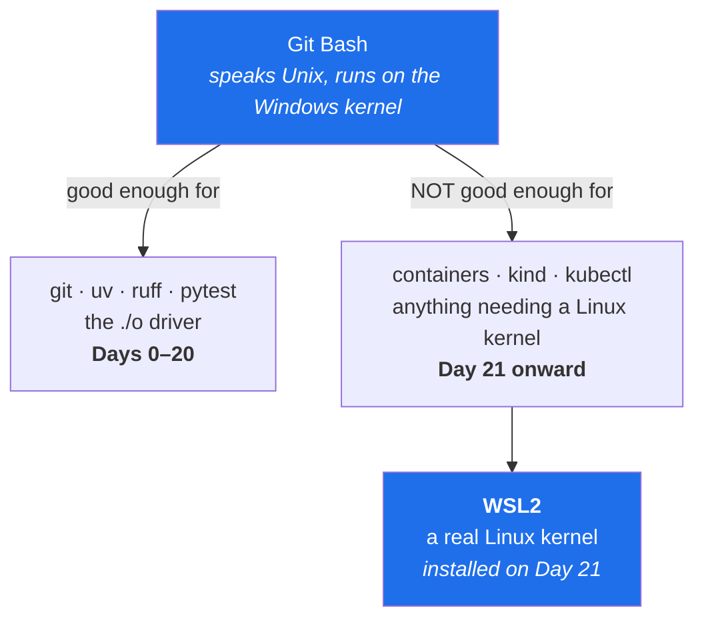

# 1.2 — Git and the shell these documents assume

## One-line answer

Every command in all 237 days is written for **Git Bash**, the Unix-style shell that installs with
Git for Windows, because the entire world of servers, containers and clusters you are about to
operate speaks that dialect — and learning a second dialect for your laptop only would be a tax you
pay every day for no benefit.

---

## The story

🎬 **The scene.** Someone is following a well-written guide for setting up a server. Step four says
to run a command that copies a file and then prints how big it is. They paste it into the black
window on their Windows machine.

😬 **The naive fix.** It fails with a message about a term not being recognised. They assume they
mistyped it, so they type it again by hand, slowly. Same message. They search for the error, find a
page suggesting a completely different command, paste that in, and it works — but prints something
that looks nothing like the guide's screenshot.

💥 **Why it fails.** The guide was written for one command language and they are typing into a
different one. The two are not variations in style. They are separate languages with separate words
for the same ideas, separate rules for quoting, separate rules for chaining two commands together,
and separate ideas about what a file path even looks like. The command was never wrong; it was
addressed to a different listener.

💡 **The insight.** A shell is a **language**, not a window. Choosing which one your documents speak
is a real decision with real consequences, and the only wrong choice is leaving it unstated so that
every reader guesses.

---

## The idea in plain language

**A shell** is a program that reads what you type, decides what it means, and runs it. It is the
thing that turns the text `ls -la` into an actual listing of files. Every operating system ships at
least one, and they do not agree with each other.

Three matter here:

| Shell | Where it comes from | Speaks |
| --- | --- | --- |
| **Git Bash** | installs with Git for Windows | the Unix dialect — `ls`, `grep`, `mkdir -p`, `&&` |
| **PowerShell** | ships with Windows | its own object-based dialect — `Get-ChildItem`, `Select-String`, `New-Item` |
| **Command Prompt** | ships with Windows, much older | a third, smaller dialect |

**Git** is a separate thing entirely: a program that records the history of a folder. It is the
subject of [3.1](../03-repo-skeleton/3.1-what-a-repository-actually-is.md). It matters *here* only
because on Windows the Git installer also brings Git Bash along with it, so installing one gets you
both.

### Why the Unix dialect, specifically

Not preference. Three concrete reasons:

1. **Everything you will operate speaks it.** A container image (Day 21) runs Linux. A Kubernetes
   pod (Day 33) runs Linux. `kubectl exec` drops you into a Linux shell. A CI runner (Day 13) is
   Linux by default. If your laptop speaks a different dialect than every machine you administer,
   you translate constantly and you build no muscle memory for the environment that actually matters.
2. **Every command you will ever search for is written in it.** Documentation, error-message
   answers, project READMEs — overwhelmingly Unix-shell. A translation step between finding an answer
   and using it is a small tax charged on every single problem you ever have.
3. **The `./o` driver is a shell script** ([4.1](../04-the-driver/4.1-why-a-driver-script-not-make.md)),
   and it is written in this dialect for the same reasons.

**PowerShell is not worse.** It is genuinely better at some things — it passes structured objects
between commands rather than text, which is a real advantage. It is simply not the language your
servers speak, and this curriculum is about servers.

### The one thing that is genuinely different, not just differently spelled

Most differences are vocabulary — `ls` versus `Get-ChildItem` — and vocabulary is cheap. One
difference is structural and worth knowing now, because it will bite you when you translate a
command yourself:

**Chaining.** In the Unix dialect, `a && b` means *run `b` only if `a` succeeded*. That "only if" is
load-bearing throughout this curriculum: it is how a gate refuses. Windows PowerShell 5.1 — the
version that ships with Windows — **does not have `&&` at all**; it is a parser error, not a
different behaviour. The equivalent is `a; if ($?) { b }`.

So a command you translate carelessly can silently lose its "only if", turning a gate into a
suggestion. `days/README.md` carries the full translation table for exactly this reason.

---

## Why Kriya needs it

Day 21 is the first container, and from Day 32 you have a Kubernetes cluster. From that point
onward a large fraction of your commands run *inside* something Linux-shaped — `docker run`,
`kubectl exec`, a CI step, a container `ENTRYPOINT`. On Day 26 you will write a container healthcheck
that is a shell command, and it runs in the container's shell, not yours.

If your laptop shell is the same dialect, all of that is one language you are getting better at every
day. If it is not, every one of those is a small translation with a small chance of an error, and the
errors are the sort that fail quietly.

---

## The mechanism

Confirm what you have. Everything today assumes both of these answer.

```bash
git --version
echo "$SHELL"
uname -s
```

**Line by line:**

- `git --version` proves Git is installed and on `PATH`. If this fails, nothing else in this
  curriculum can start — Git is the one genuinely non-optional install.
- `echo "$SHELL"` prints the path of the shell you are in. The quotes around `$SHELL` are not
  decoration: unquoted, a value containing a space would be split into several words, and Windows
  paths contain spaces constantly. **Quote every variable expansion, always** — this is the single
  most common bug in hand-written shell scripts.
- `uname -s` prints the kind of system the shell believes it is on. Its answer here is informative
  in a way you might not expect, which is the point of running it.

Observed on **2026-08-24**:

```text
git version 2.54.0.windows.1
/bin/bash.exe
MINGW64_NT-10.0-26200
```

Read those carefully, because each one tells you something:

- `2.54.0.windows.1` — the `.windows.1` suffix says this is Git for Windows specifically, the build
  that carries Git Bash with it.
- `/bin/bash.exe` — look at that path twice. `/bin/…` is a Unix-style location on a machine whose
  real paths start with `C:\`, and `.exe` is a Windows executable extension. Both halves of what Git
  Bash is are visible in one string: a Unix-shaped view of the filesystem, over Windows programs.
- `MINGW64_NT-10.0-26200` — **not Linux.** This is the honest answer: Git Bash is a Unix-*dialect*
  environment running on the Windows kernel, not a Linux machine. It speaks the language; it is not
  the same operating system.

That last point has a consequence you should hold onto:



Git Bash is a language, not a kernel. It carries you cleanly through the first twenty days. The
moment you need real Linux behaviour — namespaces, cgroups, the things containers are actually made
of — you need WSL2, which Day 21 installs. Knowing *now* that Git Bash is not Linux will save you a
confusing hour then.

---

## When it breaks

The most common Git Bash surprise on a Windows machine, and it is not an error message:

```bash
cd /c/Users/nisha_gnzw/OneDrive/Desktop/Projects/ops
```

**Line by line:** `cd` changes directory. `/c/Users/...` is Git Bash's translated spelling of
`C:\Users\...` — the drive letter becomes a top-level folder and the backslashes become forward
slashes. It is the *same* folder, spelled in the dialect. Typing the Windows spelling `C:\Users\...`
into Git Bash usually fails or, worse, half-works, because the backslash is the escape character in
this language rather than a path separator.

When you get it wrong, the message is:

```text
/usr/bin/bash: line 1: cd: C:Usersnisha_gnzwOneDrive: No such file or directory
```

**What it says:** that folder does not exist.
**What it actually means:** the shell consumed every backslash as an escape character and then
looked for the resulting mangled name. Look at the path in the message and compare it to what was
typed — the backslashes are simply *gone*, and the words have been glued together. That is the tell,
and once you have seen it once you will recognise it instantly. (The underscore survived because it
is an ordinary character; only the backslashes were eaten.)

**The smallest fix:** use forward slashes, or wrap the path in single quotes so nothing is
interpreted.

There is a second surprise worth naming, because it produces no error at all: **a script written on
Windows can carry invisible line endings** that Linux does not expect. When such a file is run inside
a container on Day 23, the failure is the memorable
`/bin/sh: 1: ./entrypoint.sh: not found` — a file that visibly exists, reported as missing, because
the interpreter name on its first line ends with an invisible character. Day 23 meets this properly;
today just know the phrase *line endings* so it is not new when it appears.

---

## In production

**What a professional does differently.** They do not write shell scripts of any length. Shell is
excellent glue for ten lines and treacherous at a hundred — no types, no real data structures, and
quoting rules that turn a filename with a space into a security incident. The rule of thumb: if a
script grows past roughly a screen, or needs an array, or needs to parse anything, it becomes a
Python program. `./o` is deliberately near that limit and no further, and
[4.3](../04-the-driver/4.3-the-dispatcher-and-resolving-a-day.md) shows where it hands off to Python.

**What degrades at scale.** A team where everyone uses a different shell cannot share commands. It
sounds trivial and it is not: runbooks (Day 79) stop being copy-pasteable, and a runbook you must
translate at 3am while half awake is a runbook that produces incidents rather than resolving them.
**Standardising the shell is a reliability decision**, not a style one.

**The failure that only shows with real traffic.** Shell scripts that work on every filename you have
ever tested, then break on the one containing a space, a quote or a newline. In an ops context that
is not theoretical — a log file, a branch name, or a customer-supplied value ends up in a script, is
unquoted, and gets split into words. This is the mechanism behind a whole family of real security
vulnerabilities, and the defence is boring: **quote every expansion**.

**The review comment a senior engineer leaves.** *"`for f in $(ls *.log)` will break the first time a
filename has a space in it, and `ls` output was never meant to be parsed. Use a glob directly:
`for f in *.log`."*

**The signal you would alert on.** None — this is authoring-time, not runtime. What you do instead is
lint it. `shellcheck` is the standard tool and it catches unquoted expansions mechanically; the
`./o check` gate gains it on Day 14 when the quality gates are built properly.

**Blast radius, stated plainly.** Git Bash introduces no privilege and no network exposure. Its worst
case is a mistyped destructive command — `rm -rf` in the wrong directory — which is bounded only by
your own care. The real bound arrives on Day 32 with the `KUBECONFIG` rule: point it at the local
cluster only, so a mistyped command cannot reach anything that matters.

**Cost:** `0` requests, `0` tokens, negligible disk. Git for Windows is a one-time install.

---

## Check yourself

```bash
uname -s && echo "$SHELL" && git --version
```

All three must answer. If `uname -s` says something containing `MINGW`, you are in Git Bash and
every command in this curriculum will work as written.

**Say out loud, without scrolling up:** *Git Bash speaks the same language as a Linux server but is
not one — so what specifically will it not be able to do on Day 21, and what gets installed then?*
