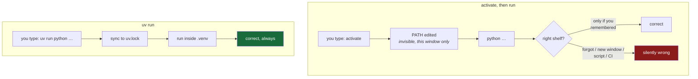

# 1.4 — The virtual environment you never activate

## One-line answer

`.venv` is an ordinary folder containing a text file that points at an interpreter and a shelf of
libraries — and because `uv run` addresses it directly, **you never activate it**, which removes an
entire category of "which environment am I in?" mistakes by removing the hidden state that causes
them.

---

## The story

🎬 **The scene.** Someone has two terminal windows open, working on two projects. In the left window
they are fixing a bug. In the right window they are checking something on the other project. They
install a library. The install succeeds.

😬 **The naive fix.** Back in the left window, the library is missing. Puzzled, they install it
again. It succeeds again. It is still missing. They restart the terminal. Now a *different* library
is missing, one they never touched.

💥 **Why it fails.** Their two windows were pointed at two different shelves, and nothing on screen
said which. The pointing had been done earlier, by a command typed in one window and not the other,
and it left no visible trace afterwards. So "install this" meant two different things in two
identical-looking windows, and the only way to know which was to remember what you had typed in that
particular window some time ago.

💡 **The insight.** The problem is not the two shelves. Two shelves is correct and necessary. The
problem is **invisible state**: a setting that changes what your commands mean, is not shown
anywhere, and is scoped to a window rather than to a project. If you remove the invisible state, the
entire class of mistake goes with it.

---

## The idea in plain language

**A virtual environment is a folder.** That is the whole thing, and it is worth saying plainly
because the name suggests something far more elaborate. Inside are three things: a small text file
naming which interpreter this environment belongs to, a folder of installed libraries (the *shelf*
from [1.1](1.1-why-one-tool-owns-the-environment.md)), and a folder of executable shims so that
programs installed by those libraries can be run.

**Activation** is the traditional way to use one. You run a script that edits your current shell's
`PATH` so the environment's folder comes first, meaning that from now on, *in this window only*, the
bare word `python` resolves to that environment's interpreter. It typically also changes your prompt
to show the environment's name.

Activation works. Its problem is what it *is*: a modification to one shell session, invisible to
everything outside that session, that expires when the window closes and is silently absent in every
context that is not an interactive window — a script, a scheduled job, a CI step, a container.

### The alternative: address it directly

If activation means "make the bare word `python` mean the right thing", then the alternative is
obvious once stated: **do not use the bare word.** Say which interpreter you mean, every time.

`uv run <command>` does that. It resolves the project environment — creating and syncing it first if
needed — and runs your command inside it. No shell state is modified. Nothing expires. The command
means the same thing in a terminal, in a script, in `./o`, and in CI.

| | Activate then run | `uv run` |
| --- | --- | --- |
| Where the choice lives | your shell session, invisibly | the command itself, visibly |
| Survives closing the window | no | yes |
| Works identically in a script or CI | no | yes |
| Ensures the environment matches the lockfile | no | **yes, every time** |
| Can be wrong without you noticing | yes | no |

That fourth row is the one people underestimate. `uv run` does not merely *use* the environment; it
first makes the environment match `uv.lock`. So a teammate who pulls a commit that added a dependency
does not need to remember to install anything — their next `uv run` handles it. **The lockfile stops
being a document you must obey and becomes one the tool enforces.**

### The cost, honestly

Typing `uv run python …` is longer than `python …`. That is the entire downside, and it buys the
removal of a whole failure class. In practice it disappears anyway, because commands you run often
end up inside `./o` ([4.1](../04-the-driver/4.1-why-a-driver-script-not-make.md)), where you type
`./o check` and the four `uv run` invocations are somebody else's problem — specifically, yours,
once, on Day 0.

---

## Why Kriya needs it

Day 46 is *"Jobs and CronJobs — the batch half of every ML system"*, and Day 94 is *"Scheduling and
dependencies — the nightly job that must never run twice."*

A scheduled job has no interactive shell. Nobody types anything; nothing is activated. If the way you
run code depends on a human having typed an activation command in a window, then **the way you run
code does not work in production at all** — it works in the one context that does not matter. Every
command in this curriculum is written so that it runs identically whether a person or a scheduler
issues it, and that property starts here.

---

## The mechanism

Look inside the folder. There is less there than the mythology suggests.

```bash
ls .venv/
cat .venv/pyvenv.cfg
```

**Line by line:** `ls .venv/` lists the environment's top level. `cat .venv/pyvenv.cfg` prints the
one file that makes a plain folder into an environment — the `pyvenv.cfg` name is a Python
convention, not a `uv` invention, so every tool that understands virtual environments reads it.

Observed on **2026-08-24**:

```text
CACHEDIR.TAG
Lib
Scripts
pyvenv.cfg
```

```text
home = C:\Users\nisha_gnzw\AppData\Roaming\uv\python\cpython-3.12-windows-x86_64-none
implementation = CPython
uv = 0.12.3
version_info = 3.12
include-system-site-packages = false
prompt = kriya
```

**Line by line:**

- `home = …AppData\Roaming\uv\python\cpython-3.12-windows-x86_64-none` — the interpreter this
  environment belongs to. Note *where*: inside `uv`'s own managed Python directory, **not** the
  system Python at `AppData\Local\Programs\Python\Python312` that
  [1.1](1.1-why-one-tool-owns-the-environment.md) found. `uv` fetched its own rather than borrowing
  whatever happened to be installed, which is precisely the "one owner" principle in action.
- `implementation = CPython` — which *kind* of Python. There are others (PyPy, GraalPy — the
  `uv python list` output in 1.1 showed a GraalPy available), and they are not interchangeable for
  anything with compiled extensions, which in an ML project is nearly everything.
- `uv = 0.12.3` — the tool that created this folder, recorded in the folder. A small thing that makes
  a confusing environment diagnosable a year later.
- `version_info = 3.12` — satisfies the `requires-python = "==3.12.*"` in `pyproject.toml`.
- `include-system-site-packages = false` — **this single line is the isolation.** It says: do not
  fall back to the system interpreter's shelf. Set it to `true` and your environment silently
  inherits every library ever installed system-wide, which makes it work on your machine and fail
  everywhere else — the exact bug this whole section exists to prevent.
- `prompt = kriya` — what an activation script would display. Sitting here unused, because you are
  not going to activate it.

So: **a text file and two folders.** No daemon, no registry, nothing hidden. When something is wrong
with an environment, you can read it.

Now prove that addressing it directly needs no activation:

```bash
uv run python -c "import sys; print(sys.executable); print(sys.prefix)"
```

**Line by line:** `sys.executable` is the running interpreter's own path on disk;
`sys.prefix` is the root of the environment it considers itself to be in. Printing both together
answers "which interpreter, in which environment?" in one command — and neither value is configurable
by you, so neither can be stale or misleading.

```text
c:\Users\nisha_gnzw\OneDrive\Desktop\Projects\ops\.venv\Scripts\python.exe
c:\Users\nisha_gnzw\OneDrive\Desktop\Projects\ops\.venv
```

No activation happened. No shell variable was set. The next command in the same window is completely
unaffected — which is the point.



---

## When it breaks

The failure mode of activation is that it produces **no error at all** — it produces the wrong
answer, confidently. From this very shell:

```text
C:\Users\nisha_gnzw\AppData\Local\Programs\Python\Python312\python.exe: No module named pytest
```

That is `python -m pytest --version` without `uv run`, observed on 2026-08-24. Here it errored,
because the system interpreter happens not to have `pytest`. **The dangerous version is when it does
not error** — when the system interpreter has *a* `pytest`, of a different version, and your tests
run against software you did not choose. Same command, no error, wrong answer.

**What it says:** no module named pytest.
**What it actually means:** you addressed the wrong interpreter, and this time you were lucky enough
to be told.

**The smallest fix:** `uv run python -m pytest --version`.

There is a second, sneakier failure worth knowing: **a stale `.venv`.** Change the Python version in
`pyproject.toml`, and the existing folder still points at the old interpreter. `uv sync` handles this
correctly, but if you ever find yourself with an environment that disagrees with its own config, the
fix is not archaeology:

```bash
rm -rf .venv && uv sync
```

**Line by line:** `rm -rf .venv` deletes the environment folder entirely — `-r` recurses into it,
`-f` suppresses complaints about files that are not there. `&& uv sync` rebuilds it from
`pyproject.toml` and `uv.lock`, which takes seconds. **This is safe precisely because the environment
is derived**, never authoritative: everything needed to recreate it is committed. If deleting `.venv`
would lose something, something has been put in the wrong place.

Being *able* to delete your environment without fear is the same instinct as being able to delete
your cluster without fear (Day 32, Addendum 02 §6). It is worth practising on the cheap version
first.

---

## In production

**What a professional does differently.** They never activate anything in anything automated. A
container image sets its interpreter path explicitly; a CI job uses `uv run` or the full path; a
Kubernetes `command:` names the binary. Activation, where it survives at all, survives as a
convenience for interactive exploration — and many people have stopped using it even there, because
one habit is easier to hold than two.

**What degrades at scale.** `.venv` on a laptop is fine. `.venv` inside a container image is usually a
mistake: you have paid for a full copy of every library *inside* an image that is already an
isolated filesystem, which is isolation twice at double the size. Day 23 and Day 24 face this
decision directly — install into the image's own interpreter, or copy a prepared environment in from
a build stage. The answer is not obvious and it is worth having the argument properly rather than
copying a template.

**The failure that only shows with real traffic.** An environment assembled at container *start* time
rather than build time — a startup script that runs an install before launching the service. It works
for months. Then the package index has an outage, or a version is yanked, and **every replica that
restarts fails to come back** while the ones still running are fine. You now have a partial outage
that deepens each time something restarts, and the cause is not in your code at all. Day 122 (the
serving failure lab) includes exactly this shape. **Build-time work belongs at build time.**

**The review comment a senior engineer leaves.** *"This `Dockerfile` runs `pip install` in the
`CMD`. That means we depend on the package index being up in order to scale up. Move it to a build
layer."*

**The signal you would alert on.** Not the environment itself — but container **restart count** and
**time to ready**, both of which you will have from Day 41's probes and Day 64's instrumentation. A
pod that takes progressively longer to become ready is very often doing work at start time that
belongs at build time, and that is the signal that catches it before an index outage does.

**Blast radius, stated plainly.** `.venv` is a derived folder inside the repository. It is gitignored,
it holds no secrets, and nothing outside this project reads it. Worst case: it becomes inconsistent
and you delete it. The bound is that it can always be rebuilt from two committed files — which is
what makes deleting it a repair rather than a loss.

**Cost:** `0` requests, `0` tokens. Disk: this environment is small; an ML one later will be over a
gigabyte, which is why Day 24 exists.

---

## Check yourself

```bash
uv run python -c "import sys; print(sys.prefix)"
```

It must print a path ending in `.venv` inside this repository. If it prints anything else, you are
not running where you think you are.

**Say out loud, without scrolling up:** *what exactly does activation change, and why does that
change stop working the moment a scheduler runs your job instead of you?*
