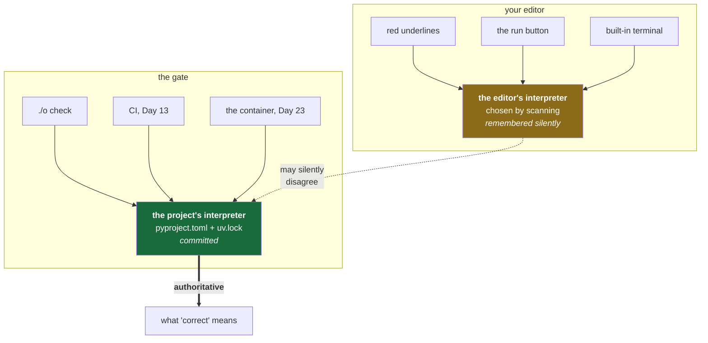

# 1.5 — The editor's interpreter trap

## One-line answer

Your editor keeps its **own** opinion about which interpreter to use, entirely separate from the one
`uv run` uses — so the editor can be green while the gate is red, or red while the gate is green, and
the rule that resolves it is that **the gate is authoritative and the editor is a guess**.

---

## The story

🎬 **The scene.** Someone is halfway through a change. The editor is calm: no red underlines, the
little "run" arrow works, the tests pass when they click it. They push.

😬 **The naive fix.** The pipeline goes red on a missing library. Confused, they run the tests again
by clicking the arrow. Green. They push an empty commit to re-trigger the pipeline, on the theory
that it was a fluke. Red again, same message. They begin to suspect the pipeline machine is broken.

💥 **Why it fails.** The pipeline is fine. Two different programs ran those tests. Clicking the arrow
in the editor ran one interpreter, chosen by the editor at some point in the past and remembered
silently. The pipeline ran a different one, built from the committed files. The library was on one
shelf and not the other. **Both results are correct answers to different questions**, and nothing on
screen said which question was being asked.

💡 **The insight.** An editor is a *client* of your environment, not the owner of it. When the two
disagree, do not ask which one is broken — ask which one is **authoritative**. If the answer is not
already decided, you will re-litigate it every time, at the worst moment.

---

## The idea in plain language

**A code editor does two things that look like one thing.** It edits text, and it also runs a small
army of background helpers over that text: something that reports undefined names and missing
imports, something that formats, something that runs tests when you click a button, and a built-in
terminal.

Every one of those helpers needs an interpreter, and the editor chooses one for them — from a list
it discovers by scanning your machine. Its choice is stored per-workspace and is not visible unless
you go and look.

So there are now **two independent answers** to "which interpreter?":

| | Chosen by | Stored where | Used for |
| --- | --- | --- | --- |
| The editor's | the editor, by scanning | editor settings, per workspace | red underlines, the run button, autocomplete |
| The project's | `pyproject.toml` + `uv.lock` | the repository, committed | `uv run`, `./o check`, CI, containers |

**These are not required to agree, and nothing warns you when they do not.**

The failure is worse than a plain error, for two reasons. First, it is *asymmetric*: the editor being
wrong in the optimistic direction (green when the gate would be red) means you push broken work; the
editor being wrong in the pessimistic direction (red underlines on a perfectly good import) trains
you to ignore your own tooling, which is arguably worse. Second, it is *silent*: nothing in the
window says "by the way, I am using a different Python than your project."

### The rule

**The gate is authoritative. The editor is a convenience.**

`./o check` ([4.4](../04-the-driver/4.4-the-check-gate.md)) is what decides whether the repository is
healthy, because it is the same thing CI runs and the same thing a teammate runs. The editor's
opinion is a fast local approximation. When they disagree, **the editor is wrong by definition** —
not because editors are bad, but because the definition of "correct" is "what the gate says", and it
is the gate that is committed and shared.

Once you hold that rule, the fix is administrative rather than mysterious: point the editor at the
same environment, and treat any remaining disagreement as a bug in the editor's configuration.

---

## Why Kriya needs it

Day 14 is *"Quality gates — lint, format, types, tests, and a gate that refuses rather than warns."*

That day's whole argument is that a warning nobody must act on is decoration, and a gate that refuses
is the only thing that changes behaviour. But a gate is worthless if a developer can be *convincingly
told the opposite locally*. Every minute your editor spends confidently lying to you is a minute of
trust drained from the gate, and once people stop believing their tools, they start pushing to see
what CI says — which turns a fifteen-second local check into a five-minute remote one.

The habit that starts today — **believe `./o check`, not the underline** — is what makes Day 14
possible.

---

## The mechanism

There are two things to do: point the editor at the project's environment, and know how to prove
which one it actually used.

First, make the choice explicit and committed rather than remembered:

```json
{
  "python.defaultInterpreterPath": "${workspaceFolder}/.venv/Scripts/python.exe",
  "python.terminal.activateEnvironment": false
}
```

**Line by line:**

- This is `.vscode/settings.json` — workspace settings that live **in the repository**, so the
  decision is shared with anyone who opens it rather than living in one person's machine. Committing
  it is the point; a setting only you have is the invisible state
  [1.4](1.4-the-venv-you-never-activate.md) exists to remove.
- `python.defaultInterpreterPath` names the interpreter to prefer. It is the long-standing setting
  for this and is documented as the legacy path-based option — newer versions of the Python extension
  discover workspace environments automatically by scanning for `./**/.venv`, so on a healthy setup
  this line is a belt-and-braces confirmation of what the extension would find anyway. *Verified
  against `code.visualstudio.com/docs/python/environments` on 2026-08-24.*
- `${workspaceFolder}` is a variable the editor substitutes for the repository root, so the setting
  is portable — it does not hard-code `C:\Users\nisha_gnzw\…` and therefore still works for someone
  who clones this repo somewhere else. **Hard-coding an absolute path into a committed settings file
  is a small act of hostility toward your future teammates.**
- `/.venv/Scripts/python.exe` is the Windows layout. On macOS or Linux it is `.venv/bin/python`. This
  is the one line in the file that is not portable across operating systems, which is worth knowing
  before someone opens it on a Mac and it silently does nothing.
- `python.terminal.activateEnvironment: false` stops the editor auto-activating the environment in
  every terminal it opens. That is deliberate and follows directly from
  [1.4](1.4-the-venv-you-never-activate.md): you do not want an invisible activation happening on
  your behalf, because then commands in the editor's terminal behave differently from commands in a
  plain terminal, and you have reintroduced exactly the hidden state you removed.

Then, the diagnostic that settles any argument, run **in the editor's own terminal**:

```bash
uv run python -c "import sys; print(sys.executable)"
python -c "import sys; print(sys.executable)"
```

**Line by line:** the first line asks the project which interpreter it uses; the second asks the
shell which one it would use by default. Running both **in the editor's terminal** is what makes this
a test of the editor rather than a test of your shell. If the second line prints something outside
`.venv`, then anything the editor does through that terminal — and quite possibly its run button too
— is using a different interpreter than your gate.

Observed in this repository on **2026-08-24**:

```text
c:\Users\nisha_gnzw\OneDrive\Desktop\Projects\ops\.venv\Scripts\python.exe
C:\Users\nisha_gnzw\AppData\Local\Programs\Python\Python312\python.exe
```

**They differ, right now, on a correctly configured machine.** That is not a fault to fix — it is the
normal state, and it is exactly why the rule exists. The bare `python` is the system interpreter; the
project's is `.venv`. Nothing is broken; two questions simply have two answers.



---

## When it breaks

The honest thing about this failure is that **its most common form is not an error message** — it is
a red underline under a line of code that is completely fine, or a green tick on code that is not.

The mechanism is easiest to see without the editor in the way. Ask the system interpreter to run
something that needs the project's shelf:

```text
C:\Users\nisha_gnzw\AppData\Local\Programs\Python\Python312\python.exe: No module named pytest
```

That is real output from this machine on 2026-08-24 (`python -m pytest --version`, no `uv run`). When
your editor is pointed at the wrong interpreter, **this is the same failure**, rendered as a squiggle
under `import pytest` instead of as a line of text — same cause, friendlier costume.

**What it says:** the module is not there.
**What it actually means:** the thing asking is not the thing you installed into.
**The smallest fix:** point the editor at `.venv`, via *Python: Select Interpreter* in the command
palette (*verified against `code.visualstudio.com/docs/python/environments` on 2026-08-24*) or via
the settings file above.

> `TODO(me)` Break it on purpose, once, so you recognise it: use *Python: Select Interpreter* to
> choose the **system** interpreter, look at what your editor does to a line importing `pytest`, and
> **write the exact message your editor shows into `docs/INCIDENTS.md`.** Editors differ and change;
> the string that matters is the one *yours* prints. Then switch back and confirm the underline goes
> away while `./o check` was green throughout — which is the whole lesson in one observation.

---

## In production

**What a professional does differently.** They commit the editor configuration. A `.vscode/` folder
with interpreter, formatter and test-runner settings is treated as part of the repository, exactly
like `pyproject.toml`, because "works on my machine" applies to tooling as much as to code. Teams
that do this stop having the conversation entirely; teams that do not have it once per new hire,
forever.

**What degrades at scale.** In a monorepo with several projects and several environments, the
editor's single per-workspace interpreter choice stops being expressive enough — one window, several
correct answers. The way out is not cleverer editor configuration; it is that the *gate* becomes the
only thing anyone trusts, and the editor is demoted to autocomplete. Which is the rule from the top
of this page, arriving on its own from a different direction.

**The failure that only shows with real traffic.** The dangerous inversion is the editor being
*optimistic*. A background helper resolves an import that the runtime cannot, because the helper is
reading a different shelf — code ships, and the failure appears at import time in production, on
startup, on every replica at once. Startup failures are the worst kind: they take out the new version
completely rather than degrading it, so the blast radius is a failed rollout rather than a slow
endpoint. Day 41's readiness probes and Day 112's canary exist so that this is caught by one replica
rather than all of them.

**The review comment a senior engineer leaves.** *"CI failed on an import that your editor resolved
fine. Before you retry the job — which interpreter did your editor use? If it isn't `.venv`, that's
the bug, and it'll happen again next week."*

**The signal you would alert on.** Nothing here is alertable — it is a developer-experience problem
with a production tail. The right control is the gate: `./o check` must be **trivial to run and fast
enough that people run it before pushing**. Speed is a reliability property here. A check that is
slow is a check that gets skipped, and a check that gets skipped is a check that does not exist.

**Blast radius, stated plainly.** Committing `.vscode/settings.json` affects every person who opens
this repository in that editor. Worst case: a setting that is wrong for someone else's operating
system (the `Scripts` versus `bin` path above) makes their editor point at nothing. That is a
visible, harmless failure — the editor complains and they choose an interpreter — and it is bounded
by the fact that **no editor setting can change what `./o check` does.** The gate reads the
repository, not the editor. Keeping that boundary intact is what makes it safe to commit editor
config at all.

**Cost:** `0` requests, `0` tokens, `0` disk beyond a small settings file.

---

## Check yourself

Run this **in your editor's built-in terminal**, not a separate one:

```bash
uv run python -c "import sys; print(sys.prefix)" && ./o check
```

The first must print a path ending in `.venv` inside this repository; the second must end `OK all
green`.

**Say out loud, without scrolling up:** *your editor shows a red underline on an import, and
`./o check` is green — which one do you believe, and what is the reason that answer does not depend
on how confident the editor looks?*
