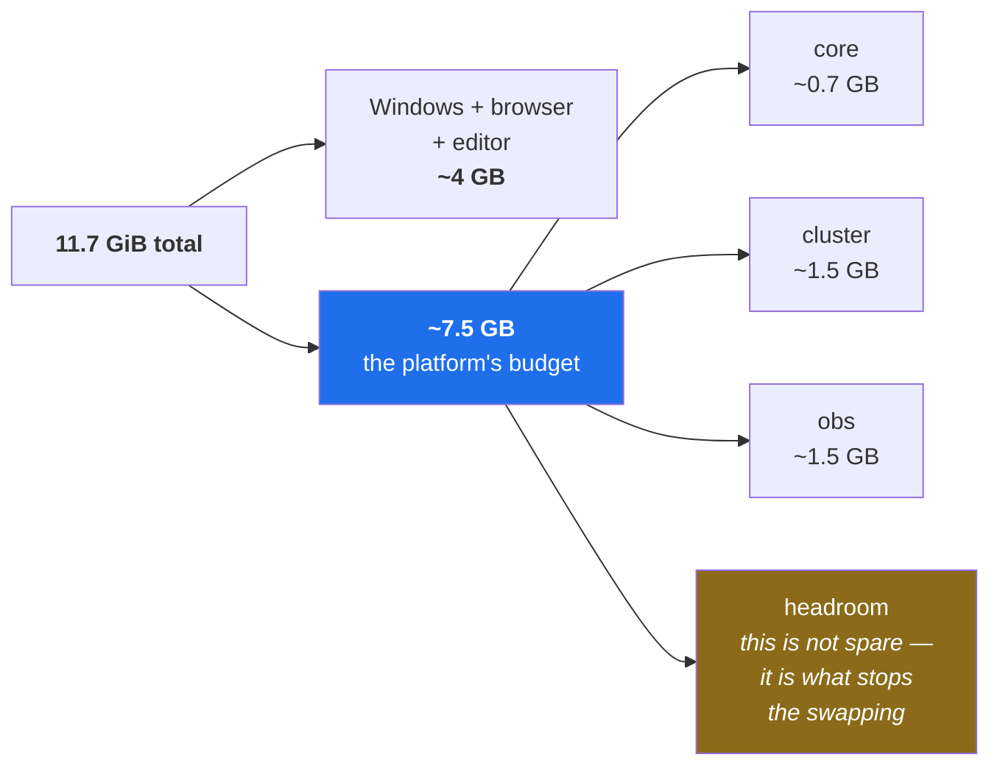

# 2.1 — The numbers your machine actually has

## One-line answer

Measure your machine's memory, cores and free disk **today**, write them into
`docs/PACKAGES.md`, and treat them as the budget every later day spends — because operations is the
practice of running real work inside real limits, and you cannot reason about a limit you have never
looked up.

---

## The story

🎬 **The scene.** A team is preparing a demo. Everything works on the laptops. On the morning of the
demo they move it to the shared machine that will actually run it, start everything up, and begin.

😬 **The naive fix.** Ten minutes in, one piece stops responding. They restart it. It comes back,
and something else stops. They restart that. The first thing stops again. They spend the demo playing
whack-a-mole, apologising, and concluding afterwards that the shared machine "has a problem".

💥 **Why it fails.** The shared machine had less memory than the laptops. Everything they were
running fitted comfortably on a laptop and did not fit here, so as each piece grew, the system
quietly picked whichever one was largest and stopped it to make room. There was no bug in any of
those programs. There was no error in any of the code. The machine did exactly what it is designed
to do when asked for more than it has, and nobody had checked what it had.

💡 **The insight.** *"It works on my machine"* is not only about software versions. It is also about
**how much machine there is**. A system's behaviour is a function of its limits, and a limit you have
not measured is a limit you will discover at the worst possible moment — usually as something being
killed, with no explanation, in front of an audience.

---

## The idea in plain language

Four numbers govern almost everything you will do for the next two hundred days.

**Memory (RAM)** is the working space where running programs keep the data they are currently using.
It is finite and it is not shared politely: when it runs out, the operating system does not slow
everything down fairly and ask nicely — it **chooses a program and stops it**. That mechanism has a
name you will meet again on Day 6 and Day 30, and the important property is that the stopped program
gets no chance to explain itself. From the outside, it simply vanishes.

**Cores** are how many things the machine can genuinely do at the same instant. A machine with four
cores can run four streams of work simultaneously; asking it to run twelve does not fail, it just
means each one gets a slice and everything takes longer. **This is the constraint people miss**,
because it never produces an error — it produces slowness, and slowness gets blamed on whatever you
happen to be looking at.

**Disk** is where things are kept when they are not being worked on. It fills up quietly, over weeks,
and the programs that fill it are usually the ones whose job is to write things down — logs, images,
datasets, model artifacts. Running out of disk produces some of the most confusing failures in this
whole field, because a program that cannot write may fail somewhere completely unrelated to writing.

**Swap** is the machine's emergency move when memory runs out: it moves some memory contents onto
disk to free space. This does not fail, which is the problem. Disk is enormously slower than memory,
so a machine that has started swapping is often *worse* than one that has cleanly stopped something —
it stays alive and becomes uselessly slow, which is harder to diagnose than a clean failure.

### Why this is a Day 0 subject and not trivia

Because from Day 21 onwards you will be asked to make decisions denominated in these units:

| Later day | The decision | The number it spends |
| --- | --- | --- |
| Day 30 | why did that container exit with code 137? | memory |
| Day 42 | what memory and CPU do I request and limit? | memory, cores |
| Day 44 | why does adding replicas not make it faster? | cores |
| Day 50 | what happens when the machine is over-committed? | memory, cores |
| Day 68 | how long do I keep logs for? | disk |
| Day 84 | what load can this actually take? | cores |
| Day 126 | which local model fits? | memory |

Every one of those is arithmetic against a budget. If you have never written the budget down, each of
those days becomes guesswork — and guessing at resource limits is precisely how the demo in the story
went wrong.

**This is also the single most common gap in self-taught operations engineers**, and it is very
visible in interviews. Being able to say "our nodes have 16 GB, we request 512 MB and limit at 1 GB,
so we fit about twelve replicas per node with headroom" is an ordinary sentence for someone who has
operated a system, and an impossible one for someone who has only read about it.

---

## Why Kriya needs it

Day 42 is *"Requests, limits and quality of service — the four numbers everybody guesses."*

That day asks you to declare, for `pulse`, the memory and CPU it needs and the maximum it may take.
Those declarations are what the scheduler uses to decide where the service can run and what happens
when the machine is under pressure. Guess low and your service is killed under load; guess high and
you waste most of a machine. There is no way to make that judgement without knowing what a machine
*has* — and the machine you will reason about first is the one in front of you.

---

## The mechanism

Three commands. Run them now, and write the answers down.

```bash
nproc
df -h .
```

**Line by line:**

- `nproc` prints the number of processing units available — logical cores, including the extra ones
  that hardware multithreading provides. It is the number that matters for "how many things at once",
  which is why it is the one to record rather than the physical core count.
- `df -h .` reports disk free space. `df` means *disk free*; `-h` means human-readable (`44G` rather
  than a count of blocks); and `.` limits it to the filesystem holding the current directory, which is
  the one you actually care about rather than every mounted volume.

Observed on **2026-08-24**:

```text
4
Filesystem      Size  Used Avail Use% Mounted on
C:              118G   74G   45G  63% /c
```

Memory needs PowerShell, because the traditional Windows command for it has been removed:

```powershell
(Get-CimInstance Win32_ComputerSystem).TotalPhysicalMemory
```

**Line by line:** `Get-CimInstance` queries the system's own management data — it is the supported,
current way to ask Windows about itself. `Win32_ComputerSystem` is the class describing the machine
as a whole, and `.TotalPhysicalMemory` is installed RAM **in bytes**, which is why the answer looks
enormous and needs dividing by 1024 three times to become gigabytes.

```text
12612919296
```

### The reference machine

Putting it together — these are the numbers this curriculum is calibrated against
(Addendum 02 §3.1):

| | Measured 2026-08-24 |
| --- | --- |
| Total RAM | **11.7 GiB** (12 612 919 296 bytes) |
| Logical CPUs | **4** |
| Free disk | **45 GB** of 118 GB |
| OS | Windows 11 Home Single Language |
| GPU | none |

**Now do the arithmetic that matters.** Windows, a browser and an editor will hold roughly 4 GB
between them. That leaves **about 7.5 GB** as the platform's budget — not the 12 GB a 16 GB laptop
would give. Every profile in Addendum 02 §4 is stated in GB so you can subtract for yourself.

And note the number that is *not* generous: **four cores**. The busiest thing this plan asks for
regularly — the local cluster plus the observability stack plus `pulse` — fits in memory with room to
spare and contends hard for those four cores. Memory pressure announces itself; CPU contention just
makes your latency graphs lie to you.



That last box is the one beginners spend. **Headroom is not unused capacity; it is the buffer that
absorbs a spike.** A machine run at 95% of memory is not efficient, it is one surprise away from
choosing something to kill.

---

## When it breaks

The characteristic failure of running out of memory is **silence**. Not a traceback, not a stack
trace — a program that was there and now is not.

You will meet its container form properly on Day 30, where a container that exceeds its memory limit
is stopped and reports:

```text
Exited (137) 2 seconds ago
```

**What it says:** exit code 137.
**What it actually means:** 137 is 128 + 9, and signal 9 is the one that cannot be caught, blocked or
ignored — the process was terminated by force and given no opportunity to log anything, flush
anything, or say goodbye. **The absence of an error message is itself the diagnostic**: a program
that crashes writes something; a program that is killed for memory writes nothing.

**The smallest fix** is never "add a try/except" — nothing was raised to catch. It is to measure what
the program actually uses and either give it more or make it use less. That is why the numbers on this
page are the prerequisite.

The disk version is more insidious, because a full disk produces errors in whatever component happens
to need to write next:

```text
OSError: [Errno 28] No space left on device
```

**What it actually means:** a write failed. But the *reported* failure will be in whichever component
wrote last, which is frequently not the component that filled the disk. On Day 68 the thing filling
the disk is your own log shipper, and the thing that fails is something else entirely — a genuinely
disorienting experience the first time.

> `TODO(me)` You are not going to run out of memory today. But do check the numbers under load once:
> start something heavy, watch memory in Task Manager, and note how close to the total it gets before
> anything complains. Knowing the shape of "nearly full" on *your* machine is worth more than any
> table in this document.

---

## In production

**What a professional does differently.** They know their node size without looking, and they treat
capacity as arithmetic rather than intuition: *this node has N GB, we reserve some for the system, we
request R per replica, therefore we fit this many, therefore we need this many nodes.* A team that
cannot do that sum ends up either paying for idle machines or being surprised by evictions, and
usually both in the same quarter.

**What degrades at scale.** The numbers stop being about one machine and become a *distribution*. The
question is no longer "how much memory does it use" but "how much does it use at the 99th percentile,
and what happens to the one replica in a hundred that is over". This is why Day 42 pairs requests
with limits: the request is the ordinary case that the scheduler plans with, and the limit is the
protection against the rare case taking the whole node down with it.

**The failure that only shows with real traffic.** A slow memory leak. Every replica grows a few
megabytes an hour. Nothing is wrong for days. Then a cluster of replicas cross the limit at roughly
the same time — because they all started at roughly the same time, after the same deploy — and you
get several simultaneous restarts, which looks like an incident with an external cause and is not.
Day 122's serving failure lab includes this shape deliberately, because "it was fine for a week" is
what makes it hard.

**The review comment a senior engineer leaves.** *"You set the memory limit to 4 GB because that is
what the node has. That means one bad request takes the whole node down instead of one pod. Set it to
what the service actually needs plus headroom, and let the scheduler do its job."*

**The signal you would alert on.** Not raw memory usage — that is a distraction, and a service using
90% of its allowance may be perfectly healthy. Alert on the **symptom**: container restarts, and
memory usage *as a fraction of the limit* trending upward over a window long enough to distinguish a
leak from normal variation. That distinction — page on symptoms, not on causes — is Day 76's whole
subject, and this is the first place it applies.

**Blast radius, stated plainly.** Reading these numbers changes nothing; all three commands are
read-only. The blast radius belongs to the *decisions* they enable, and it arrives on Day 42: a
memory limit that is too low kills your own service under load, and one that is too high lets one
misbehaving replica destabilise every other workload sharing the node. The bound in both directions
is measurement, which is what you did today.

**Cost:** `0` requests, `0` tokens, `0` disk. These commands only read.

---

## Check yourself

```bash
nproc && df -h . && grep -i "RAM\|CPU\|disk" docs/PACKAGES.md
```

The third command must find the rows you added. If it prints nothing, you have measured your machine
and not recorded it — which means Day 42 will be a guess.

**Say out loud, without scrolling up:** *your machine has 11.7 GB of memory and four cores. Which of
those two is more likely to cause a problem you can see immediately, and which is more likely to
cause a problem you misdiagnose?*
