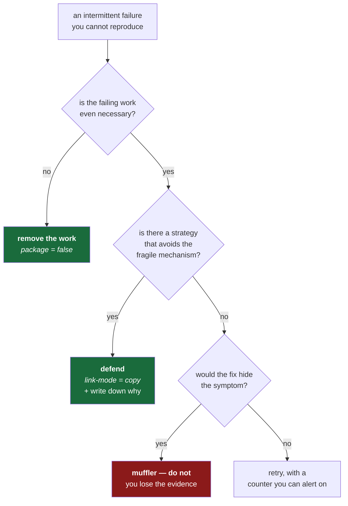

# 2.2 — OneDrive, and the defence against a bug you cannot reproduce

## One-line answer

This repository sits inside a cloud-synced folder, which can break the fast way `uv` installs
packages — but only sometimes, depending on state you cannot see — and the interesting question is
not *how to fix it* but **when a defence against an unreproducible failure is worth keeping**, which
is a judgement you will make for the rest of your career.

---

## The story

🎬 **The scene.** A service falls over at 04:10. On-call restarts it and it comes back. The next
morning three people read the logs and find nothing: no error, no stack trace, nothing unusual before
the gap. They cannot make it happen again. They try for two days.

😬 **The naive fix.** Somebody adds a retry around the operation they think was involved. It is not
unreasonable — retries are cheap, and if it was a blip, a retry absorbs it. The ticket is closed.

💥 **Why it fails.** It happens again six weeks later, at 04:10, and this time it takes something else
down with it. The retry was hiding it: the operation was failing every night and succeeding on the
second attempt, so the only visible symptom was slightly slower nights, and nobody was looking at
that. Two months of evidence had been quietly swallowed by the fix.

💡 **The insight.** There are two completely different responses to a failure you cannot reproduce,
and they look almost identical in a code review. One is a **defence**: it prevents the failure and
leaves a record. The other is a **muffler**: it hides the symptom and destroys the evidence. Choosing
wrongly is how a small intermittent problem becomes a large one with no history.

---

## The idea in plain language

**A hardlink** is a second name for a file that already exists. Not a copy — the same bytes on disk,
reachable through two names. Making one is nearly instant and costs no extra space, because nothing
is duplicated.

This is how `uv` is fast. It keeps one cache of downloaded packages, and when a project needs one, it
creates a hardlink from the cache into that project's `.venv`
([1.4](../01-the-toolchain/1.4-the-venv-you-never-activate.md)). Ten projects using the same library
means one copy on disk and ten names for it. It is a genuinely good design.

**OneDrive** synchronises a folder to the cloud. Its *Files On-Demand* feature goes further: a file
you have not opened recently can be replaced by a **placeholder** — an entry that looks like a file,
reports the right size, and contains nothing, downloading the real contents at the moment something
tries to read it.

Those two ideas do not compose. A placeholder is not really a file yet, and you cannot make a second
name for bytes that are not there. When `uv` tries, the operating system refuses.

**Whether it refuses depends on the sync state of individual files at that instant** — which is not
visible, not stable, and not something you control. That makes this an *intermittent, environmental*
failure: the hardest kind to diagnose, because the thing that decides the outcome is invisible and
changes on its own.

### The judgement, stated properly

The relevant setting is a single line, `link-mode = "copy"`, in the `[tool.uv]` table of
`pyproject.toml` — you will see it and its walkthrough in *The mechanism* below. It tells `uv` to copy
files out of its cache rather than hardlinking them, and on Windows that genuinely changes behaviour
rather than restating a default.

Here is the honest situation, and it is the whole reason this part exists:

| | |
| --- | --- |
| Does the failure exist? | **Yes** — reported upstream as `astral-sh/uv#7906` and `#9721`, with a related path case in `#19616` |
| Did it happen on this machine? | **No.** Hardlink mode was tested in a OneDrive folder on 2026-08-24 and worked |
| Can I make it happen on demand? | **No** — it depends on Files On-Demand placeholder state |
| What does the defence cost? | A few hundred milliseconds per install, and some disk |
| What does the failure cost if undefended? | A half-completed environment, at an unpredictable moment |

So: a real bug, not reproduced here, with a cheap defence. **Keep it — and write down that you never
saw it.** That last clause is what separates a defence from superstition. A defensive setting with no
recorded reason becomes cargo cult within a year: nobody remembers why it is there, everybody is
afraid to remove it, and it accumulates alongside a dozen others until the configuration is folklore.

The three questions worth asking about any defence you cannot test:

1. **What does it cost?** Here: milliseconds and disk. Cheap enough that being wrong is free.
2. **Does it hide anything?** No — copying is a different strategy, not a suppressed error. This is
   the question that separates a defence from a muffler.
3. **Is the reason written down where the setting is?** It is, in a comment in `pyproject.toml` naming
   the upstream issues and the date it was tested.

If a defence fails any of those three, it is not a defence.

---

## Why Kriya needs it

Day 174 is *"Automated remediation I — the safe actions, and the ladder of trust you climb slowly"*,
and Day 175 is *"Automated remediation II — brakes, rate limits, and the remediator that made it
worse."*

Automated remediation is this same judgement with real consequences. An action that restarts an
unhealthy pod is a **defence**: it fixes a known failure and leaves a record. An action that restarts
a pod every time a metric looks odd is a **muffler**: it hides a degrading service, and the evidence
of the degradation is destroyed by the restarts. Those two are separated by exactly the three
questions above, and the second one caused the story at the top of this page.

You are practising that judgement here, on a setting that costs milliseconds, so you have made it
before you make it on something that can take down a service.

---

## The mechanism

The defence itself, in `pyproject.toml`:

```toml
[tool.uv]
link-mode = "copy"
```

**Line by line:** `[tool.uv]` is the table where `uv` reads its own project settings — every tool gets
its own table in the same file, which is what makes `pyproject.toml` one manifest instead of a
repository root littered with dotfiles
([3.4](../03-repo-skeleton/3.4-pyproject-and-the-lockfile.md)). `link-mode = "copy"` tells `uv` to
copy files out of its cache instead of hardlinking them. The allowed values are `clone`, `copy`,
`hardlink` and `symlink`, and the default is `clone` on macOS and Linux but **`hardlink` on
Windows** — so on this machine this line genuinely changes behaviour rather than restating a default,
which is the only kind of configuration line worth writing. *Verified against
`docs.astral.sh/uv/reference/settings/` on 2026-08-24.*

Now, what `uv` actually does when hardlinking is unavailable — observed on **2026-08-24**, installing
into a directory where the cache and target could not be hardlinked:

```text
Resolved 6 packages in 469ms
Prepared 1 package in 4.98s
warning: Failed to hardlink files; falling back to full copy. This may lead to degraded performance.
         If the cache and target directories are on different filesystems, hardlinking may not be supported.
         If this is intentional, set `export UV_LINK_MODE=copy` or use `--link-mode=copy` to suppress this warning.
Installed 5 packages in 79ms
```

Read that carefully, because it is a small masterclass in error design:

- It **did not fail.** It noticed, degraded to a slower strategy, and completed.
- It said **what it did** ("falling back to full copy"), not merely that something was wrong.
- It said **what that costs** ("may lead to degraded performance"), so you can judge whether to care.
- It **guessed at the cause** ("if the cache and target directories are on different filesystems"),
  which is a hypothesis offered rather than asserted.
- It told you **how to make the message stop** — and note that the suggested fix is to *state your
  intent*, not to suppress the warning. `--link-mode=copy` does not silence a check; it makes the
  fallback the deliberate choice.

**This is what good failure behaviour looks like**, and it is worth having a reference point for,
because you are going to design some yourself. Day 132 (timeouts, retries and backoff) and Day 175
(remediation with brakes) are both exercises in the same shape: notice, degrade honestly, say what
you did, stay loud.

Now the harder failure — a real one from this repository, on 2026-08-24:

```text
error: failed to remove directory `c:\Users\nisha_gnzw\OneDrive\Desktop\Projects\ops\.venv\Lib\site-packages\kriya-0.1.0.dist-info`: Access is denied. (os error 5)
```

**This one did fail**, and it fired twice. Not the hardlink path — this is `uv` trying to *remove* a
directory inside a synced folder while something else held it. The something else is OneDrive's sync
process. Same root cause: a cloud sync agent and a package manager both operating on the same files,
neither aware of the other.

The fix was not to retry. It was to stop doing the work at all:

```toml
[tool.uv]
package = false
```

**Line by line:** `package = false` tells `uv` not to build and install *this project* into its own
environment. Day 0 has no importable code — `pulse/` holds a `.gitkeep` and nothing else — so every
`uv run` was building an empty wheel, installing it, and removing the previous one, purely as
ceremony. Removing the ceremony removed the failure. *Verified against
`docs.astral.sh/uv/concepts/projects/config/` on 2026-08-24: "Setting `tool.uv.package = false` will
force a project package not to be built and installed into the project environment."*

**That is the best possible outcome for an intermittent failure: not a retry, not a suppression, but
noticing that the failing work was unnecessary.** It flips back to a real package on Day 3, when
`pulse/` gains modules that tests need to import.



---

## When it breaks

The failure this section defends against, in its documented form:

```text
Caused by: The cloud operation cannot be performed on a file with incompatible hardlinks. (os error 396)
```

**Provenance, stated honestly:** that is the message reported in `astral-sh/uv#9721`. **It was not
observed on this machine** — hardlinking was tested here and worked. It is recorded because the
defence exists because of it, and a defence whose reason is unrecorded is superstition.

**What it says:** a cloud operation cannot be performed on a file with incompatible hardlinks.
**What it actually means:** OneDrive's filesystem driver refused to let a hardlink be made to
something it is managing as a placeholder. Note that it is the *cloud provider* speaking, not `uv`
and not Python — which is why searching for this error in Python documentation finds nothing, and why
knowing that the message can come from a layer below your tool is a genuinely useful instinct.

**The smallest fix:** `link-mode = "copy"`, already set in `pyproject.toml`.

**The fix that is not a fix:** deleting `.venv` and retrying until it works. It will work, eventually,
because the placeholder state changes. You will conclude the problem is gone. It is not — you have
just found the version of "add a retry" that leaves no record at all.

> `TODO(me)` Try to reproduce it. Set `link-mode = "hardlink"` in a **scratch** project inside your
> OneDrive folder, `uv sync`, and see what happens on your machine. Whatever the outcome — success,
> the warning above, or `os error 396` — **write it in `docs/INCIDENTS.md` with the date.** A defence
> you have tested is worth more than a defence you inherited, and "I tried to reproduce it and could
> not" is a legitimate and valuable entry.

---

## In production

**What a professional does differently.** They write the reason next to the defence, with a date and
a link. Not in a commit message, which nobody will find — in a comment at the setting itself, which is
where the person considering removing it will be looking. A configuration file full of settings whose
reasons are lost is one of the most common forms of technical debt, and it is unusually corrosive
because it is invisible until someone tries to simplify and breaks something nobody understands.

**What degrades at scale.** Intermittent, environment-dependent failures are the ones that survive
into large systems, because reproducible ones get fixed early. At scale they stop being rare in
absolute terms: a one-in-ten-thousand failure across a million operations a day is a hundred failures
a day, which is a pager problem. This is why "I could not reproduce it" is never a resolution — at
sufficient volume, everything that *can* happen *does*, continuously.

**The failure that only shows with real traffic.** The genuinely dangerous shape is the *partially*
completed operation. The install that failed halfway leaves an environment that is neither the old one
nor the new one — some packages upgraded, some not, no error visible afterwards. The production
equivalent is a deploy that fails partway through, leaving half your replicas on one version and half
on another. Day 43 (rollouts as a state machine) and Day 113 (rollback for models) exist because
"halfway" is a real state that systems can get stuck in, and the defence is always the same:
operations should be **atomic** — fully done or fully not — or at minimum, **idempotent**, so running
them again from any state converges.

**The review comment a senior engineer leaves.** *"This retry makes the flake go away, but now we have
no idea how often it happens. Add a counter and keep the retry — a retry without a metric is how you
find out in six months that it has been failing every night."*

**The signal you would alert on.** Not the failure itself, which is a build-time event on one
developer's machine. But the generalisation is directly alertable and you will build it: **count your
retries.** Any retry in a production path should increment a counter, and the alert is on the *rate*
of retries, not on any single one. A system that retries successfully is healthy; a system whose retry
rate is climbing is a system failing more often while telling you nothing — the exact story at the top
of this page. Day 132 builds this properly.

**Blast radius, stated plainly.** `link-mode = "copy"` affects only how files get from `uv`'s cache
into `.venv`. Worst case: installs are slightly slower and use more disk. It cannot affect what is
installed, cannot affect correctness, and cannot affect anything outside this project. `package =
false` has a sharper edge: it means `import pulse` will not work from an arbitrary directory, which is
exactly why it must flip on Day 3 when there is something to import. Both are bounded by being
build-time settings in a committed file — visible in a diff, reviewable, and reversible in one line.

**Cost:** `0` requests, `0` tokens. Disk: copying rather than hardlinking costs one full copy of each
package per environment — tens of megabytes here, and a real number once ML libraries arrive, which is
one more reason Day 24 cares about image size.

---

## Check yourself

```bash
grep -A2 "link-mode\|^package" pyproject.toml
```

Both settings must be present **and carry a comment saying why**. If either has no reason next to it,
add one now — in a year you will not remember, and neither will anyone else.

**Say out loud, without scrolling up:** *what is the difference between a defence and a muffler, and
which of the three questions would have caught the retry in the story at the top of this page?*
