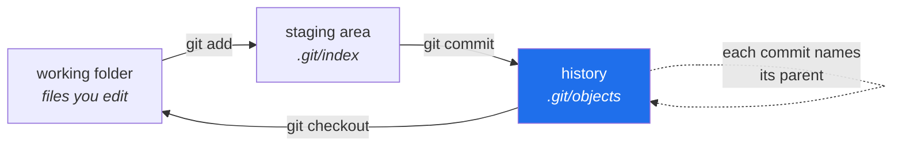

# 3.1 — What a repository actually is

## One-line answer

A repository is a folder plus a hidden `.git` directory holding **an append-only history of complete
snapshots**, which is why every serious answer in operations — rollback, audit, reproducibility,
GitOps — eventually reduces to "what does the repository say?"

---

## The story

🎬 **The scene.** Someone is about to make a risky change to a working script. They know it is risky,
so they are careful. They copy the file to `script_backup.py` first.

😬 **The naive fix.** The change does not work. They try another approach, and copy again first:
`script_backup2.py`. Then `script_working.py`, because by then they are not sure which backup was the
working one. A colleague sends them a fix, which becomes `script_final.py`. Two days later the folder
holds seven files, four of which differ from each other in ways nobody can state.

💥 **Why it fails.** Copying preserves *content* and destroys *everything else*. It does not record
when the copy was made, who made it, what they were trying to do, which copy came from which, or what
changed between them. So the moment there is more than one copy, the only way to know anything is to
open two files side by side and read — and that does not scale past about three.

💡 **The insight.** The valuable thing was never the backup. It was the **history**: the ordered chain
of what changed, when, by whom, and why. A tool that records history gives you every backup you would
have made, plus the answers to all the questions copying threw away.

---

## The idea in plain language

**Git is a program that records the history of a folder.** A **repository** is a folder it is
recording. All the state lives in a hidden subfolder called `.git`; delete that and you are left with
ordinary files, no history.

Four words you need, and they are worth getting exactly right because almost everyone gets one of
them slightly wrong for years:

**A commit is a snapshot, not a change.** This is the one people get wrong. A commit records the
complete state of every tracked file at that moment — not "the three lines I edited". Git *shows* you
differences because differences are what humans want to read, but it *stores* snapshots. That is why
you can check out any commit and get a complete, working folder, rather than having to replay
history from the beginning.

**The staging area** — also called the index — is a waiting room between your files and the next
commit. You add things to it, then commit what is in it. It exists so that a commit can be a
deliberate, curated selection rather than "whatever happened to be on disk". The staging area is the
part beginners find pointless and experienced people would refuse to give up.

**Tracked and untracked.** A file Git knows about is tracked. A file it has never been told to record
is untracked. Untracked files sit in the folder, appear in `git status` as unknown, and are not in
any snapshot. This distinction is what
[3.2](3.2-gitignore-before-the-secret-exists.md) is built on.

**The history is append-only in practice.** Each commit names its parent, forming a chain, and each
commit's identity is a hash of its entire content *including that parent name*. Change anything in
the past and every commit after it gets a different identity — which means tampering is not
impossible, but it is **loud**. You cannot quietly alter what happened.

### Why an operations curriculum starts here

Because "what does the repository say?" turns out to be the answer to a surprising number of
production questions:

| The question | The repository-shaped answer | Day |
| --- | --- | --- |
| What is running in production? | the commit the running image was built from | 16 |
| How do I undo this? | go back to the previous commit and redeploy | 19 |
| Why is the cluster configured this way? | the manifest in the repository, and its commit message | 56 |
| Who changed this and why? | `git log` on that file | 173 |
| Can you prove what ran on that data? | the commit, the lockfile, the data version | 107, 221 |
| What caused this incident? | the deploy, and the diff it carried | 173 |

Day 56 (GitOps) takes this to its conclusion: the cluster's desired state is a file in a repository,
and a program continuously makes reality match it. At that point the repository is not a record of
the system — **it is the system**, and everything else is a cache.

That is why this plan's first principle is *the repo is the memory, not the chat*. A conversation, a
terminal window and a person's recollection all decay. A commit does not.

---

## Why Kriya needs it

Day 19 is *"Rollback is a feature — the undo you rehearse before you need it."*

Rollback is not a special mechanism. It is the ordinary consequence of having an append-only history
of complete snapshots: the previous version still exists, unchanged, addressable by name, and can be
rebuilt and redeployed. Systems that cannot roll back are almost always systems where the previous
state was overwritten rather than recorded — a copy, not a commit.

Everything on Day 19 is downstream of today.

---

## The mechanism

A repository is created by one command, and it is worth seeing exactly what it does and does not do:

```bash
git init
git status --short
git log --oneline
```

**Line by line:**

- `git init` creates the `.git` directory in the current folder. It does **not** commit anything, does
  not touch your files, and does not contact any server. It is entirely local, instant, and
  reversible by deleting `.git` — which is worth knowing, because "have I broken something
  irreversible?" is the main anxiety of the first week.
- `git status --short` lists what has changed, in a compact two-column format. `--short` earns its
  place: the long form prints paragraphs of advice that are useful once and noise thereafter.
- `git log --oneline` prints the history, one commit per line. On a fresh repository this errors,
  because there is no history yet — a fact worth seeing rather than reading about.

Observed in this repository on **2026-08-24**:

```text
 M docs/02_ADDENDUM_THE_MACHINE.md
 M docs/CHANGELOG_PLAN.md
 M pyproject.toml
 M uv.lock
?? days/day-000-toolchain-skeleton-driver/
```

```text
8f64745 init
```

**Read the two columns of `--short` output.** The first column is the staging area, the second is the
working folder. ` M` with a leading space means *modified on disk, not staged*. `??` means *untracked
— Git has never heard of this*. Those two states are different in a way that matters: the `M` files
are in the history already and have changed; the `??` folder is not in the history at all, and
committing right now would not include it.

Now look inside:

```bash
ls .git
```

**Line by line:** `ls .git` lists the hidden directory holding the entire history. This is worth doing
once, so that `.git` stops being magic and becomes a folder.

```text
COMMIT_EDITMSG HEAD config description gk hooks index info logs objects refs
```

The two that matter today:

- **`objects`** — where every snapshot actually lives, stored by hash. This is the history. Everything
  else is bookkeeping on top of it.
- **`index`** — the staging area, as a file. The "waiting room" is not a metaphor for something
  abstract; it is that file.

And `HEAD` is a small file naming where you currently are in the history. That is the whole model:
snapshots in `objects`, a pointer in `HEAD`, a waiting room in `index`.



---

## When it breaks

Ask for history where there is none:

```text
fatal: your current branch 'master' does not have any commits yet
```

Observed on 2026-08-24 by running `git log --oneline` in a freshly `git init`-ed folder; it exits
with status 128. **The branch name in that message may differ on your machine** — a fresh
`git init` here produced `master`, while this repository is on `main`, because the default is
configurable (`init.defaultBranch`) and has changed over Git's history. If your message names a
different branch, nothing is wrong.

**What it says:** the branch has no commits.
**What it actually means:** `git init` succeeded and made a repository; you simply have not recorded
anything into it yet. **This is not an error condition** — it is the correct description of a fresh
repository, and Git is being precise rather than unhelpful.

**The smallest fix:** make a commit. There is nothing to repair.

The genuinely confusing failure is a different one, and it catches people who work in nested folders:

```text
fatal: not a git repository (or any of the parent directories): .git
```

**What it actually means:** you are not inside a repository. Git searched the current directory and
every parent directory up to the root and found no `.git`. The message tells you it searched
upward — which is the useful part, because it implies the fix is usually `cd`, not `git init`.

**The trap in that message:** running `git init` to make it go away, while standing in the wrong
folder, creates a *second, nested repository*. Everything then appears to work, and your files are
being recorded into a repository nobody else knows about. The symptom arrives later, as "my changes
are not in the pull request", and it is genuinely bewildering the first time. **Read the error and
`cd`; do not initialise your way out of it.**

---

## In production

**What a professional does differently.** They write commit messages for the person reading them
during an incident. Not `fix`, not `update`, not `changes` — a subject line saying what changed and a
body saying **why**. The `why` is the part that cannot be recovered from the diff: the diff already
shows what changed, and it is the only thing you cannot reconstruct later. Day 11 makes this a
practice; Day 173 (attributing an incident to a deploy) is where it pays.

**What degrades at scale.** Repository *size* — specifically, binary files. Git stores snapshots, so a
100 MB model file committed ten times is roughly a gigabyte in `.git`, permanently, for everyone who
clones, forever. Git has no forget. This is precisely why `.gitignore` excludes `data/`, `mlruns/` and
model artifacts (Addendum 02 §2), and why Day 87 introduces a separate tool for versioning data.
**Committing a large binary is one of the few genuinely hard-to-undo mistakes in this curriculum**,
because removing it requires rewriting history that others may already have.

**The failure that only shows with real traffic.** Not a runtime failure — a *forensic* one. An
incident happens, and the answer to "what changed?" is unavailable because the deploy came from an
uncommitted local state, or from a branch that was force-pushed over. You have an outage and no
history. Day 56 (GitOps) removes this failure mode structurally: if the cluster only ever reconciles
to committed state, then an undocumented change is not merely discouraged, it is **impossible**.

**The review comment a senior engineer leaves.** *"This commit message says 'fix bug'. In six months
someone will `git blame` this line during an incident and get no help at all. What was the bug, and
why is this the fix?"*

**The signal you would alert on.** Nothing here is runtime-alertable — but two repository-shaped
signals become real alerts later. **Drift** (Day 60): the cluster no longer matches the repository,
which means someone changed reality without changing the record. And **deploy frequency and change
failure rate** (Day 20), both computed directly from `git log`. Your history is a data source, not
just an archive.

**Blast radius, stated plainly.** `git init` creates a local directory and nothing else — no network,
no credentials, no remote. Its worst case is the nested-repository confusion above. The sharper edges
arrive later: `git push --force` can destroy shared history, and a commit containing a secret is
effectively permanent (which is [3.5](3.5-proving-the-guard-rail-holds.md)'s entire subject). The
bound today is that everything is local and `rm -rf .git` undoes all of it.

**Cost:** `0` requests, `0` tokens. Disk: `.git` for this repository is small; it grows with history
and never shrinks on its own.

---

## Check yourself

```bash
git log --oneline && git ls-files | wc -l
```

The first shows your history; the second counts how many files are actually tracked. Compare that
count to how many files are in the folder — the difference is what `.gitignore` is doing.

**Say out loud, without scrolling up:** *a commit stores a complete snapshot, but Git shows you a
diff — why does storing snapshots rather than diffs make rollback simple?*
