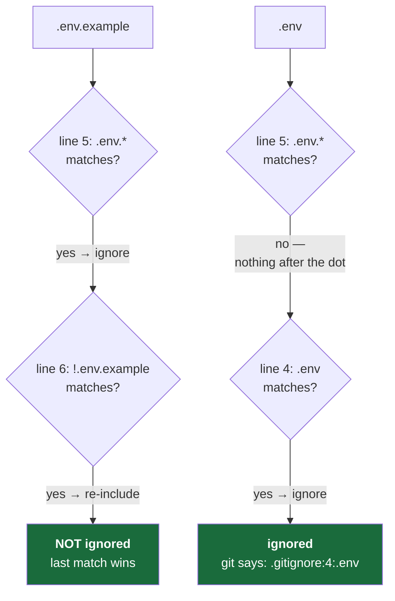

# 3.2 — The ignore rule is written before the secret exists

## One-line answer

`.gitignore` is a list of patterns telling Git which files to pretend it cannot see, and the rule
that makes it actually work is **ordering**: the rule is written on Day 0, before any secret exists,
because a secret that reaches the history even once is effectively permanent.

---

## The story

🎬 **The scene.** Someone is wiring a service up to a third-party provider. They get a key, paste it
into a config file to check the connection works, and it works. Pleased, they commit their morning's
work and push.

😬 **The naive fix.** An hour later they notice the key in the diff. Mildly embarrassed, they delete
the line, commit again with the message "remove key", and push. The file no longer contains the key.
The problem, as far as they can see, is solved.

💥 **Why it fails.** The history stores snapshots ([3.1](3.1-what-a-repository-actually-is.md)). The
snapshot from an hour ago still contains the key, unchanged, and always will — that is what an
append-only history *is*. Anyone who has cloned the repository has that snapshot on their disk. Any
system that mirrored it has a copy. Any automated scanner watching public repositories read it within
seconds of the push. The second commit did not remove anything; **it added a commit that happens not
to contain the key**, and it advertised exactly where to look for it.

💡 **The insight.** You cannot un-publish. The only control that works is the one applied **before**
the data exists, because every control applied afterwards is cleanup with an audience. This is not
specific to secrets — it is the general shape of anything irreversible, and it is why the ordering of
today's steps matters more than their content.

---

## The idea in plain language

**`.gitignore` is a file of patterns.** Any path matching one of them is treated as if it were not
there: it will not show up in `git status` as an untracked file, and `git add -A` will not pick it up.

Three properties are worth knowing exactly, because each one causes a specific real-world mistake.

**It only affects untracked files.** If a file is *already tracked* — already in the history — adding
it to `.gitignore` does nothing at all. Git keeps recording it. This surprises everyone once. The
ignore list is a filter on what gets *noticed*, not a rule about what may be *stored*.

**The last matching pattern wins.** The documentation states it directly: *"within one level of
precedence, the last matching pattern decides the outcome"* (*verified against
`git-scm.com/docs/gitignore` on 2026-08-24*). This is what makes exceptions possible — you can ignore
broadly and then rescue one file, but **only in that order**.

**A `!` prefix re-includes**, with one hard limit. The documentation again: *"An optional prefix `!`
which negates the pattern; any matching file excluded by a previous pattern will become included
again. It is not possible to re-include a file if a parent directory of that file is excluded."*

That last sentence is a real trap. Ignoring `data/` and then writing `!data/schema.json` **does not
work** — the file stays ignored, silently. The reason is a performance decision documented right
there: *"Git doesn't list excluded directories for performance reasons, so any patterns on contained
files have no effect, no matter where they are defined."* Git never looks inside an excluded
directory, so it never sees your exception.

### The ordering rule, stated as a rule

> **Write the ignore rule before the file it protects against can exist.**

On Day 0 there is no `.env`. Writing `.env` into `.gitignore` today costs nothing and protects
against every future moment. Writing it on Day 9, when you create the real file with three real keys
in it, means the protection and the risk arrive together — and they will race.

This generalises well past secrets, and you will see the same shape repeatedly:

| The control | Applied before | Rather than after |
| --- | --- | --- |
| `.gitignore` | the secret exists (Day 0) | noticing it in a diff |
| A resource limit | the workload runs (Day 42) | the node falls over |
| An approval gate | the agent can act (Day 193) | the agent acted |
| A policy admission rule | the manifest is applied (Day 59) | auditing what got in |

**Every one of those is the same idea**: a control at the boundary, installed before the thing it
governs. This is Principle 13 — *blast radius before capability* — and today is its smallest possible
instance.

---

## Why Kriya needs it

Day 9 is *"Configuration and secrets — the twelve-factor service, `.env`, and code that refuses to
start rather than failing late."* That is the day three real API keys arrive on your machine.

By then the guard rail must already exist and must already have been *tested*, because the window
between "the key exists" and "the key is protected" is exactly the window in which accidents happen.
Day 9 will begin by running `git check-ignore -v .env` and confirming it prints a rule — a check that
only means something because the rule was written nine days earlier.

And Day 92 of the plan's arc — the repository going public in Phase 23 — is why this is not theatre.
A history that has ever contained a live key cannot safely be published.

---

## The mechanism

Here is the relevant part of this repository's `.gitignore`, written on Day 0 before any secret
existed:

```gitignore
.env
.env.*
!.env.example
.envrc
*.pem
*.key
kubeconfig
```

**Line by line:**

- `.env` — the exact filename that will hold real keys from Day 9. The most important line in the
  file, and the reason the file exists at all.
- `.env.*` — every variant: `.env.local`, `.env.prod`, `.env.backup`. People invent these constantly
  under time pressure, and each one is a full-value secret file. Matching the pattern rather than
  enumerating names is what makes this hold up against future improvisation.
- `!.env.example` — the exception. This file must be committed, because it documents *which* variables
  the project needs while containing no values. It matches `.env.*` above, and the `!` rescues it.
  **The order is load-bearing**: last matching pattern wins, so this line must come *after* `.env.*`.
  Swap the two lines and the exception silently does nothing.
- `.envrc` — a different tool's environment file, ignored for the same reason. Cheap to add now,
  awkward to remember later.
- `*.pem`, `*.key` — private key material by extension. These arrive around Day 8 (TLS) and Day 58
  (secrets management), and again the pattern is written years before it is needed.
- `kubeconfig` — cluster credentials (Day 32). A kubeconfig is not merely configuration; it usually
  contains a token that grants administrative access to a cluster.

Now prove it works — the whole point, and the thing most people never do:

```bash
git check-ignore -v .env
git check-ignore -v .env.example
```

**Line by line:** `git check-ignore` asks Git whether a path would be ignored, **without needing the
file to exist**. That is the property that makes it usable on Day 0. `-v` (verbose) prints *which
rule* matched, in the form `file:line:pattern<TAB>path`, which turns "is it ignored?" into "ignored,
because of this specific line" — a much more useful answer when a pattern is not doing what you
expect. The exit status is the real result: `0` means ignored, `1` means not ignored.

Observed on **2026-08-24**:

```text
.gitignore:4:.env	.env
```

```text
```

The first command printed the matching rule and exited `0`: `.env` is ignored, because of line 4.
The second **printed nothing and exited `1`**: `.env.example` is *not* ignored, which is correct —
the `!` exception is working, and the example file will be committed.

**Read that pair together.** One command proves the protection is on; the other proves the exception
is on. Two commands, and the entire ordering question is settled with evidence rather than belief.



---

## When it breaks

The characteristic failure of `.gitignore` is that **it does nothing and says nothing**. There is no
error. The file you expected to be protected is simply in the commit.

The most common cause is the already-tracked case. Add a file, commit it, *then* add it to
`.gitignore`, and:

```bash
git check-ignore -v secrets.txt
```

prints the matching rule — the ignore rule is genuinely there and genuinely matches — and Git carries
on tracking the file anyway, because `.gitignore` never applied to tracked files in the first place.
**The diagnostic tells you the truth and you draw the wrong conclusion from it**, which is what makes
this one memorable.

**The smallest fix:**

```bash
git rm --cached secrets.txt
```

**Line by line:** `git rm` removes a file from Git. `--cached` is the critical flag: it removes the
file from **the index only**, leaving it on your disk. Without `--cached` you delete your own file —
which, when the file holds your only copy of a working configuration, is a bad afternoon. After this,
the file becomes untracked, `.gitignore` starts applying, and future commits omit it.

**But understand what this does not do.** It stops *future* commits from containing the file. Every
past commit still has it. If the file ever held a real secret, the only correct response is:

1. **Rotate the credential.** Immediately, before anything else. Assume it is compromised, because
   assuming otherwise costs nothing if you are right and everything if you are wrong.
2. Remove it from the history, if the repository is shared or public — a genuinely disruptive
   operation that rewrites every subsequent commit.
3. Only then worry about the ignore rule.

**Rotation is step one, always.** The instinct to clean up the repository first is natural and
backwards: cleaning up takes minutes during which the key is still valid. [3.5](3.5-proving-the-guard-rail-holds.md)
is where you watch this guard rail hold, and watch how easily it can be overridden.

---

## In production

**What a professional does differently.** They do not rely on `.gitignore` alone, because it is a
single control that a `-f` flag defeats ([3.5](3.5-proving-the-guard-rail-holds.md)). Real protection
is layered: the ignore rule, plus an automated secret scanner in CI that fails the build, plus a
pre-commit hook that catches it before it is even a commit, plus — the only one that actually
matters — **secrets that live in a secret manager and never exist as a file in the first place**.
Day 17 adds the CI scanner; Day 58 removes the file.

**What degrades at scale.** A repository-root `.gitignore` stops being expressive enough in a monorepo
where different subtrees have genuinely different rules. Git supports per-directory `.gitignore`
files for exactly this. The failure mode when people resist that is a single root file of two hundred
lines that nobody dares edit, where the ordering interactions are no longer comprehensible and the
`!` exceptions have quietly stopped working.

**The failure that only shows with real traffic.** Not traffic — *time*. A `.gitignore` written for
today's tools silently fails to cover tomorrow's. You add a new tool that writes credentials to a
path nobody anticipated, and the ignore file does not know about it. This is why the scanner in CI
matters more than the ignore list: **a denylist of known-bad paths ages badly, while a scanner
looking for things that look like secrets does not.** Preferring detection to enumeration is a
general security instinct, and Day 217 applies it to dependencies.

**The review comment a senior engineer leaves.** *"You've added `!data/schema.json` under an ignored
`data/` directory. That won't work — Git doesn't descend into excluded directories, so the negation
has no effect. Un-ignore the directory and ignore its contents instead."*

**The signal you would alert on.** Not the ignore file. But **secret scanning is genuinely
alertable**, in two places with two different urgencies: a CI job that *fails the build* on a
detected secret in a diff (a gate — it stops the change), and a repository-wide scheduled scan that
*pages someone* on a detection in history (an alert — the thing has already happened and a credential
may be live). The distinction between a gate and an alert, and choosing the right one, is Day 14 and
Day 76 respectively.

**Blast radius, stated plainly.** `.gitignore` is a filter with **no enforcement power**. Its worst
case is being trusted: it can be overridden with `git add -f` by anyone, deliberately or by
copy-pasting a command from a search result, and it does nothing about files already tracked. What it
bounds is *accidents* — the `git add -A` that would otherwise sweep up a key — which is the majority
of real incidents, but not the deliberate or the ignorant ones. Knowing the limits of a control is
part of using it.

**Cost:** `0` requests, `0` tokens, negligible disk. `git check-ignore` only reads.

---

## Check yourself

```bash
git check-ignore -v .env; echo "exit=$?"; git check-ignore -v .env.example; echo "exit=$?"
```

The first must print a rule and `exit=0`. The second must print nothing and `exit=1`. If both print
rules, your `!.env.example` line is in the wrong place and the example file will never be committed.

**Say out loud, without scrolling up:** *you added a file to `.gitignore` and Git is still tracking
it — what is the reason, and which flag fixes it without deleting your file?*
