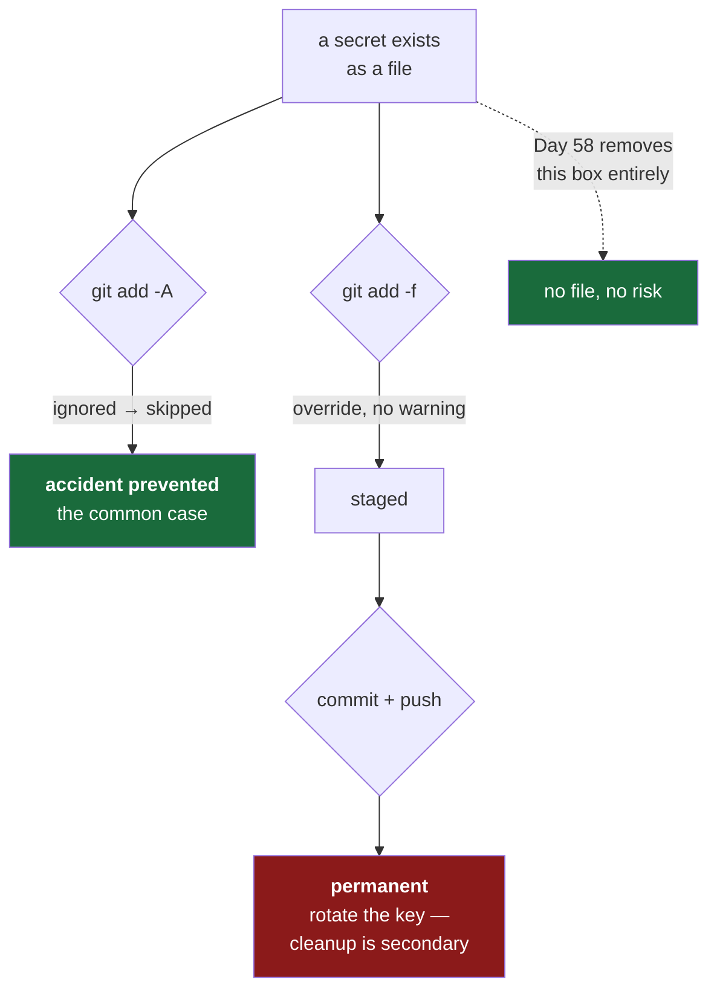

# 3.5 — Proving the guard rail holds — and finding its limit

## One-line answer

Today you put a fake secret in `.env`, watch Git refuse to see it, then **defeat your own guard rail
with one flag** — because a control you have never tested is a belief, and a control whose limits you
have never found is a dangerous belief.

---

## The story

🎬 **The scene.** A company has a rule: secrets never go in the repository. It is written down. Every
engineer knows it. There is a `.gitignore` with the right entries, reviewed and approved.

😬 **The naive fix.** Someone is debugging a deployment at the end of a long day. A config file will
not load. They try things. One of the things they try is a command they found in a search result,
which includes `-f` because the original poster's file was being ignored for an unrelated reason. It
works. They commit and push, relieved, and go home.

💥 **Why it fails.** The rule was real, the `.gitignore` was correct, and neither was a control. Both
were *conventions* — they made the wrong thing require one extra deliberate character. Under fatigue,
at the end of a debugging session, with a command copied from the internet, that character got typed
without being read. Nothing warned anyone. The push succeeded. The credential was live for nine days.

💡 **The insight.** There is a difference between something that makes a mistake **unlikely** and
something that makes it **impossible**, and it is easy to mistake the first for the second. A guard
rail you have never pushed against feels like a wall. **Go and find the gap on purpose, while it is
free** — because the alternative is finding it at the end of a long day, by accident.

---

## The idea in plain language

Three ideas that this part exists to make concrete.

**Testing a control means trying to defeat it.** Confirming that a control works when you cooperate
with it tells you almost nothing. `.gitignore` obviously ignores a file when you do not try to add
it. The question worth answering is what happens when someone *does* — deliberately, or by accident,
or by copying a command they do not fully understand.

**Every control has a limit, and knowing where it is changes how much you rely on it.**
`.gitignore`'s limits are precise and knowable: it does not apply to already-tracked files
([3.2](3.2-gitignore-before-the-secret-exists.md)), and it can be overridden by `git add -f`. Those
are not bugs — they are documented, deliberate design choices with good reasons. But a control with a
documented override is a **filter against accidents**, not a **barrier against actions**, and those
protect against different things.

**Defence in depth is the response to that.** Because no single control is a barrier, real protection
is layered, and the layers fail differently:

| Layer | Catches | Defeated by | Arrives |
| --- | --- | --- | --- |
| `.gitignore` | the accidental `git add -A` | `git add -f`, or already-tracked files | Day 0 |
| A pre-commit hook | the deliberate-but-thoughtless commit | `--no-verify`, or not being installed | later |
| A CI secret scanner | anything that reaches a branch | nothing, if it blocks the merge | Day 17 |
| Secrets in a manager, never a file | **the whole class** | — | Day 58 |

Read the last row carefully, because it is the point of the table. The first three layers all catch a
secret *after it exists as a file on someone's disk*. The last one removes the file. **The strongest
control is not a better check — it is an arrangement where the dangerous thing does not exist.** That
is a general principle and you will meet it again on Day 192, where the diagnosis agent is made
read-only rather than being told not to write.

---

## Why Kriya needs it

Day 9 creates three real API keys. Day 17 puts a secret scanner in CI. Day 58 moves secrets out of
files entirely. Phase 23 makes this repository public.

Every one of those depends on you having an accurate model of what protects you and how well. If you
believe `.gitignore` is a barrier, you will not bother with Day 17's scanner — and the scanner is the
layer that actually catches the story at the top of this page. **Doing this exercise today is what
makes the later layers feel necessary rather than bureaucratic.**

---

## The mechanism

Create a fake secret. **A fake one** — a string that is obviously not a credential, so that if
anything goes wrong you have lost nothing.

```bash
printf 'GROQ_API_KEY=gsk_FAKE_NOT_A_REAL_KEY_000000\n' > .env
```

**Line by line:** `printf` rather than `echo` because its behaviour with escapes and flags is
consistent across shells, which matters in a document other people will run. `\n` is the trailing
newline — a text file without one is a small, persistent annoyance for other tools. `>` writes the
file, replacing any existing contents. The value is deliberately shouty: `FAKE_NOT_A_REAL_KEY`
cannot be mistaken for a live credential by you, by a scanner, or by someone reading a diff.

Now ask Git what it sees:

```bash
git status --short | grep -c "\.env$"
git status --ignored --short | grep "\.env"
```

**Line by line:** the first counts how many lines of ordinary status output mention `.env` — `grep
-c` counts rather than prints, and `\.env$` anchors to the end of the line so it does not also match
`.env.example`. The second asks for the **ignored** files too, which is the only way to see something
`.gitignore` is hiding. Most people never run `--ignored`, which is why "where did my file go?" is a
recurring confusion.

Observed on **2026-08-24**:

```text
0
```

```text
!! .env
```

**Zero mentions in normal status. `!!` in ignored status.** That `!!` is the marker for *ignored* —
Git can see the file perfectly well and is deliberately declining to offer it to you. The guard rail
is working.

Now the real test — try to commit everything, the way you would at the end of a working session:

```bash
git add -A
git ls-files --cached | grep -c "^\.env$"
```

**Line by line:** `git add -A` stages **everything** — every modification, every new file, across the
whole repository. This is the command that causes the accident in the story, and it is extremely
common precisely because it is convenient. `git ls-files --cached` lists what is actually staged, so
`grep -c` counting `0` is proof rather than assumption. Checking the *index* rather than trusting the
*status output* matters: you are verifying the thing that would be committed.

```text
0
```

**The guard rail held against the realistic accident.** Now find its limit:

```bash
git add -f .env
git ls-files --cached | grep "^\.env$"
```

**Line by line:** `-f` is `--force`: stage this path *even though it is ignored*. One character. It
exists for legitimate reasons — occasionally you genuinely need to commit something an over-broad
pattern excludes — and it is exactly what turns a filter into a suggestion.

```text
.env
```

**Your secret is now staged.** One commit away from the history, and — if the repository has a
remote — one push away from being permanent and public. No warning was printed. No confirmation was
requested. Git did what it was asked.

Undo it before you go any further:

```bash
git rm --cached .env
git ls-files --cached | grep -c "^\.env$"
rm .env
```

**Line by line:** `git rm --cached .env` removes the file from the index while **leaving it on
disk** — the `--cached` flag is the difference between un-staging a file and deleting your own work
([3.2](3.2-gitignore-before-the-secret-exists.md)). The count then confirms `0`. `rm .env` deletes
the fake file, because a fake secret lying around is a habit worth not forming.

```text
0
```



---

## When it breaks

The defining property of this failure is that **it produces no error at all**. That is what makes it
worth rehearsing: there is no message to recognise, so the only defence is knowing the shape of the
mistake in advance.

Here is what "it went wrong" actually looks like — a perfectly ordinary, successful commit:

```text
[master 299e225] add local config
 1 file changed, 1 insertion(+)
 create mode 100644 .env
```

**What it says:** one file changed, one insertion. Success.
**What it actually means:** a credential is now in the permanent history. The only tell is the single
line `create mode 100644 .env`, in output most people do not read because the command succeeded.

**Compare that to every other failure in this curriculum.** A container that runs out of memory
prints exit code 137. A rate limit prints a 429. A stale lockfile prints an error. **This one prints
success.** Silent failures are categorically harder than loud ones, and the only defences are a
control that refuses (Day 17's scanner) or an arrangement where the mistake is not possible (Day 58).

**If it ever happens with a real key, the order is not negotiable:**

1. **Rotate the credential.** First. Before cleanup, before telling anyone, before understanding how
   it happened. Revoking takes seconds and makes the leaked value worthless; every minute spent on
   anything else is a minute the key is live. Automated scanners find keys in public repositories in
   seconds, not days.
2. **Then** worry about history rewriting, and only if the repository is shared or public.
3. **Then** the postmortem: which layer was missing, and which one gets added.

The instinct to clean up first is nearly universal and exactly backwards. Cleaning up feels like
fixing it; rotating actually fixes it.

> `TODO(me)` Do the whole exercise above, including `git add -f`, and **append a row to
> `docs/INCIDENTS.md`**. First symptom: *"none — the commit succeeded normally"*. That is a real and
> important entry, because it is the first time in this curriculum that a failure has no error
> message, and your incident ledger should record that such failures exist.

---

## In production

**What a professional does differently.** They assume the guard rail will eventually be bypassed and
build the layer that cannot be, which is the CI scanner: it runs on the server, on every branch, and
cannot be skipped by a flag on someone's laptop. Notice the structural property — **the control that
matters runs somewhere the person making the mistake does not control.** That is the same reason
`./o check` matters less than Day 13's CI running the same checks, and the same reason Day 59's
admission policy matters more than a convention about manifests.

**What degrades at scale.** Scanners produce false positives, and false positives are how a control
dies. A scanner that flags every long random-looking string will flag test fixtures, hashes and
example values; people start adding ignore annotations; within a quarter the ignore list is long
enough that a real secret hides in it. Day 77 (*alert quality — precision, recall, fatigue, and the
courage to delete an alert*) is the general version of this problem, and it applies to security
controls exactly as it applies to pages.

**The failure that only shows with real traffic.** The secret that was never in a file. A key passed
as a command-line argument appears in shell history and in the process list, where any other process
on the machine can read it. A key in a container's environment variables appears in `docker inspect`,
in Kubernetes pod specs, and often in crash dumps and error-reporting payloads. `.gitignore` protects
files, and **files are only one of the places a secret can leak from**. Day 156 (PII and redaction)
and Day 211 (secrets at the tool boundary) deal with the rest.

**The review comment a senior engineer leaves.** *"This commit uses `git add -f` on a config file.
Why is that file ignored, and why does this one need to be committed? If the pattern is wrong, fix
the pattern — a forced add is invisible to everyone reading the history later."*

**The signal you would alert on.** Two, and they need **different urgency levels**, which is a
distinction worth learning now:

- A secret detected **in a pull request diff** → a *gate*. Fail the build. Nothing has escaped yet;
  the correct response is to block, not to wake anyone.
- A secret detected **in the default branch or in history** → a *page*. Something has escaped and a
  credential may be live. This is one of the few genuinely page-worthy security signals, because the
  response is time-critical and manual.

Same detection, same tool, two different responses, chosen by *what has already happened*. Day 76
builds this reasoning properly.

**Blast radius, stated plainly.** This exercise stages and un-stages a fake string in a local
repository with no remote push. Worst case: you forget to run `git rm --cached` and commit a file
containing `gsk_FAKE_NOT_A_REAL_KEY_000000`, which is embarrassing and harmless. The bound is
deliberate — **a fake value and no push** — and that bounding is the actual lesson: this is how you
rehearse a dangerous operation, by removing the part that makes it dangerous while keeping the part
that makes it instructive. Day 83 (game days) is the same technique at system scale.

**Cost:** `0` requests, `0` tokens, `0` disk.

---

## Check yourself

```bash
git status --ignored --short | grep -c "^!!" && git ls-files | grep -c "^\.env$"
```

The first counts how many things `.gitignore` is currently hiding from you — look at the number and
be slightly surprised by it. The second **must be `0`**: no `.env` is tracked, on this machine, right
now.

**Say out loud, without scrolling up:** *`.gitignore` did its job and a secret still reached the
history — name the two ways that happens, and say which layer catches each one.*
