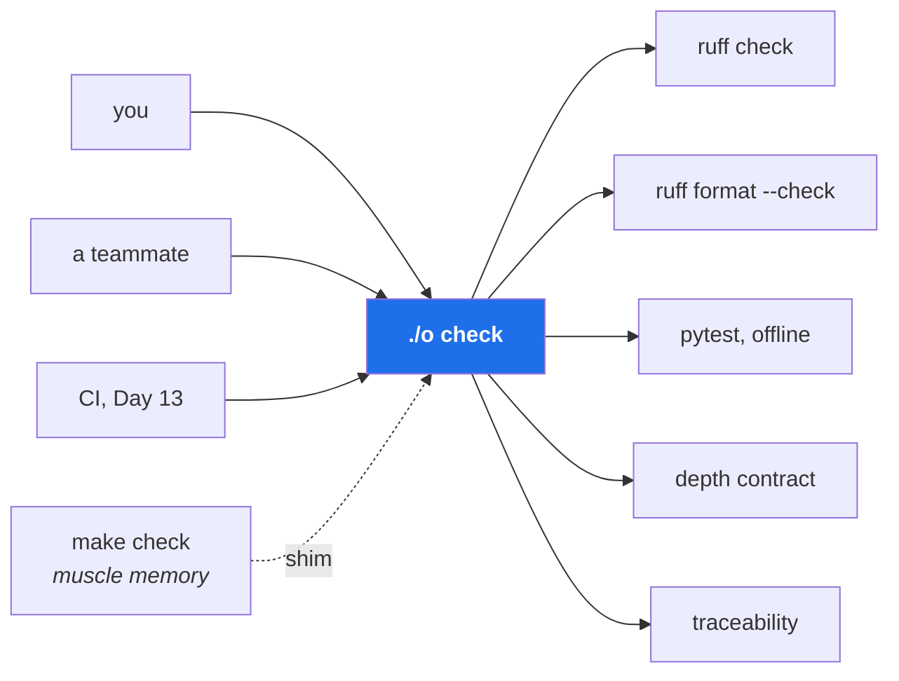

# 4.1 — Why a driver script, and not `make`

## One-line answer

`./o` exists so that **every routine operation on this repository has exactly one name**, and it is a
shell script rather than a `Makefile` because `make` is not installed on Windows and its file-based
model does not describe what any of these commands actually do.

---

## The story

🎬 **The scene.** A new person joins a project. They clone it and ask how to run the tests. They are
told: *"it's in the README"*. The README says `pytest`. It fails.

😬 **The naive fix.** They ask again. Someone remembers you have to activate the environment first.
Then they need a flag to skip the tests that hit the network. Then it turns out the linter is run
separately, with a different command, that also has a flag nobody mentioned. Each answer is correct.
Each answer is given by a different person, an hour apart.

💥 **Why it fails.** The knowledge of how to operate the project lived in people's heads and in a
README that was accurate on the day it was written. Every command had drifted slightly. Nobody
noticed, because everyone who already knew the commands had them in their shell history, and shell
history is the most effective documentation-rot concealer ever invented.

💡 **The insight.** If the way to do something exists only in a person's memory, it will drift, and
the drift is invisible to exactly the people who could correct it. **Put the command in the
repository and make it the only way**, and it cannot drift without breaking for everyone at once —
which is the point.

---

## The idea in plain language

**A driver script is a single executable file at the repository root that names every routine
operation.** `./o check`, `./o next`, `./o done 42`. Each name maps to a real sequence of commands,
which lives in the file, which is committed.

This buys four things, and they are worth separating because people usually only notice the first:

1. **One name per operation.** You do not need to remember `uv run python -m pytest -q -m "not live
   and not cluster"`. You need to remember `./o check`.
2. **The command cannot drift from the documentation, because it *is* the documentation.** A README
   describing a command can go stale silently. A script *is* the command; if it goes stale, it breaks.
3. **The same thing runs everywhere.** You, a teammate, and CI on Day 13 all invoke `./o check`.
   Reviewing the script reviews everyone's behaviour at once.
4. **New capability becomes discoverable.** Running `./o` with no arguments prints every operation the
   repository supports. That is a real answer to "what can I do here?", available without asking
   anyone.

### Why not `make`

`make` is the traditional answer and it is a good tool. It is wrong *here*, for three specific
reasons — and the reasoning matters more than the conclusion, because you will make this kind of
choice repeatedly.

**It is not installed.** Git for Windows does not ship `make`
([1.2](../01-the-toolchain/1.2-git-and-the-shell-these-docs-assume.md)). A driver that requires an
extra install before you can run the gate has already failed at its main job, which is to be the
thing that always works.

**Its model does not fit.** `make` is built around one idea: *this output file depends on those
input files; rebuild it when they are newer.* That is excellent for compiling. But `./o check` does
not produce a file. `./o done` does not produce a file. There is nothing to be up to date with
respect to — so you end up declaring everything as `.PHONY`, which is the standard way of telling
`make` "ignore the entire model you are built around". A tool used entirely in its escape hatch is
the wrong tool.

**Its syntax has a famous trap.** Recipe lines must begin with a literal tab character, not spaces.
Editors convert tabs to spaces by default. The resulting error is
a *missing separator* error that names the file and the line and **never mentions tabs**.

**One thing `make` genuinely has that a script does not** is a dependency graph: it can work out what
needs doing and skip the rest. That matters when a build takes minutes. `./o check` takes seconds, so
the benefit is zero and the costs above are real. **This is the shape of a good tooling decision:
name what the tool gives you, check whether you need it, and count what it costs.**

The repository keeps a two-line `Makefile` anyway, purely as a shim, so that muscle memory reaching
for `make check` still lands somewhere useful.

### Why the name is one letter

`./o` is typed many times a day for 237 days. There is no prize for a longer name, and the letter is
the initial of the folder it lives in. `sutra` uses `./m`, `kosha` uses `./k`; the convention is a
single character because friction on a command you run constantly is a real tax on how often you run
it — **and a gate you skip because it is annoying is a gate that does not exist**.

---

## Why Kriya needs it

Day 13 is *"The first pipeline — continuous integration that can genuinely fail."*

That day, a machine you do not control will check out this repository and need to verify it. The
whole design of Day 13 rests on one property: **CI runs the same command you run.** If your local
check and the pipeline's check are two separately maintained lists of commands, they will diverge —
and the day they diverge is the day CI stops being trustworthy and starts being an obstacle people
retry until it passes.

`./o check` existing today is what makes that pipeline three lines long.

---

## The mechanism

The script's entire job is dispatch: read the first argument, and run the corresponding block. Its
self-documenting behaviour is the part to notice first.

```bash
./o
```

**Line by line:** running the script with **no arguments** prints usage rather than doing anything.
That is a deliberate choice: a driver script invoked by accident should describe itself, not act. The
`./` prefix is required because `.` — the current directory — is not on `PATH`, and deliberately so:
if it were, typing a command name would run a program from whatever directory you happened to be
standing in, which is a well-known way to get compromised.

Observed on **2026-08-24**:

```text
usage: ./o <command> [day]

  status         one line: how many days are written / complete
  next           the next unwritten day, and the command that writes it
  tracker        regenerate docs/TRACKER.md
  trace          regenerate docs/TRACEABILITY.md + docs/CURRICULUM_INDEX.md from the hubs vs plan §14
  start N        point at day N's hub and list its parts/
  parts N        list day N's sub-topic documents
  depth [N]      check day N (or every written day) against plan §17, the depth contract
  scaffold N     create days/day-NNN-<slug>/lab/
  runbooks       list every runbook in the repository
  check          ruff + ruff format + offline pytest + depth contract + traceability
  done N         refuse unless the checklist is ticked and checks are green, then commit
```

**That output is the repository's interface**, and it is generated from the script itself, so it
cannot describe a command that does not exist.

The `Makefile` shim, in full:

```makefile
check:
	@bash ./o check
```

**Line by line:** `check:` declares a target named `check`. The next line **must begin with a literal
tab** — this is the syntax trap described above, and it is why this file is two lines and will never
grow. `@` suppresses `make`'s default behaviour of echoing the command before running it, so the
output is `./o`'s and not `make`'s. `bash ./o check` invokes the real driver: the shim delegates
rather than duplicating, so there is still exactly one place where the gate is defined. **A shim that
reimplemented the checks would be a second source of truth, which is the thing this whole part exists
to prevent.**



---

## When it breaks

First, the claim this part is built on, checked rather than asserted:

```bash
command -v make || echo "make NOT INSTALLED"
```

**Line by line:** `command -v make` prints the path of `make` if the shell can find it and exits
non-zero if it cannot. `|| echo …` runs only when that fails
([1.2](../01-the-toolchain/1.2-git-and-the-shell-these-docs-assume.md)). This is the honest way to
check for a tool — better than running `make --version`, which prints an ugly error when absent.

Observed on **2026-08-24**:

```text
make NOT INSTALLED
```

So the reasoning at the top of this part is not hypothetical on this machine.

The failure you will actually hit is a different one, and it has a property worth dwelling on:
**it cannot happen here, which is exactly why it bites later.** On a Unix machine or in CI, a `./o`
without its executable bit gives:

```text
bash: ./o: Permission denied
```

**What it says:** permission denied.
**What it actually means:** the file exists and is readable, but does not have the *executable* bit
set. Git records that bit, but it is easy to lose — a file created by an editor, copied from a
template, or extracted from an archive typically arrives without it.

**Provenance, honestly:** that message is **not reproducible on this machine**. Tested on 2026-08-24:
`chmod -x` on a script here had no effect at all, and the script ran anyway. Windows does not
implement the Unix executable bit in a way Git Bash enforces, so the permission simply does not bind.

**That is the lesson, not a footnote.** A whole class of defect is invisible on your development
machine and fatal on the Linux box that runs your pipeline. You will meet this shape repeatedly:
case-sensitive filenames (Windows does not care, Linux does), line endings
([1.2](../01-the-toolchain/1.2-git-and-the-shell-these-docs-assume.md)), and file permissions. It is
one of the strongest arguments for Day 21's containers — **running the same Linux image locally that
you run in production converts these from surprises into ordinary local failures.**

**The smallest fix:**

```bash
chmod +x o && git update-index --chmod=+x o
```

**Line by line:** `chmod +x o` sets the executable bit on your local copy. `git update-index
--chmod=+x o` records that bit **in Git**, so everyone else gets it too — without this second half
you fix your own machine and nobody else's, and the next person hits the same wall. That distinction,
between fixing your copy and fixing the repository, is worth internalising now: it is the same
distinction as [1.5](../01-the-toolchain/1.5-the-editors-interpreter-trap.md)'s committed editor
settings, and it comes up constantly.

**The workaround that hides the problem:** running `bash ./o check` instead. It works, because you are
invoking the interpreter explicitly rather than relying on the file being executable. It is the right
move on Windows, where the executable bit is largely meaningless — but on a Unix machine it papers
over a genuine repository defect that CI will hit later.

The other failure is the `make` tab trap, worth knowing because you will meet it in someone else's
project even though it cannot arise in yours. When a recipe line begins with spaces instead of a tab,
`make` reports a *missing separator* error naming the file and line — and **says nothing about
whitespace**, which is why this error has cost so many collective hours.

> `TODO(me)` The exact wording differs between `make` implementations and versions, and `make` is not
> installed here, so no message is quoted. If you ever hit it, run
> `make --version` and record the version and the verbatim message in `docs/INCIDENTS.md`. **A quoted
> error you have not seen is a guess**, and this curriculum does not print guesses as evidence.

---

## In production

**What a professional does differently.** They keep the driver *thin*. Its job is to name operations
and delegate, not to contain logic. The moment a command needs a loop, a data structure, or real
argument parsing, it becomes a Python script in `scripts/` that the driver calls — which is exactly
what `./o depth`, `./o trace` and `./o tracker` already do
([4.3](4.3-the-dispatcher-and-resolving-a-day.md)). A driver that has grown to four hundred lines of
shell is a program written in the wrong language, and it will be the least-tested code in the
repository.

**What degrades at scale.** In a monorepo, one root driver stops fitting: different services need
different checks, and `./o check` becomes either impossibly slow or a lowest common denominator. The
usual answer is a task runner that understands a dependency graph and can cache results — which is
`make`'s original idea, arriving at the scale where it actually pays for itself. **Noticing when a
tool you rejected becomes correct is a genuine skill**, and the trigger here is measurable: when your
gate is slow enough that people skip it.

**The failure that only shows with real traffic.** Not runtime — *adoption*. A gate that takes long
enough to be annoying gets bypassed, and it gets bypassed exactly when people are in a hurry, which
is exactly when the mistakes happen. This is why `./o check` runs the offline test subset by default
and excludes anything needing a network or a cluster
([3.4](../03-repo-skeleton/3.4-pyproject-and-the-lockfile.md)'s markers). **Gate speed is a
reliability property**, not a convenience, and treating it as one is the difference between a gate
that works and a gate that exists.

**The review comment a senior engineer leaves.** *"This adds a new check to CI but not to `./o check`.
Now the pipeline can fail for a reason nobody can reproduce locally. Add it to the driver, and let CI
call the driver."*

**The signal you would alert on.** Nothing about the driver itself. But two derived signals are real
and you will build them: **how long the gate takes** (rising duration predicts people skipping it),
and **the pipeline's pass rate on first attempt** — a low rate means local and remote have diverged,
which is the failure this part exists to prevent. Day 20 computes these from your own repository.

**Blast radius, stated plainly.** `./o` runs arbitrary commands with your permissions, and one of its
subcommands (`done`) **commits to the repository**. That is real power for a file you will edit
casually. The bounds today are: it is short enough to read in full, every subcommand is explicit,
`done` refuses unless the checklist is ticked and the checks pass
([4.5](4.5-the-done-gate-that-refuses.md)), and nothing in it pushes to a remote — the one genuinely
irreversible operation is deliberately absent. **Adding a `push` subcommand would be the moment to
stop and think**, and that is not an accident of design.

**Cost:** `0` requests, `0` tokens, negligible disk. `./o check` costs seconds of CPU.

---

## Check yourself

```bash
./o && ./o status
```

The first prints the full list of operations this repository supports. The second tells you where you
are. Between them, a stranger could orient themselves without asking anyone — which is the test.

**Say out loud, without scrolling up:** *`make` is a good tool that this project rejected — name the
one thing it gives you that a shell script does not, and say why that thing is worth nothing here.*
