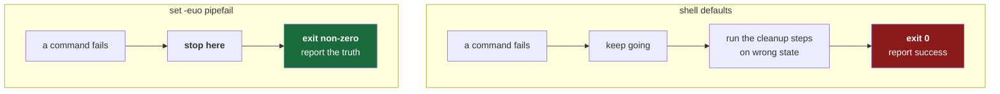

# 4.2 — `set -euo pipefail`, four words that make a script fail honestly

## One-line answer

By default a shell script **ignores failures and keeps going**, so `set -euo pipefail` on line 3 of
`./o` turns three silent wrong-answer behaviours into loud stops — and it is the difference between a
gate that reports the truth and a gate that reports success.

---

## The story

🎬 **The scene.** A nightly job builds an artifact, copies it to a directory, and deletes the working
directory afterwards. It has run every night for a year. The dashboard is green every morning.

😬 **The naive fix.** One morning someone needs yesterday's artifact and cannot find it. They look at
last night's job: it succeeded. They look at the night before: succeeded. They look in the output
directory: the newest file is eleven weeks old.

💥 **Why it fails.** Eleven weeks ago the copy step started failing — a path changed. The script did
not stop. It printed an error nobody read, carried on to the next line, deleted the working
directory, reached the end, and **exited with a status meaning success**, because the status a script
reports by default is the status of its *last* command. The last command had worked fine. So for
eleven weeks the job destroyed its own output and reported that everything was fine.

💡 **The insight.** A script that continues after a failure does not merely fail — it does something
*worse than failing*, because it proceeds to the cleanup steps with the wrong state and then
certifies the result. **"Keep going after an error" is almost never what you want**, and it is the
default.

---

## The idea in plain language

Three separate default behaviours conspire in that story, and `set -euo pipefail` switches off all
three.

**`-e` (errexit) — stop when a command fails.** The manual: *"Exit immediately if a pipeline … returns
a non-zero status."* Without it, execution continues to the next line regardless.

**`-u` (nounset) — stop when an unset variable is used.** The manual: *"Treat unset variables and
parameters … as an error when performing parameter expansion."* Without it, a misspelled variable
expands to an **empty string**, silently. This is how `rm -rf "$DIR/"` becomes `rm -rf "/"` when `DIR`
is misspelled — a genuinely catastrophic outcome from a typo, produced by a default.

**`-o pipefail` — a pipeline fails if *any* stage failed.** The manual: *"the return value of a
pipeline is the value of the last (rightmost) command to exit with a non-zero status, or zero if all
commands in the pipeline exit successfully."* Without it, a pipeline reports only its **last**
command's status, so `something_broken | tee log` succeeds as long as `tee` worked.

*All three quoted verbatim from the GNU Bash manual, `The Set Builtin`; verified against
`gnu.org/software/bash/manual/html_node/The-Set-Builtin.html` on 2026-08-24.*

### The exceptions to `-e`, which you must know

`-e` is not "stop on any non-zero anywhere", and believing that it is causes its own bugs. The manual
lists exactly where a failing command does **not** trigger an exit:

| Where | Why it exists |
| --- | --- |
| the condition of an `if` | `if grep -q x file` must be allowed to be false |
| a `while` or `until` condition | same reason |
| any command in a `&&` or `||` list **except the last** | `a || b` is asking "did `a` fail?" |
| any command in a pipeline **but the last** | this is precisely what `pipefail` fixes |
| a command negated with `!` | `! grep -q x file` is asking for failure |

**The `||` exception is the useful one.** It is how you say *"this command is allowed to fail, and
here is what to do about it"* — which is how `./o check` handles pytest's "no tests collected"
([4.4](4.4-the-check-gate.md)). Without that exception, `-e` would make deliberate failure-handling
impossible.

**These settings do not make a script safe. They make it honest.** A script can still do the wrong
thing correctly; what it can no longer do is the wrong thing *and report success*.

---

## Why Kriya needs it

Day 13 puts `./o check` in a pipeline, and Day 174 has an agent take automated remediation actions.

Both depend on the same property: **a command's exit status must mean something.** CI decides
pass/fail from an exit status. An automated remediation decides whether to escalate from an exit
status. A script that exits `0` after its third step failed will tell a pipeline that broken code is
fine, and will tell a remediation agent that a failed repair succeeded — at which point the agent
stops trying and the incident continues with nobody watching.

The story at the top of this page is annoying on a laptop. The same defaults inside an automated
remediation loop on Day 175 are how a remediator makes an outage worse.

---

## The mechanism

The line, from the top of `./o`:

```bash
#!/usr/bin/env bash
set -euo pipefail
```

**Line by line:**

- `#!/usr/bin/env bash` is the *shebang* — the first line telling the system which interpreter to run
  this file with. `/usr/bin/env bash` finds `bash` via `PATH` rather than hard-coding a location,
  which matters because `bash` lives in different places on different systems. **This line must be
  first and must have no leading whitespace**; a blank line above it and the file is treated as an
  ordinary text file.
- `set -euo pipefail` combines the three: `-e` errexit, `-u` nounset, `-o pipefail`. `-e` and `-u` are
  single-character options so they bundle into `-eu`; `pipefail` has no single-character form, hence
  `-o`.

Now watch each one, with real output.

**`-u`, the unset variable:**

```bash
bash -c 'set -euo pipefail; echo "before"; echo "$NOPE"; echo "after"'
```

**Line by line:** `bash -c '…'` runs a script given as a string, which is how you demonstrate shell
behaviour without creating files. Single quotes stop your *current* shell expanding `$NOPE` before
the inner shell ever sees it — with double quotes the demonstration would silently do nothing. The
three `echo`s mark before, the failure, and after, so the output tells you exactly where it stopped.

Observed on **2026-08-24**:

```text
before
bash: line 1: NOPE: unbound variable
```

**`after` never printed.** The script stopped at the bad expansion, said which variable, and exited
`1`. Without `-u` it would have printed `before`, an empty line, and `after` — and reported success.

**`pipefail`, the hidden pipeline failure:**

```bash
bash -c 'set -e; false | echo piped; echo "reached, exit=$?"'
```

**Line by line:** `false` is a command whose entire purpose is to exit non-zero. Piping it into
`echo` builds a pipeline whose first stage fails and whose last stage succeeds. `$?` holds the exit
status of the previous command. Note this uses `set -e` **without** `pipefail`, deliberately — the
point is to show what `-e` alone does not catch.

```text
piped
reached, exit=0
```

**`reached` printed, and the status was `0`.** Even with `-e` active, the failure of `false` was
invisible, because a pipeline's status is its last command's. `pipefail` is what closes this, and it
matters far more than it looks: the moment a script pipes anything into `grep`, `tee`, `sort` or
`head`, its error detection quietly stops working.



---

## When it breaks

`set -u` breaks scripts that read *optional* variables, and this is the one genuine friction it
creates. `./o` reads its second argument, which is frequently absent — `./o check` has no day number:

```bash
DAY="${2:-}"
```

**Line by line:** `$2` is the second argument. Under `-u`, referencing it when it does not exist is a
fatal error. `${2:-}` is *parameter expansion with a default*: use `$2` if set, otherwise the empty
string after the `:-`. Here the default is deliberately empty — the script wants `DAY` to be empty
when no day was given, and it checks for that explicitly later
([4.3](4.3-the-dispatcher-and-resolving-a-day.md)).

Without it, `./o check` fails immediately. Observed on **2026-08-24**, running the same two lines
with `check` as the only argument:

```text
check: line 2: $2: unbound variable
```

**Note the prefix.** It is not `bash:` — it is the script's own name, which is what `$0` holds. In
`./o` the message would begin `./o:`. That detail is worth registering, because when you are staring
at a wall of pipeline output, the prefix is how you find *which* script failed.

**What it says:** `$2` is unbound.
**What it actually means:** `-u` is doing its job. This is not a bug in `-u`; it is `-u` demanding
that you state your intent about an optional value rather than leaning on an invisible default. The
`${VAR:-default}` form is how you say "this one really is optional", and being forced to say it is
the point.

**The fix that throws away the protection:** deleting `set -u`. One optional variable becomes a
reason to disable a whole class of error detection for the entire script. **When a safety setting is
inconvenient in one place, handle that place — do not remove the setting.** That instinct generalises
directly to Day 77 (deleting a noisy alert versus silencing all alerts) and Day 59 (a policy
exception versus disabling the policy).

There is a second sharp edge worth knowing before it surprises you: **`-e` does not apply inside a
function whose result is being tested**, and it behaves in ways experienced people still get wrong in
complex scripts. That is not a reason to skip it; it is a reason to keep shell scripts short
([1.2](../01-the-toolchain/1.2-git-and-the-shell-these-docs-assume.md)), which is why `./o` delegates
anything with real logic to Python.

---

## In production

**What a professional does differently.** They put `set -euo pipefail` in every shell script without
thinking about it — and they also know it is not sufficient. In a container, the entrypoint script
gets the same treatment plus `exec` for the final command, so the real process replaces the shell and
receives signals directly. Without `exec`, the shell stays as process 1, does not forward `SIGTERM`,
and your container ignores a graceful shutdown request until it is killed — which shows up on Day 41
as pods that take the full termination grace period to die, and on Day 45 as a node drain that takes
far longer than it should.

**What degrades at scale.** Shell's error handling has no exceptions, no stack traces, and no
structured way to add context. At a hundred lines you are hand-rolling error handling that a real
language gives you for free. The scale signal is not line count but *branching*: the first time a
script needs to make a decision based on structured output — parsing JSON, comparing versions — it
has outgrown shell. That is the boundary `./o` respects.

**The failure that only shows with real traffic.** The silent-partial-success in the opening story is
the archetype, and its production form is worse: a deployment script that fails to apply one manifest
out of twelve, continues, reports success, and leaves the system in a state matching *neither* the old
nor the new version. Half-applied state is genuinely hard to reason about and hard to roll back from.
Day 43 (rollouts as a state machine) and Day 56 (reconciliation) both exist because "the change was
partially applied" is a real state that systems get stuck in.

**The review comment a senior engineer leaves.** *"This script has no `set -e`, and step four can
fail. If it does, step five deletes the source directory anyway. Add `set -euo pipefail`, and think
about whether steps four and five should be atomic."*

**The signal you would alert on.** Not the settings themselves — but **exit status is the signal that
everything downstream is built on**. A scheduled job that exits `0` after failing is invisible to
every alert you will ever write, because your alerting has nothing to see. This is why Day 94's
nightly job is instrumented to report *what it did* — a record of work completed — rather than only
its exit status. **An alert on "the job failed" cannot fire if the job lies about failing**, so a
serious pipeline also alerts on the *absence* of an expected success record. That is a dead-man's
switch, and it is one of the highest-value alerts in production monitoring.

**Blast radius, stated plainly.** These settings make the script *more* likely to stop and *less*
likely to proceed on bad state, so their blast radius is the opposite of most changes: they can cause
a script to fail that previously appeared to work. That is a feature — the appearance was the bug —
but it does mean adding them to an existing script can surface latent failures all at once. The
bound: `./o` is small, and every one of its subcommands is run by hand before anyone depends on it.

**Cost:** `0` requests, `0` tokens, `0` disk. Two words and one option.

---

## Check yourself

```bash
head -4 o && bash -c 'set -euo pipefail; echo "$NOPE"' ; echo "exit=$?"
```

The first shows the shebang and the `set` line. The second must print an `unbound variable` error and
a non-zero exit — proving the protection is real rather than decorative.

**Say out loud, without scrolling up:** *`set -e` is active and a script runs `false | tee log` — does
it stop, and which of the three settings decides?*
