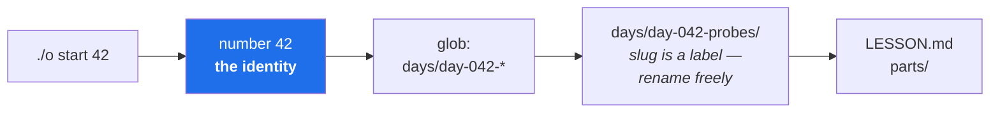

# 4.3 — The dispatcher, and resolving a day by number

## One-line answer

`./o` is a `case` statement mapping a word to a block of commands, and the one genuinely interesting
thing in it is `daydir()` — which finds a day folder **by its number, accepting any slug that
follows**, so that renaming `day-042-probes` to something better cannot break a single tool.

---

## The story

🎬 **The scene.** A project names its folders after what they contain. One is called
`reports-quarterly`. Everyone knows it. Six scripts refer to it, three scheduled jobs read from it,
and a dashboard links to it.

😬 **The naive fix.** The team's scope grows and the name is now wrong — the reports are monthly.
Someone renames it to `reports-monthly`. Sensible, tidy, obviously correct.

💥 **Why it fails.** Two of the six scripts break immediately and loudly, which is fine. One breaks
silently, because it creates the directory if it is missing — so it now writes into a new, empty
`reports-quarterly` that nobody looks at. A scheduled job fails at 02:00 and emails an address nobody
reads. The dashboard shows a blank panel that everyone assumes is a data problem. **The rename was
correct and it was still a mistake**, because the name was doing two jobs: describing the contents
*and* being the address everything used to find it.

💡 **The insight.** A name that is both an **identity** and a **description** cannot be improved,
because improving the description breaks the identity. Separate them — a stable identity plus a
mutable label — and you can rename freely forever.

---

## The idea in plain language

**A dispatcher maps a word to an action.** `./o` takes its first argument, compares it against a list
of known commands, and runs the matching block. Anything unrecognised prints usage. That is the whole
architecture, and its virtue is that it is boring: a reader can find any command's implementation in
seconds.

**The interesting problem is addressing.** This plan has 237 day folders, and their names carry two
different kinds of information:

| | Example | Changes? | Used by |
| --- | --- | --- | --- |
| **Identity** | `042` | never | every tool |
| **Label** | `probes-liveness-readiness` | freely | humans reading a file tree |

The plan states this explicitly (§17.2): *the number is the identity, the slug is a label on it.*
Every tool resolves a day by number and **accepts whatever slug follows** — so a folder can be renamed
to a better slug at any time, and `./o start 42`, `./o depth 42`, the tracker and the traceability
generator all keep working.

The cost is that no tool may ever compute a path by joining a number and a slug. It must *search*.
That is four extra lines in one function, paid once, in exchange for the freedom to rename 237
folders forever. **That trade — a little indirection now to buy mutability later — is the same trade
as a DNS name in front of an IP address, or a Kubernetes Service in front of a set of pods**
(Day 35). Pods are created and destroyed constantly; the Service name is stable; nothing that calls
the service has to care. It is the same idea, at a different scale.

---

## Why Kriya needs it

Day 35 is *"Services and cluster DNS — how a request finds a pod that keeps being replaced."*

A pod's name and address change every time it restarts. If callers used those, every restart would
break every caller. Kubernetes solves it with a stable name that resolves to a changing set — exactly
the identity/label split above.

You are meeting the idea today, in four lines of shell, where you can read the whole implementation.
On Day 35 you will meet it again with a control loop and a DNS server behind it, and the mechanism
will be familiar rather than magical.

---

## The mechanism

The resolver:

```bash
pad() { printf "%03d" "$1"; }

daydir() {
  local n d
  n="$1"
  for d in "days/day-$(pad "$n")-"* "days/day-$(printf '%02d' "$n")-"* "days/day-$n-"*; do
    [ -d "$d" ] && { echo "$d"; return; }
  done
  echo ""
}
```

**Line by line:**

- `pad() { … }` defines a function. `printf "%03d" "$1"` formats its first argument as a decimal
  integer padded with zeros to at least three characters: `0` becomes `000`, `42` becomes `042`, `236`
  stays `236`. Three digits so that a sorted listing puts day 100 after day 99 rather than after day
  10 (plan §17.2).
- `local n d` declares both variables local to the function. Without `local`, a shell function's
  variables are **global**, so a helper could silently overwrite a caller's variable and produce a bug
  that looks like action at a distance. This is one line of hygiene that prevents a genuinely nasty
  class of shell bug.
- `for d in … ; do` iterates over three glob patterns in order — three-digit, two-digit, unpadded. The
  fallbacks exist so that a folder created by hand as `day-42-something` still resolves; the number is
  the identity, and the resolver is generous about how it is written.
- `"days/day-$(pad "$n")-"*` — note where the quotes stop. The quoted part protects the path from
  word-splitting, and the `*` sits **outside** the quotes so the shell still expands it as a glob. A
  `*` inside quotes is a literal asterisk and would match nothing. This is a small, real trap.
- `[ -d "$d" ] && { echo "$d"; return; }` — `[ -d "$d" ]` tests whether `$d` is a directory, which
  matters because **an unmatched glob in bash expands to the pattern itself**, so `$d` may be the
  literal string `days/day-042-*`. The `-d` test rejects that. `&& { …; }` runs the block only on
  success; `echo` prints the answer and `return` leaves immediately, so the first match wins.
- `echo ""` after the loop prints an empty string when nothing matched. **The function reports
  "not found" as empty output rather than as a failure**, which is deliberate: under `set -e`
  ([4.2](4.2-set-euo-pipefail.md)) a non-zero return would abort the whole script, and the caller
  wants to print a helpful message instead.

The dispatcher itself:

```bash
DAY="${2:-}"

case "${1:-help}" in
  start)
    need_day start
    D="$(daydir "$DAY")"
    [ -n "$D" ] || { echo "day $DAY is not written yet. Ask Claude Code:  /day-kriya $DAY"; exit 1; }
    ...
    ;;
  *)
    cat <<'USAGE'
usage: ./o <command> [day]
USAGE
    ;;
esac
```

**Line by line:**

- `DAY="${2:-}"` — the second argument, defaulting to empty, because `set -u` would otherwise abort on
  `./o check` which has no second argument ([4.2](4.2-set-euo-pipefail.md)).
- `case "${1:-help}" in` — branch on the first argument, defaulting to `help`. That default is why
  bare `./o` prints usage rather than failing: **the no-argument case is a designed behaviour, not an
  accident.**
- `start)` … `;;` — a branch. The `;;` terminator is mandatory; shell `case` does not fall through
  like C, which is one of the few places shell's syntax is friendlier than a real language's.
- `D="$(daydir "$DAY")"` — `$( )` is command substitution: run the function, capture its output.
- `[ -n "$D" ] || { echo …; exit 1; }` — `-n` tests for a non-empty string. `||` runs the block only
  if the test failed, which is the idiomatic shell way to say *"otherwise, complain and stop"*. Note
  the error message **tells you what to do next** rather than only what went wrong.
- `*)` — the catch-all branch, matching anything not handled above.
- `cat <<'USAGE' … USAGE` — a *heredoc*: everything up to the terminator is fed to `cat` as input. The
  **quotes around `'USAGE'` are critical**: they stop the shell expanding `$` inside the block. Without
  them, a `$something` in your usage text would be replaced by an empty string, silently mangling your
  own help output.

Watch it resolve. Day 0's folder is `days/day-000-toolchain-skeleton-driver/`, and the slug is not
mentioned anywhere:

```bash
./o parts 0
```

**Line by line:** `parts` takes a day number, resolves the folder, and lists its part documents. The
argument is `0` — not the folder name, and not a path.

Observed on **2026-08-24**:

```text
01-the-toolchain/1.1-why-one-tool-owns-the-environment.md
01-the-toolchain/1.2-git-and-the-shell-these-docs-assume.md
01-the-toolchain/1.3-uv-the-one-binary.md
01-the-toolchain/1.4-the-venv-you-never-activate.md
01-the-toolchain/1.5-the-editors-interpreter-trap.md
02-the-machine/2.1-the-numbers-your-machine-actually-has.md
```

**Rename the folder to `day-000-anything-else` and that command still works**, unchanged, along with
`./o depth 0`, `./o start 0`, the tracker and the traceability generator — because none of them ever
knew the slug.



---

## When it breaks

Ask for a day that does not exist:

```bash
./o start 5
```

Observed on **2026-08-24**:

```text
day 5 is not written yet. Ask Claude Code:  /day-kriya 5
```

**What it says:** day 5 is not written.
**What it actually means:** `daydir` returned empty — none of the three glob patterns matched a
directory. **This is a designed message, not an error the shell produced**, and the difference is
worth noticing: a shell error would have said something about a file not existing, which is true and
useless. This message names the situation and gives the next action.

Compare with what happens when the folder exists but is incomplete — this is Day 0's own state before
its hub was written:

```text
day 0 has no hub + parts/ - it is not written (plan §17.2)
```

**Two different messages for two different situations**, and that distinction is the whole value.
"The folder does not exist" and "the folder exists but is not a written day" need different responses
from you, so they get different sentences. **A tool that collapses distinct failures into one generic
message makes you do the diagnosis it could have done for you** — a principle that recurs on Day 79
when you write runbooks, and Day 172 when an AIOps system ranks candidate causes.

The failure mode of the *glob* approach itself is worth knowing, because it is silent:

```bash
mkdir -p days/day-042-first days/day-042-second
./o parts 42
```

**Line by line:** create two folders whose numbers collide, then resolve. `daydir` returns the **first
match** in glob order and never mentions the second. You get a valid answer to the wrong question, and
nothing warns you.

**The smallest fix:** do not create two folders for one day — the day number is the identity, so a
duplicate is a contradiction. **The better fix**, if this ever bit in practice, would be for `daydir`
to detect multiple matches and refuse. It does not today, and that is a deliberate, stated limitation
rather than an oversight: with one author and a generator that creates folders, the failure cannot
arise, and a check that cannot fire is code that will never be tested.

---

## In production

**What a professional does differently.** They keep the dispatcher flat and push logic outward. Every
`./o` subcommand is either a couple of lines of shell or a call into `scripts/*.py`. The three
commands with real logic — `depth`, `trace`, `tracker` — are Python, because they parse files, build
data structures and compare sets, and shell is the wrong language for all three
([1.2](../01-the-toolchain/1.2-git-and-the-shell-these-docs-assume.md)). **The driver's job is
naming, not computing.**

**What degrades at scale.** A `case` statement is fine to about twenty commands and then becomes a
wall. The symptoms are duplicated argument handling and commands nobody remembers. The answer is
subcommand grouping (`./o day start 42`) or a real CLI framework — and the trigger for switching is
not the count but the moment two commands need to share non-trivial logic, because that is when
copy-paste starts.

**The failure that only shows with real traffic.** The identity/label lesson, at scale, is what
happens when something *is* addressed by a mutable name. A service discovered by a pod's IP breaks
every time the pod restarts. A model loaded from a path containing a version breaks when the version
changes. A dashboard querying a metric by a label that gets renamed goes blank — silently, because a
query matching nothing returns no data rather than an error, which looks identical to "the system is
idle". Day 63 and Day 65 both deal with this exact silence.

**The review comment a senior engineer leaves.** *"This builds the path as `days/day-{n}-{slug}`. Now
the slug is load-bearing and nobody can rename a folder. Glob on the number instead."*

**The signal you would alert on.** Nothing about a dispatcher. But the generalisation is directly
alertable and it is one of the most useful alerts you will ever configure: **alert on a query that
returns no data.** A metric that stops being reported looks exactly like a metric reporting zero, and
"no data" is very often a rename, a redeploy or a broken exporter rather than a genuinely idle system.
Day 72's observability failure lab is built on precisely this.

**Blast radius, stated plainly.** `daydir` only reads the filesystem — it globs and tests for
directories, and cannot create, move or delete anything. Its worst case is returning the wrong folder
when numbers collide, which then feeds a *read* command. The sharp edge is one level up: `./o done`
takes that resolved path and **commits**, so a wrong resolution there would commit against the wrong
day. The bound is that `done` refuses unless that folder's checklist is fully ticked
([4.5](4.5-the-done-gate-that-refuses.md)) — a wrong folder would not be.

**Cost:** `0` requests, `0` tokens, `0` disk. Three globs and a directory test.

---

## Check yourself

```bash
./o parts 0 | head -3 && ./o start 5
```

The first lists day 0's parts, addressed purely by number. The second must refuse with a message that
tells you what to do next, and exit non-zero.

**Say out loud, without scrolling up:** *the day folder is called `day-000-toolchain-skeleton-driver`
— which part of that name may a tool depend on, which part may not, and what would break if a tool
depended on the wrong half?*
