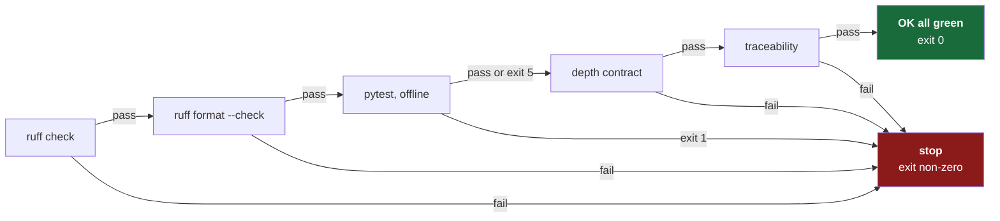

# 4.4 — The check gate

## One-line answer

`./o check` runs five checks in a deliberate order and **stops at the first failure**, so that one
command answers "is this repository healthy?" with an exit status a human, a pipeline and an agent
can all act on.

---

## The story

🎬 **The scene.** A team has good tooling. There is a linter, a formatter, a type checker and a test
suite. All four are configured, all four work, and the README lists all four commands.

😬 **The naive fix.** Everyone runs the tests. Some people run the linter. The formatter is run by
whoever remembers, which means diffs are full of unrelated reformatting whenever someone new touches
a file. The type checker is run by one person, on Fridays. When the pipeline goes red on a lint error
nobody has seen locally, the response is to fix that one error and move on.

💥 **Why it fails.** Four commands means four opportunities to skip one, and people skip
*inconsistently* — so the set of checks that has actually run on any given change is unknown. The
pipeline becomes the first place anything is verified, which makes it slow feedback rather than a
safety net, and people start treating red as "try again" rather than "something is wrong".

💡 **The insight.** The number of quality tools does not matter. **The number of commands does.** One
name that runs everything is not a convenience wrapper — it is what makes "did you check?" a question
with a yes-or-no answer.

---

## The idea in plain language

**A gate is a single command that answers one question with an exit status: is this repository in a
state I am willing to commit?**

Three properties make it a gate rather than a script that runs some tools.

**It stops at the first failure.** Under `set -e` ([4.2](4.2-set-euo-pipefail.md)) the first
non-zero command ends the run. That is a design decision with a real trade-off: you see one failure
at a time rather than all of them at once. It is the right trade because the checks are ordered
cheapest-first, so the thing that fails is usually the thing that is fastest to fix, and a wall of
simultaneous failures is harder to act on than one.

**It is the same everywhere.** You, a teammate and CI (Day 13) all run `./o check`. There is no
"but locally we also…" — the gate is the definition, so local and remote cannot disagree
([4.1](4.1-why-a-driver-script-not-make.md)).

**It must be able to fail.** This is Principle 11 and it is not rhetorical. A check that has never
gone red is not evidence of health; it is an untested assertion. **Right now, on this repository,
`./o check` is red** — and that is deliberate, because Day 0 is not finished yet.

### The order, and why it is that order

| # | Check | Catches | Cost |
| --- | --- | --- | --- |
| 1 | `ruff check .` | lint: unused imports, likely bugs, import order | fast |
| 2 | `ruff format --check .` | formatting drift | fast |
| 3 | `pytest`, offline subset | behaviour | medium |
| 4 | `depth_check.py` | the day documents' structure | fast |
| 5 | `trace.py` | day↔ID consistency across the whole plan | fast |

**Cheapest first, most specific first.** There is no point running a test suite to discover that a
file has an unused import — the linter answers in a fraction of the time. Ordering by cost means the
common case (something small is wrong) is also the fast case.

The tests are third rather than first because they are the slowest step, and the two before them
catch a large share of real problems. This is the same reasoning as a Dockerfile's layer order
(Day 24) and a CI pipeline's job order (Day 14): **put the cheap, high-yield check first, and fail
fast.**

---

## Why Kriya needs it

Day 13 is *"The first pipeline — continuous integration that can genuinely fail"*, and Day 14 is
*"Quality gates — lint, format, types, tests, and a gate that refuses rather than warns."*

Day 13's pipeline is short specifically because this gate exists: check out the repository, install
from the lockfile, run `./o check`. Three steps. Everything the pipeline verifies is defined in a file
you can run yourself, which means a red pipeline is always reproducible locally — and a red pipeline
you cannot reproduce locally is the thing that destroys trust in pipelines.

---

## The mechanism

The whole gate:

```bash
check)
  uv run ruff check .
  uv run ruff format --check .
  # pytest exits 5 for "no tests collected". Before the first test exists an empty suite is not a
  # failure - so 0 and 5 pass and everything else stops the gate.
  uv run python -m pytest -q -m "not live and not cluster" || [ $? -eq 5 ]
  uv run python scripts/depth_check.py
  uv run python scripts/trace.py
  echo "OK all green"
  ;;
```

**Line by line:**

- `uv run ruff check .` — lint the whole tree. `uv run` guarantees the project's own `ruff` at the
  pinned version ([1.4](../01-the-toolchain/1.4-the-venv-you-never-activate.md)), so the gate cannot
  depend on what happens to be installed on the machine. `.` is the current directory, and the
  exclusions in `pyproject.toml` keep it out of `.venv` and `days/*/lab`
  ([3.4](../03-repo-skeleton/3.4-pyproject-and-the-lockfile.md)).
- `uv run ruff format --check .` — **`--check` is the whole point of this line.** Without it, `ruff
  format` would *rewrite your files*, and a gate that silently modifies the thing it is checking is
  not a gate. With it, the command reports what it *would* change and exits non-zero. A gate reports;
  it does not act.
- `uv run python -m pytest -q -m "not live and not cluster"` — run the offline subset. The marker
  expression excludes anything needing a real API or a running cluster, which is what keeps the gate
  fast and runnable in CI ([3.4](../03-repo-skeleton/3.4-pyproject-and-the-lockfile.md)).
- `|| [ $? -eq 5 ]` — the interesting line. pytest exits **5** for *"No tests were collected"*
  (*verified against `docs.pytest.org/en/stable/reference/exit-codes.html` on 2026-08-24*), and
  before the first test exists, an empty suite is not a failure. `||` runs the right-hand side only
  when pytest exited non-zero, and `[ $? -eq 5 ]` succeeds only if that status was exactly 5 —
  so 0 and 5 pass, and 1 (tests failed) still stops the gate. This also relies on the `set -e`
  exception for `||` lists ([4.2](4.2-set-euo-pipefail.md)): without it, `-e` would abort before the
  check could run. **Note how narrow the exemption is** — it forgives exactly one status, not "any
  pytest failure", which is the difference between handling a known case and disabling a check.
- `uv run python scripts/depth_check.py` — every written day against the plan's §17 depth contract.
- `uv run python scripts/trace.py` — regenerates the traceability ledger and fails on any day that
  claims IDs the plan did not assign it.
- `echo "OK all green"` — reachable only if every previous line succeeded, because `set -e` would have
  ended the script otherwise. **The success message is therefore evidence, not decoration**: if you
  see it, all five checks passed.

Run it:

```bash
./o check
```

**Line by line:** no arguments — the gate always checks the whole repository, because a gate that
checks only what you remembered to name is a gate you can accidentally aim away from the problem. The
`./` prefix runs the script in this directory rather than searching `PATH`
([4.1](4.1-why-a-driver-script-not-make.md)).

Observed on **2026-08-24**, part-way through writing this very day:

```text
All checks passed!
40 files already formatted
FAIL day   0  2 problems
       - LESSON.md: missing - every day needs a hub
       - CHECKLIST.md: missing

depth contract: 0/1 days pass
```

**The gate is red, and it exits `1`.** Steps 1 and 2 passed, step 3 was silent (no tests yet — the
exit-5 case), and step 4 refused: this day has parts but no hub and no checklist, so by the plan's own
definition it is not written. `trace.py` never ran, because `set -e` stopped the script.

**That is Day 0's check that can fail, and you are looking at it failing.** It goes green when this
day is finished — which is a much better demonstration of a gate than any example could be.



---

## When it breaks

Make it fail on purpose — the only way to know a gate works.

```bash
mkdir -p .probe && printf 'import os\nimport sys\n\n\ndef f( x ):\n    return x\n' > .probe/bad.py
uv run ruff check .probe/bad.py
```

**Line by line:** `mkdir -p .probe` creates a scratch directory. The file has three planted defects:
two imports that are never used, and spaces inside the parentheses of the function signature. `\n\n\n`
gives the two blank lines before a top-level definition that the formatter expects, so the *only*
formatting complaint is the one we planted.

Observed on **2026-08-24**, abbreviated to the first finding:

```text
F401 [*] `os` imported but unused
 --> .probe\bad.py:1:8
  |
1 | import os
  |        ^^
2 | import sys
  |
help: Remove unused import: `os`
  |
  - import os
1 | import sys
  |

Found 2 errors.
[*] 2 fixable with the `--fix` option.
```

**`F401` is a rule code**, from the Pyflakes family that `select = ["E", "F", …]` enables
([3.4](../03-repo-skeleton/3.4-pyproject-and-the-lockfile.md)). Codes matter: they are how you
suppress one specific rule on one specific line if you ever genuinely must, and how you look up what
a complaint means. The `[*]` marks it as auto-fixable, and the footer says so explicitly — but note
that the gate does **not** pass `--fix`, for the same reason it does not let the formatter write:
a gate reports.

Then check the formatter separately, because the two tools report different things:

```bash
uv run ruff format --check .probe/bad.py
```

Observed on **2026-08-24**:

```text
unformatted: File would be reformatted
 --> .probe\bad.py:5:7
  |
4 |
  - def f( x ):
5 + def f(x):
6 |     return x
  |

1 file would be reformatted
```

**Read what that output is.** It is a **diff of what would change**, not a change. The `-` line is
what you wrote, the `+` line is what the formatter wants, and nothing on disk was touched — that is
`--check` doing its job. Exit status 1.

Clean up, and confirm the gate returns to its previous state:

```bash
rm -rf .probe && ./o check
```

**What it says:** file would be reformatted.
**What it actually means:** your file and the project's formatting configuration disagree. Not "your
code is wrong" — formatting is not correctness. Which is exactly why it is a **gate** and not a
warning: the value of consistent formatting is that diffs contain only real changes, and that value
only exists if it is enforced rather than encouraged.

**The fix that quietly removes the gate:** changing `ruff format --check .` to `ruff format .`. It
will make the failure go away — by reformatting your files as a side effect of running the gate. Now
the gate always passes, does not tell you anything, and modifies your working tree while you are
looking at something else. **A check that fixes things is not a check.** Formatters belong on save,
or in a pre-commit hook — somewhere explicit, never inside the thing whose job is to report.

---

## In production

**What a professional does differently.** They keep the gate fast, and they measure it. A gate that
becomes slow gets skipped, and it gets skipped precisely when people are rushing — which is when the
mistakes are. Practically: the slow checks move to CI-only or run in parallel, and the local gate
keeps the fast, high-yield ones. **Gate duration is a reliability metric**, not a developer-comfort
metric.

**What degrades at scale.** Running every check over the whole repository stops being viable in a
monorepo — you want to check only what changed, which needs a dependency graph and a cache. That is
`make`'s original idea returning at the scale where it earns its keep
([4.1](4.1-why-a-driver-script-not-make.md)). The trigger to switch is measurable and you will feel
it: when the gate takes long enough that you start doing something else while it runs.

**The failure that only shows with real traffic.** The gate that is green and wrong. Tests that pass
because they assert nothing meaningful, a linter with the interesting rules disabled, a depth check
that only counts headings. **A gate's value is bounded entirely by what it actually verifies**, and a
green light on a check that cannot fail is worse than no check, because it manufactures confidence.
This is why Principle 11 requires every day to ship a check you have personally watched go red, and
why Day 148 (*building an evalset that can actually fail*) is a whole day about the same problem in
the LLM setting.

**The review comment a senior engineer leaves.** *"You added a check to CI that isn't in `./o check`.
Now the pipeline can fail for a reason nobody can reproduce locally, and the first thing anyone will
do is re-run the job. Put it in the driver and have CI call the driver."*

**The signal you would alert on.** Not the gate — but two derived signals are real and you build them
on Day 20: **gate duration over time** (a rising trend predicts people skipping it) and **CI
first-attempt pass rate** (a falling rate means local and remote have diverged, or that people have
stopped running the gate locally at all). Both are computed from data your pipeline already produces.

**Blast radius, stated plainly.** `./o check` is **read-only by design**, and that is the property to
protect. It lints, it checks formatting without applying it, it runs tests, it validates documents.
The two exceptions are `trace.py` and `depth_check.py`'s companion `tracker.py`, which **rewrite
generated ledgers** — `TRACEABILITY.md`, `CURRICULUM_INDEX.md`, `TRACKER.md`. Those are declared
generated (plan §16), so overwriting them is their contract rather than a surprise. Nothing else is
modified, nothing is committed, nothing leaves the machine. **The moment someone adds a step to this
gate that changes source files, it stops being safe to run casually** — and running it casually is
the entire point.

**Cost:** `0` requests, `0` tokens, `0` network. Seconds of CPU.

---

## Check yourself

```bash
./o check; echo "exit=$?"
```

Today this should print the depth failure and `exit=1`. Read the failure — it is telling you exactly
what Day 0 still needs.

**Say out loud, without scrolling up:** *why is `ruff format --check` in the gate instead of
`ruff format`, and what specifically goes wrong if you "fix" a red gate by dropping the `--check`?*
