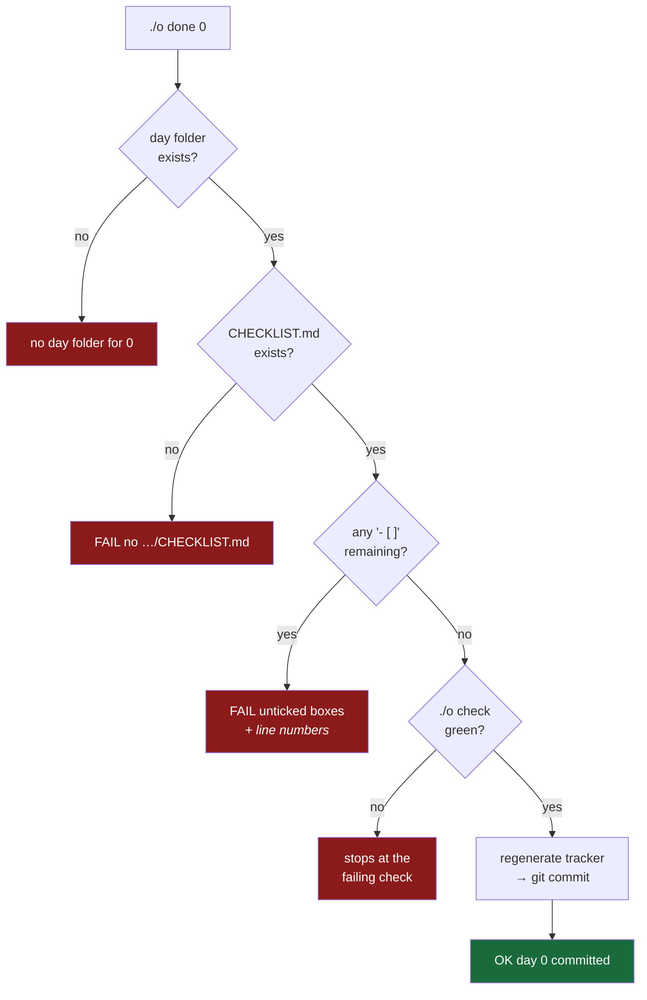

# 4.5 — The done gate that refuses

## One-line answer

`./o done N` will not commit a day while any checklist box is unticked or any check is red — and the
important thing about it is what it **cannot** verify: whether you were honest, which is the part
deliberately left to you.

---

## The story

🎬 **The scene.** A team has a definition of done. It is on a wiki page: tests written, documentation
updated, monitoring in place, runbook written. Everyone agreed to it at a meeting.

😬 **The naive fix.** A ticket is finished and moved to Done. The tests exist. The documentation is
"mostly there". Monitoring will be added next sprint, because the dashboard work is a separate
ticket. The runbook is a heading with three bullet points. Nobody lies about any of this; each
individual gap is reasonable and has a reason.

💥 **Why it fails.** Six weeks later the service pages at 02:40 and the runbook is three bullet
points. The person on call has never touched this service. **The definition of done was real, and
nothing ever checked it** — so it drifted, one reasonable exception at a time, until "Done" meant
"the code works", which is the one part that was never in question.

💡 **The insight.** A definition of done that is not enforced is a description of intentions. The
enforcement does not need to be clever — it needs to **exist**, and it needs to say *no* rather than
*warning*. A gate that can be walked past is a sign, not a gate.

---

## The idea in plain language

`./o done N` is the definition of done, made executable. It performs four steps in order and
**refuses at the first one that fails**:

1. Find day N's folder ([4.3](4.3-the-dispatcher-and-resolving-a-day.md)).
2. Require a `CHECKLIST.md`, and require **every box in it to be ticked**.
3. Run the full `./o check` gate ([4.4](4.4-the-check-gate.md)).
4. Regenerate the tracker, then `git add -A && git commit`.

The ordering is deliberate and it is the cheap-first principle again: the checklist scan is instant,
so there is no point spending seconds on lint and tests before discovering that half the boxes are
empty.

### What it can verify, and what it cannot

This distinction is the whole part, and it is worth being precise about:

| | Machine-checkable | Not machine-checkable |
| --- | --- | --- |
| Checklist | every box is ticked | whether ticking it was true |
| Tests | they pass | whether they test anything meaningful |
| Depth contract | every required section is present | whether the explanation is any good |
| Traceability | the IDs match the plan | whether you understood them |

**The left column is a floor, not a ceiling.** `./o done` can stop you committing a day that is
*obviously* unfinished. It cannot stop you committing a day you did not understand, because ticking a
box is an assertion by you and the script has no way to audit it.

That is not a flaw to be engineered away. It is the honest boundary of automated verification, and
pretending otherwise is how you get theatre — a process with many green checkmarks and no assurance.
**Knowing exactly where your automation stops is more valuable than extending it slightly further**,
because the place it stops is where a human has to be paying attention.

This is why the plan pairs the mechanical `./o depth` with the reviewed §17.8, and why Day 14's gates
are paired with Day 82's blameless postmortems. Machines check the floor; humans check the ceiling.

---

## Why Kriya needs it

Day 82 is *"Postmortems without blame, and action items that actually get done."*

The recurring failure of postmortems is the action item that is agreed and never done, which is the
story at the top of this page. The response is not more meetings — it is making completion
*checkable*: the action item becomes a ticket, a test, an alert, or a line in a runbook, and something
verifies it exists. `./o done` is the smallest possible instance of that idea, applied to your own
learning, where the only person you can defraud is yourself.

---

## The mechanism

The gate:

```bash
done)
  need_day done
  D="$(daydir "$DAY")"
  [ -n "$D" ] || { echo "no day folder for $DAY"; exit 1; }
  C="$D/CHECKLIST.md"
  [ -f "$C" ] || { echo "FAIL no $C"; exit 1; }
  if grep -q '^- \[ \]' "$C"; then
    echo "FAIL unticked boxes remain in $C"; grep -n '^- \[ \]' "$C"; exit 1
  fi
  "$0" check
  uv run python scripts/tracker.py
  git add -A && git commit -m "day-$(pad "$DAY"): complete"
  echo "OK day $DAY committed"
  ;;
```

**Line by line:**

- `need_day done` — refuses if no day number was given. `./o done` with no argument is almost
  certainly a mistake, and committing "whatever day I guess you meant" is not a recovery.
- `D="$(daydir "$DAY")"` then `[ -n "$D" ] || { …; exit 1; }` — resolve the folder by number, and
  stop if there is none.
- `C="$D/CHECKLIST.md"` / `[ -f "$C" ] || { echo "FAIL no $C"; exit 1; }` — the checklist must exist.
  Note the message includes the **full path it looked for**, so the fix is obvious rather than
  requiring you to guess where it expected the file.
- `grep -q '^- \[ \]' "$C"` — search for unticked boxes. `-q` means *quiet*: produce no output, just
  an exit status, because at this point we only want to know *whether* any exist. The pattern
  `^- \[ \]` anchors to the start of a line (`^`) and matches the literal Markdown `- [ ]`; the
  brackets are escaped because `[…]` is a character class in a regular expression. **A ticked box is
  `- [x]` and does not match**, which is the entire mechanism.
- `if …; then echo …; grep -n …; exit 1; fi` — on finding any, print a message and then run `grep`
  **again with `-n`** to list the offending lines *with their line numbers*. Two greps: the first
  decides, the second reports. **The gate does not merely refuse — it tells you exactly which boxes
  are unticked**, which is the difference between a gate that helps and a gate that is an obstacle.
- `"$0" check` — re-invoke this same script's `check` subcommand. `$0` is the path this script was
  called as, so the gate cannot drift from the standalone gate; there is one definition
  ([4.4](4.4-the-check-gate.md)). Under `set -e`, a red check ends everything here.
- `uv run python scripts/tracker.py` — regenerate `docs/TRACKER.md` **before** committing, so the
  generated ledger is part of the same commit as the work it describes. A generated file committed
  one commit later is a generated file that is wrong for one commit.
- `git add -A && git commit -m "day-$(pad "$DAY"): complete"` — stage everything and commit with a
  uniform message. This is the one genuinely mutating operation in the whole driver.
- `echo "OK day $DAY committed"` — reachable only if everything above succeeded.

Watch it refuse. Right now Day 0 has parts but no checklist:

```bash
./o done 0
```

**Line by line:** `0` is the day **number**, not a folder name and not a path — the resolver finds
the folder from it ([4.3](4.3-the-dispatcher-and-resolving-a-day.md)). This is the one command in the
driver that will change your repository, so it is worth being deliberate about typing it.

Observed on **2026-08-24**:

```text
FAIL no days/day-000-toolchain-skeleton-driver/CHECKLIST.md
```

Exit `1`, nothing committed. The gate resolved the folder correctly — it found
`day-000-toolchain-skeleton-driver` from the bare number `0` — and then refused at step 2.



---

## When it breaks

The interesting failure is the one where the gate is satisfied and the work is not. There is no error
to show you, because **there is no error** — the gate says exactly this:

```text
OK day 0 committed
```

…and that sentence is true about the checklist and silent about your understanding. **Every box was
ticked. The script cannot tell you whether ticking them was honest.**

The other real failure is a partial one, and it is worth knowing because it looks alarming:
`git commit` can fail *after* `git add -A` has already staged everything — an empty commit, a hook
rejecting it, a misconfigured identity. Under `set -e` the script stops, leaving your working tree
**staged but not committed**. Nothing is lost, but the repository is in a middle state.

**The smallest fix:**

```bash
git status --short && git commit -m "day-000: complete"
```

**Line by line:** `git status --short` shows what is staged, so you look before acting rather than
guessing. Then commit by hand. `&&` so the commit only runs if status succeeded
([1.2](../01-the-toolchain/1.2-git-and-the-shell-these-docs-assume.md)).

**Notice the shape of that failure**, because it is the same shape as the deploy that fails halfway
(Day 43) and the pipeline that writes some rows and then dies (Day 96): **an operation that is not
atomic can stop in the middle, and the middle is a state your system has to be able to describe.**
Here it is harmless because Git's staging area is designed for exactly this and the recovery is one
command. In a distributed system it is the hardest problem there is.

> `TODO(me)` Before you finish Day 0, make the gate refuse on purpose. Untick one box in
> `CHECKLIST.md`, run `./o done 0`, and read the output — it will name the file **and the line
> number**. Tick it back. A gate you have watched refuse is a gate you believe in; one you have only
> read about is a wiki page.

---

## In production

**What a professional does differently.** They put the gate where it cannot be skipped. `./o done`
runs on your machine, so it is a *convention* — you can always `git commit` yourself and bypass it
entirely, exactly as `git add -f` bypasses `.gitignore`
([3.5](../03-repo-skeleton/3.5-proving-the-guard-rail-holds.md)). Real enforcement lives on the server:
a required CI check (Day 13), a branch protection rule, an admission controller (Day 59). **The
pattern is always the same — a local gate for fast feedback, a server-side gate for actual
enforcement**, and confusing the two is how teams end up believing they have a control they do not
have.

**What degrades at scale.** Checklists rot. A list that was meaningful in month one becomes a
ritual by month six, at which point people tick everything without reading — and a checklist that is
always fully ticked carries exactly as much information as no checklist. The defences are to keep it
short, to make each item *verifiable* rather than aspirational, and to delete items that have stopped
earning their place. That last one is the same instinct as deleting a noisy alert (Day 77), and it
takes the same courage.

**The failure that only shows with real traffic.** Automation that certifies work nobody did. Its
production form is the deploy pipeline whose smoke test always passes because it checks that the
service returns *any* HTTP response, or the health check that returns `200` from a process whose
database connection died an hour ago. **The check runs, the check is green, and the check verifies
nothing.** Day 26 (the container that lies about being up) and Day 41 (probes) are both this exact
failure, and Day 122's serving lab makes you build it wrong on purpose so you recognise it.

**The review comment a senior engineer leaves.** *"This checklist item says 'monitoring added'. What
would I run to verify that? If there's no answer, it's not a checklist item — it's a hope. Make it
'alert X exists and has a runbook at path Y'."*

**The signal you would alert on.** Not the gate. But the generalisation is one of the most valuable
alerts in production, and it is worth naming now: **alert on the absence of an expected success.** A
nightly job that should report completion by 03:00 and has not is a signal, and it is the *only*
signal that catches a job that died before it could report anything. A gate that never ran produces
no failure, so something must be watching for the silence. This is a dead-man's switch, and Day 94
builds one.

**Blast radius, stated plainly.** `./o done` is **the only subcommand in the entire driver that
mutates shared state** — it runs `git add -A` and `git commit`. `git add -A` stages *everything*,
which is precisely the command that would sweep up a secret if `.gitignore` were wrong
([3.2](../03-repo-skeleton/3.2-gitignore-before-the-secret-exists.md)) — so the guard rail you tested
on Day 0 is load-bearing for a command you will run 237 times. The bounds: it commits **locally
only** and never pushes, so nothing leaves the machine and any mistake is fixable with
`git reset`; and it refuses unless the checklist is complete and every check is green. **The absence
of a `push` subcommand is a deliberate design decision** — the irreversible step stays manual.

**Cost:** `0` requests, `0` tokens. One `./o check` worth of CPU, plus a commit.

---

## Check yourself

```bash
./o done 0; echo "exit=$?"
```

Today it must refuse and exit non-zero — read *which* of the four steps it stopped at.

**Say out loud, without scrolling up:** *`./o done` verifies that every box is ticked. Name the thing
it cannot verify, and say what that implies about who is actually responsible for the day being
done.*
