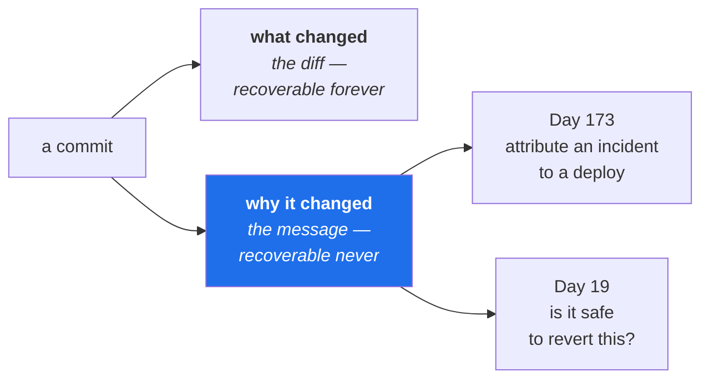

# 5.1 — The first commit, and what it promises

## One-line answer

A commit message is the only part of your work that gets read by someone who is confused, in a hurry,
and cannot ask you — so the subject line says **what changed** and the body says **why**, because the
diff already shows the what and can never show the why.

---

## The story

🎬 **The scene.** Something is wrong in production. A responder narrows it to one function and runs
the command that shows who last changed each line, and when.

😬 **The naive fix.** The line was changed eleven months ago. The commit message is `fix`. They open
the full commit: fourteen files, four hundred lines, message still `fix`. The author left the company
in March.

💥 **Why it fails.** The change was probably correct. The person understood exactly why they were
making it. That understanding lived in their head, and in a conversation, and possibly in a ticket
that has since been archived — everywhere except the one place that was guaranteed to still be here
eleven months later. **The diff survived perfectly and the reasoning did not**, so the responder now
has to decide whether reverting is safe with no information at all.

💡 **The insight.** Every commit is a message to a stranger under pressure. The stranger might be you.
The diff answers *what changed* forever; **the only thing you can add is why**, and it is the only
thing that cannot be recovered later.

---

## The idea in plain language

**A commit is a snapshot plus metadata** ([3.1](../03-repo-skeleton/3.1-what-a-repository-actually-is.md)):
who, when, what changed, and a message. The message is the only field a human writes, and therefore
the only one that can be wrong in an interesting way.

The conventional shape:

```text
<subject: what changed, imperative, short>
<blank line>
<body: why it changed, what else was considered, what it affects>
```

**The subject is imperative** — *"add the driver script"*, not *"added"* or *"adds"*. This reads
oddly for about a week and then stops mattering. The reason is that Git itself writes messages in the
imperative when it generates them (`Merge branch …`, `Revert …`), so matching keeps the log
consistent.

**The blank line is load-bearing.** Git treats the text before the first blank line as the subject and
everything after as the body, and every tool that shows a one-line log shows only the subject. Omit
the blank line and your entire message becomes one enormous subject that is truncated everywhere.

**Short subject, roughly fifty characters.** Not a style rule — a display constraint. Tools truncate,
and a truncated subject is one that stops before its most useful word.

### What belongs in the body

The test: **could a stranger reconstruct this from the diff?** If yes, leave it out.

| Belongs in the body | Does not |
| --- | --- |
| why this change, now | a list of the files you touched |
| what you considered and rejected | a restatement of the code |
| what it affects elsewhere | "various fixes and improvements" |
| what you are unsure about | anything the diff already says |

That fourth row is underused and valuable. *"I am not certain the timeout should be 30s; I picked it
to match the upstream default"* is enormously useful to the next person, and costs one line.

### Why this repository has a fixed commit format

Every day ends with the same message shape (plan §18.6):

```text
day NNN: <title> — closes <IDs>
```

The sameness is the point. It makes the history **queryable**: you can find where a concept was
covered by grepping the log, and the delivery metrics on Day 20 are computed from exactly this
structure. A history with a predictable format is a dataset; a history of `fix` and `wip` is a wall.

---

## Why Kriya needs it

Day 173 is *"Change intelligence — attributing an incident to the deploy that caused it."*

That day builds the thing the story at the top of this page needed: given an incident at a time, find
the changes that could plausibly have caused it, and rank them. The mechanism is mostly mechanical —
correlate deploy timestamps with the onset of a signal — but the **ranking** depends on what the
commits say. A candidate whose message explains a behaviour change is immediately assessable; a
candidate saying `fix` requires reading four hundred lines while an incident is ongoing.

**You are building that day's input data now**, one commit at a time, for 237 days.

---

## The mechanism

This repository already has its first commit. Look at it as a stranger would:

```bash
git log --format="%h %an %ad%n  %s" --date=short
```

**Line by line:** `--format=` takes a template of placeholders: `%h` is the abbreviated hash, `%an`
the author name, `%ad` the date, `%n` a newline, `%s` the subject. `--date=short` prints
`YYYY-MM-DD` rather than a long timestamp. Building the exact view you want, rather than reading the
default and squinting, is a habit worth forming — the log is a queryable dataset and this is the
query language.

Observed on **2026-08-24**:

```text
8f64745 aignishant 2026-08-24
  init
```

**That message is `init`, and it is not good enough.** It is the single most common first commit
message in the world, and it says nothing that the position in history does not already say — of
course the first commit initialises things. Compare what it *could* say:

```text
day 000: toolchain, skeleton and the ./o driver — closes no IDs

Establishes the environment contract before any code exists:
uv owns the interpreter and the lockfile, .gitignore precedes
any secret, and ./o defines the only gate.

Day 0 closes no curriculum IDs by design — it is a precondition
for the plan, not a member of it (plan §14).
```

Now see what it contains:

```bash
git show --stat --oneline HEAD | head -6
git ls-files | wc -l
```

**Line by line:** `git show` displays one commit; `--stat` summarises files changed rather than
printing every line; `--oneline` compresses the header. `head -6` keeps it short. Then
`git ls-files | wc -l` counts tracked files — the honest measure of what is in the repository
([3.3](../03-repo-skeleton/3.3-the-folder-skeleton-decided-early.md)).

Observed on **2026-08-24**:

```text
8f64745 init
 .claude/skills/day-kriya/SKILL.md              |  197 ++++
 .claude/skills/incident-drill/SKILL.md         |  131 +++
 .claude/skills/review-day/SKILL.md             |   91 ++
 .env.example                                   |   92 ++
 .gitignore                                     |   63 ++
```

```text
41
```

**Forty-one files, and not one of them is a secret.** Check that claim rather than trusting it:

```bash
git ls-files | grep -i "env\|secret\|key\|credential"
```

**Line by line:** list every tracked file and search for anything whose name suggests a credential.
`-i` makes the match case-insensitive. This is the check that matters before a repository is ever
pushed anywhere.

```text
.env.example
```

**One match, and it is the right one** — the example file with names and no values, deliberately
committed ([3.2](../03-repo-skeleton/3.2-gitignore-before-the-secret-exists.md)). The guard rail
written before any secret existed did its job on the very first commit.



---

## When it breaks

Try to commit with nothing staged:

```text
On branch main
nothing to commit, working tree clean
```

**What it says:** nothing to commit.
**What it actually means:** either you genuinely have no changes, or — far more commonly — **you
forgot to stage them**. Git prints the same sentence for both, and the second is the one that catches
people: you edited three files, ran `git commit -m "..."`, saw this, and concluded your changes were
already saved. They are not.

**The smallest fix:** `git status --short` first, every time. Two columns, and the left one tells you
what is staged ([3.1](../03-repo-skeleton/3.1-what-a-repository-actually-is.md)).

The other failure is one Git will not let you make silently:

```text
Author identity unknown

*** Please tell me who you are.

Run

  git config --global user.email "you@example.com"
  git config --global user.name "Your Name"

to set your account's default identity.
Omit --global to set the identity only in this repository.
```

**What it actually means:** a commit records an author, and Git refuses to invent one. Notice what
this message does: it names the problem, gives **the exact commands that fix it**, and then adds the
variation you might want instead (`--global` or not). That is unusually good error design — a failure
that leaves the reader able to act without a search — and it is worth registering as the standard to
aim at when you write your own failure messages on Day 79.

**A note on this specific commit.** The message `init` is already in the history and it will stay
there, because rewriting history to improve a message is almost never worth it — the cost is that
every subsequent commit changes identity ([3.1](../03-repo-skeleton/3.1-what-a-repository-actually-is.md)),
which breaks anyone who has already cloned. **The right response to a bad commit message is a better
next one**, not archaeology. Day 0's *own* commit, at the end of today, uses the plan's format.

---

## In production

**What a professional does differently.** They write the body. Not always — a one-line change to a
constant needs one line — but any change with a *reason* gets its reason recorded. The heuristic that
works: if you would have to explain this change in a review, write that explanation in the commit
instead, and the review comment becomes unnecessary.

**What degrades at scale.** History becomes unsearchable without conventions. Teams adopt structured
prefixes (`feat:`, `fix:`, `chore:`) precisely so that release notes and changelogs can be generated
from the log rather than written by hand. **The convention is not bureaucracy — it is what turns the
log into a machine-readable record**, which is exactly what Day 20's delivery metrics need and what
this repository's `day NNN:` format provides.

**The failure that only shows with real traffic.** The commit that is too large to reason about. A
change touching forty files across six concerns cannot be reverted selectively: if one part causes an
incident, you either revert everything (losing five good changes) or cherry-pick a fix under pressure.
**Commit size is a rollback-granularity decision**, and it is invisible until the day you need to
undo half of something. Day 19's rehearsed rollback and Day 20's change-failure-rate both depend on
commits being about one thing.

**The review comment a senior engineer leaves.** *"This commit does three unrelated things. If the
migration turns out to be wrong at 2am, whoever is on call has to revert your logging improvement to
get rid of it. Split it."*

**The signal you would alert on.** Nothing about a message. But the commit log is a genuine **data
source** for signals you will build: deploy frequency, lead time from commit to production, change
failure rate, and — on Day 173 — the correlation between a deploy and the onset of an incident. All
four are computed from `git log`, which is why its structure is an operational concern and not a
matter of taste.

**Blast radius, stated plainly.** A commit is local and reversible: `git reset` moves the branch back,
`git revert` adds an inverse commit, and the snapshot is still in `.git/objects` either way. **The
irreversible step is `push`** — once history is shared, rewriting it disrupts everyone who has it, and
anything published (a secret, in particular) must be treated as public forever
([3.5](../03-repo-skeleton/3.5-proving-the-guard-rail-holds.md)). This is exactly why `./o done`
commits and does not push ([4.5](../04-the-driver/4.5-the-done-gate-that-refuses.md)): the reversible
step is automated, the irreversible one stays in your hands.

**Cost:** `0` requests, `0` tokens. Disk: a commit stores only what changed, compressed; `.git` grows
slowly with text and quickly with binaries.

---

## Check yourself

```bash
git log --format="%h %s" && git ls-files | grep -i "env\|key\|secret"
```

The first shows your history so far. The second must print **only** `.env.example` — anything else
tracked with a credential-shaped name needs investigating right now.

**Say out loud, without scrolling up:** *the diff records what changed forever — so what is the one
thing a commit message can add, and which later day depends on your having added it?*
