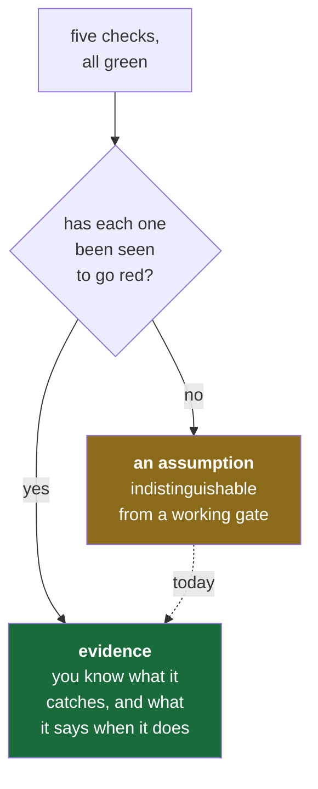

# 5.2 — Breaking every gate on purpose

## One-line answer

Today you make each of the five checks fail, one at a time, and read what it says — because **a gate
you have never seen fail is an assumption**, and the whole rest of this curriculum is built on
trusting these five.

---

## The story

🎬 **The scene.** A building has a fire alarm. It is inspected annually. The certificate is on the
wall by the entrance, current and signed.

😬 **The naive fix.** During a real evacuation, one wing hears nothing. Afterwards, everyone is
confused: the system passed inspection eight weeks ago. The panel showed all zones green the whole
time.

💥 **Why it fails.** The inspection tested that the panel reported the zone as healthy. It did not
test that the sounder in that wing produced a noise. The panel had been reporting green for two years
about a circuit that could not actually make a sound, and every inspection confirmed the panel's
opinion of itself.

💡 **The insight.** **Verifying that a monitoring system says everything is fine is not the same as
verifying that it would notice if things were not.** The only test that means anything is to create
the condition and watch the system react. Everything else is testing the report rather than the
thing.

---

## The idea in plain language

There is a specific, common defect in checks: a check that **cannot fail** looks exactly like a check
that is **passing**. Green, both cases. Same output. The difference only shows on the day it matters,
which is the day you find out.

Examples you will meet in this curriculum:

| The check | The way it silently cannot fail |
| --- | --- |
| a test suite | tests that assert nothing meaningful — Day 148 |
| a health endpoint | returns `200` from a process whose database is gone — Day 26 |
| a readiness probe | checks the port is open, not that the service works — Day 41 |
| a drift detector | thresholds so wide nothing crosses them — Day 115 |
| an evalset | cases so easy every model passes — Day 148 |
| an alert | a query that returns no data, forever — Day 72 |

**Every one is green.** Every one is worthless. And in each case the way to find out is identical:
**create the failure and confirm it is detected.** That technique has names at different scales —
a red test in test-driven development, a game day (Day 83), chaos engineering, a fire drill — and it
is the same idea each time.

Principle 11 puts it as: *every gate must be able to go red.* Today is the first application, and it
is the cheapest one you will ever get: five checks, five deliberate breakages, no consequences.

---

## Why Kriya needs it

Day 83 is *"Game days — breaking it on purpose, on a schedule."*

By then you will be deliberately failing a component of a running system to find out whether your
alerts fire, your runbooks work and your dashboards show anything useful. That is an intimidating
exercise to do for the first time on something real.

Doing it today, on five checks, on a repository with nothing to lose, is how the technique becomes
ordinary before the stakes rise. **The scale changes; the method does not.**

---

## The mechanism

Five breakages. Do each one, read the output, then undo it. **Work in a scratch directory** so
nothing here touches the real repository except where stated.

### 1 — the linter

```bash
mkdir -p .probe && printf 'import os\n' > .probe/bad.py && ./o check; echo "exit=$?"
```

**Line by line:** an import that is never used — the simplest possible real defect. `./o check` runs
the whole gate; `echo "exit=$?"` prints the exit status, which is what CI reads and therefore the
thing that actually matters.

```text
F401 [*] `os` imported but unused
 --> .probe\bad.py:1:8
```

The gate stops at check 1 and never reaches the other four
([4.2](../04-the-driver/4.2-set-euo-pipefail.md)). **Undo:** `rm -rf .probe`.

### 2 — the formatter

```bash
mkdir -p .probe && printf 'x = { "a":1 }\n' > .probe/fmt.py && ./o check; echo "exit=$?"
```

**Line by line:** valid Python that is formatted wrongly — spaces inside the braces, no space after
the colon. The linter has no complaint about it, so this isolates check 2 from check 1.

```text
unformatted: File would be reformatted
```

Note that nothing on disk changed — `--check` reports and does not rewrite
([4.4](../04-the-driver/4.4-the-check-gate.md)). **Undo:** `rm -rf .probe`.

### 3 — the tests

```bash
mkdir -p tests && printf 'def test_deliberate():\n    assert 1 == 2\n' > tests/test_probe.py && ./o check; echo "exit=$?"
```

**Line by line:** a test that cannot pass. This is the most important of the five, because it also
proves something else: until now `./o check` has been passing pytest by way of the *exit code 5*
exemption ([4.4](../04-the-driver/4.4-the-check-gate.md)) — no tests collected. **This is the first
time the test step has actually run a test**, and you should confirm that a failing test genuinely
stops the gate rather than being swallowed by that exemption.

```text
E       assert 1 == 2
```

Then delete the file and confirm the gate returns to the exit-5 path. **Undo:**
`rm tests/test_probe.py`.

### 4 — the depth contract

```bash
printf '\n**Time:** about two hours\n' >> days/day-000-toolchain-skeleton-driver/CHECKLIST.md
./o check; echo "exit=$?"
```

**Line by line:** `>>` **appends** — one character different from `>`, which would destroy the file
([hub §7](../../LESSON.md)). The appended line is a time estimate, which Principle 17 forbids anywhere
in a day folder.

```text
FAIL day   0  1 problems
       - CHECKLIST.md: a **Time:** line ('**Time:**') - a day has no clock (Principle 17)
```

**Undo:** remove the appended line. `git diff` will show you exactly what to remove, and
`git checkout -- days/day-000-toolchain-skeleton-driver/CHECKLIST.md` will do it for you if the file
is already committed.

### 5 — the done gate

```bash
./o done 0; echo "exit=$?"
```

**Line by line:** untick one box in `CHECKLIST.md` first, then run this. `echo "exit=$?"` prints the
exit status, because the status is what a pipeline reads — the human-readable message is for you, and
the number is for the machine. The two must agree, and checking that they do is the point of printing
both.

The gate refuses **before** running any checks, and names the line
([4.5](../04-the-driver/4.5-the-done-gate-that-refuses.md)):

```text
FAIL unticked boxes remain in days/day-000-toolchain-skeleton-driver/CHECKLIST.md
```



---

## When it breaks

The failure of *this exercise* is the one to watch for: **a breakage that does not break anything.**

Try breaking something the gate does not actually check:

```bash
mkdir -p days/day-000-toolchain-skeleton-driver/lab && printf 'import os\n' > days/day-000-toolchain-skeleton-driver/lab/junk.py
./o check; echo "exit=$?"
```

**Line by line:** the same unused import as breakage 1, placed inside a `lab/` directory. If the gate
were checking everything, this would fail identically.

It does not. The gate stays green, because `days/*/lab` is excluded in `pyproject.toml`
([3.4](../03-repo-skeleton/3.4-pyproject-and-the-lockfile.md)).

**What it says:** nothing. Green.
**What it actually means:** you have just discovered a **boundary of your gate**, empirically. That
particular boundary is deliberate and documented — a lab is scratch space and linting an experiment
is a nuisance. But the *technique* is the lesson: you found out what the gate does not cover by
trying to break it and being told nothing.

**Every gate has such boundaries.** Most are not deliberate, and almost none are documented. The only
reliable way to find them is exactly what you just did. **Undo:** `rm -rf
days/day-000-toolchain-skeleton-driver/lab`.

> `TODO(me)` Do all five breakages, and after each one, write **one line** in `docs/INCIDENTS.md`:
> what you broke, and the first line of output you saw. Five rows. This is your incident ledger's
> first content, and its purpose is that in six months you will recognise these messages instantly
> instead of pasting them into a search box.
>
> Then find **one more boundary** of your own — something you expected the gate to catch that it does
> not. There are several. Record it too, because an undocumented gap you know about is worth far more
> than one you do not.

---

## In production

**What a professional does differently.** They test the detection, not just the system. Concretely:
after writing an alert, they force the condition and confirm the page arrives — in the right channel,
to the right person, with a link to a runbook that exists. An alert that has never fired is an alert
nobody knows is misrouted, and misrouted alerts are discovered during incidents, which is the worst
possible time to discover anything.

**What degrades at scale.** Deliberate breakage stops being free. On a laptop you break a check and
undo it; in production you are creating a real failure in a system with real users, so it needs a
blast-radius plan, a rollback, a communication plan and an abort condition. **That is what makes
Day 83 a whole day rather than a paragraph.** The technique is identical; the surrounding safety
apparatus is what you are actually learning.

**The failure that only shows with real traffic.** The check that passes because it is *measuring the
wrong side of the boundary*. The archetype is the health endpoint that returns `200` because the web
framework is alive, while the database connection behind it has been dead for an hour. Every probe is
green; every request fails. **The check and the thing it claims to check have quietly become
different things.** Day 26 and Day 41 are both this failure, and they are more common than any other
kind of monitoring defect.

**The review comment a senior engineer leaves.** *"You've added an alert for this failure mode. Have
you fired it? Not simulated the query — actually caused the condition and confirmed the page arrived
with a runbook link. If not, we don't know that it works, we know that it exists."*

**The signal you would alert on.** The meta-signal, and it is one of the highest-value alerts in
production monitoring: **alert on a check that has not run.** A test suite that stopped executing, a
scheduled scan that silently stopped being scheduled, a probe that was removed in a refactor — all of
these look exactly like "everything is fine", because absence of failure is indistinguishable from
absence of checking. The defence is a dead-man's switch: something that expects a regular heartbeat
and complains about **silence**. Day 94 builds one.

**Blast radius, stated plainly.** Four of the five breakages happen in a `.probe` directory or a file
you delete immediately, so their worst case is a stray file. **Breakage 4 edits a real, tracked file**
(`CHECKLIST.md`), which is why it uses `>>` and not `>` and why the undo is `git checkout`. Breakage 5
edits the same file. The bound throughout is that **nothing is committed and nothing is pushed** —
`./o done` refuses precisely because you have deliberately broken it, so the one command that could
make any of this permanent is the one you are testing the refusal of. That is a pleasing property and
not an accident: the deliberate-failure exercise cannot accidentally persist, because the gate it is
testing is the gate that would have persisted it.

**Cost:** `0` requests, `0` tokens, negligible disk. A few `./o check` runs.

---

## Check yourself

```bash
./o check; echo "exit=$?"; git status --short
```

After undoing all five breakages, the gate must be green and `git status` must show no leftover
`.probe`, no `tests/test_probe.py`, no `lab/` and no stray line in `CHECKLIST.md`. **Cleaning up
after a deliberate failure is part of the exercise** — a game day that leaves the system in a
modified state is an incident you caused.

**Say out loud, without scrolling up:** *a check that cannot fail and a check that is passing look
identical — name the only way to tell them apart, and name one check in this repository whose
boundary you found today.*
