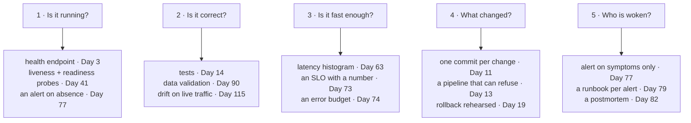

# 1.1 — The day the code met real traffic

## One-line answer

Operations is everything that becomes true about a piece of software the moment other people depend
on it, and none of it is visible while you are the only person using it.

---

## The story

🎬 **The scene.** You make yourself a sandwich for lunch every day. It is a good sandwich, and it
takes you five minutes. One day a colleague tries a bite and asks whether you would make her one
tomorrow. You say yes. A week later a second person asks. By the end of the month you are making six
sandwiches every morning.

😬 **The naive fix.** You buy more bread. Nothing else about the job has changed, so nothing else
needs to change. It is the same sandwich, the same five minutes, the same kitchen.

💥 **Why it fails.** It works for a fortnight, and that is the part worth noticing. Then one morning
the bread runs out at sandwich number four, and the two people at the end of the list find out at one
o'clock, when they are hungry and it is too late to buy anything. Then you are off sick on a Tuesday.
Nobody knows until lunchtime, because the only way to find out is to walk to the kitchen and look.
Then you switch to a cheaper mayonnaise. Nobody complains, but two people quietly stop asking, and
you do not learn why for a month.

💡 **The insight.** The sandwich never changed. What changed is that other people started depending
on it, and depending on something creates a whole set of questions that the thing itself cannot
answer. Is there one today? Is it the same as it was? Will it be ready in time? What did you change
last? And when it goes wrong, who finds out, and how soon? Those questions are the job. They are not
a harder kind of sandwich-making. They are a different activity, and it starts on the day somebody
else is counting on you.

---

## The idea in plain language

Software has two lives.

In the **first life** it is a thing you are making. You run it, you read what it printed, you change
it, and you run it again. The loop is short and you are standing inside it. If it breaks, you are
already looking at it. If it is slow, you wait. If it gives a wrong answer, you notice, because you
are the person reading the answer.

In the **second life** it is a thing other people are using. Now it runs when you are not watching:
at night, at the weekend, while you are in a meeting, on a machine you are not logged in to. It runs
against inputs you did not choose, at volumes you did not plan for, next to other programs competing
for the same memory. Most importantly, when something goes wrong, you are not the person who finds
out. Somebody else is, and the way they find out is by being unable to do their work.

**Operations is the name for the work of keeping software correct, available and understandable in
its second life.** It is not the work of building the software. It is the work of running it.

Three words get used for the people and the practices around this. They are worth separating now,
because everywhere else they are used loosely.

- **Operations** is the activity itself: running the system, watching it, fixing it and changing it
  safely.
- **DevOps** is a claim about *who* should do that activity. It argues that the people who build a
  system should also run it, because splitting those two jobs between two groups makes both groups
  worse at their own.
- **SRE**, which stands for site reliability engineering, is one specific way of doing operations.
  Its distinguishing move is to treat reliability as a **measurable quantity with a target you can be
  above or below**, rather than as something you aspire to. You meet it properly in Phase 8, starting
  on Day 73.

This curriculum teaches the activity. The labels matter much less than the questions.

### The five things that appear in the second life and are absent from the first

| What appears | Why it is absent when you are the only user |
| --- | --- |
| **Time when nobody is watching** | You were the monitoring. Take yourself away and there is none. |
| **Concurrency** | One person makes one request at a time. Ten people do not. |
| **Inputs you did not choose** | You test with the data you thought of. Reality supplies the rest. |
| **Neighbours on the same machine** | On your laptop the program has the machine to itself. In production it shares. |
| **A cost of being wrong that lands on somebody else** | Your own broken run costs you a re-run. Theirs costs them their morning. |

Every subject in the next two hundred and thirty-five days is a response to one of those five rows.
Health checks and alerting exist because of the first row. Timeouts and rate limits exist because of
the second and the fourth. Validation and drift detection exist because of the third. Rollbacks,
error budgets and approval gates exist because of the fifth.

---

## Why Kriya needs it

Day 73 asks you to write a **service level objective** for `pulse`. That is a sentence of the form
*"99% of requests will be answered correctly in under 400 milliseconds, measured over a rolling
four-week window."*

That sentence is meaningless in the first life. There is no such thing as "99% of requests" when
there are six requests and you made all of them yourself. It only becomes a real, checkable,
arguable commitment once somebody else's work depends on the answer arriving. Everything Phase 8
does is arithmetic built on top of the observation in this part, which is that **dependence is what
turns reliability from a feeling into a number.**

You also need it long before Day 73. On Day 3 you write `pulse`'s first health endpoint, and the only
reason that endpoint exists is the first row of the table above. Something has to answer the question
*are you alive?* when nobody is watching.

---

## The mechanism

There is no code today. The mechanism is a **set of questions**, and it is worth writing down,
because you will use it on every system anybody ever hands you.

Take any piece of software and ask these in order. The first one you cannot answer is where your
operational work starts.

```text
1. Is it running right now, and how do I know without asking a person?
2. Is it giving correct answers, and how would I find out if it stopped?
3. Is it fast enough, and fast enough for whom?
4. What changed most recently, and can I undo it?
5. When it breaks at 3am, who is woken, and what do they read?
```

Apply the five to the sandwiches in the story.

| Question | The honest answer that morning |
| --- | --- |
| Is there one today? | Unknown. You find out by walking to the kitchen. |
| Is it the same as it was? | Unknown. It was the same in April. |
| Will it be ready in time? | Unknown, and "in time" was never agreed with anybody. |
| What changed? | Unknown. Nobody wrote the mayonnaise down. |
| Who finds out first? | The hungry person, at one o'clock. |

Five unknowns, and not one of them is fixed by making a better sandwich. That is the point of the
story. The equivalent claim about software is that not one of them is fixed by writing better sorting
code.

Now apply the same five questions to `pulse` as it will exist at the end of this curriculum.



**Read the diagram as a promise about the rest of the plan.** Each of the five unanswerable questions
turns into three concrete mechanisms you can build, each with a day number attached. That is the
whole shape of this curriculum. It is the question set, expanded.

---

## When it breaks

The failure mode of *this idea*, rather than of any program, is one very common sentence. You will
hear it in code review for the rest of your career.

```text
It works on my machine.
```

That sentence is not a lie, and it is not laziness. It is almost always literally true, and that is
exactly what makes it useless. The speaker has run the program in its first life and reported the
result accurately. The listener is asking about the second life. The two of them are talking about
different systems, and both believe they are talking about the same one.

**What it actually means:** *"I have verified the only property I am able to verify without other
people."*

**The smallest fix** is not a better answer. It is a better question. Replace *does it work?* with
*what would have to be true for this to keep working while I am asleep?* The list that comes back is
a work plan, and it is usually longer than the program.

You saw the mechanical version of this on [Day 0, part 1.1](../../../day-000-toolchain-skeleton-driver/parts/01-the-toolchain/1.1-why-one-tool-owns-the-environment.md),
where two machines disagreed about what the word `python` meant. This is the same failure at a larger
scale, with two people disagreeing about what the word "works" means.

---

## In production

**What a professional does differently.** They ask the five questions *before* the thing exists.
Every one of the five has an answer that is cheap to build on the first day and expensive to retrofit
on the four hundredth. Adding a health endpoint to a new service takes a few lines. Adding one to a
service that has been running for two years means discovering that nothing has ever restarted
cleanly, that startup takes ninety seconds for reasons nobody remembers, and that two other systems
will misread the new endpoint. **The cost of an operational property depends on how late you add
it**, which is why Day 2 draws the blast-radius map before a single line of `pulse` exists.

**What degrades at scale.** Human attention. One person watching a terminal can answer the five
questions when there is one service. At ten services that person is the bottleneck, and at a hundred
they are a fiction. Everything in Phases 7 and 8, meaning metrics, structured logs, traces and
alerting, exists to answer those five questions *without* a person in the loop. The reason is
arithmetic rather than elegance.

**The failure that only shows with real traffic.** The one from the story, which is **silent
wrongness**. A system that is down announces itself within a working day, because people cannot get
their work done. A system that is quietly returning wrong answers announces itself only when somebody
notices a consequence further downstream, and that can take weeks. This is the single most important
asymmetry in operations, and it gets much worse with machine learning, where "wrong" is a
distribution rather than an exception and the model returns a confident number either way. Day 115,
on drift in live traffic, is where that lands, and it will land harder because you met the shape of
it here.

**The review comment a senior engineer leaves.** *"This is fine, but what happens to it at 3am on a
Sunday when you are not here? Walk me through who finds out and what they see."* If the answer
involves a person noticing, the work is not finished.

**The signal you would alert on.** Nothing yet, because today introduces no signal. That is worth
saying rather than skipping (plan §17.4.1, rule 4). Today is a mental model rather than a mechanism,
and there is nothing running to observe. The first real signal in this curriculum is `pulse`
answering, or failing to answer, its health endpoint on Day 3, and the first alert built on a signal
arrives on Day 77.

**Blast radius:** none. This part introduces no capability, changes no file and starts no process.
Saying so explicitly is the habit. A part that adds a power always names what bounds it, and a part
that adds none says that instead.

**Cost:** `0` requests, `0` tokens, `0` CI minutes and `0` MB resident. Reading costs nothing.

**The interview question that finds out whether you have done this.** *"Tell me about a time you
found out something was broken from a user rather than from a monitor. What did you change
afterwards?"* The answer they are listening for is not the fix. It is whether you changed the
**detection**, because a fix without a change to detection means the next problem is also found by a
user.

---

## Check yourself

```bash
./o next
```

It prints the day you are on and the IDs that day closes. Run it now, and notice that the tool
answers the question *where am I?* from the repository rather than from your memory. That is exactly
the subject of [2.1](../02-the-repo-remembers/2.1-why-the-chat-is-not-the-memory.md).

**Say out loud, without scrolling up:** *name the five questions, and say which one the sandwich
arrangement in the story failed first.*
