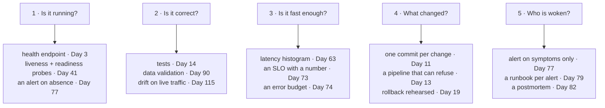

# 1.1 — The day the code met real traffic

## One-line answer

Operations is everything that becomes true about software the moment other people depend on it —
and none of it is visible while you are the only user.

---

## The story

🎬 **The scene.** Someone writes a small program that reads a list of support tickets and sorts them
by how urgent they look. It works. They run it on their own machine, on a file of two hundred rows,
and it finishes before they lift their hand off the keyboard. They show a colleague. The colleague
says: can the rest of the team use it?

😬 **The naive fix.** They put it on a spare machine under a desk and give everyone the address. It
is the same program. Nothing about it changed. Job done.

💥 **Why it fails.** Not immediately — that is the part worth noticing. It works for a week. Then one
morning it is slow, and nobody can say whether it is slow for everyone or just for the person who
complained. Then it stops answering entirely, and nobody knows when it stopped, because the only way
anyone finds out is by trying it. Someone restarts it. It works again. Nobody knows why it broke, so
nobody knows whether it will break again this afternoon. A month later somebody edits the file it
reads and the sorting quietly becomes wrong — not broken, *wrong* — and it stays wrong for eleven
days because nothing in the world was checking.

💡 **The insight.** The program never changed. **What changed is that other people started depending
on it**, and dependence creates a whole category of questions the program cannot answer about itself:
is it running, is it right, is it fast enough, when did that change, and who finds out first. Those
questions are the job. They are not a harder version of programming; they are a different activity
that begins on the day the code meets real traffic.

---

## The idea in plain language

Software has two lives.

In the **first life** it is a thing you are making. You run it, you look at what it printed, you
change it, you run it again. The loop is short and you are inside it. If it breaks, you are already
looking at it. If it is slow, you wait. If it is wrong, you notice, because you are the one reading
the output.

In the **second life** it is a thing other people are using. Now it runs when you are not watching —
at night, at the weekend, while you are in a meeting, on a machine you are not logged into. It runs
against inputs you did not choose, at volumes you did not plan for, next to other programs competing
for the same memory. And crucially: **when something goes wrong, you are not the one who finds out.
Someone else is, and they find out by being unable to do their work.**

**"Operations" is the name for the work of keeping software correct, available and understandable in
its second life.** Not the work of building it. The work of running it.

Three words get used for the people and practices around this, and they are worth separating now
because they are used loosely everywhere else:

- **Operations** is the activity: running the system, watching it, fixing it, changing it safely.
- **DevOps** is a claim about *who* does that activity — the argument that the people who build a
  system should also run it, because separating those two roles makes each one worse at its job.
- **SRE**, site reliability engineering, is a specific practice for doing operations, and its
  distinguishing move is to treat reliability as a **measurable quantity with a target you can be
  under or over** rather than as an aspiration. You meet it properly in Phase 8, starting Day 73.

This curriculum teaches the activity. The labels matter far less than the questions.

### The five things that appear in the second life and are absent from the first

| What appears | Why it is absent when you are the only user |
| --- | --- |
| **Time you are not watching** | You are the monitoring. Remove yourself and there is none. |
| **Concurrency** | One person makes one request at a time. Ten people do not. |
| **Inputs you did not choose** | You test with the data you thought of. Reality supplies the rest. |
| **Other tenants** | On your laptop the program has the machine. In production it shares. |
| **A cost of being wrong that lands on someone else** | Your own broken run costs you a re-run. Theirs costs them their morning. |

Every subject in the next two hundred and thirty-five days is a response to one of those five rows.
Health checks and alerting exist because of row one. Timeouts and rate limits exist because of rows
two and four. Validation and drift detection exist because of row three. Rollbacks, error budgets and
approval gates exist because of row five.

---

## Why Kriya needs it

Day 73 asks you to write a **service level objective** for `pulse` — a sentence of the form *"99% of
requests will be answered correctly in under 400 milliseconds, measured over a rolling four-week
window."*

That sentence is meaningless in the first life. There is no "99% of requests" when there are six
requests and you made all of them. It only becomes a real, checkable, arguable commitment once
somebody else's work depends on the answer arriving. Everything Phase 8 does is arithmetic on top of
the observation in this part: **dependence is what makes reliability a number instead of a feeling.**

You also need it far sooner than Day 73. On Day 3 you write `pulse`'s first health endpoint, and the
only reason that endpoint exists is row one of the table above — something has to answer "are you
alive?" when nobody is watching.

---

## The mechanism

There is no code today. The mechanism is a **question set**, and it is worth writing down because
you will use it on every system you are ever handed.

Take any piece of software and ask these in order. The first one you cannot answer is where your
operational work starts.

```text
1. Is it running right now, and how do I know without asking a person?
2. Is it giving correct answers, and how would I find out if it stopped?
3. Is it fast enough, and fast enough for whom?
4. What changed most recently, and can I undo it?
5. When it breaks at 3am, who is woken, and what do they read?
```

Apply it to the ticket-sorting program in the story:

| Question | The honest answer that morning |
| --- | --- |
| Is it running? | Unknown. You find out by trying it. |
| Is it correct? | Unknown. It was correct in April. |
| Is it fast enough? | Unknown, and "enough" was never defined. |
| What changed? | Unknown. There is no record. |
| Who is woken? | Nobody. It waits until someone complains. |

Five unknowns. Not one of them is a programming problem, and not one of them is solved by writing
better sorting code.

Now apply the same five to `pulse` as it will exist at the end of this curriculum:



**Read the diagram as a promise about the rest of the plan.** Each of the five unanswerable questions
becomes three concrete, buildable mechanisms with a day number attached. That is the whole shape of
this curriculum: it is the question set, expanded.

---

## When it breaks

The failure mode of *this* idea — not of a program, of the idea — is a specific and very common
sentence, and you will hear it in code review for the rest of your career:

```text
It works on my machine.
```

That sentence is not a lie and it is not laziness. It is almost always **literally true**, and that
is what makes it useless. The speaker has run the program in its first life and reported the result
accurately. The listener is asking about the second life. The two of them are discussing different
systems and both believe they are discussing the same one.

**What it actually means:** *"I have verified the only property I can verify without other people."*

**The smallest fix** is not a better answer, it is a better question. Replace *does it work?* with
*what would have to be true for this to keep working when I am asleep?* The list you get back is a
work plan, and it is usually longer than the program.

You saw the mechanical version of this on [Day 0, part 1.1](../../../day-000-toolchain-skeleton-driver/parts/01-the-toolchain/1.1-why-one-tool-owns-the-environment.md):
two machines disagreed about what `python` meant. This is the same failure at a larger scale — two
people disagreeing about what "works" means.

---

## In production

**What a professional does differently.** They ask the five questions *before* the thing exists.
Every one of the five has an answer that is cheap to build on day one and expensive to retrofit on
day four hundred. Adding a health endpoint to a new service takes a few lines. Adding one to a
service that has been running for two years means discovering that nothing ever restarted cleanly,
that startup takes ninety seconds for reasons nobody remembers, and that two other systems will
misinterpret the new endpoint. **The cost of an operational property is a function of how late you
add it**, which is why Day 2 draws the blast-radius map before a single line of `pulse` exists.

**What degrades at scale.** Human attention. The five questions can be answered by one person
watching a terminal when there is one service. At ten services the person is the bottleneck; at a
hundred they are a fiction. Everything in Phases 7 and 8 — metrics, structured logs, traces,
alerting — exists to answer those five questions *without* a person in the loop, and the reason is
arithmetic rather than elegance.

**The failure that only shows with real traffic.** The one from the story: **silent wrongness.** A
system that is down announces itself within a working day, because people cannot work. A system that
is quietly returning wrong answers announces itself when someone notices a downstream consequence,
which can be weeks. This is the single most important asymmetry in operations, and it gets much worse
with machine learning, where "wrong" is a distribution rather than an exception and the model returns
a confident number either way. Day 115 (drift on live traffic) is where that lands, and it will land
harder because you met the shape of it here.

**The review comment a senior engineer leaves.** *"This is fine, but what happens to it at 3am on a
Sunday when you're not here? Walk me through who finds out and what they see."* If the answer
involves a person noticing, it is not finished.

**The signal you would alert on.** Nothing yet — today introduces no signal. That is worth stating
rather than skipping (plan §17.4.1, rule 4): today is a mental model, not a mechanism, and there is
nothing running to observe. The first real signal in this curriculum is `pulse` answering or failing
to answer its health endpoint on Day 3, and the first alert built on a signal is on Day 77.

**Blast radius:** none. This part introduces no capability, changes no file and starts no process.
Stating that explicitly is the habit; a part that adds a power always names what bounds it, and a
part that adds none says so.

**Cost:** `0` requests, `0` tokens, `0` CI minutes, `0` MB resident. Reading costs nothing.

**The interview question that finds out whether you have done this.** *"Tell me about a time you
found out something was broken from a user rather than from a monitor. What did you change
afterwards?"* The answer they are listening for is not the fix — it is whether you changed the
**detection**, because a fix without a detection change means the next one is also found by a user.

---

## Check yourself

```bash
./o next
```

It prints the day you are on and the IDs that day closes. Run it now, and notice that the tool
answers "where am I?" from the repository rather than from your memory — which is exactly the subject
of [2.1](../02-the-repo-remembers/2.1-why-the-chat-is-not-the-memory.md).

**Say out loud, without scrolling up:** *name the five questions, and say which one the ticket-sorting
program in the story failed first.*
