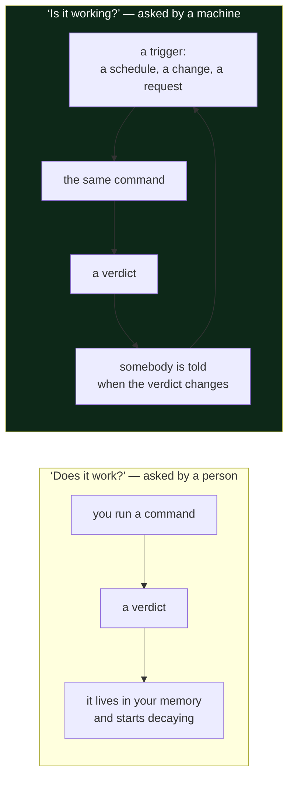

# 1.2 — "Does it work?" versus "Is it working?"

## One-line answer

*Does it work?* is a question about a property that was true once; *is it working?* is a question
about a fact that must be re-established continuously — and only the second one has an expiry date.

---

## The story

🎬 **The scene.** A smoke alarm is installed in a hallway. The installer presses the test button, the
alarm shrieks, and everyone agrees it works. They write the date on a sticker and go home.

😬 **The naive fix.** Nine years later there is a fire, and the alarm does not sound. The obvious
conclusion is that somebody should have bought a better alarm.

💥 **Why it fails.** The alarm was fine. Its battery died in year four. Between year four and year
nine the hallway contained a device that looked exactly like a working smoke alarm, occupied the
place a working smoke alarm would occupy, and satisfied anyone who glanced at it. The sticker was
still there, and the sticker was still true: on the day it was written, it worked.

💡 **The insight.** "It works" is a statement about a **moment**. Nothing about that moment extends
itself into the future for free. If you need the property to hold on an arbitrary later day, you need
something that **re-checks it** — and, critically, something that **tells you when the re-check
fails**. A smoke alarm with a chirp when its battery is low is a fundamentally different device from
one without, even though on installation day they behave identically.

---

## The idea in plain language

Two questions that sound like the same question:

**"Does it work?"** — a question about capability. It is answered by trying it once. The answer has
no timestamp attached, which is exactly the problem: people remember the answer and forget the day.

**"Is it working?"** — a question about the present. It is answered by a fresh observation, and the
answer is only good until the next one. Ask it again in ten minutes and you may get a different
answer, with nothing having been done wrong by anybody.

The gap between them is where almost all of operations lives. A test suite answers the first
question. A health check answers the second. A code review answers the first. A dashboard answers the
second. **The first kind of answer is made by people; the second kind has to be made by machines,
because it has to be remade constantly and nobody can do that.**

Two terms you need, and they are used inconsistently in the wild, so pin them down here:

**A check** is a thing that produces a fresh answer to "is it working?" on demand or on a schedule.
It has a subject (what it looks at), a verdict (pass or fail), and — this is the part people forget —
**a consumer**. A check nobody reads is not a check.

**A signal** is an observation about the running system that a check can be built from: a number, a
line of text, a status code. You meet signals formally in Phase 7 (Day 61 onward). Today you only
need to know that a check is built on signals, and a signal on its own decides nothing.

### The property that expires

Here is the distinction as a table, because the pairs are the useful part:

| Question | Answered by | Answer's shelf life | Example from this repository |
| --- | --- | --- | --- |
| Does the code lint? | a person running the linter | until the next edit | `uv run ruff check .` |
| Is the repository lint-clean *right now*? | a gate, on every change | until the next change | `./o check`, which CI will also run from Day 13 |
| Does `pulse` start? | trying it once | until anything changes | Day 3 |
| Is `pulse` up *right now*? | a probe, every few seconds | until the next probe | Day 41 |
| Was the model accurate at training? | an offline evaluation | until the world moves | Day 100 |
| Is the model accurate *right now*? | monitoring on live traffic | until the next window closes | Day 114 |

Read the last pair carefully, because it is the one that ends careers. An offline evaluation score of
0.94 is a *does it work* answer, permanently frozen on the day it was computed. The world it was
computed against keeps moving. That is trap #3 in the plan's §5.1 — *the model that is fine offline* —
and it is a direct consequence of confusing the two questions.

---

## Why Kriya needs it

Day 41 is *"Probes — liveness, readiness, startup, and the liveness probe that took production
down."*

A **probe** is Kubernetes' name for a check it runs against your container on a schedule and acts on
automatically. The whole day is a study in what happens when a machine is given a *is it working?*
question and the authority to restart things based on the answer. It is impossible to reason about
that day if you have not first separated the two questions cleanly, because the failure it teaches —
a liveness probe restarting healthy pods during a slow database query — is precisely a check
answering the wrong question and being believed.

Closer to hand: the health endpoint you write on Day 3 exists only because of this distinction, and
[5.2 of that day](../../../day-003-pulse-v0/LESSON.md) is about a health endpoint that answers *does
it work?* while pretending to answer *is it working?*

---

## The mechanism

You already own an example of each. Run both and watch the difference in what they promise.

```bash
uv run ruff check .
```

**Line by line:**

- `uv run` executes the following command inside this project's environment, so `ruff` means the
  version pinned in `pyproject.toml` and not whatever else is installed on the machine — the Day 0,
  part 1.4 rule ([the venv you never activate](../../../day-000-toolchain-skeleton-driver/parts/01-the-toolchain/1.4-the-venv-you-never-activate.md)).
- `ruff check .` runs the linter over the current directory. **This is a *does it work?* answer.** It
  is true about the files as they are on disk at this instant, and it stops being a fact the moment
  you save a file. Nothing re-runs it. Nothing tells you when it stops being true.

Now the second kind:

```bash
./o check
```

**Line by line:**

- `./o` is the driver script from Day 0. `check` runs five checks in a fixed order — lint, format,
  tests, the depth contract, traceability — and stops at the first one that fails.
- The important difference is **not** that it runs more checks. It is that `./o check` is the thing a
  pipeline will run automatically on Day 13, on every change, without being asked. That turns the
  same underlying question into a continuously re-established fact. **The command is a check; the
  automation around it is what makes it answer *is it working?***

Observed here on **2026-08-24**:

```text
All checks passed!
40 files already formatted
no tests ran in 0.02s
OK   day   0  19 parts

depth contract: all 1 checked days pass
traceability: 0/279 closed, 0 problem(s); index: 279 IDs
OK all green
```

The last line is a verdict with an implicit timestamp of *now*. Tomorrow it means nothing, which is
why it will be re-run tomorrow.



**The loop is the whole idea.** The command in both halves can be byte-identical. What makes the
second half operations is the trigger and the notification.

---

## When it breaks

The characteristic failure is a check whose loop is intact and whose **notification is missing**. It
runs, it fails, and nothing happens. Here is a real one from this repository's own history, recorded
in `docs/INCIDENTS.md` row 7 on 2026-08-24:

```text
$ ./o check
All checks passed!
40 files already formatted
no tests ran in 0.02s
OK   day   0  19 parts

depth contract: all 1 checked days pass
traceability: 0/279 closed, 0 problem(s); index: 279 IDs
OK all green
```

Exit status `0`. Green. And at that moment a file containing a deliberate lint error —
`import os` unused — was sitting in `days/day-000-*/lab/junk.py`.

**What it says:** everything passed.
**What it actually means:** everything the gate *looks at* passed. `pyproject.toml` sets
`extend-exclude = ["days/*/lab", "legacy"]`, so the entire `lab/` directory is invisible to the
linter, deliberately, because a lab is scratch space.

**Why this belongs in this part:** the gate was answering "is it working?" perfectly. The problem was
that its *subject* was narrower than the reader assumed. A green check is a claim about a scope, and
if you do not know the scope you have learned nothing.

**The smallest fix:** none — the exclusion is intentional. The fix is *knowing*, which is why it is
row 7 in the incident ledger rather than a change to `pyproject.toml`. An intentional gap that is
written down is a decision; an intentional gap that nobody remembers is a hole.

---

## In production

**What a professional writes instead of the teaching version.** They give every check three
properties before trusting it: a **subject** they can state in one sentence, a **frequency**, and a
**consumer** — the human or system that is told when it fails. A check missing the third one is
theatre, and it is astonishingly common: dashboards nobody opens, log files nobody reads, tests that
have been failing in a nightly job for so long that the red is furniture.

**What degrades at scale.** The consumer. One check with one consumer works. Four hundred checks with
one consumer produces a person who ignores all four hundred, which is strictly worse than having
none, because the organisation now believes it is covered. That collapse has a name — alert fatigue —
and Phase 16 (Days 169–178) is thirty days of work on the single problem of turning four hundred
firing alerts into one incident with a ranked list of causes.

**The failure that only shows with real traffic.** A check that is *itself* dependent on the thing it
is checking. The classic version: monitoring that runs inside the cluster it monitors, so when the
cluster goes down the monitoring goes down and you receive silence rather than an alarm. **Silence is
the most dangerous possible output of a monitoring system**, because it is indistinguishable from
health. Day 77 makes "alert on the absence of a signal" a standing rule for exactly this reason.

**The review comment a senior engineer leaves.** *"This check runs on a schedule and writes to a log.
Who reads the log? If the answer is 'we'd check it if there was a problem', delete the check and save
the CPU — right now it is telling you that you have coverage you don't have."*

**The signal you would alert on.** The one this part argues for: **check freshness**. Not just "did
the check fail?" but "when did the check last produce *any* verdict?" A check that stopped running is
the smoke alarm with the flat battery. In Prometheus terms this becomes an alert on the *age* of the
last successful run rather than on its result, and you build it on Day 77.

**Blast radius:** this part introduces no capability. `./o check` is read-only with one important
exception worth naming: it **regenerates** `docs/TRACKER.md`, `docs/TRACEABILITY.md` and
`docs/CURRICULUM_INDEX.md`, so running it overwrites any hand edit to those three files. Who can
trigger it: anyone who can run the repository's own tooling. What bounds it: the three regenerated
files are derived, committed, and diffable, so an unwanted overwrite is visible in `git diff` and
recoverable with `git checkout --`. Part [2.5](../02-the-repo-remembers/2.5-generated-files-you-never-edit.md)
is about exactly this.

**Cost:** `0` requests, `0` tokens. `./o check` costs a few seconds of local CPU and no network. From
Day 13 the same command costs CI minutes on every push, and that number becomes a real budget line.

**The interview question.** *"What's the difference between a test and a monitor?"* The answer that
lands: a test asks whether the code can be correct; a monitor asks whether the running system is
correct right now. They can execute the same assertion — a synthetic check that calls your own API
often literally reuses a test — and they are still different tools, because one runs before the
change and one runs forever after it.

---

## Check yourself

```bash
./o check && echo "verdict at $(date -Iseconds)"
```

Run it twice. Both verdicts are green; both are only about the instant they were produced. The
timestamp is the point.

**Say out loud, without scrolling up:** *the smoke alarm and the smoke alarm with a low-battery chirp
behave identically on installation day — state precisely what the chirp buys you, in the vocabulary
of this part.*
