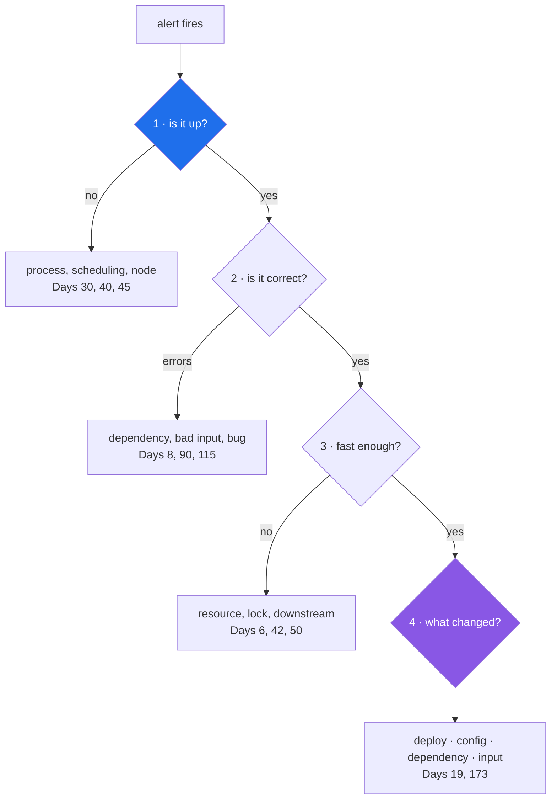

# 1.3 — The four questions an operator must be able to answer

## One-line answer

*Is it up · is it correct · is it fast enough · what changed* — four questions, and an operator's
entire toolchain exists to make each one answerable from a screen, in a fixed order, by someone who
did not write the code.

---

## The story

🎬 **The scene.** A pager goes off at twenty past three in the morning. The message says: *checkout
is broken*. The person holding the pager did not write checkout. They have never opened its source.
They have thirty seconds of grogginess and then they have to start being useful.

😬 **The naive fix.** Open the code and start reading. Find the checkout module. Try to understand
what it does. Look for something that seems wrong.

💥 **Why it fails.** There is no way to read your way to the answer. The code has not changed in a
week; it is not the code that is broken, it is the *situation*. Meanwhile every additional stretch of
silence is more people who cannot buy anything. And at three in the morning, reading unfamiliar code
is the slowest possible activity a human can attempt.

💡 **The insight.** The useful move is not reading. It is a **fixed sequence of four questions**,
asked in the same order every single time, because each answer eliminates an entire category of
cause. *Is it up?* eliminates "the process is gone". *Is it correct?* separates "returning errors"
from "returning nonsense". *Is it fast enough?* catches the case where nothing is failing and
everything is timing out. *What changed?* is asked last and solves it about half the time. The person
holding the pager does not need to understand checkout. They need the four answers, and they need
them from a screen rather than from a person.

---

## The idea in plain language

An operator is someone who can be handed a running system they did not build and make useful
statements about it. That sounds like it needs deep knowledge of the system. It mostly does not. It
needs four answers, and it needs them **fast, from an artifact, without waking anybody up**.

**Question 1 — is it up?** Is the process alive, listening, and reachable from where the users are?
Note the three separate claims in that sentence; they fail independently, and a system can be alive
but not listening, or listening but not reachable. Day 3 gives `pulse` an endpoint that answers the
first two. Day 7 (networking) is about the third. Day 41 hands the question to Kubernetes.

**Question 2 — is it correct?** Of the requests it is answering, what fraction are answered *well*?
"Well" splits into two very different failures: **loud wrong** (an error, a 500, a traceback) and
**quiet wrong** (a 200 response containing a bad answer). Loud wrong is easy — the system tells you.
Quiet wrong is the hard half of this curriculum and the entire reason Phases 11 and 14 exist.

**Question 3 — is it fast enough?** Not "is it fast" — *enough*, for whom, measured how. The
distinction between an average and a **percentile** matters enormously here and gets its own day
(Day 63). For now hold one sentence: an average latency hides the slow requests, and the slow
requests are the users who are having a bad time. If ninety-nine out of a hundred requests take 50
milliseconds and one takes 30 seconds, the average is a comfortable 350 milliseconds and one person
in a hundred has given up.

**Question 4 — what changed?** In a system that was working and is now not working, something is
different. Nearly always it is one of four things: a **deploy** (your code changed), a
**configuration change** (your settings changed), a **dependency** (something you call changed), or
**the input** (the traffic or the data changed). That list of four is worth memorising; it is the
first thing to run down, and the reason the plan spends Phase 2 on making "what changed" answerable
from `git log` alone.

### Why the order is fixed

Because each question, answered, deletes work.

| Answer | What it eliminates |
| --- | --- |
| It is up | every hypothesis involving a crashed, evicted or unscheduled process |
| It is up and returning errors | every hypothesis about slowness, and most about correctness |
| It is up, correct, and slow | every hypothesis about the code being *wrong*; you are now hunting a resource, a lock or a dependency |
| Nothing changed on our side | the deploy, the config and the flag — leaving the dependency and the input |

Asking them out of order is not fatal, but it wastes the expensive minutes. The classic waste is
starting at question 4 — *what did we deploy?* — because it feels productive, and spending twenty of
the first thirty minutes reading a diff for a service that was never actually up.

---

## Why Kriya needs it

Day 173 is *"Change attribution — which deploy caused this?"*, and Day 82 is your first written
postmortem.

Both of those days assume you already have the four answers available as **data** rather than as
opinion. A postmortem whose timeline reads "around 3am things seemed slow, we restarted it and it got
better" is not a postmortem; it is a memory. A postmortem whose timeline reads "03:12 error rate
crossed 5%, 03:14 alert fired, 03:19 identified deploy `a3f19c` at 02:58, 03:24 rolled back, 03:26
error rate normal" is a document you can learn from — and every number in it is one of the four
questions, timestamped.

The four questions are also the skeleton of every runbook you write from Day 79 onward.

---

## The mechanism

Today the four questions have no automated answers, because `pulse` does not exist yet. What you can
do — and should, because it makes the abstraction concrete — is answer them **about this repository**,
which is the only running system you currently own.

```bash
# Q1 — is it up?  For a repo, the analogue is: does the toolchain resolve and run at all?
uv run python -c "print('alive')"

# Q2 — is it correct?  The gate is this repository's correctness check.
./o check

# Q3 — is it fast enough?  There is no target yet, so measure and record a baseline.
time ./o check

# Q4 — what changed?  The repository is the record. This is the whole of Day 11, in one line.
git log --oneline -5
```

**Line by line:**

- `uv run python -c "print('alive')"` is the smallest possible liveness question. It proves the
  interpreter resolves, the environment exists and code executes. `-c` runs the string as a program
  rather than loading a file, so nothing on disk can be blamed.
- `./o check` is question 2 for a repository: are the artifacts in the state the project defines as
  correct? Note that this is a *does it work?* answer today and becomes an *is it working?* answer on
  Day 13, when CI runs the same command on every push — the distinction from
  [1.2](1.2-does-it-work-versus-is-it-working.md).
- `time ./o check` prefixes the command with the shell's built-in timer, printing how long it took.
  **There is no target to compare it against, and that is the honest state of question 3 today.** A
  measurement without a target is a baseline, not a check; you cannot say "fast enough" until Day 73
  defines *enough*. Writing the baseline down is still worth doing, because the first sign of a
  problem is usually a number that moved.
- `git log --oneline -5` answers question 4 for the repository: the last five things that changed,
  one per line. `--oneline` collapses each commit to a hash and subject; `-5` limits it. This is the
  primitive that Day 173's change attribution is built out of — the same question, correlated against
  an incident timeline.

Observed here on **2026-08-24**:

```text
alive
```

```text
2c36b16 day 000: record the day's commit hash in PROGRESS.md and the hub
5a8edee day 000: toolchain, skeleton and the ./o driver — closes no IDs
8f64745 init
```

**Read the `git log` output as an operator, not as an author.** Three commits, each with a subject
line that says what changed rather than *"updates"*. If an incident happened right now, that list is
the entire "what changed" investigation, and it takes one command and no interpretation. That is the
standard Day 11 asks you to hold for the next two hundred days.



---

## When it breaks

The four questions break in a specific and recognisable way: **you can ask them but not answer
them**, and the failure surfaces as a conversation rather than as an error message.

```text
"Is it up?"
"I think so? Let me try it... yeah, it worked for me just now."
"Is it up for everyone?"
"...I don't know how to check that."
```

**What it says:** one person made one successful request.
**What it actually means:** you have a sample of size one, taken from the wrong place — from inside
the office, on a warm connection, by someone who knows which endpoint works. It answers "does it
work?" and question 1 asked "is it working?".

There is a real error message that goes with this, and you will meet it on Day 7:

```text
curl: (28) Failed to connect to pulse.local port 8000 after 2003 ms: Timeout was reached
```

**What it actually means:** *unknown*. That is the point, and it is why this belongs here. A timeout
does not distinguish between "the process is dead", "the process is alive but not listening", "it is
listening but the network cannot reach it", and "it is fine but too slow to answer in the time
allowed". Four completely different causes, one indistinguishable symptom. **The four questions exist
because the symptom does not identify the cause** — you have to eliminate, in order.

**The smallest fix** for the conversation above is not a tool. It is deciding, today, that "is it up?"
must be answerable by a command anyone can run, and then making that true on Day 3.

---

## In production

**What a professional does differently.** They keep the four answers on **one screen**, and they know
where that screen is before the pager goes off. In practice that means a single dashboard with four
panels — availability, error rate, latency percentile, recent deploys — and the deploy markers drawn
*on the same time axis* as the other three, so "what changed" is answered by looking rather than by
correlating in your head. You build exactly this on Day 66, and the deploy-marker overlay on Day 173.

**What degrades at scale.** Question 4. With one service and one deploy a day, "what changed" is a
short list. With forty services deploying continuously, "what changed in the last hour" is hundreds
of events across systems you do not own, and the question stops being answerable by a human at all.
That is what change attribution (Day 173) and alert correlation (Day 171) exist to fix, and it is why
the plan insists from Day 11 that **every change is one commit with a message that explains itself**.
The discipline is cheap now and un-retrofittable later.

**The failure that only shows with real traffic.** Question 1 answered *per instance* instead of *per
user*. Your health check says the process is up; nine of your ten instances are up; one is serving
errors to ten percent of users and the aggregate looks fine. Averages hide minorities, and the
minority is a real person having a completely broken experience. This is why Day 63 teaches
percentiles and Day 73's SLO is written against user-visible outcomes rather than process states.

**The review comment a senior engineer leaves.** *"Your runbook starts with 'check the logs'. Which
logs, filtered how, and what am I looking for? Start it with the four questions and the exact command
for each one — I'll be reading this at 3am and I won't be clever."*

**The signal you would alert on.** One per question, and no more: **availability** (question 1),
**error rate** (question 2), **latency at a high percentile** (question 3). Question 4 gets **no
alert at all** — a deploy is not a problem, it is context, so it belongs on the dashboard as an
annotation and never as a page. That asymmetry is worth holding onto: *you alert on symptoms, you
annotate with causes.* Day 77 makes it a rule.

**Blast radius:** none from the four questions themselves. One caution on the commands above: `./o
check` regenerates three files in `docs/` (see [2.5](../02-the-repo-remembers/2.5-generated-files-you-never-edit.md)),
so running it is not purely read-only. Bounded by git: the change is diffable and revertible.

**Cost:** `0` requests, `0` tokens, `0` MB resident. `time ./o check` costs one extra run of the
gate — a few seconds of local CPU on four cores (Addendum 02 §3.1).

**The interview question.** *"You're paged for a service you've never seen. What are the first four
things you look at?"* Interviewers ask this constantly and are listening for **order and elimination**
rather than for tool names. Answering "I'd look at the logs" is a weak answer; answering "up, then
correct, then fast, then what changed — and I'd want each one from a dashboard rather than a shell,
because at 3am I'll type the wrong thing" is a strong one.

---

## Check yourself

```bash
git log --oneline -5 && time ./o check
```

Two of the four questions, answered about this repository, in one line.

**Say out loud, without scrolling up:** *why is "what changed?" asked last, when it is the question
that most often contains the answer?*
