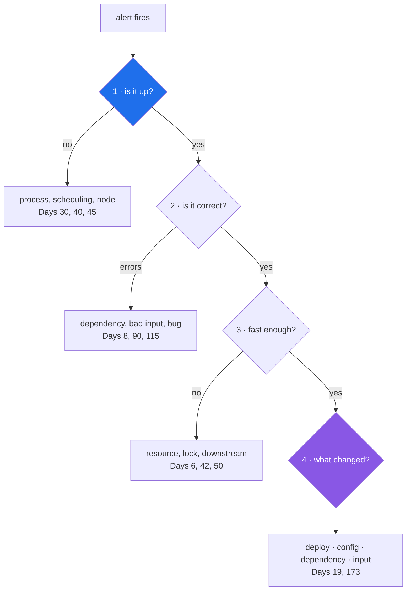

# 1.3 — The four questions an operator must be able to answer

## One-line answer

Is it up, is it correct, is it fast enough, and what changed. Those are the four questions, and an
operator's entire toolchain exists to make each one answerable from a screen, in a fixed order, by
somebody who did not write the code.

---

## The story

🎬 **The scene.** Your phone rings at twenty past three in the morning. It is the neighbour who lives
below you, and she says there is water coming through her ceiling from your flat. You know nothing
about plumbing. You have about thirty seconds of grogginess, and then you have to start being useful.

😬 **The naive fix.** Start looking for the leak. Pull up a floorboard. Look under the sink. Search
for something that looks wrong.

💥 **Why it fails.** You cannot look your way to the answer, because you do not know what a wrong pipe
looks like. The plumbing has not changed in six years, so it is probably not the plumbing that is
broken. Meanwhile every extra minute is more water in somebody else's ceiling, and at three in the
morning, learning plumbing is the slowest thing a person can attempt.

💡 **The insight.** The useful move is not looking. It is a **fixed list of questions, asked in the
same order every single time**, because each answer rules out a whole category of cause. *Is water
still arriving?* If yes, turn the mains off, and the emergency stops getting worse while you think.
*Which room is it under?* That eliminates most of the flat. *Is the water clean or dirty?* Clean means
a supply pipe, dirty means a drain, and those are different problems with different urgency. *What
did anybody do differently today?* Somebody plumbed in a washing machine this afternoon. You did not
need to understand plumbing. You needed four answers, in that order, and you needed them from things
you could look at rather than from somebody you had to wake up.

---

## The idea in plain language

An operator is somebody who can be handed a running system they did not build, and make useful
statements about it. That sounds as though it requires deep knowledge of the system. Mostly it does
not. It requires four answers, and it requires them **quickly, from something written down, without
waking anybody up.**

**Question 1: is it up?** Is the process alive, is it listening, and is it reachable from where the
users are? Notice that those are three separate claims in one sentence. They fail independently, so a
system can be alive but not listening, or listening but not reachable. Day 3 gives `pulse` an
endpoint that answers the first two. Day 7, on networking, is about the third. Day 41 hands the whole
question to Kubernetes.

**Question 2: is it correct?** Of the requests it is answering, what fraction are answered *well*?
"Well" splits into two very different failures. **Loud wrong** is an error, a 500, a traceback.
**Quiet wrong** is a successful-looking response that contains a bad answer. Loud wrong is easy,
because the system tells you. Quiet wrong is the hard half of this curriculum, and it is the entire
reason Phases 11 and 14 exist.

**Question 3: is it fast enough?** Not "is it fast", but fast *enough*, for whom, and measured how.
The difference between an average and a **percentile** matters enormously here, and it gets its own
day on Day 63. For now, hold one sentence. An average latency hides the slow requests, and the slow
requests are the users who are having a bad time. If ninety-nine requests out of a hundred take 50
milliseconds and one takes 30 seconds, the average is a comfortable 350 milliseconds and one person
in every hundred has given up and gone elsewhere.

**Question 4: what changed?** In a system that was working and is now not working, something is
different. Almost always it is one of four things. A **deploy**, meaning your code changed. A
**configuration change**, meaning your settings changed. A **dependency**, meaning something you call
changed. Or **the input**, meaning the traffic or the data changed. That list of four is worth
memorising, because it is the first thing to run down, and it is the reason the plan spends the whole
of Phase 2 on making "what changed" answerable from `git log` alone.

### Why the order is fixed

Because each question, once answered, deletes work.

| Answer | What it eliminates |
| --- | --- |
| It is up | every guess that involves a crashed, evicted or unscheduled process |
| It is up and returning errors | every guess about slowness, and most guesses about correctness |
| It is up, correct, and slow | every guess about the code being *wrong*; you are now hunting a resource, a lock or a dependency |
| Nothing changed on our side | the deploy, the config and the feature flag, which leaves the dependency and the input |

Asking them out of order is not fatal, but it wastes the expensive minutes. The classic waste is
starting at question 4, *what did we deploy?*, because it feels productive. You then spend twenty of
the first thirty minutes reading a diff for a service that was never actually up.

---

## Why Kriya needs it

Day 173 is *"Change attribution: which deploy caused this?"*, and Day 82 is your first written
postmortem.

Both of those days assume you already have the four answers available as **data** rather than as
opinion. A postmortem whose timeline reads *"around 3am things seemed slow, we restarted it and it
got better"* is not a postmortem. It is a memory. A postmortem whose timeline reads *"03:12 error
rate crossed 5%, 03:14 alert fired, 03:19 identified deploy `a3f19c` at 02:58, 03:24 rolled back,
03:26 error rate normal"* is a document somebody can learn from, and every number in it is one of the
four questions with a timestamp on it.

The four questions are also the skeleton of every runbook you write from Day 79 onward.

---

## The mechanism

Today the four questions have no automated answers, because `pulse` does not exist yet. What you can
do, and should, because it makes the abstraction concrete, is answer them **about this repository**,
which is the only running system you currently own.

```bash
# Q1 — is it up?  For a repo, the equivalent is: does the toolchain resolve and run at all?
uv run python -c "print('alive')"

# Q2 — is it correct?  The gate is this repository's correctness check.
./o check

# Q3 — is it fast enough?  There is no target yet, so measure and record a baseline.
time ./o check

# Q4 — what changed?  The repository is the record. This is the whole of Day 11, in one line.
git log --oneline -5
```

**Line by line:**

- `uv run python -c "print('alive')"` is the smallest possible liveness question. It proves that the
  interpreter resolves, that the environment exists, and that code executes. `-c` runs the string as
  a program rather than loading a file, so nothing on disk can be blamed for a failure.
- `./o check` is question 2 for a repository. Are the files in the state the project defines as
  correct? Notice that this is a *does it work?* answer today, and that it becomes an *is it
  working?* answer on Day 13, when CI runs the same command on every push. That is the distinction
  from [1.2](1.2-does-it-work-versus-is-it-working.md).
- `time ./o check` puts the shell's built-in timer in front of the command, so it prints how long the
  command took. **There is no target to compare it against, and that is the honest state of question
  3 today.** A measurement with no target is a baseline rather than a check, and you cannot say "fast
  enough" until Day 73 defines *enough*. Writing the baseline down is still worth doing, because the
  first sign of a problem is usually a number that moved.
- `git log --oneline -5` answers question 4 for the repository, by listing the last five things that
  changed, one per line. `--oneline` collapses each commit to a hash and a subject, and `-5` limits
  the list to five. This is the primitive that Day 173's change attribution is built out of: the same
  question, lined up against an incident timeline.

Observed here on **2026-08-24**:

```text
alive
```

```text
2c36b16 day 000: record the day's commit hash in PROGRESS.md and the hub
5a8edee day 000: toolchain, skeleton and the ./o driver — closes no IDs
8f64745 init
```

**Read the `git log` output as an operator rather than as an author.** There are three commits, and
each subject line says what changed rather than saying *"updates"*. If an incident happened right
now, that list is the entire "what changed" investigation, and it takes one command and no
interpretation. That is the standard Day 11 asks you to hold for the next two hundred days.



---

## When it breaks

The four questions break in a specific and recognisable way. **You can ask them but you cannot answer
them**, and the failure surfaces as a conversation rather than as an error message.

```text
"Is it up?"
"I think so? Let me try it... yeah, it worked for me just now."
"Is it up for everyone?"
"...I don't know how to check that."
```

**What it says:** one person made one successful request.

**What it actually means:** you have a sample of one, taken from the wrong place. It came from inside
the office, over a connection that was already warm, made by somebody who knows which endpoint works.
It answers *does it work?*, and question 1 asked *is it working?*

There is a real error message that goes with this, and you meet it on Day 7:

```text
curl: (28) Failed to connect to pulse.local port 8000 after 2003 ms: Timeout was reached
```

**What it actually means:** unknown. That is the point, and it is why this belongs here. A timeout
does not distinguish between "the process is dead", "the process is alive but not listening", "it is
listening but the network cannot reach it", and "it is fine but too slow to answer in the time
allowed". Those are four completely different causes behind one symptom you cannot tell apart. **The
four questions exist because the symptom does not identify the cause.** You have to eliminate, in
order.

**The smallest fix** for the conversation above is not a tool. It is deciding, today, that "is it
up?" must be answerable by a command anybody can run, and then making that true on Day 3.

---

## In production

**What a professional does differently.** They keep the four answers on **one screen**, and they know
where that screen is before the pager goes off. In practice that means a single dashboard with four
panels for availability, error rate, latency percentile and recent deploys, with the deploy markers
drawn *on the same time axis* as the other three, so that "what changed" is answered by looking
rather than by correlating things in your head. You build exactly this on Day 66, and the
deploy-marker overlay on Day 173.

**What degrades at scale.** Question 4. With one service and one deploy a day, "what changed" is a
short list. With forty services deploying continuously, "what changed in the last hour" is hundreds
of events across systems you do not own, and the question stops being answerable by a human at all.
That is what change attribution on Day 173 and alert correlation on Day 171 exist to fix, and it is
why the plan insists from Day 11 that **every change is one commit with a message that explains
itself**. The discipline is cheap now and impossible to retrofit later.

**The failure that only shows with real traffic.** Question 1 answered *per instance* instead of *per
user*. Your health check says the process is up. Nine of your ten instances are up. One is serving
errors to ten percent of users, and the total looks fine. Averages hide minorities, and the minority
is a real person having a completely broken experience. This is why Day 63 teaches percentiles, and
why Day 73's SLO is written against outcomes the user can see rather than against process states.

**The review comment a senior engineer leaves.** *"Your runbook starts with 'check the logs'. Which
logs, filtered how, and what am I looking for? Start it with the four questions and the exact command
for each one. I will be reading this at 3am and I will not be clever."*

**The signal you would alert on.** One per question, and no more. **Availability** for question 1,
**error rate** for question 2, and **latency at a high percentile** for question 3. Question 4 gets
**no alert at all**, because a deploy is not a problem, it is context. It belongs on the dashboard as
an annotation and never as a page. That asymmetry is worth holding on to: *you alert on symptoms, and
you annotate with causes.* Day 77 makes it a rule.

**Blast radius:** none from the four questions themselves. One caution about the commands above.
`./o check` regenerates three files in `docs/`, as explained in
[2.5](../02-the-repo-remembers/2.5-generated-files-you-never-edit.md), so running it is not purely
read-only. It is bounded by git, because the change is diffable and revertible.

**Cost:** `0` requests, `0` tokens and `0` MB resident. `time ./o check` costs one extra run of the
gate, which is a few seconds of local CPU on four cores (Addendum 02 §3.1).

**The interview question.** *"You are paged for a service you have never seen. What are the first
four things you look at?"* Interviewers ask this constantly, and they are listening for **order and
elimination** rather than for tool names. Answering "I would look at the logs" is weak. Answering
"up, then correct, then fast, then what changed, and I would want each one from a dashboard rather
than a shell, because at 3am I will type the wrong thing" is strong.

---

## Check yourself

```bash
git log --oneline -5 && time ./o check
```

Two of the four questions, answered about this repository, in one line.

**Say out loud, without scrolling up:** *why is "what changed?" asked last, when it is the question
that most often contains the answer?*
