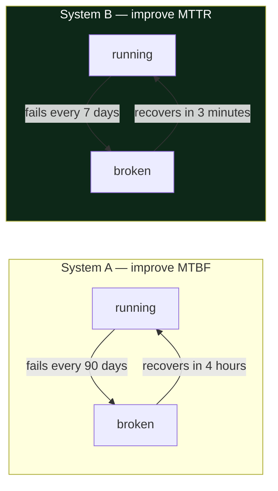

# 1.4 — Failure is the normal state

## One-line answer

A production system is not a working system that occasionally breaks; it is a **continuously
failing** system that stays useful because the failures are small, contained and recovered from
faster than they accumulate.

---

## The story

🎬 **The scene.** A city runs a bus network. Buses break down. Not rarely — every single day, several
of them, somewhere. Engines fail, tyres puncture, drivers call in sick.

😬 **The naive fix.** Buy better buses. Set a target of zero breakdowns. Treat every breakdown as a
scandal requiring an investigation into whose fault it was.

💥 **Why it fails.** With a thousand buses, even an extraordinarily reliable bus that breaks down once
every three years still means one breakdown a day somewhere in the fleet. You cannot buy your way out
of arithmetic. And a culture that treats each one as a scandal produces mechanics who hide problems,
which is the opposite of what you needed.

💡 **The insight.** The city does not measure breakdowns. It measures **whether people got where they
were going**. Spare buses, a depot that can swap one in, routes with enough frequency that a missing
bus costs you a short wait rather than your morning — those are the real design. Breakdowns are
treated as **inputs to the design**, not as failures of it. The question stops being "how do we stop
buses breaking?" and becomes "how do we make a broken bus not matter?"

---

## The idea in plain language

Beginners model production as: *the system works, and sometimes an incident happens.* That model is
wrong in a way that produces bad engineering, because it treats failure as an exception and exceptions
get handled last.

The accurate model is: *at any given moment, something in the system is broken.* A disk is filling. A
machine is being rebooted for patching. One of a hundred requests is timing out against a service on
another continent. A certificate expires next week. Whether the users notice is a **design property**,
not luck.

Two ideas make this precise, and they are the two numbers every reliability conversation eventually
reduces to.

**MTBF — mean time between failures.** On average, how long does the thing run before breaking? This
is the number people instinctively try to improve, and it is usually the expensive one.

**MTTR — mean time to recovery.** On average, how long from the break to service being restored? This
is the number that is usually cheaper to improve and usually matters more.

Why does MTTR matter more? Because **downtime is roughly MTTR divided by (MTBF + MTTR)**, and you can
often halve MTTR with a rehearsed rollback and a good runbook, while halving MTBF means rewriting
something. A system that breaks twice as often but recovers in a tenth of the time is dramatically
more available. That trade is not intuitive until you do the arithmetic once, so do it once:

| | Fails every | Recovers in | Unavailable |
| --- | --- | --- | --- |
| System A — "reliable" | 90 days | four hours | 0.18% |
| System B — "fragile" | 7 days | three minutes | 0.03% |

System B breaks nearly thirteen times as often and is **six times more available**. Every instinct
says A is the better-engineered system. The users disagree, and the users are right.

### The vocabulary you need for the rest of the plan

**Availability** — the fraction of time (or of requests) the system was usable. Usually written as a
number of nines: 99% is *two nines*, 99.9% is *three nines*. Each extra nine is ten times less
allowed downtime and roughly ten times more expensive, which is why "we want five nines" is almost
always a sentence said by someone who has not costed it.

**Blast radius** — how much breaks when one thing breaks. A term you meet properly on
[Day 2](../../../day-002-shape-of-production-system/LESSON.md), where you draw the map. It is the
single most useful lens in this curriculum and it is Principle 13.

**Graceful degradation** — the system loses a *feature* rather than losing *service*. `pulse` without
its language model should still classify tickets. `pulse` without its retrieval index should still
generate, with a note that it is ungrounded. Designing which capability you are willing to lose, in
advance, is engineering; discovering it during an incident is not.

**Single point of failure** — a component whose loss takes the whole system with it. Every system has
some; the job is knowing which, not pretending there are none.

---

## Why Kriya needs it

Day 74 is *"Error budgets — the arithmetic that turns reliability into a decision."*

An error budget is this part, formalised. If your objective is 99.9% of requests succeeding over four
weeks, then you have explicitly **budgeted** 0.1% of requests to fail — roughly forty minutes of full
outage per four-week window. That budget is not a shameful allowance; it is the thing that makes
shipping possible. A team with budget left can take risks; a team that has burned it stops shipping
features and fixes reliability. **The budget converts an argument into arithmetic**, and none of it
makes sense unless you have already accepted the premise of this part: failure is not an exception, it
is a quantity you allocate.

The same premise underlies Principle 11 — *every gate must be able to go red* — and the fifteen
failure-lab days. You cannot practise recovery on a system you believe will not break.

---

## The mechanism

The mechanism here is arithmetic, and it is worth running rather than reading, because the numbers are
counterintuitive.

```python
# lab/availability.py — run it, change the numbers, argue with the output.
def unavailability(mtbf_hours: float, mttr_hours: float) -> float:
    """Fraction of time unavailable, from mean time between failures and mean time to recovery."""
    return mttr_hours / (mtbf_hours + mttr_hours)


for name, mtbf, mttr in [
    ("A: fails rarely, recovers slowly", 90 * 24, 4.0),
    ("B: fails often, recovers fast", 7 * 24, 0.05),
]:
    down = unavailability(mtbf, mttr)
    print(f"{name:36s} unavailable {down:.4%}  -> {(1 - down):.3%} available")
```

**Line by line:**

- `def unavailability(mtbf_hours: float, mttr_hours: float) -> float:` — type hints on a public
  function, per the repository's house style. The units are in the parameter *names*, which is not
  decoration: a units mismatch is one of the most common and most embarrassing production bugs, and
  naming the unit is the cheapest defence there is.
- `return mttr_hours / (mtbf_hours + mttr_hours)` — the whole model. One cycle of the system's life is
  *run for MTBF, then be broken for MTTR*. The fraction broken is the second over the total. It is a
  simplification (it assumes independent, non-overlapping failures) and it is close enough to make the
  decision.
- `90 * 24` — ninety days expressed in hours, left as an expression rather than the number `2160`, so
  the reader can see where it came from. Arithmetic you can check beats a constant you have to trust.
- `0.05` is three minutes expressed in the same unit as everything else, rather than mixed units, for
  the reason above.
- `f"{down:.4%}"` — format as a percentage to four decimal places. Availability arguments happen in
  the fourth decimal place; `.2%` would print both systems as `0.18%` and `0.03%` and hide the
  interesting range entirely.

Run it:

```bash
uv run python days/day-001-what-operations-actually-is/lab/availability.py
```

**Line by line:** `uv run` uses the project's interpreter rather than whatever `python` resolves to
(Day 0, part [1.4](../../../day-000-toolchain-skeleton-driver/parts/01-the-toolchain/1.4-the-venv-you-never-activate.md));
the path is the file you just created under this day's `lab/`, which `./o scaffold 1` makes for you.
Note that `lab/` is excluded from the linter by `pyproject.toml` — it is scratch space, and
`docs/INCIDENTS.md` row 7 records what that exclusion does and does not cover.

Expected output:

```text
A: fails rarely, recovers slowly      unavailable 0.1848%  -> 99.815% available
B: fails often, recovers fast         unavailable 0.0298%  -> 99.970% available
```



**The design lesson is in which arrow you shorten.** Almost every mechanism in Phases 2 through 6 —
rollback, canary deploys, replica sets, disruption budgets, GitOps reconciliation — shortens the
*bottom* arrow. Very few of them touch the top one.

---

## When it breaks

The characteristic failure of ignoring this part is not a crash. It is an organisation that has
optimised the wrong arrow, and it shows up as an incident timeline like this one:

```text
02:58  deploy of build a3f19c completes
03:12  error rate crosses 5%
03:14  alert fires, on-call paged
03:19  on-call identifies the deploy as the likely cause
03:21  on-call asks in chat: "how do we roll back?"
04:07  someone with the answer wakes up and replies
04:19  rollback complete, error rate normal
```

Sixty-five minutes of outage. **Six of those minutes were diagnosis.** The other fifty-nine were the
absence of a rehearsed recovery — a rollback that existed in principle and had never been run by the
person who needed it.

**What it says:** an incident lasting sixty-five minutes.
**What it actually means:** MTTR was never engineered. Nobody had ever measured it, because measuring
it requires deliberately breaking something, and the organisation's model said breaking things is bad.

**The smallest fix:** rehearse the rollback on a normal afternoon and write down the exact command.
That single act typically removes the largest term in the timeline, and it is why Day 19 is titled
*"Rollback is a feature — the undo you rehearse before you need it"* rather than *"Rollback"*.

There is a second, subtler failure worth naming: **a system so reliable that nobody knows how to
recover it.** Long uptime is not evidence of a recoverable system; it is evidence of an untested one.
The plan's fifteen failure labs exist precisely to keep your MTTR measured rather than assumed.

---

## In production

**What a professional writes instead of the teaching version.** They stop quoting MTBF entirely and
talk in terms of a **service level objective plus an error budget** — a target expressed in
user-visible outcomes over a window, with an explicit allowance for failure. "99.9% of `/predict`
requests succeed in under 400 ms, measured over four weeks" is a professional statement. "The service
is highly available" is not a statement about anything. Day 73.

**What degrades at scale.** Independence. The arithmetic in this part assumes failures are
independent, and at scale they are not: one slow dependency causes queues to fill, which causes
timeouts, which causes retries, which causes more load on the slow dependency. That is a **cascading
failure**, and it is the mechanism behind most large outages you have read about. The defences —
timeouts, bounded retries with jitter, circuit breakers, load shedding — arrive on Days 7, 8 and 44,
and every one of them is an attempt to keep failures independent so the arithmetic stays true.

**The failure that only shows with real traffic.** Correlated recovery. Ten instances all restart at
once after a shared dependency comes back, all warm their caches at once, all hammer the dependency
at once, and take it down again. The system oscillates instead of recovering — a **thundering herd**.
It is invisible with one instance on a laptop and unmissable with a hundred in a cluster. Day 44's
autoscaling and Day 45's disruption budgets are where you first meet the containment.

**The review comment a senior engineer leaves.** *"You've written a retry here with no limit and no
backoff. When the downstream is struggling, this code triples the load on it. What stops that?"*
That comment is Principle 13 in one sentence, and it is the single most common review comment in
production code.

**The signal you would alert on.** Not MTBF and not MTTR — both are lagging averages you compute
after the fact, and you would never page on them. What you page on is the **error budget burn rate**:
how fast the current failure rate is consuming the allowance. A burn rate that would exhaust a
four-week budget in a few hours is a page; the same errors spread thinly over the month are a ticket.
That distinction, built on Day 74, is what stops you being woken for something that does not matter.

**Blast radius:** the script in this part is arithmetic in a scratch file. It reads nothing, writes
nothing and calls nothing. Worst case: it prints a wrong number and you believe it, which is why the
formula is stated in prose above rather than only in code.

**Cost:** `0` requests, `0` tokens, `0` MB resident. One local Python process that exits immediately.

**The interview question.** *"Would you rather halve how often your service fails, or halve how long
it takes to recover?"* There is no universally right answer and the interviewer knows it — they want
to hear you reach for the arithmetic, name the cases where MTBF wins (data loss, anything
irreversible, anything with a regulator) and the cases where MTTR wins (nearly everything else), and
say which one you would measure first.

---

## Check yourself

```bash
uv run python -c "print(f'{4/(90*24+4):.4%}  vs  {0.05/(7*24+0.05):.4%}')"
```

The two unavailability numbers, without the script. The "fragile" system is the available one.

**Say out loud, without scrolling up:** *your service currently recovers from a bad deploy by a
person noticing and asking in chat. Name the one change that would most improve availability, and say
which term of the formula it moves.*
