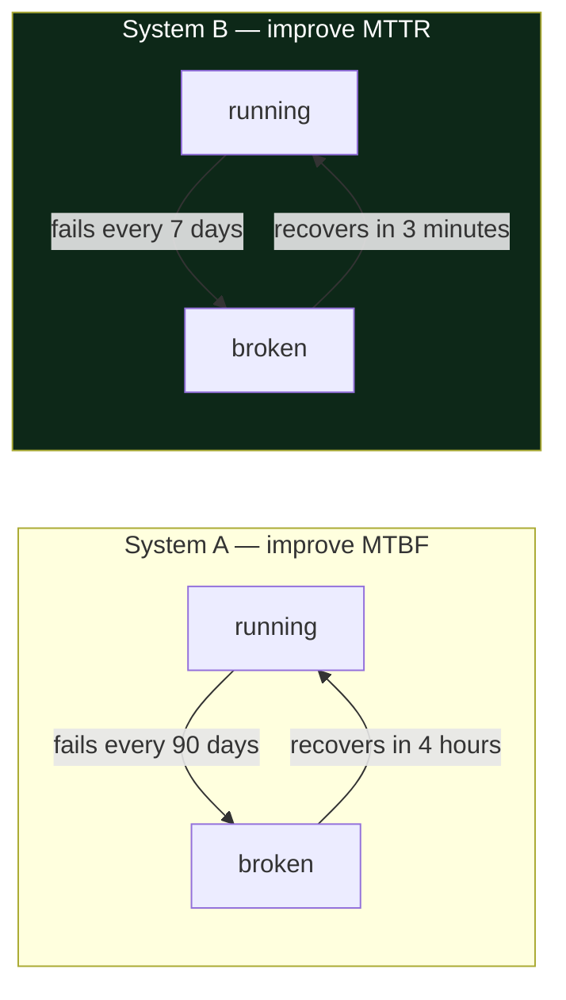

# 1.4 — Failure is the normal state

## One-line answer

A production system is not a working system that occasionally breaks. It is a **continuously
failing** system that stays useful because the failures are small, contained, and recovered from
faster than they pile up.

---

## The story

🎬 **The scene.** You catch the same bus to work every morning. Some mornings it does not turn up.
Not rarely, either. Perhaps one morning in ten, a bus somewhere on that route has broken down, or the
driver has called in sick.

😬 **The naive fix.** Complain to the bus company. They should buy better buses. The target should be
zero breakdowns.

💥 **Why it fails.** The company runs a thousand buses. Even an excellent bus that only breaks down
once every three years still adds up to a breakdown somewhere in the fleet every single day. You
cannot buy your way out of that arithmetic. Worse, when the company tried treating every breakdown as
a scandal, the mechanics started quietly not reporting small faults, because every report turned into
an argument about whose fault it was.

💡 **The insight.** What decides whether your morning is ruined is not how often buses break. It is
how long you stand at the stop. On a route with a bus every twenty minutes, one breakdown costs you
your meeting. On a route with a bus every four minutes, the same breakdown costs you four minutes and
you never even find out it happened. The company that fixed your commute did not build better buses.
It ran them more often and kept a spare at the depot. Breakdowns became an **input to the design**
rather than a failure of it, and the question changed from *how do we stop buses breaking?* to *how do
we make a broken bus not matter?*

---

## The idea in plain language

Beginners picture production like this: *the system works, and sometimes an incident happens.* That
picture is wrong in a way that produces bad engineering, because it treats failure as an exception,
and exceptions get handled last.

The accurate picture is this: *at any given moment, something in the system is broken.* A disk is
filling up. A machine is being rebooted for patching. One request in a hundred is timing out against a
service on another continent. A certificate expires next week. Whether the users notice any of that
is a **design property**, not luck.

Two ideas make this precise, and they are the two numbers every reliability conversation eventually
comes down to.

**MTBF, mean time between failures.** On average, how long does the thing run before it breaks? This
is the number people instinctively try to improve, and it is usually the expensive one.

**MTTR, mean time to recovery.** On average, how long is it from the break to the service being
usable again? This is the number that is usually cheaper to improve and usually matters more.

Why does MTTR matter more? Because **downtime is roughly MTTR divided by MTBF plus MTTR**, and you can
often halve MTTR with a rehearsed rollback and a good runbook, while halving MTBF means rewriting
something. A system that breaks twice as often but recovers in a tenth of the time is dramatically
more available. That trade is not obvious until you have done the arithmetic once, so do it once.

| | Fails every | Recovers in | Unavailable |
| --- | --- | --- | --- |
| System A, the "reliable" one | 90 days | four hours | 0.18% |
| System B, the "fragile" one | 7 days | three minutes | 0.03% |

System B breaks nearly thirteen times as often and is **six times more available**. Every instinct
says A is the better-engineered system. The users disagree, and the users are right.

### The vocabulary you need for the rest of the plan

**Availability** is the fraction of the time, or of the requests, that the system was usable. It is
usually written as a number of nines. 99% is *two nines* and 99.9% is *three nines*. Each extra nine
allows ten times less downtime and costs roughly ten times more, which is why "we want five nines" is
almost always said by somebody who has not costed it.

**Blast radius** is how much breaks when one thing breaks. You meet the term properly on
[Day 2](../../../day-002-shape-of-production-system/LESSON.md), where you draw the map. It is the
single most useful lens in this curriculum, and it is Principle 13.

**Graceful degradation** is when the system loses a *feature* rather than losing *service*. `pulse`
without its language model should still classify tickets. `pulse` without its retrieval index should
still generate an answer, with a note saying it is ungrounded. Deciding in advance which capability
you are willing to lose is engineering. Discovering it during an incident is not.

**A single point of failure** is a component whose loss takes the whole system with it. Every system
has some. The job is knowing which ones, rather than pretending there are none.

---

## Why Kriya needs it

Day 74 is *"Error budgets: the arithmetic that turns reliability into a decision."*

An error budget is this part, written down formally. If your objective is that 99.9% of requests
succeed over four weeks, then you have explicitly **budgeted** 0.1% of requests to fail, which is
roughly forty minutes of complete outage in every four-week window. That budget is not a shameful
allowance. It is the thing that makes shipping possible. A team with budget left can take risks, and a
team that has burned through it stops shipping features and fixes reliability instead. **The budget
turns an argument into arithmetic**, and none of it makes sense unless you have already accepted the
premise of this part, which is that failure is not an exception but a quantity you allocate.

The same premise sits underneath Principle 11, *every gate must be able to go red*, and underneath the
fifteen failure-lab days. You cannot practise recovery on a system you believe will not break.

---

## The mechanism

The mechanism here is arithmetic, and it is worth running rather than reading, because the numbers go
against instinct.

```python
# lab/availability.py — run it, change the numbers, argue with the output.
def unavailability(mtbf_hours: float, mttr_hours: float) -> float:
    """Fraction of time unavailable, from mean time between failures and mean time to recovery."""
    return mttr_hours / (mtbf_hours + mttr_hours)


for name, mtbf, mttr in [
    ("A: fails rarely, recovers slowly", 90 * 24, 4.0),
    ("B: fails often, recovers fast", 7 * 24, 0.05),
]:
    down = unavailability(mtbf, mttr)
    print(f"{name:36s} unavailable {down:.4%}  -> {(1 - down):.3%} available")
```

**Line by line:**

- `def unavailability(mtbf_hours: float, mttr_hours: float) -> float:` carries type hints on a public
  function, which is this repository's house style. The units live in the parameter *names*, and that
  is not decoration. A mismatch of units is one of the most common and most embarrassing production
  bugs there is, and naming the unit is the cheapest defence available.
- `return mttr_hours / (mtbf_hours + mttr_hours)` is the whole model. One cycle of the system's life
  is *run for MTBF, then be broken for MTTR*, so the fraction of time broken is the second number
  over the total. It is a simplification, because it assumes failures are independent and do not
  overlap, and it is close enough to make the decision.
- `90 * 24` is ninety days expressed in hours. It is left as an expression rather than written as
  `2160`, so the reader can see where the number came from. Arithmetic you can check beats a constant
  you have to trust.
- `0.05` is three minutes expressed in the same unit as everything else, rather than mixing units, for
  the reason above.
- `f"{down:.4%}"` formats the value as a percentage to four decimal places. Availability arguments
  happen in the fourth decimal place, and `.2%` would print both systems as `0.18%` and `0.03%`,
  hiding the interesting range entirely.

Run it:

```bash
uv run python days/day-001-what-operations-actually-is/lab/availability.py
```

**Line by line:** `uv run` uses the project's interpreter rather than whatever `python` happens to
resolve to, which is Day 0, part
[1.4](../../../day-000-toolchain-skeleton-driver/parts/01-the-toolchain/1.4-the-venv-you-never-activate.md).
The path is the file you just created under this day's `lab/`, which `./o scaffold 1` makes for you.
Note that `lab/` is excluded from the linter by `pyproject.toml`, because it is scratch space, and
`docs/INCIDENTS.md` row 7 records what that exclusion does and does not cover.

Expected output:

```text
A: fails rarely, recovers slowly      unavailable 0.1848%  -> 99.815% available
B: fails often, recovers fast         unavailable 0.0298%  -> 99.970% available
```



**The design lesson is in which arrow you shorten.** Almost every mechanism in Phases 2 to 6, meaning
rollback, canary deploys, replica sets, disruption budgets and GitOps reconciliation, shortens the
*bottom* arrow. Very few of them touch the top one.

---

## When it breaks

The characteristic failure of ignoring this part is not a crash. It is an organisation that has
optimised the wrong arrow, and it shows up as an incident timeline like this one:

```text
02:58  deploy of build a3f19c completes
03:12  error rate crosses 5%
03:14  alert fires, on-call paged
03:19  on-call identifies the deploy as the likely cause
03:21  on-call asks in chat: "how do we roll back?"
04:07  someone with the answer wakes up and replies
04:19  rollback complete, error rate normal
```

That is sixty-five minutes of outage, and **six of those minutes were diagnosis**. The other
fifty-nine were the absence of a rehearsed recovery: a rollback that existed in principle and had
never been run by the person who needed it.

**What it says:** an incident lasting sixty-five minutes.

**What it actually means:** MTTR was never engineered. Nobody had ever measured it, because measuring
it means deliberately breaking something, and the organisation's model said that breaking things is
bad.

**The smallest fix:** rehearse the rollback on an ordinary afternoon and write down the exact command.
That single act usually removes the largest term in the timeline, and it is why Day 19 is titled
*"Rollback is a feature: the undo you rehearse before you need it"* rather than just *"Rollback"*.

There is a second and subtler failure worth naming, which is **a system so reliable that nobody knows
how to recover it**. Long uptime is not evidence of a recoverable system. It is evidence of an
untested one. The plan's fifteen failure labs exist precisely to keep your MTTR measured rather than
assumed.

---

## In production

**What a professional writes instead of the teaching version.** They stop quoting MTBF at all, and
talk instead about a **service level objective with an error budget**, meaning a target expressed in
outcomes the user can see, over a window, with an explicit allowance for failure. "99.9% of
`/predict` requests succeed in under 400 ms, measured over four weeks" is a professional statement.
"The service is highly available" is not a statement about anything. That is Day 73.

**What degrades at scale.** Independence. The arithmetic in this part assumes failures are
independent, and at scale they are not. One slow dependency causes queues to fill, which causes
timeouts, which causes retries, which causes more load on the slow dependency. That is a **cascading
failure**, and it is the mechanism behind most of the large outages you have read about. The
defences, meaning timeouts, bounded retries with jitter, circuit breakers and load shedding, arrive on
Days 7, 8 and 44. Every one of them is an attempt to keep failures independent so that the arithmetic
stays true.

**The failure that only shows with real traffic.** Correlated recovery. Ten instances all restart at
once when a shared dependency comes back, all warm their caches at once, all hammer the dependency at
once, and take it down again. The system oscillates instead of recovering, which is called a
**thundering herd**. It is invisible with one instance on a laptop and unmissable with a hundred in a
cluster. Day 44's autoscaling and Day 45's disruption budgets are where you first meet the
containment.

**The review comment a senior engineer leaves.** *"You have written a retry here with no limit and no
backoff. When the downstream service is struggling, this code triples the load on it. What stops
that?"* That comment is Principle 13 in one sentence, and it is the single most common review comment
in production code.

**The signal you would alert on.** Not MTBF, and not MTTR. Both are lagging averages you compute after
the fact, and you would never page anybody on them. What you page on is the **error budget burn
rate**, meaning how fast the current failure rate is eating through the allowance. A burn rate that
would exhaust a four-week budget in a few hours is a page. The same number of errors spread thinly
over the month is a ticket. That distinction, built on Day 74, is what stops you being woken for
something that does not matter.

**Blast radius:** the script in this part is arithmetic in a scratch file. It reads nothing, writes
nothing and calls nothing. The worst case is that it prints a wrong number and you believe it, which
is why the formula is stated in prose above rather than only in code.

**Cost:** `0` requests, `0` tokens and `0` MB resident. One local Python process that exits
immediately.

**The interview question.** *"Would you rather halve how often your service fails, or halve how long
it takes to recover?"* There is no universally right answer and the interviewer knows it. They want to
hear you reach for the arithmetic, name the cases where MTBF wins, which are data loss, anything
irreversible and anything with a regulator attached, name the cases where MTTR wins, which is nearly
everything else, and say which one you would measure first.

---

## Check yourself

```bash
uv run python -c "print(f'{4/(90*24+4):.4%}  vs  {0.05/(7*24+0.05):.4%}')"
```

The two unavailability numbers, without the script. The "fragile" system is the available one.

**Say out loud, without scrolling up:** *your service currently recovers from a bad deploy by a person
noticing and asking in chat. Name the one change that would most improve availability, and say which
term of the formula it moves.*
