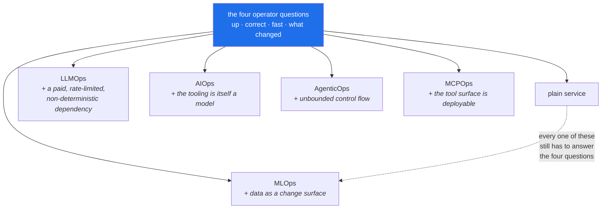

# 1.5 — The five kinds of ops are one job

## One-line answer

MLOps, LLMOps, AIOps, AgenticOps and MCPOps are not five disciplines — they are the same four
operator questions asked about five different kinds of thing, and every one of them is an ordinary
distributed-systems problem wearing a costume.

---

## The story

🎬 **The scene.** A hospital has a department for hearts, a department for lungs, and a department for
kidneys. Someone arrives short of breath. The lung department examines the lungs, finds nothing, and
sends them home.

😬 **The naive fix.** Add a fourth department for people who are short of breath.

💥 **Why it fails.** The breathlessness was caused by a failing heart, which was caused by a kidney
problem that had been raising blood pressure for years. Three departments each looked at their own
organ and each honestly reported that their organ was fine. Nobody was wrong. Nobody looked at the
person.

💡 **The insight.** The specialisms are real and useful — you genuinely do need someone who knows
kidneys. What is not real is the idea that a problem stays inside the boundary of one specialism. The
valuable practitioner is the one who knows the specialisms **and** keeps looking at the whole person,
because the interesting failures live in the joins.

---

## The idea in plain language

You will see five words used as if they were five separate jobs with five separate toolchains.
They are not. Here is what each one actually means, in plain language, and what makes it different
from ordinary software operations.

**MLOps** — operating a system that contains a **trained model**. What is new: the behaviour of the
system depends on *data* as well as on code, so "what changed?" gains a fourth answer nobody had to
consider before, and correctness can decay without anything being deployed.

**LLMOps** — operating a system that calls a **large language model**, usually somebody else's, over
a network. What is new: the dependency is expensive, rate-limited, non-deterministic and returns free
text instead of a number, so "is it correct?" stops having a cheap automatic answer.

**AIOps** — using machine learning **on your own telemetry** to operate the system: spotting
anomalies, clustering log lines, correlating four hundred alerts into one incident. What is new:
nothing about the system under management. The novelty is that the operator's tooling is itself a
model, with all the failure modes of one.

**AgenticOps** — operating a system in which a model **decides what to do next and then does it**,
in a loop, using tools. What is new: the workload has no fixed control flow, so cost, duration and
side effects are all unbounded unless you bound them explicitly. This is where trap #4 —
*autonomy with no brake* — lives.

**MCPOps** — operating the **tool boundary** those agents act through. MCP, the Model Context
Protocol, is an open specification for how a model-facing client discovers and calls tools. What is
new: the set of things your system can do becomes a *deployable, versioned, permissioned surface* of
its own, rather than a list of functions inside one program.

### What they all have in common

Take the four questions from [1.3](1.3-the-four-questions-an-operator-answers.md) and ask them of
each. The table is the point of this part:

| | Is it up? | Is it correct? | Fast enough? | What changed? |
| --- | --- | --- | --- | --- |
| **plain service** | process is listening | error rate | latency percentile | the deploy |
| **MLOps** | model file loaded, served | prediction quality on live traffic | inference latency | the deploy **or the data** |
| **LLMOps** | provider reachable, not rate-limited | eval score, hallucination rate | time to first token | the deploy, the data, **the prompt, the model version** |
| **AIOps** | detector running | precision and recall of its alerts | detection lag | its own thresholds and training window |
| **AgenticOps** | runtime accepting tasks | task success rate, trajectory quality | steps and wall-clock per task | the prompt, the tools, the model, the policy |
| **MCPOps** | each server health-checked | tool returns valid results | per-tool latency | tool schema version, permissions |

Read down the first column. Every row is *is the thing listening*. Read down the last column: every
row is *the change surface got wider*. **The questions never change. What changes is the number of
things that can be the answer**, and that is why the plan spends eighty-four days on the plain-service
row before touching the others (plan §13).

The one genuinely new property, and it is worth naming precisely: in the bottom five rows,
**correctness is statistical rather than binary**. A plain service is right or it throws. A model is
right 94% of the time, and the interesting question is whether that number is moving. Every hard day
in Phases 11, 14, 15 and 17 is downstream of that single sentence.

---

## Why Kriya needs it

Day 234 is *"Capstone II — a staged incident that crosses the ML, LLM, agent and tool layers."*

That day is deliberately built so that no single specialism can solve it: the symptom appears in the
agent's task success rate, the cause is a retrieval index that was rebuilt against stale data, and the
thing that made it invisible is an eval suite that only tested the model in isolation. It is the
hospital story with a `pulse` costume on. You will be able to work it only if the five words have
never been five departments in your head.

Sooner than that: Day 115 asks you to distinguish a **broken upstream** from a **changed world** when
a drift detector fires. One is a platform problem and one is an ML problem, the alert looks identical
for both, and the person on call is you.

---

## The mechanism

The mechanism is the plan itself. `docs/CURRICULUM_INDEX.md` is generated from the plan's §14 and
answers *where do I learn X?*, and reading it as a whole is the fastest way to see the five threads
interleave rather than stack.

```bash
grep -c '^| `' docs/CURRICULUM_INDEX.md
awk '/^## Curriculum/ {name=$0} /^\| `/ {count[name]++} END {for (n in count) print count[n], n}' docs/CURRICULUM_INDEX.md | sort -rn
```

**Line by line:**

- `grep -c '^| \`'` counts lines that begin with a table-row pipe followed by a backtick — which is
  exactly the shape of an ID row in that generated file. `-c` prints the count rather than the lines.
  The answer should be `279`, the plan's total ID count; if it is not, the index and the plan have
  drifted and that is a bug worth reporting.
- The `awk` line groups those rows by the `## Curriculum` heading above them. `name=$0` remembers the
  most recent heading; `count[name]++` tallies each ID row under it; the `END` block prints the
  tallies. `sort -rn` orders them by size, largest first.
- **Why `awk` and not a Python script:** this is a one-off question about a text file, and reaching
  for a program you have to save, lint and test would be the wrong instinct. Knowing when *not* to
  write code is an operator skill.

Observed on **2026-08-24**:

```text
279
```

```text
42 ## Curriculum B — Platform: containers, Kubernetes, IaC, delivery (`PLT-`) — 42 IDs
41 ## Curriculum D — MLOps (`MLO-`) — 41 IDs
34 ## Curriculum E — LLMOps (`LLM-`) — 34 IDs
33 ## Curriculum I — Security, governance & compliance (`SEC-`) — 33 IDs
27 ## Curriculum C — Observability & SRE practice (`OBS-`) — 27 IDs
24 ## Curriculum A — Foundations & the production mental model (`FND-`) — 24 IDs
23 ## Curriculum G — AgenticOps (`AGO-`) — 23 IDs
23 ## Curriculum F — AIOps (`AIO-`) — 23 IDs
16 ## Curriculum J — Cost, capacity & FinOps (`FIN-`) — 16 IDs
16 ## Curriculum H — MCPOps (`MCO-`) — 16 IDs
```

**Your tie order may differ.** `awk` iterates an associative array in an unspecified order, and
`sort -rn` only orders by the number, so the two 23s and the two 16s can swap places between runs.
That is not a bug and it is worth registering now: **a command whose output is not deterministic
cannot be used in a check.** You will meet the same problem for real on Day 15, where a build has to
produce byte-identical output to be reproducible.

**Read the distribution, not the totals.** Platform, observability, foundations and security together
are 126 of the 279 IDs — nearly half the curriculum is the *plain service row* of the table above.
That is not an accident of pacing; it is the plan's central claim, stated as arithmetic.



---

## When it breaks

The failure of this idea is an organisation that built five departments, and it surfaces as an
incident channel full of accurate, useless statements:

```text
14:02  platform:  cluster is healthy, all pods ready, no restarts
14:03  ml:        model version unchanged since Tuesday, offline AUC 0.94
14:04  llm:       provider status page is green, no 429s in the last hour
14:06  support:   ~30% of ticket summaries have been blank since this morning
14:09  platform:  nothing on our side
14:11  ml:        nothing on our side
```

Everybody is telling the truth. The blank summaries were caused by a retrieval index rebuild that
silently produced zero documents for one ticket category, so the assistant received an empty context
and correctly declined to invent one. **The index is not owned by any of the three departments** —
it sits in the join.

**What it says:** three teams, each confirming their component is healthy.
**What it actually means:** the system has no owner. Component health is not system health, and the
sum of five green components is not a working product.

**The smallest fix** is not organisational. It is a **user-visible signal** — one measurement of
whether the thing people actually want is happening, in this case "fraction of summaries that are
non-empty". A single such signal would have named the problem at 14:02 instead of 14:06. Day 73's
first rule is that an SLO is written against the user's outcome and never against a component's
state, and this transcript is the reason.

---

## In production

**What a professional does differently.** They refuse to accept a component-level "all clear" as an
answer to a system-level question, and they insist on at least one **end-to-end** check that
exercises the whole path the way a user does. In `pulse` that becomes a synthetic request that goes
in the front door and asserts on the final output — built as a test on Day 3 and promoted to a
continuously-running probe later. It is the only check that catches a failure in the joins.

**What degrades at scale.** Ownership. Every additional component adds joins faster than it adds
components: five components have ten possible pairs, ten components have forty-five. The joins are
where incidents live and nobody's job description mentions them. This is why Day 230 (documentation
that survives you) and Day 231 (handover) exist, and why the architecture map you draw on
[Day 2](../../../day-002-shape-of-production-system/LESSON.md) is a deliverable rather than a sketch.

**The failure that only shows with real traffic.** Cross-layer coupling you did not know existed. An
agent (AgenticOps) calls a tool (MCPOps) that queries metrics (AIOps) from a system that is currently
degraded — so the agent's diagnosis is wrong in exactly the situation it was built for, and it is
*confidently* wrong. Day 191 onward is about containing precisely this, and the containment is an
approval gate rather than a better model.

**The review comment a senior engineer leaves.** *"This dashboard has fourteen panels and none of them
tells me whether a user got a useful answer. Add that one first, and consider deleting four others."*

**The signal you would alert on.** Exactly one, at first: a **user-outcome signal** for the whole
system. Everything else — pod restarts, GPU utilisation, token counts, index size — is diagnosis, and
diagnosis goes on the dashboard, not on the pager. The plan formalises this on Day 77 as *alert on
symptoms, not on causes*, and the discipline it enforces is that you cannot page on a hundred things,
so you must choose the few that mean a person is having a bad time.

**Blast radius:** none. This part runs two read-only text queries against a generated file in `docs/`.
Worst case: `grep` prints a wrong count because the file's format changed, which is itself the signal
that something upstream moved.

**Cost:** `0` requests, `0` tokens, `0` MB resident.

**The interview question.** *"What's actually different about operating an ML system compared with a
normal service?"* The weak answer lists tools. The strong answer is two sentences: the change surface
gains data and prompts alongside code, so "what changed?" has more possible answers; and correctness
becomes statistical, so you need a *measurement* of quality on live traffic rather than a pass/fail
test. Then name the thing that is genuinely not different — it is still a networked service that has
to be up, fast and observable, and that part is most of the work.

---

## Check yourself

```bash
grep -c '^| `' docs/CURRICULUM_INDEX.md
```

`279`, if the index and the plan agree.

**Say out loud, without scrolling up:** *pick any two of the five ops words and name one failure that
would be invisible to both specialisms and visible to a single end-to-end check.*
