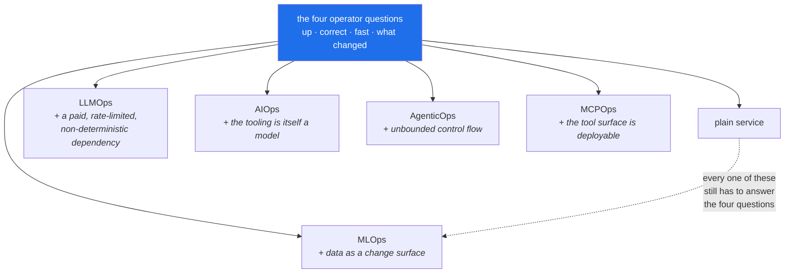

# 1.5 — The five kinds of ops are one job

## One-line answer

MLOps, LLMOps, AIOps, AgenticOps and MCPOps are not five disciplines. They are the same four operator
questions asked about five different kinds of thing, and every one of them is an ordinary
distributed-systems problem wearing a costume.

---

## The story

🎬 **The scene.** There is a damp patch on your bedroom wall. It is about the size of a dinner plate,
and it gets bigger every winter.

😬 **The naive fix.** You call a plumber. He checks every pipe in the flat and tells you, correctly,
that nothing is leaking. So you call a roofer. She goes up, checks the tiles, and tells you,
correctly, that the roof is sound. So you call a builder, who taps the wall and tells you, correctly,
that the wall is fine.

💥 **Why it fails.** Three people, three honest answers, and the patch keeps growing. The water is
coming from a gutter that overflows in heavy rain onto a stretch of wall that was never sealed. The
gutter belongs to the roofer's world and the wall belongs to the builder's, and the overflow belongs
to neither of them. Nobody was wrong. Nobody stood outside in the rain and looked at the whole side of
the house at once.

💡 **The insight.** The specialists are real and you genuinely need them. Somebody has to know pipes.
What is not real is the idea that a problem stays inside one specialist's boundary. The person who
finally fixes your damp is the one who knows the trades **and** keeps looking at the whole house,
because the interesting failures live in the joins.

---

## The idea in plain language

You will see five words used as though they were five separate jobs with five separate toolchains.
They are not. Here is what each one actually means, in plain language, and what makes it different
from ordinary software operations.

**MLOps** is operating a system that contains a **trained model**. What is new is that the behaviour
of the system depends on *data* as well as on code, so "what changed?" gains a fourth answer nobody
had to consider before, and correctness can decay without anything being deployed at all.

**LLMOps** is operating a system that calls a **large language model**, usually somebody else's, over
a network. What is new is that the dependency is expensive, rate-limited and non-deterministic, and
that it returns free text instead of a number, so "is it correct?" stops having a cheap automatic
answer.

**AIOps** is using machine learning **on your own telemetry** in order to operate the system: spotting
anomalies, clustering log lines, or folding four hundred alerts into one incident. What is new is
nothing about the system being managed. The novelty is that the operator's tooling is itself a model,
with all the failure modes of one.

**AgenticOps** is operating a system in which a model **decides what to do next and then does it**, in
a loop, using tools. What is new is that the workload has no fixed control flow, so cost, duration and
side effects are all unbounded unless you bound them on purpose. This is where trap number 4,
*autonomy with no brake*, lives.

**MCPOps** is operating the **tool boundary** those agents act through. MCP, the Model Context
Protocol, is an open specification for how a model-facing client discovers and calls tools. What is
new is that the set of things your system can do becomes a *deployable, versioned, permissioned
surface* in its own right, rather than a list of functions inside one program.

### What they all have in common

Take the four questions from [1.3](1.3-the-four-questions-an-operator-answers.md) and ask them of
each one. The table is the point of this part.

| | Is it up? | Is it correct? | Fast enough? | What changed? |
| --- | --- | --- | --- | --- |
| **plain service** | process is listening | error rate | latency percentile | the deploy |
| **MLOps** | model file loaded, served | prediction quality on live traffic | inference latency | the deploy **or the data** |
| **LLMOps** | provider reachable, not rate-limited | eval score, hallucination rate | time to first token | the deploy, the data, **the prompt, the model version** |
| **AIOps** | detector running | precision and recall of its alerts | detection lag | its own thresholds and training window |
| **AgenticOps** | runtime accepting tasks | task success rate, trajectory quality | steps and wall-clock per task | the prompt, the tools, the model, the policy |
| **MCPOps** | each server health-checked | tool returns valid results | per-tool latency | tool schema version, permissions |

Read down the first column and every row says *is the thing listening*. Read down the last column and
every row says *the change surface got wider*. **The questions never change. What changes is the
number of things that can be the answer**, and that is why the plan spends eighty-four days on the
plain-service row before touching any of the others, as §13 explains.

There is one genuinely new property, and it is worth naming precisely. In the bottom five rows,
**correctness is statistical rather than binary**. A plain service is either right or it throws an
error. A model is right 94% of the time, and the interesting question is whether that number is
moving. Every hard day in Phases 11, 14, 15 and 17 comes downstream of that single sentence.

---

## Why Kriya needs it

Day 234 is *"Capstone II: a staged incident that crosses the ML, LLM, agent and tool layers."*

That day is built deliberately so that no single specialism can solve it. The symptom appears in the
agent's task success rate, the cause is a retrieval index that was rebuilt against stale data, and the
thing that made it invisible is an eval suite that only ever tested the model on its own. It is the
damp-patch story wearing a `pulse` costume. You will only be able to work it if the five words have
never been five departments in your head.

Sooner than that, Day 115 asks you to tell a **broken upstream** apart from a **changed world** when a
drift detector fires. One of those is a platform problem and the other is an ML problem, the alert
looks identical for both, and the person on call is you.

---

## The mechanism

The mechanism is the plan itself. `docs/CURRICULUM_INDEX.md` is generated from the plan's §14 and
answers the question *where do I learn X?*. Reading it as a whole is the fastest way to see the five
threads interleave rather than stack.

```bash
grep -c '^| `' docs/CURRICULUM_INDEX.md
awk '/^## Curriculum/ {name=$0} /^\| `/ {count[name]++} END {for (n in count) print count[n], n}' docs/CURRICULUM_INDEX.md | sort -rn
```

**Line by line:**

- `grep -c '^| \`'` counts the lines that begin with a table-row pipe followed by a backtick, which is
  exactly the shape of an ID row in that generated file. `-c` prints the count rather than the lines
  themselves. The answer should be `279`, which is the plan's total ID count. If it is not, the index
  and the plan have drifted apart, and that is a bug worth reporting.
- The `awk` line groups those rows by the `## Curriculum` heading above them. `name=$0` remembers the
  most recent heading, `count[name]++` tallies each ID row underneath it, and the `END` block prints
  the tallies. `sort -rn` then orders them by size, largest first.
- **Why `awk` and not a Python script:** this is a one-off question about a text file, and reaching
  for a program you would have to save, lint and test would be the wrong instinct. Knowing when *not*
  to write code is an operator skill.

Observed on **2026-08-24**:

```text
279
```

```text
42 ## Curriculum B — Platform: containers, Kubernetes, IaC, delivery (`PLT-`) — 42 IDs
41 ## Curriculum D — MLOps (`MLO-`) — 41 IDs
34 ## Curriculum E — LLMOps (`LLM-`) — 34 IDs
33 ## Curriculum I — Security, governance & compliance (`SEC-`) — 33 IDs
27 ## Curriculum C — Observability & SRE practice (`OBS-`) — 27 IDs
24 ## Curriculum A — Foundations & the production mental model (`FND-`) — 24 IDs
23 ## Curriculum G — AgenticOps (`AGO-`) — 23 IDs
23 ## Curriculum F — AIOps (`AIO-`) — 23 IDs
16 ## Curriculum J — Cost, capacity & FinOps (`FIN-`) — 16 IDs
16 ## Curriculum H — MCPOps (`MCO-`) — 16 IDs
```

**Your tie order may differ.** `awk` walks an associative array in an unspecified order, and `sort
-rn` only orders by the number, so the two 23s and the two 16s can swap places between runs. That is
not a bug, and it is worth registering now: **a command whose output is not deterministic cannot be
used in a check.** You meet the same problem for real on Day 15, where a build has to produce
byte-identical output in order to be reproducible.

**Read the distribution rather than the totals.** Platform, observability, foundations and security
together account for 126 of the 279 IDs, so nearly half the curriculum is the *plain service* row of
the table above. That is not an accident of pacing. It is the plan's central claim, stated as
arithmetic.



---

## When it breaks

The failure of this idea is an organisation that built five departments, and it surfaces as an
incident channel full of accurate, useless statements:

```text
14:02  platform:  cluster is healthy, all pods ready, no restarts
14:03  ml:        model version unchanged since Tuesday, offline AUC 0.94
14:04  llm:       provider status page is green, no 429s in the last hour
14:06  support:   ~30% of ticket summaries have been blank since this morning
14:09  platform:  nothing on our side
14:11  ml:        nothing on our side
```

Everybody is telling the truth. The blank summaries were caused by a rebuild of the retrieval index
that silently produced zero documents for one category of ticket, so the assistant received an empty
context and correctly declined to invent one. **The index is not owned by any of the three
departments.** It sits in the join.

**What it says:** three teams, each confirming that their component is healthy.

**What it actually means:** the system has no owner. Component health is not system health, and the
sum of five green components is not a working product.

**The smallest fix** is not organisational. It is a **signal the user would recognise**, meaning one
measurement of whether the thing people actually want is happening. In this case that is the fraction
of summaries that are not blank. A single such signal would have named the problem at 14:02 instead of
14:06. Day 73's first rule is that an SLO is written against the user's outcome and never against a
component's state, and this transcript is the reason.

---

## In production

**What a professional does differently.** They refuse to accept a component-level "all clear" as an
answer to a system-level question, and they insist on at least one **end-to-end** check that exercises
the whole path the way a user does. In `pulse` that becomes a synthetic request that goes in the front
door and asserts on the final output. It is built as a test on Day 3 and promoted to a
continuously-running probe later. It is the only check that catches a failure in the joins.

**What degrades at scale.** Ownership. Every extra component adds joins faster than it adds
components, because five components have ten possible pairs and ten components have forty-five. The
joins are where incidents live, and nobody's job description mentions them. This is why Day 230, on
documentation that survives you, and Day 231, on handover, exist, and why the architecture map you
draw on [Day 2](../../../day-002-shape-of-production-system/LESSON.md) is a deliverable rather than a
sketch.

**The failure that only shows with real traffic.** Coupling between layers that you did not know
existed. An agent, which is AgenticOps, calls a tool, which is MCPOps, that queries metrics, which is
AIOps, from a system that is currently degraded. The agent's diagnosis is therefore wrong in exactly
the situation it was built for, and it is *confidently* wrong. Day 191 onward is about containing
precisely this, and the containment is an approval gate rather than a better model.

**The review comment a senior engineer leaves.** *"This dashboard has fourteen panels and not one of
them tells me whether a user got a useful answer. Add that one first, and consider deleting four
others."*

**The signal you would alert on.** Exactly one, at first, which is a **user-outcome signal** for the
whole system. Everything else, meaning pod restarts, GPU utilisation, token counts and index size, is
diagnosis, and diagnosis belongs on the dashboard rather than on the pager. The plan formalises this
on Day 77 as *alert on symptoms, not on causes*. The discipline it enforces is that you cannot page on
a hundred things, so you have to choose the few that mean a person is having a bad time.

**Blast radius:** none. This part runs two read-only text queries against a generated file in `docs/`.
The worst case is that `grep` prints a wrong count because the file's format changed, and that is
itself the signal that something upstream moved.

**Cost:** `0` requests, `0` tokens and `0` MB resident.

**The interview question.** *"What is actually different about operating an ML system compared with a
normal service?"* The weak answer lists tools. The strong answer is two sentences. First, the change
surface gains data and prompts alongside code, so "what changed?" has more possible answers. Second,
correctness becomes statistical, so you need a *measurement* of quality on live traffic rather than a
pass-or-fail test. Then name the thing that is genuinely not different: it is still a networked
service that has to be up, fast and observable, and that part is most of the work.

---

## Check yourself

```bash
grep -c '^| `' docs/CURRICULUM_INDEX.md
```

It should print `279`, if the index and the plan agree.

**Say out loud, without scrolling up:** *pick any two of the five ops words and name one failure that
would be invisible to both specialisms and visible to a single end-to-end check.*
