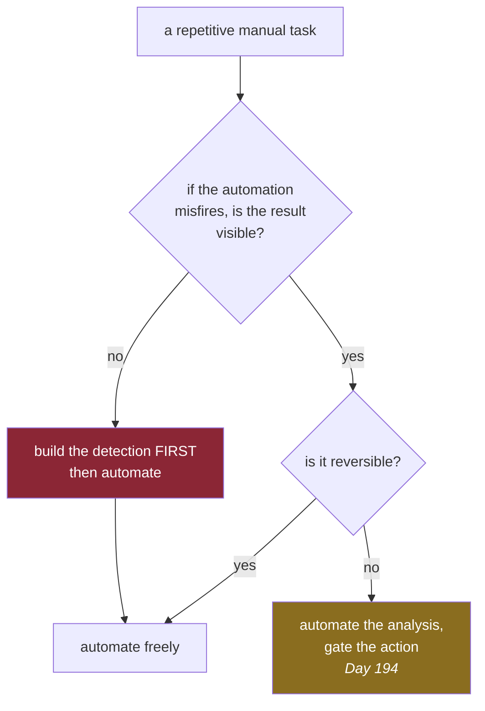

# 1.6 — Toil, and the line you automate

## One-line answer

Toil is manual work that grows in step with the size of the system and leaves nothing behind, and the
operator's real judgement is not *"can this be automated?"* but *"what happens when the automation is
wrong?"*

---

## The story

🎬 **The scene.** Once a month you walk out to the cupboard, read the number off the electricity
meter, and type it into the energy company's website. It takes four minutes. You have done it for two
years.

😬 **The naive fix.** The company offers to fit a meter that sends the reading by itself. You say yes.
It works.

💥 **Why it fails.** Not straight away, which is the pattern by now. It sends a reading every month
for nine months. Then the meter loses its mobile signal, and the company quietly goes back to
estimating. The estimates are based on last winter, and since then you have bought a tumble dryer.
Nobody notices, because nobody reads the bill carefully. You read it to check that it arrived.
Fourteen months later the company catches up and sends you the whole difference in one bill.

💡 **The insight.** The manual version had a property nobody had written down: **a person looked at
the number every single month.** Slowly, and with somebody standing there who would have said "hang
on, that is the same as last month" the very first time it repeated. The automation removed the walk
to the cupboard *and* it removed the looking, and only the walk was in anybody's description of the
job. Automating a task means you now have to automate the noticing as well. Otherwise you have not
removed the work. You have turned it into a silent failure.

---

## The idea in plain language

**Toil** is a specific kind of work, and it is worth being precise about the definition, because the
word gets used loosely to mean "work I do not enjoy". Work is toil when it is all of these things at
once:

- **manual**, meaning a human does it;
- **repetitive**, meaning it has been done before and will be done again;
- **automatable**, meaning a machine could in principle do it;
- **tactical**, meaning it is reactive rather than planned;
- **without lasting value**, meaning the system is in the same state afterwards as it was before,
  only later;
- **linear with the size of the system**, meaning twice the system is twice the work.

That last one is the important one. Work that does not grow with the system is a chore. Work that does
grow with the system is a **ceiling**, and it is the reason a team of five can operate ten services
and cannot operate a hundred.

Restarting a stuck process is toil. Manually approving a routine deploy is toil. Copying eleven
numbers into an email is toil. Writing a runbook is *not* toil, because it is a lasting thing that
makes future work cheaper. Investigating a failure nobody has seen before is not toil either, even
though it is reactive, because you learn something that changes the system.

### The judgement, which is the actual skill

Everybody can see that toil should be automated. The interesting question is the one the story asks:
**what happens when the automation is wrong?**

There are three outcomes, and they need completely different treatment.

| If the automation misfires, the result is… | Then | Examples |
| --- | --- | --- |
| **visible and reversible** | automate freely | regenerating a report, rebuilding an index, restarting a stateless process |
| **visible and irreversible** | automate with a gate, so that a human approves the action rather than the analysis | deleting data, rotating a key, scaling to zero |
| **invisible** | **do not automate until you have built the detection first** | anything that can quietly produce a wrong but plausible output |

The third row is the one people get wrong, and it is the row the story is about. It is also, and this
is no coincidence, where every AI-shaped failure in this curriculum lives: a model that returns a
confident number for rubbish input, an agent that reports success on a task it did not do, a drift
detector that has stopped detecting.

**This is Principle 13, blast radius before capability, in its most everyday form.** The rule is not
"be careful". The rule is that *the automation and the check that the automation worked land in the
same change*. Never in a later one, because there is no later one.

### Automation is not the only answer to toil

There are three other answers. All of them are legitimate and all of them are under-used.

**Eliminate the work.** The best script is the one you did not need. If a process gets stuck every
week and you automate the restart, you have made the symptom cheap and the cause invisible, and now it
will never be fixed. Sometimes the right response to toil is to ask why the task exists at all.

**Make it self-service.** If four teams ask you to do the same thing, the answer may be a documented
command they run themselves, rather than a script you own and maintain forever.

**Do it less often.** Some weekly tasks are weekly for a reason nobody can remember.

---

## Why Kriya needs it

Day 175 is *"Automated remediation: one action, with brakes you have tested."* Day 188 and Day 194 are
the same subject for agents.

Those days build a system that spots a problem and fixes it without a human. That is the most
dangerous capability in this entire curriculum, and it is trap number 4 from the plan's §5.1,
*autonomy with no brake*. Whether it is survivable is decided entirely by what you learn here. The
remediation ships with a rate limit, so it may act at most once per window. It ships with an audit
trail, so every action is recorded along with what it saw. It ships with a kill switch, so one command
stops it. And it ships with a check that the remediation *worked*, rather than merely ran.

You also need this on Day 13, which is much sooner. CI automates the question *did somebody run the
checks?*, and the trap is identical. If the pipeline reports green when it actually skipped the test
step, you have automated the labour and deleted the noticing.

---

## The mechanism

The mechanism is a rule you can apply before you write anything, plus a demonstration of what
"automate the noticing too" looks like at the smallest possible scale.

Here is some toil in this repository: checking that every day folder has a hub and a checklist. You
could do it by eye. That takes seconds today and will take an afternoon at Day 200, which is **linear
with the size of the system** and therefore toil by the definition above.

```bash
# The manual version: look, and hope you notice.
ls days/*/LESSON.md days/*/CHECKLIST.md
```

**Line by line:** `ls` with two glob patterns prints every hub and every checklist that exists. **It
is completely silent about the ones that do not exist**, which is precisely the failure mode of the
manual version. Absence is invisible, and absence is exactly what you were checking for. This is the
single most common flaw in hand-rolled operational checks, and it is worth having felt once.

Now the automated version, which already exists, because Day 0 built it:

```bash
uv run python scripts/depth_check.py 0
```

**Line by line:**

- `scripts/depth_check.py` is the repository's depth-contract checker. Given a day number, it
  inspects that day's folder against the plan's §17: are the parts present, is the numbering
  contiguous, are the required sections in order, is there a clock anywhere, is there an unmarked
  billable command, does the hub teach.
- **The important design property is that it reports absence.** It does not list what exists. It
  states what is missing and exits with a non-zero status. That is the difference between the two
  blocks, and it is the whole lesson: an automated check has to be built around what *should* be
  true, not around what happens to be there.
- It takes a day number rather than a path, so a folder can be renamed without breaking it. That is
  the Day 0, part
  [4.3](../../../day-000-toolchain-skeleton-driver/parts/04-the-driver/4.3-the-dispatcher-and-resolving-a-day.md)
  rule that the number is the identity and the slug is only a label.

Observed on **2026-08-24**:

```text
OK   day   0  19 parts

depth contract: all 1 checked days pass
```

And here is the same check against a day that is missing its hub, which is the state this repository
was actually in while Day 0 was being written:

```text
FAIL day   0  2 problems
       - LESSON.md: missing - every day needs a hub
       - CHECKLIST.md: missing

depth contract: 0/1 days pass
```

**That is what "automate the noticing" produces.** Two lines naming exactly what is absent, and a
non-zero exit code so that a pipeline can refuse. The `ls` version would have printed a shorter list
and looked fine.



---

## When it breaks

The failure has a name, **automation complacency**, and it looks like this. From this repository's own
incident ledger, row 4, on 2026-08-24:

```text
$ ./o check
All checks passed!
40 files already formatted
no tests ran in 0.02s
OK   day   0  19 parts

depth contract: all 1 checked days pass
traceability: 0/279 closed, 0 problem(s); index: 279 IDs
OK all green
```

**What it says:** the test step passed.

**What it actually means:** the test step **ran no tests**. `pytest` exits with status `5` for "no
tests were collected", and `o` forgives exit 5 with `|| [ $? -eq 5 ]`, because before the first test
exists an empty suite genuinely is not a failure. So for the whole of Day 0, the green on that line
was produced by an exemption rather than by a passing test, and nobody would have noticed if the test
runner had been broken the entire time.

The way this was caught is the only way it is ever caught, which is **by breaking it on purpose**.
Adding a test containing `assert 1 == 2` produced this:

```text
FAILED tests/test_probe.py::test_deliberate - assert 1 == 2
```

That proved the exemption does not swallow a genuine failure. It is Principle 11, every gate must be
able to go red, and it is why that is a principle rather than a suggestion.

**The smallest fix** here is not code. It is knowing that the exemption expires the moment real tests
exist, which is [Day 3](../../../day-003-pulse-v0/LESSON.md). From that day onward, "no tests
collected" would be a silent regression rather than a fair description, and part 4.1 of Day 3 closes
it.

---

## In production

**What a professional writes instead of the teaching version.** Every piece of automation they ship
carries four things, and they will not merge it without them. A **bound** on how often it can act. An
**audit record** of what it saw and what it did. A **kill switch** a tired person can operate in one
command. And a **post-condition check** that the action achieved its purpose. An auto-remediator
without the fourth is the most dangerous thing in the estate, because it reports success on having
*acted* rather than on having *fixed*.

**What degrades at scale.** The bound. A remediation that restarts an unhealthy instance is sensible
for one instance and catastrophic across a fleet when the cause is a shared dependency, because the
automation then restarts everything at once and turns a partial outage into a total one. This is why
Day 175 specifies a rate limit before it specifies an action, and why Kubernetes has its own
equivalent in the pod disruption budget on Day 45.

**The failure that only shows with real traffic.** Automation that is correct and *too fast*. A human
doing a task at human speed provides accidental rate limiting and an accidental review at every step.
Take the human out and a wrong decision is executed across the whole system before anybody can read
the first alert. Speed is a capability, and by Principle 13 it needs a bound in the same change that
introduces it.

**The review comment a senior engineer leaves.** *"This runs on a cron and logs on failure. Who reads
that log? If the answer is nobody, this job will be silently broken for months and we will find out
from a customer. Make it alert on not having succeeded recently, rather than on having failed."* That
inversion, alerting on the absence of success rather than the presence of failure, is one of the most
valuable sentences in operations, and Day 77 makes it a rule.

**The signal you would alert on.** For any automation there are two: **time since the last successful
run**, and **actions taken per window**. The first catches the job that quietly stopped, and the
second catches the job that has gone berserk. Notice that neither one is "did it fail". A job that
fails loudly is the healthy case, because you find out.

**Blast radius.** This part introduces no new capability, and the two commands are read-only
inspections of files in `days/`. What it does introduce is the *habit* that governs every capability
in the plan. Stated in the plan's own form: the worst case for an unbounded automation is that it
performs a wrong action at machine speed across the whole system; anyone or anything that can produce
the input it watches can trigger it, including an attacker; and what bounds it is a rate limit, an
approval gate and a kill switch, all of which have to exist before it is switched on.

**Cost:** `0` requests, `0` tokens and `0` MB resident. The depth check is a local Python process
reading Markdown.

**The interview question.** *"When would you choose not to automate something?"* The answer that
lands has three parts. When the failure would be invisible and I have not built the detection yet.
When the task is rare enough that the automation would rot between uses and still be trusted. And
when the manual process is quietly doing a second job nobody wrote down, usually a human
sanity-check, that the automation would silently delete.

---

## Check yourself

```bash
uv run python scripts/depth_check.py 0 && echo "the check reported absence, not presence"
```

**Say out loud, without scrolling up:** *you are asked to auto-restart a service that gets stuck once
a week. Which row of the three-outcome table is it, what has to ship in the same change, and what is
the question you should ask before writing any of it?*
