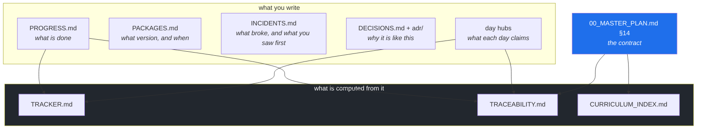

# 2.1 — Why the chat is not the memory

## One-line answer

A system's memory is whatever a stranger can read without asking you, so a decision that lives in a
conversation, a terminal window or your head has, as far as operations is concerned, not been recorded
at all.

---

## The story

🎬 **The scene.** In a shared flat, the front door has to be lifted slightly as you turn the key, or
the lock jams. One flatmate worked this out after an evening spent locked out in the rain, and that
night he explained it to everybody in the group chat. A long message, a photo of the dropped hinge,
the whole reasoning. All four of them read it. All four of them understood.

😬 **The naive fix.** Nothing more. It is written down. The message exists, the chat is searchable,
and four people know.

💥 **Why it fails.** Fourteen months later, two of the four have moved out and somebody new has moved
in. She turns the key the ordinary way, the lock jams, and she spends the evening on the step. The
message still exists and is still perfectly accurate. Nobody searched for it, because you cannot
search for an explanation you do not know exists. One of the remaining flatmates half-remembers that
there was "something about the door".

💡 **The insight.** Writing it down is not the same as recording it. A record has to be findable
**from the thing it is about**, by somebody who does not know it exists. The message failed, not
because it was badly written, but because it was in the wrong place. It was attached to a *moment*,
and the question gets asked at the *door*. A sticky note on the door frame with three badly spelled
words on it would have worked better than the best message anybody ever sent.

---

## The idea in plain language

Think about where a piece of knowledge about your system can live, and how long it survives there.

| Where it lives | How a stranger finds it | Survives a person leaving? | Survives a year? |
| --- | --- | --- | --- |
| somebody's head | by knowing to ask them | no | no |
| a chat thread | by searching for words they do not know to use | no, in practice | rarely |
| a terminal scrollback | it does not | no | no |
| a ticket | if they happen to find the ticket | sometimes | sometimes |
| **a file in the repository, next to the thing** | by reading the thing | **yes** | **yes** |

The last row is the only one that works, and the reason is one word: **proximity**. A comment beside
the odd setting, a decision record linked from the module, a runbook named after the alert. The
question is always asked *at* the artifact, so the answer has to be *at* the artifact.

That is what "the repo is the memory, not the chat" means. It is not a preference for Markdown over
Slack. It is a claim about **where a question gets asked from**.

### Two more properties a real memory needs

**It has to be append-only.** A record you can quietly overwrite is a record nobody can trust, because
you cannot tell a corrected entry from a rewritten one. Git gives you this almost for free, because
history is a chain in which every commit's identity depends on its parent's identity. Altering the
past therefore changes every identity after it, so tampering is possible but **loud**. That is Day 0,
part [3.1](../../../day-000-toolchain-skeleton-driver/parts/03-repo-skeleton/3.1-what-a-repository-actually-is.md).
The ledgers in this repository add a second layer of the same discipline: you *append* a row and never
edit one.

**It has to be checkable.** A memory nobody verifies decays into fiction, one small optimistic edit at
a time. That is why `docs/TRACEABILITY.md` is *generated* from the day documents and the progress
ledger rather than maintained by hand. A claim that day 47 closed `PLT-32` is only accepted if day
47's hub says so **and** `docs/PROGRESS.md` has a row for day 47. You cannot write yourself a good
report, because the report is computed. Part [2.5](2.5-generated-files-you-never-edit.md) is about
exactly this.

### What this costs you, honestly

It is slower. Appending a row to a ledger at the end of an exhausting debugging session, when the
problem is already fixed and you want to stop, is genuinely unpleasant, and every instinct says the
work is done. It is the single most commonly skipped step in operations, by everybody, forever.

The plan's answer is **ritual**. Every day in this curriculum ends the same way: the checklist, then
the ledger rows, then a commit message in a fixed format. The sameness is the mechanism. A step you
perform identically 237 times stops requiring a decision, and a step that does not require a decision
does not get skipped when you are tired.

---

## Why Kriya needs it

Day 231 is *"The handover: operating a system somebody else built."*

That day hands you a system and asks you to operate it using only what is in the repository. It is the
exam for this part, and the failure mode is not dramatic. You simply cannot answer basic questions,
and every answer costs a message to a person who may not reply. Everything you fail to record between
now and then is a question you will fail then.

It matters much sooner too. This curriculum runs for 237 days, and **Day 22 is genuinely forgotten by
Day 190**. That is not a figure of speech. It is why the plan's style guide requires every term to be
defined again on first use, with a link back. The person the repository has to explain things to is,
first and most often, you.

---

## The mechanism

The mechanism is the set of files this repository already carries. Look at them as a group, because
the grouping is the design.

```bash
ls docs/
```

**Line by line:** `ls docs/` lists the memory. Everything a stranger would need sits in one directory
at the top level of the repository, deliberately, so that the answer to "where is it written down?" is
never a search.

Observed on **2026-08-24**:

```text
00_MASTER_PLAN.md
01_ADDENDUM_ZERO_COST_STACK.md
02_ADDENDUM_THE_MACHINE.md
CHANGELOG_PLAN.md
CURRICULUM_INDEX.md
DECISIONS.md
INCIDENTS.md
PACKAGES.md
PROGRESS.md
TRACEABILITY.md
TRACKER.md
adr
```

Those eleven files and one directory divide cleanly into three kinds, and **knowing which kind a file
is tells you how to treat it**.

| Kind | Files | Rule |
| --- | --- | --- |
| **the contract** | `00_MASTER_PLAN.md`, the two addenda, `CHANGELOG_PLAN.md` | changed only by amendment, never silently (Principle 14) |
| **the ledgers** | `PROGRESS.md`, `PACKAGES.md`, `INCIDENTS.md`, `DECISIONS.md`, `adr/` | **append** a row, and never edit one |
| **the generated** | `TRACKER.md`, `TRACEABILITY.md`, `CURRICULUM_INDEX.md` | never touch them, because a tool rewrites them |



**Read the arrows as a trust boundary.** Nothing in the bottom box is an input to anything. If you
want a different report, you change a fact in the top box. Changing the report itself changes nothing
about the world, and it is erased on the next run.

---

## When it breaks

The failure is quiet, and this repository can demonstrate it in one command. Add a note to a generated
file, which is the sort of thing that feels completely reasonable, and then run the tool that owns it.

```bash
printf '\n**Hand-written note: FND-01 is basically done.**\n' >> docs/TRACEABILITY.md
tail -2 docs/TRACEABILITY.md
./o trace
tail -2 docs/TRACEABILITY.md
```

**Line by line:**

- `printf ... >> docs/TRACEABILITY.md` appends a line. **`>>` appends, and a single `>` would have
  emptied the file first.** That is one character between adding a note and destroying the document,
  which is why the plan's trap list names it.
- `tail -2` prints the last two lines, so that you can see the note is genuinely there before and
  genuinely gone afterwards.
- `./o trace` regenerates `docs/TRACEABILITY.md` and `docs/CURRICULUM_INDEX.md` from the master plan's
  §14, the day hubs and `docs/PROGRESS.md`.

Observed on **2026-08-24**:

```text
**Hand-written note: FND-01 is basically done.**
traceability: 0/279 closed, 0 problem(s); index: 279 IDs

**0 / 279 IDs closed.**
```

**What it says:** `traceability: 0/279 closed, 0 problem(s)`, which is a perfectly normal success
line.

**What it actually means:** your note has been deleted, and **nothing warned you**. There is no
"overwriting local changes" message, no confirmation and no backup. The tool did exactly its job.

**The smallest fix:** `git checkout -- docs/TRACEABILITY.md` if you want the file back, although here
the regenerated version *is* the correct one, so there is nothing to recover. The real fix is knowing
which of the three kinds a file is before you type into it, which is why the header of every generated
file in this repository says **"do not edit by hand"** on line three.

---

## In production

**What a professional does differently.** They put the explanation **as close to the artifact as the
tooling allows**, and they accept some duplication to get it. The odd setting gets a comment on the
line, the comment names the decision record, and the decision record has the full story. Three copies
of the same fact at three levels of detail sounds wasteful, right up until the moment somebody finds
the one-line version at 3am and stops before changing it.

**What degrades at scale.** Findability. Ten documents are a directory you can read. Four hundred are
a search problem, and search only works if you already know the vocabulary. That is why this
repository fixes the *shape*, with one plan, three generated reports, four ledgers and one decision
directory, and why every day document ends in the same place with the same rows. **A predictable
structure is worth more than a good index**, because a stranger can guess a structure.

**The failure that only shows with real traffic.** Ledger rot. The ledgers stay accurate for about
three weeks of enthusiasm and then start missing entries, usually the interesting ones, because the
interesting days are the exhausting ones. The counter-measure in this repository is mechanical.
`./o done N` refuses to commit while the day's checklist has an unticked box, and the checklist
contains the ledger rows. It cannot detect a dishonest tick, and `docs/INCIDENTS.md` row 6 records
exactly that limitation, but it removes the *accidental* skip, which is most of them.

**The review comment a senior engineer leaves.** *"This PR changes a timeout from 30 seconds to 5. The
diff tells me what. Nothing tells me why. In a year somebody will see 5, think it looks arbitrary, and
put it back. Put the reason in the commit body and a one-line comment on the constant."*

**The signal you would alert on.** Normally none, because documentation quality is not a pageable
signal, and pretending otherwise produces alerts nobody can act on. There is one real exception, and
it arrives on Day 60: **configuration drift**, where the running system no longer matches the
repository. That is alertable, and it is the sharpest possible version of this part's claim. If the
repository is the memory, then reality disagreeing with it is an incident rather than a curiosity.

**Blast radius.** The command in this part appends to a file in `docs/` and then has it overwritten.
The worst case is that you append to the wrong file, or type `>` instead of `>>` and truncate one. You
are the only person who can trigger it. What bounds it is that every file in `docs/` is tracked by
git, so `git diff` shows the damage and `git checkout --` undoes it, provided you have not committed.
That bound is the entire argument for committing often.

**Cost:** `0` requests, `0` tokens and `0` MB resident. `./o trace` reads and writes three Markdown
files locally.

**The interview question.** *"How do you decide what to document?"* The answer that lands is a filter
rather than a list: *anything a competent stranger could not work out from the code*. The code already
records what happens. It cannot record what you rejected, what you were afraid of, what number you
measured, and what would make you change your mind. Those four are the documentation, and everything
else is a comment restating the obvious.

---

## Check yourself

```bash
head -4 docs/TRACKER.md docs/TRACEABILITY.md docs/CURRICULUM_INDEX.md | grep -i "do not edit\|Generated"
```

Every generated file announces itself in its first few lines. That is not decoration. It is the only
protection those files have.

**Say out loud, without scrolling up:** *the group-chat message in the story was accurate, detailed
and searchable. Name the one property it lacked, and say where the same explanation should have
lived.*
