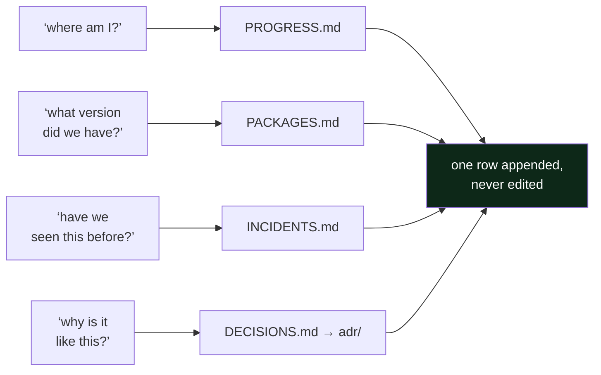

# 2.2 — The four ledgers, and the question each one answers

## One-line answer

There are four append-only files, covering progress, packages, incidents and decisions, because
operations asks exactly four questions of the past, and a single "notes" file answers none of them
well.

---

## The story

🎬 **The scene.** A kitchen with one drawer that holds everything. Knives, batteries, receipts, a
spare key, takeaway menus, and a charger for a phone nobody owns any more.

😬 **The naive fix.** Tidy the drawer. Everything goes back in neatly, once a month.

💥 **Why it fails.** The drawer is not untidy because the people are lazy. It is untidy because it has
no *question* attached to it. Nobody ever goes to that drawer looking for "a thing". They go looking
for a knife, or for the spare key, and they have to look at everything in order to find one item. So
the cost of a search is the size of the drawer, it grows forever, and tidying does not change that at
all.

💡 **The insight.** The fix is not organisation. It is **separation by question**. Knives live with
knives because *where is a knife?* is a question people actually ask. The moment a container has one
question attached to it, finding becomes instant, and so does putting things away, because you never
have to decide where something goes. The question decides for you.

---

## The idea in plain language

A **ledger**, in this repository, means a file where you *append a row* and never edit an old one. It
is not a document you maintain. It is a list you extend. There are four of them, and each one exists
because there is a question that gets asked about the past.

**`docs/PROGRESS.md` answers *what is actually done?*** It holds one row per completed day: the day
number, the date, the IDs it closed, how many parts it had, the commit hash, and whether the gates
were green. The last row is where you are. This file is not decoration, because `scripts/trace.py`
reads it, and an ID only counts as closed if its day has a row here.

**`docs/PACKAGES.md` answers *what version, and when did we see it?*** It holds one row per pinned
tool or library: the package, the version, the date it was observed, the day that added it, and why.
This is Principle 7 turned into a file. Its real audience is you in six months, trying to reproduce
something, or you on Day 232, trying to upgrade something and needing to know what you had before.

**`docs/INCIDENTS.md` answers *what broke, and what did it look like before we knew?*** It holds one
row per failure, deliberate or real. Its most important column is *first symptom*, which gets a part
of its own in [2.3](2.3-the-first-symptom-column.md).

**`docs/DECISIONS.md` and `docs/adr/` answer *why is it like this?*** They are a one-line index plus
one document per architecture decision. The index exists so that a cold reader finds the decision
without grepping for it, and [2.4](2.4-the-adr-and-its-expiry-condition.md) is about what goes in the
document.

### Why four and not one

Because the four questions have different **shapes**, and the shape is what makes a file usable.

| Ledger | Row granularity | Read when | Sorted by | Written by |
| --- | --- | --- | --- | --- |
| `PROGRESS.md` | one day | "where am I?" | day number | you, at the end of a day |
| `PACKAGES.md` | one pin | "what did we have?" | date added | you, when something is installed |
| `INCIDENTS.md` | one failure | "have we seen this?" | incident number | you, immediately after a break |
| `DECISIONS.md` | one decision | "why on earth is it like this?" | ADR number | you, when a choice is expensive to reverse |

Merge them and every read becomes a filter while every write becomes a decision about where the thing
goes. Separate them and both are free. **That is the entire argument, and it generalises far beyond
this repository.** It is why production systems keep metrics, logs and traces as three stores rather
than one, which you meet properly on Day 61.

### The rule that makes them trustworthy

**Append, never edit.** If a row turns out to be wrong, you add a new row saying so, rather than
correcting the old one. This feels pedantic and it is not. An edited ledger cannot be told apart from
an accurate one, so the moment editing becomes normal, the whole file turns into a set of claims
rather than a record. The same instinct is why an accountant strikes a line through an entry rather
than erasing it, and why `git revert` exists alongside `git reset`.

---

## Why Kriya needs it

Day 107 asks you to **reproduce a prediction the system made months earlier.**

To do that you need the commit, which comes from `PROGRESS.md`. You need the exact library versions in
force on that day, which come from `PACKAGES.md`. You need the data version, which comes from Day 87's
tooling. And you need any incident that might explain an anomaly in that window, which comes from
`INCIDENTS.md`. That is three of the four ledgers, used together, for one question. If any of them has
a gap in the relevant week, the answer is "we cannot tell you", and on a real system that sentence is
sometimes a regulatory problem rather than an embarrassment.

Day 235, *"the audit: prove every claim in the readiness review from the repo alone"*, is the same
exam with all four.

---

## The mechanism

The mechanism is appending a row, and the thing worth practising is that it is **one line of shell,
done identically every time**.

```bash
printf '| 1 | 2026-08-24 | FND-01, FND-02 | 13 | <hash> | ✅ |\n' >> docs/PROGRESS.md
tail -3 docs/PROGRESS.md
```

**Line by line:**

- `printf` rather than `echo`, because `printf` treats its first argument as a format string and
  behaves identically everywhere, while `echo` handles backslashes and flags differently between
  shells. On a Windows machine running Git Bash next to PowerShell, that difference is not academic.
- The `\n` at the end has to be written out, because `printf` does not add a newline and `echo` does.
  A missing newline here silently joins your new row onto the previous one and corrupts the table.
- **`>>` appends and `>` truncates.** That is one character between adding a row and destroying the
  ledger. It is the plan's named trap, and it is worth a moment of fear every time you type it.
- `<hash>` is a placeholder, because the commit hash does not exist until you commit, and the commit
  happens *after* the row is written. The honest workflow is to write the row with a placeholder,
  commit, and then amend the row with the real hash in the next commit. `docs/PROGRESS.md`'s Day 0 row
  was filled in exactly that way, which is why commit `2c36b16` exists and is titled *"record the
  day's commit hash in PROGRESS.md and the hub"*.
- `tail -3` immediately afterwards, every single time. **Verify the write.** Appending to the wrong
  file is silent, and checking costs nothing.

Observed on **2026-08-24**, before Day 1's row exists:

```text
| Day | Date | IDs closed | Parts | Commit | Gates green? |
| --- | ---- | ---------- | ----- | ------ | ------------ |
| 0 | 2026-08-24 | — | 19 | 5a8edee | ✅ |
```

And here is the tool that reads it, which proves the ledger is load-bearing rather than decorative:

```bash
./o trace
```

**Line by line:** `./o trace` regenerates `docs/TRACEABILITY.md` and `docs/CURRICULUM_INDEX.md`. It
takes the plan's §14 as the list of what *should* be closed, each day hub's frontmatter as what that
day *claims*, and `docs/PROGRESS.md` as what is *actually green*. An ID is only closed when all three
agree.

```text
traceability: 0/279 closed, 0 problem(s); index: 279 IDs
```

Zero are closed, because only Day 0 has a row, and Day 0 closes no IDs by design.



---

## When it breaks

There are two failures here. Both are cheap to cause, and both are worth having caused deliberately.

**The first is the wrong redirect.** Type `>` instead of `>>`:

```text
$ printf '| 1 | ... |\n' > docs/PROGRESS.md
$ wc -l docs/PROGRESS.md
1 docs/PROGRESS.md
```

**What it says:** nothing at all. There is no output and no error, because the shell did exactly what
you asked it to do.

**What it actually means:** the ledger is gone. Thirteen lines of header, explanation and history have
been replaced by one row.

**The smallest fix:** `git checkout -- docs/PROGRESS.md`, which works because the file is tracked and
committed. If it were not committed, there would be no fix. This is one of several reasons the plan
commits once per day rather than once per week.

**The second failure is the ledger that is technically full and actually empty.** A row like this one
is worse than no row at all:

```text
| 12 | 2026-09-05 | FND-15 | 9 | a91b3c2 | ✅ |
```

Pair it with an `INCIDENTS.md` row reading *"broke the pipeline, fixed it"*. The progress row is fine.
The incident row has recorded the two facts that were already obvious and none of the facts that were
expensive to obtain: what you saw first, what you thought it was, and what it turned out to be. A
ledger full of rows like that passes every automated check in this repository and teaches you nothing,
which is why [2.3](2.3-the-first-symptom-column.md) exists as a part of its own.

---

## In production

**What a professional writes instead of the teaching version.** In a real organisation these four
ledgers already exist under other names, and the professional's skill is recognising them.
`PROGRESS.md` is the deploy log and the release notes. `PACKAGES.md` is the lockfile plus the software
bill of materials, which is Day 15. `INCIDENTS.md` is the incident tracker and the postmortem archive,
which is Day 82. `DECISIONS.md` is the decision-record directory or the design-doc folder. **The
failure is never "we have no ledgers". It is that one of the four is missing and nobody has noticed
which one.** Ask a team those four questions and watch which one produces a pause.

**What degrades at scale.** The shape of `PROGRESS.md`. One row per day works for 237 days and does
not work for a service that deploys thirty times a day. At that point the ledger stops being
hand-written and becomes a query over the deployment system's own records, which is exactly what Day
20 computes the four delivery metrics from. The *questions* survive scale and the *files* do not, and
knowing which is which stops you defending a Markdown table long after it should have become a
database.

**The failure that only shows with real traffic.** Ledger latency. A row written a week late is
written from memory, and memory reconstructs a tidy causal story that is frequently wrong. People
genuinely remember noticing things they only worked out afterwards. An incident record written after
the fact tends to describe the *cause*, because that is what you now know, and to leave out the
*symptom*, which is the only part that helps next time. This is not carelessness. It is how memory
works, and the countermeasure is procedural: write the symptom down before you investigate.

**The review comment a senior engineer leaves.** *"Your postmortem has a 'root cause' section and no
timeline. Without timestamps I cannot tell whether this took two minutes to detect and two hours to
fix, or the other way round, and those are completely different problems with completely different
fixes."*

**The signal you would alert on.** None of the four ledgers is alertable, and you should not invent a
way to make them so. A "documentation completeness" metric gets gamed within a week. The enforcement
here is a **gate** rather than an alert. `./o done N` refuses to commit a day whose checklist is
unticked, and the checklist contains the ledger rows. A gate refuses at the moment of the mistake,
whereas an alert nags afterwards, and nagging loses.

**Blast radius.** Appending to a ledger changes one tracked text file. The worst case is the `>` typo
above, which destroys that file's history so far. Anybody with a shell in the repository can trigger
it. What bounds it is git, because every ledger is committed, so the damage is one `git checkout --`
away for as long as you commit daily. There is no bound at all on an uncommitted file, which is the
real argument for Principle 2.

**Cost:** `0` requests, `0` tokens and `0` MB resident. Four Markdown files, a few kilobytes each,
growing by a handful of lines per day.

**The interview question.** *"Six months after you left, somebody finds a strange configuration value
in your service. What do they do?"* The strong answer names the artifact and the path to it, such as a
comment on the line pointing at a decision record, or a commit message that explains the why, and it
admits what the repository would *not* be able to tell them. Naming the gap is a better answer than
claiming there is none.

---

## Check yourself

```bash
wc -l docs/PROGRESS.md docs/PACKAGES.md docs/INCIDENTS.md docs/DECISIONS.md
```

Four files and four questions. Notice which one is currently the longest, and ask yourself whether
that is what you would expect on Day 1.

**Say out loud, without scrolling up:** *name the four questions, and say which ledger you would reach
for first if a prediction made in March needed reproducing in September.*
