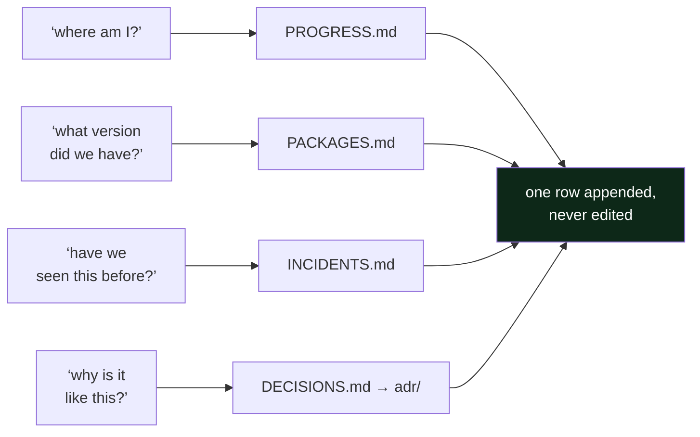

# 2.2 — The four ledgers, and the question each one answers

## One-line answer

Four append-only files — progress, packages, incidents, decisions — because operations asks exactly
four questions of the past (*what is done · what version · what broke · why is it like this*) and a
single "notes" file answers none of them well.

---

## The story

🎬 **The scene.** A kitchen. One drawer holds everything: knives, batteries, receipts, a spare key,
takeaway menus, a phone charger for a phone nobody owns any more.

😬 **The naive fix.** Tidy the drawer. Everything goes back in, neatly, once a month.

💥 **Why it fails.** The drawer is not untidy because people are lazy. It is untidy because it has no
*question* attached to it. You never go to the drawer looking for "a thing" — you go looking for a
knife, or the key, and you have to look at everything to find one thing. So the search cost is the
size of the drawer, and it grows forever, and the tidying does not change that.

💡 **The insight.** The fix is not organisation, it is **separation by question**. Knives live with
knives because "where is a knife?" is a question people actually ask. The moment a container has one
question, finding is instant and *filing* is instant too — you never have to decide where something
goes, because the question decides.

---

## The idea in plain language

A **ledger** here means a file where you *append a row* and never edit an old one. Not a document you
maintain; a list you extend. Four of them, and each one exists because there is a question that gets
asked about the past.

**`docs/PROGRESS.md` — what is actually done?** One row per completed day: the day number, the date,
the IDs it closed, how many parts it had, the commit hash, and whether the gates were green. The last
row is where you are. This file is not decoration: `scripts/trace.py` reads it, and an ID only counts
as closed if its day has a row here.

**`docs/PACKAGES.md` — what version, and when did we see it?** One row per pinned tool or library:
package, version, the date observed, the day that added it, and *why*. This is Principle 7 made into
a file. Its real audience is you in six months, trying to reproduce something, or on Day 232, trying
to upgrade something and needing to know what you had.

**`docs/INCIDENTS.md` — what broke, and what did it look like before we knew?** One row per failure,
deliberate or real. Its most important column is *first symptom*, which gets its own part —
[2.3](2.3-the-first-symptom-column.md).

**`docs/DECISIONS.md` + `docs/adr/` — why is it like this?** A one-line index plus one document per
architecture decision. The index exists so a cold reader finds the decision without grepping;
[2.4](2.4-the-adr-and-its-expiry-condition.md) is about what goes in the document.

### Why four and not one

Because the four questions have different **shapes**, and a shape is what makes a file usable:

| Ledger | Row granularity | Read when | Sorted by | Written by |
| --- | --- | --- | --- | --- |
| `PROGRESS.md` | one day | "where am I?" | day number | you, at the end of a day |
| `PACKAGES.md` | one pin | "what did we have?" | date added | you, when something is installed |
| `INCIDENTS.md` | one failure | "have we seen this?" | incident number | you, immediately after a break |
| `DECISIONS.md` | one decision | "why on earth is it like this?" | ADR number | you, when a choice is expensive to reverse |

Merge them and every read becomes a filter and every write becomes a decision about where it goes.
Separate them and both are free. **That is the entire argument, and it generalises far beyond this
repository** — it is why production systems keep metrics, logs and traces as three stores rather than
one, which you meet properly on Day 61.

### The rule that makes them trustworthy

**Append, never edit.** If a row turns out to be wrong, you add a new row that says so — you do not
correct the old one. This feels pedantic and it is not: an edited ledger cannot be distinguished from
an accurate one, so the moment editing is normal, the whole file becomes a set of claims rather than
a record. The same instinct is why an accountant strikes through rather than erases, and why
`git revert` exists alongside `git reset`.

---

## Why Kriya needs it

Day 107 asks you to **reproduce a prediction the system made months earlier.**

To do that you need: the commit (from `PROGRESS.md`), the exact library versions in force on that day
(from `PACKAGES.md`), the data version (from Day 87's tooling), and any incident that might explain an
anomaly in that window (from `INCIDENTS.md`). Three of the four ledgers, used together, for one
question. If any of them has a gap in the relevant week, the answer is "we cannot tell you", and on a
real system that sentence is sometimes a regulatory problem rather than an embarrassment.

Day 235 — *"the audit: prove every claim in the readiness review from the repo alone"* — is the same
exam with all four.

---

## The mechanism

The mechanism is appending a row, and the thing worth practising is that it is **one line of shell,
done identically every time**.

```bash
printf '| 1 | 2026-08-24 | FND-01, FND-02 | 13 | <hash> | ✅ |\n' >> docs/PROGRESS.md
tail -3 docs/PROGRESS.md
```

**Line by line:**

- `printf` rather than `echo`, because `printf` treats its first argument as a format string and
  behaves identically everywhere, while `echo`'s handling of backslashes and flags differs between
  shells. On a Windows machine running Git Bash next to PowerShell, that difference is not academic.
- The `\n` at the end is why `printf` needs it stated explicitly — `printf` does not add a newline and
  `echo` does. A missing newline here silently joins your new row onto the previous one and corrupts
  the table.
- **`>>` appends. `>` truncates.** One character between adding a row and destroying the ledger. This
  is the plan's named trap and it is worth a moment of fear every time you type it.
- `<hash>` is a placeholder because the commit hash does not exist until you commit — which happens
  *after* the row is written. The honest workflow is: write the row with a placeholder, commit, then
  amend the row with the real hash in the next commit. `docs/PROGRESS.md`'s Day 0 row was filled in
  exactly that way, which is why commit `2c36b16` exists and is titled *"record the day's commit hash
  in PROGRESS.md and the hub"*.
- `tail -3` immediately afterwards, every time. **Verify the write.** Appending to the wrong file is
  silent, and the cost of checking is nothing.

Observed on **2026-08-24**, before Day 1's row exists:

```text
| Day | Date | IDs closed | Parts | Commit | Gates green? |
| --- | ---- | ---------- | ----- | ------ | ------------ |
| 0 | 2026-08-24 | — | 19 | 5a8edee | ✅ |
```

And the file that reads it, to prove the ledger is load-bearing rather than decorative:

```bash
./o trace
```

**Line by line:** `./o trace` regenerates `docs/TRACEABILITY.md` and `docs/CURRICULUM_INDEX.md`. It
takes the plan's §14 as the list of what *should* be closed, each day hub's frontmatter as what that
day *claims*, and `docs/PROGRESS.md` as what is *actually green* — and an ID is only closed when all
three agree.

```text
traceability: 0/279 closed, 0 problem(s); index: 279 IDs
```

Zero closed, because only Day 0 has a row and Day 0 closes no IDs by design.



---

## When it breaks

Two failures, both cheap to cause and worth having caused deliberately.

**The first is the wrong redirect.** Type `>` instead of `>>`:

```text
$ printf '| 1 | ... |\n' > docs/PROGRESS.md
$ wc -l docs/PROGRESS.md
1 docs/PROGRESS.md
```

**What it says:** nothing. There is no output and no error; the shell did exactly what you asked.
**What it actually means:** the ledger is gone. Thirteen lines of header, explanation and history,
replaced by one row.
**The smallest fix:** `git checkout -- docs/PROGRESS.md`, which works because the file is tracked and
committed. If it were not committed, there is no fix. This is one of several reasons the plan commits
once per day rather than once per week.

**The second is the ledger that is technically full and actually empty.** A row like this one is worse
than no row:

```text
| 12 | 2026-09-05 | FND-15 | 9 | a91b3c2 | ✅ |
```

…paired with an `INCIDENTS.md` row reading *"broke the pipeline, fixed it"*. The progress row is
fine. The incident row has recorded the two facts that were already obvious and none of the facts
that were expensive to obtain: what you saw first, what you thought it was, and what it turned out to
be. A ledger of such rows passes every automated check in this repository and teaches you nothing,
which is why [2.3](2.3-the-first-symptom-column.md) exists as its own part.

---

## In production

**What a professional writes instead of the teaching version.** In a real organisation these four
ledgers already exist under other names, and the professional's skill is recognising them:
`PROGRESS.md` is the deploy log and the release notes; `PACKAGES.md` is the lockfile plus the SBOM
(Day 15); `INCIDENTS.md` is the incident tracker and the postmortem archive (Day 82); `DECISIONS.md`
is the ADR directory or the design-doc folder. **The failure is never "we have no ledgers" — it is
that one of the four is missing and nobody has noticed which.** Ask a team those four questions and
watch which one produces a pause.

**What degrades at scale.** `PROGRESS.md`'s shape. One row per day works for 237 days and does not
work for a service deploying thirty times a day; at that point the ledger stops being hand-written
and becomes a query over the deployment system's own records, which is exactly what Day 20 computes
the four delivery metrics from. The *questions* survive scale; the *files* do not, and knowing which
is which stops you defending a Markdown table long after it should have become a database.

**The failure that only shows with real traffic.** Ledger latency. The row that is written a week
later is written from memory, and memory reconstructs a tidy causal story that is frequently wrong —
people genuinely remember noticing things they only worked out afterwards. An incident record written
after the fact tends to describe the *cause*, because that is what you now know, and to omit the
*symptom*, which is the only part that helps next time. This is not carelessness; it is how memory
works, and the countermeasure is procedural: write the symptom before you investigate.

**The review comment a senior engineer leaves.** *"Your postmortem has a 'root cause' section and no
timeline. Without timestamps I can't tell whether this took two minutes to detect and two hours to
fix, or the reverse — and those are completely different problems with completely different fixes."*

**The signal you would alert on.** None of the four ledgers is alertable, and you should not invent
one — a "documentation completeness" alert is the kind of metric that gets gamed within a week. The
enforcement is a **gate**, not an alert: `./o done N` refuses to commit a day whose checklist is
unticked, and the checklist contains the ledger rows. A gate refuses at the moment of the mistake; an
alert nags afterwards, and nagging loses.

**Blast radius.** Appending to a ledger changes one tracked text file. Worst case, the `>` typo above
destroys a file's history-to-date. Who can trigger it: anyone with a shell in the repository. What
bounds it: git — every ledger is committed, so the damage is one `git checkout --` away for as long
as you commit daily. There is no bound at all on an uncommitted file, which is the actual argument
for Principle 2.

**Cost:** `0` requests, `0` tokens, `0` MB resident. Four Markdown files, a few kilobytes each,
growing by a handful of lines per day.

**The interview question.** *"Six months after you left, someone finds a weird configuration value in
your service. What do they do?"* The strong answer names the artifact and the path to it — a comment
on the line pointing at an ADR, or a commit message that explains the why — and admits what the
repository would *not* be able to tell them. Naming the gap is a better answer than claiming there
is none.

---

## Check yourself

```bash
wc -l docs/PROGRESS.md docs/PACKAGES.md docs/INCIDENTS.md docs/DECISIONS.md
```

Four files, four questions. Note which one is currently the longest, and ask yourself whether that is
what you would expect on Day 1.

**Say out loud, without scrolling up:** *name the four questions, and say which ledger you would reach
for first if a prediction made in March needed reproducing in September.*
