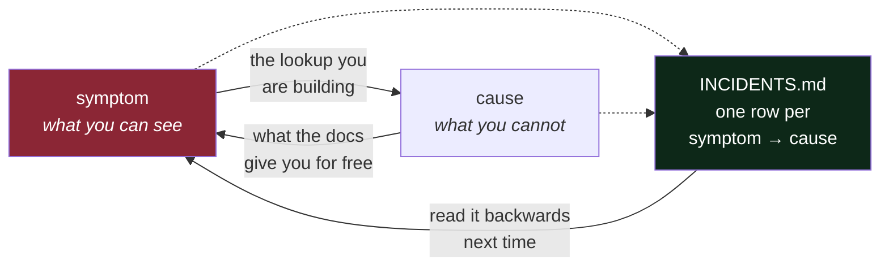

# 2.3 — The first-symptom column

## One-line answer

Debugging is a lookup from a symptom you can see to a cause you cannot, and you build that lookup
table one row at a time — which is why the incident ledger records **what you saw before you knew**,
not what it turned out to be.

---

## The story

🎬 **The scene.** Two people are handed the same broken machine. One has worked on machines like it
for ten years. The other read the manual last week and knows it better.

😬 **The naive fix.** Give the problem to the one who knows the manual, since the manual contains
everything true about the machine.

💥 **Why it fails.** The manual is organised by *component*. It tells you, exhaustively, what each
part does. The person with ten years does something the manual cannot: they listen to the noise it is
making and say "that's the bearing", and they are right, and they cannot fully explain why. What they
have is not more knowledge of components. It is a **table that goes the other way** — from noise to
part — built from every machine they have ever heard make that noise.

💡 **The insight.** Expertise in diagnosis is a reverse index. The manual maps cause to effect; the
job requires effect to cause. Nobody is born with that table and no document ships with it, because
it is specific to the systems you actually run. **You build it by writing down what things sounded
like, at the moment you did not yet know what they were.**

---

## The idea in plain language

When something breaks, the order of events is always the same:

1. You observe something. A number, a message, a complaint, a graph.
2. You do not know what it means.
3. You investigate.
4. You find out.

Step 4 is the satisfying part, and it is the part everyone writes down. **Step 1 is the valuable
part, and it evaporates within the hour**, because the moment you know the cause, the symptom stops
looking mysterious and starts looking obvious. You genuinely cannot recover it later; your memory
will helpfully rewrite it into "we saw X, which of course meant Y".

So the incident ledger has a column called **first symptom I saw**, and it is filled in *before* the
investigation, not after. That single procedural rule is what turns the file from a list of
resolved tickets into a diagnostic index.

The columns of `docs/INCIDENTS.md`, and what each is for:

| Column | Filled in when | Why it exists |
| --- | --- | --- |
| What I broke | after | the cause, once known |
| **First symptom I saw** | **before investigating** | **the lookup key — the only column you cannot reconstruct** |
| What it actually was | after | the mapping's other side |
| The smallest fix | after | what to do at 3am, not what to do properly |
| What I changed so it cannot happen silently again | after | the detection, which is the real deliverable |

Note the last column carefully. **A fix without a detection change means the next occurrence is also
found by a human.** An incident that produces only a fix has taught you nothing about the system's
observability, and observability is what you are actually building.

### Why "silently" is the load-bearing word

The column is not "so it cannot happen again" — that is usually impossible and often not worth it.
It is "so it cannot happen **silently** again". Those are very different commitments:

- *Cannot happen again* means removing a failure mode. Expensive, sometimes impossible, occasionally
  the wrong trade.
- *Cannot happen silently again* means adding a signal, a check or an alert. Nearly always cheap, and
  it converts an unknown failure into a known one.

You will meet failures you deliberately choose not to prevent. You should never meet the same failure
twice without warning.

---

## Why Kriya needs it

Day 82 is your first written postmortem, and Day 173 is *"change attribution — which deploy caused
this?"*

A postmortem is this ledger row, expanded, with a timeline and a set of actions. It is impossible to
write a good one from memory, and the specific thing you will be missing is the timeline of *what was
visible when* — which is the first-symptom column with timestamps. Teams that write good postmortems
are, without exception, teams that took notes during the incident.

Nearer term: Day 30 is *"the container failure lab — exit 137, CrashLoopBackOff, a full disk, a build
that will not cache."* Every one of those four is a **symptom**, and the entire day is spent building
the row that maps it to a cause. `exit 137` means nothing until you know it is `128 + 9`, signal 9,
the kernel's out-of-memory killer. That is one row in your table, and there are perhaps two hundred
worth having.

---

## The mechanism

The mechanism is a discipline with two steps, and the first one takes seconds.

**Step 1, before you investigate:** capture the symptom exactly, verbatim, with no interpretation.

```bash
./o check 2>&1 | tee "C:/Users/NISHA_~1/AppData/Local/Temp/symptom-$(date +%Y%m%dT%H%M%S).log"
```

**Line by line:**

- `2>&1` redirects standard error into standard output, so the pipe carries both. **Almost every
  useful error message is on standard error**, and a pipeline that forgets this captures the boring
  half of the output and loses the traceback.
- `tee` writes its input to a file *and* passes it through to your terminal, so you get the capture
  without losing the ability to read it live. This is the reason to use `tee` rather than a plain
  redirect: during an incident you need both.
- `$(date +%Y%m%dT%H%M%S)` timestamps the filename in a sortable, unambiguous format — year, month,
  day, then `T`, then the time. Sortable filenames matter the third time you do this in one evening.
- The file goes to a scratch directory outside the repository, deliberately: it is raw capture, not a
  record, and it must never be committed. The *record* is the row you write next.

**Step 2, immediately after:** append the row, with the symptom column filled in from that capture
rather than from memory.

```bash
printf '| 11 | %s | 1 | <what I broke> | <verbatim first symptom> | <what it was> | <smallest fix> | <detection I added> |\n' "$(date +%F)" >> docs/INCIDENTS.md
tail -1 docs/INCIDENTS.md
```

**Line by line:**

- `%s` with `"$(date +%F)"` inserts today's date in `YYYY-MM-DD` form. Using a format string rather
  than pasting the date means the row cannot be dated wrong when you write three of them.
- `| 11 |` — the next incident number. The ledger currently ends at 10, so Day 1's rows start at 11.
- `>>` appends. Again. It will be `>>` every single time, and the one time it is not will be
  memorable.
- `tail -1` verifies. Always.

Here is what a good row and a bad row look like, from this repository's real ledger. The bad one is
invented; the good one is row 9, written on 2026-08-24:

```text
BAD:
| 9 | 2026-08-24 | 0 | secret scanning | it didn't work | no scanner | added one | n/a |

GOOD:
| 9 | 2026-08-24 | 0 | Boundary hunt (my own, 2 — the important one) — appended
GROQ_API_KEY=gsk_LIVE_LOOKING_VALUE_123456 to .env.example, a **tracked** file, and ran the gate
| **nothing. exit=0, all five checks green** | **The gate has no secret scanning whatsoever.**
Today's entire secrets defence is .gitignore, which matches *paths* and never *content* — and
.env.example is deliberately un-ignored. So the one file guaranteed to be committed is the one file
nothing inspects | git checkout -- .env.example | Nothing yet — this is precisely what Day 17's CI
secret scanner is for. Recording it now so that day closes a gap I found rather than one I was told
about |
```

**The difference is not length.** It is that the good row's symptom column says **"nothing. exit=0,
all five checks green"** — an observation you could look up later from the other direction. If you
ever again see a green gate and a nagging feeling, that row is the thing you find.



---

## When it breaks

The failure is writing the row after you know the answer. Here is the same incident recorded both
ways. Row 4 of this repository's real ledger, written properly:

```text
| 4 | 2026-08-24 | 0 | Breakage 3 — a test that cannot pass, `assert 1 == 2` | `F [100%]` then
`E       assert 1 == 2` and `FAILED tests/test_probe.py::test_deliberate` | **The first time the
test step had ever run a test.** Every prior green came from pytest exiting `5` ("no tests
collected"), which `|| [ $? -eq 5 ]` forgives |
```

And the version memory would have produced a week later:

```text
| 4 | 2026-08-24 | 0 | added a failing test | the gate went red | pytest exit code handling |
```

**What the second one says:** the gate went red.
**What it actually means:** nothing usable. "The gate went red" is true of every failure the gate can
detect, so as a lookup key it matches everything and identifies nothing. The genuinely valuable
discovery in that incident — *that every previous green had come from an exemption rather than from a
passing test* — is absent, because by the time the row was written it no longer felt surprising.

**The smallest fix** is procedural and slightly uncomfortable: **stop before you investigate** and
paste the output. Ten seconds, at the moment you least want to spend them.

There is a second failure, subtler and more common: recording the symptom you *expected* rather than
the one you saw. If you were testing whether the gate catches an unused import and it did, the honest
symptom is the exact `F401` text and the fact that **the gate stopped at check 1 of 5 and never ran
the other four** — which is row 2 of this repository's ledger, and which nobody predicts. The
surprise is the whole value.

---

## In production

**What a professional writes instead of the teaching version.** They keep a running timestamped log
*during* the incident — one line per observation, in the incident channel or a scratch file — and the
postmortem is assembled from it afterwards. The discipline has a name in some organisations
(*scribe*, a role assigned at the start of an incident alongside the commander), and it exists because
the people diagnosing cannot also be the people remembering. Day 81 assigns you both roles, since
there is one of you.

**What degrades at scale.** The symptom stops being a single observation. On one service the symptom
is a traceback. On forty services the symptom is *"the error rate on service C rose four minutes
after a deploy to service A, and services B and D look fine"* — a relationship rather than a string.
Recording that requires timestamps and a shared clock, which is why distributed tracing (Day 69) is
the tooling answer and why "what time was it, exactly" is the most under-rated column in any incident
record.

**The failure that only shows with real traffic.** Symptoms that are only visible in aggregate. A
single failing request looks like a fluke; one percent of requests failing is an incident, and no
individual observation will tell you which you are looking at. This is why the first-symptom column
in a mature system quotes a *metric* — "error rate crossed 5% at 03:12" — rather than an anecdote, and
why Phase 7 comes before Phase 8 in this plan: you cannot describe an aggregate symptom until you
are measuring aggregates.

**The review comment a senior engineer leaves.** *"The action items on this postmortem are all
'be more careful' and 'add documentation'. Neither of those is a change to the system. What signal
would have caught this, and who is adding it?"*

**The signal you would alert on.** Not on the ledger — but the ledger is where alerts *come from*.
The healthiest pattern in operations is that most alerts are born in the last column of an incident
row: something broke silently, and the response was a new detector. Over time your alert set becomes
a fossil record of everything that has ever gone wrong, which is a much better design principle than
alerting on everything you can measure. Day 77 states it as a rule; Day 159 onward turns your own
incident history into training data for detectors, which is AIOps in one sentence.

**Blast radius.** The commands here write one scratch log outside the repository and append one row to
a tracked Markdown file. Worst case: you paste a **secret** into the ledger, because incident output
frequently contains tokens, connection strings and personal data. Who can trigger it: you, in a hurry.
What bounds it: nothing automatic today — `.gitignore` matches paths, never content, and
`docs/INCIDENTS.md` is deliberately tracked. That is row 9 of the ledger, and the real control arrives
on Day 17 with a CI secret scanner. **Redact before you paste**, and treat that as a rule rather than
a suggestion.

**Cost:** `0` requests, `0` tokens. Disk: one small log file per capture, in scratch, deleted when you
are done.

**The interview question.** *"Walk me through the last incident you were involved in."* Interviewers
are listening for the order in which you say things. Candidates who start with the cause are usually
reciting; candidates who start with "we saw X, we thought it was Y, it turned out to be Z" have
actually been there — and the "we thought it was Y" is the part that proves it.

---

## Check yourself

```bash
awk -F'|' 'NF>5 {print NR": "$6}' docs/INCIDENTS.md | tail -10
```

Print the sixth column — *first symptom* — of every row. Read them as a list, with the causes hidden.
That is the index you are building, and it is the one you will read from at 3am.

**Say out loud, without scrolling up:** *why is the first-symptom column the only one you cannot fill
in accurately after the investigation?*
