# 2.4 — The ADR, and the expiry condition that makes it honest

## One-line answer

An architecture decision record is a short document saying what you chose, what you rejected, and
what would make you change your mind, and it is the last of those three that separates a decision
from a justification.

---

## The story

🎬 **The scene.** A family is choosing where to live. They pick a flat a long way out of town because
it is cheap and quiet, and they are pleased with the reasoning. A friend asks why not somewhere
closer. They explain that the journey to work is bearable and the saving is large.

😬 **The naive fix.** Write the reasons down. Cheap, quiet, bearable journey. Everybody agrees, and
the note goes in a drawer.

💥 **Why it fails.** Four years later a child starts school on the other side of town, a road closes
and the journey doubles, and the saving is swallowed by fuel. The decision is now clearly wrong.
Nobody revisits it, though, because the note in the drawer still reads as a perfectly good argument.
It is *still true* that the flat was cheap and quiet. Nothing in the note says **under what conditions
this choice stops being right**, so there is no trigger, and a decision with no trigger gets defended
rather than reviewed.

💡 **The insight.** The valuable sentence is not "we chose this because". It is "**we would choose
differently if**", with something you can actually observe in it. That one sentence turns a piece of
self-justification into a decision with an expiry condition, and expiry conditions are what let a
system be changed by people who were never in the room.

---

## The idea in plain language

An **ADR**, which stands for architecture decision record, is a short, numbered, unchangeable document
that records one decision. It is unchangeable in the same sense as the ledgers. You do not rewrite
ADR-0003 when you change your mind. You write ADR-0011 and mark ADR-0003 as *superseded*. The chain of
ADRs is the reasoning history of the system.

You do not write one for every choice. The filter this repository uses is stated in
`docs/DECISIONS.md`: **write an ADR when a choice would be expensive to reverse and non-obvious to a
stranger.** Both halves matter. Something expensive but obvious needs no explanation, and something
non-obvious but cheap can simply be changed. It is the overlap between the two that produces the *why
on earth is it like this?* question six months later.

This repository requires six sections, and the last two are the ones that make the document worth
writing.

| Section | The question it answers | What a bad version looks like |
| --- | --- | --- |
| **Context** | what was true when we decided? | no numbers, just "we needed something scalable" |
| **Options considered** | what else was on the table? | one option, listed to make the choice look inevitable |
| **Decision** | what did we choose? | a paragraph where a sentence belongs |
| **Consequences** | what is now easier, what is harder, what are we committed to? | only the good half |
| **What would make us change our minds** | **which observable condition invalidates this?** | "if it stops working for us" |
| **Cold read** | does it still make sense later? | never filled in |

### Why "options considered" is not padding

Because the options you rejected are the part that cannot be recovered. Six months later the code
shows what you built. Nothing shows what you deliberately did *not* build, so a stranger's first
instinct is to propose it, and you find yourself re-arguing a decision whose reasoning you have partly
forgotten, against somebody arguing in good faith. Writing down the rejected option *with its honest
advantages* is what ends that conversation in one link.

Note the phrase "with its honest advantages". An options table in which every rejected option is
obviously terrible is a tell. It means the writer worked backwards from the answer, and it means the
reader learns nothing at all about the trade.

### Why the expiry condition has to contain something observable

Compare these two.

- *"We would reconsider if this approach stops meeting our needs."* This can never be shown to be
  false. It will never trigger, because nobody can ever say the condition has been met.
- *"We would reconsider if the median day exceeds roughly twenty-five parts."* This is a number.
  Somebody can check it, in the tracker, without asking anybody.

The second is from ADR-0002 in this repository. It is checkable by a person who was not in the room,
which is the entire test.

---

## Why Kriya needs it

Day 230 is *"Documentation that survives you: architecture, runbooks, decisions."* Day 231 hands you
somebody else's system.

By then this repository will hold decisions you no longer remember making. Why the model registry is
the only source of truth for deployability, which is Day 105. Why one automated remediation exists and
not five, which is Day 175. Why the agent may act only through an approval gate, which is Day 194.
Each of those is a choice with a real alternative, and each will look arbitrary to a reader who
arrives late. **You are that reader**, from about Day 120 onward.

Immediately, the four ADRs already in `docs/adr/` are the reason this curriculum is shaped as it is,
and today's checklist asks you to read all four. Everything in Day 0 and Day 1 follows from them.

---

## The mechanism

Look at a real one, and then look at the shape of its most important section.

```bash
ls docs/adr/
grep -A6 "What would make us change our minds" docs/adr/ADR-0002-depth-contract.md
```

**Line by line:**

- `ls docs/adr/` lists the decision records. The filename carries the number **and** a slug, for the
  same reason day folders do. `ADR-0002.md` is an address, and `ADR-0002-depth-contract.md` is an
  answer.
- `grep -A6` prints the matching line plus the six lines after it. `-A`, which stands for after, is
  the flag you reach for when the interesting content follows a known heading. The alternative, which
  is opening the file and scrolling, does not compose into a pipeline and does not work across four
  hundred files.

Observed on **2026-08-24**:

```text
ADR-0001-project-charter.md
ADR-0002-depth-contract.md
ADR-0003-zero-cost-and-local-first.md
ADR-0004-fundamentals-before-ai.md
```

```text
## What would make us change our minds

- If `./o depth` starts passing days that read badly, the mechanical half is measuring the wrong
  thing and needs a *different* check — never a relaxed one.
- If the median day exceeds roughly twenty-five parts, sections are being used as a substitute for
  day boundaries and the day map itself needs amending, with its own ADR.
```

**Read those two bullets as instructions to a future person.** The first names a *symptom*, which is
that days pass the script and read badly, and pre-commits to a response that is not the tempting one,
which is to fix the check rather than relax it. The second names a *number* that somebody can look up
in `docs/TRACKER.md` with no context at all. Neither requires the author to still be here.

The lifecycle of an ADR is a small state machine, and it is worth knowing, because "superseded" is the
state people forget exists.

```mermaid
stateDiagram-v2
    [*] --> proposed: written, not yet agreed
    proposed --> accepted: agreed; the system is built this way
    proposed --> rejected: we decided not to
    accepted --> superseded: a later ADR replaces it
    accepted --> deprecated: no longer applies, nothing replaced it
    superseded --> [*]
    deprecated --> [*]
    rejected --> [*]
    note right of superseded
        the old ADR is never edited or deleted
        the new one names it, the old one links forward
    end note
```



---

## When it breaks

There are two failure modes, and the first is the common one.

**The ADR that is a press release.** Every rejected option is a straw man, the consequences section
lists only benefits, and the expiry condition is *"if requirements change"*. It looks like this:

```text
## Options considered

| Option | Pros | Cons |
| --- | --- | --- |
| A. Build it ourselves | full control | slow, expensive, risky |
| B. The thing we chose | fast, flexible, industry standard | none significant |

## What would make us change our minds

If the solution no longer meets our requirements.
```

**What it says:** we considered alternatives.

**What it actually means:** we did not. "None significant" in a cons column is never true of anything,
and a reader who has ever made a real technical decision will read that table and discount the whole
document.

**The smallest fix:** write one genuine disadvantage of the option you chose. If you cannot think of
one, you have not understood it yet, and that is the finding.

**The second failure is the ADR nobody can find.** The document is excellent and it lives in a
directory nobody opens, so the question gets asked *at the code* while the answer sits three
directories away. This is [2.1](2.1-why-the-chat-is-not-the-memory.md)'s proximity problem with better
formatting.

**The smallest fix** is a one-line comment at the site of the decision naming the ADR. The code says
*what*, the comment says *see ADR-0007*, and the ADR says *why*. That is three levels of detail, each
findable from the one above.

This repository already does that. `pyproject.toml` carries a comment explaining `link-mode = "copy"`
with the upstream issue numbers, precisely so that a future reader tidying up the file finds the
reason before deleting the line.

---

## In production

**What a professional writes instead of the teaching version.** They write the ADR **before** the
work rather than after it, and they circulate it while the decision is still reversible. An ADR
written afterwards is a summary. An ADR written beforehand is a design review that costs one document.
The tell that a team is doing this well is that some of their ADRs have the status `rejected`. A
decision log with no rejected entries is a log of things that were going to happen anyway.

**What degrades at scale.** Discoverability first, and then trust. Forty ADRs make a directory you can
skim. Four hundred make a corpus nobody reads, at which point people stop writing them because "nobody
reads them", which is true and self-inflicted. The fixes are the boring ones: an index file with one
line per decision, which is this repository's `docs/DECISIONS.md`, and links *from the code to the
ADR* rather than only the other way round.

**The failure that only shows with real traffic.** The decision that was right and quietly stopped
being right. Nothing breaks, no alert fires, and the system slowly becomes harder to work with for a
reason nobody can name, because the *conditions* changed rather than the code. Traffic grew tenfold,
the free tier's limits moved, the model provider deprecated the endpoint. This is why the expiry
condition exists, and why it should contain a number. It is the only mechanism that turns a slow
change in the environment into a discrete trigger. Day 232, on day-two operations, is a whole day on
this shape of problem.

**The review comment a senior engineer leaves.** *"Your 'what would make us change our minds' says 'if
performance becomes a problem'. Whose performance, measured how, above what number? Right now this ADR
can never be wrong, which means it can never be reviewed."*

**The signal you would alert on.** Normally none, but the good ADRs in this plan are written so that
their expiry condition *is* something already being measured. When the condition is "if p99 latency
for `/predict` exceeds 400 ms sustained", the alert already exists, and the ADR becomes a document
that the alert points at. That is the ideal, and it is rare enough to be worth aiming at deliberately.
**An expiry condition a monitor can evaluate is a decision that reviews itself.**

**Blast radius.** Writing an ADR creates one new file in `docs/adr/` and appends one row to
`docs/DECISIONS.md`. No capability is added. The one real hazard is *editing an existing ADR* instead
of superseding it, which silently rewrites the reasoning history and cannot be spotted by reading the
file, only by reading `git log` on it. It is bounded by git, which is why the ADR is a committed file
rather than a wiki page.

**Cost:** `0` requests, `0` tokens and `0` MB resident. A few kilobytes of Markdown per decision.

**The interview question.** *"Tell me about a technical decision you made that turned out to be
wrong."* The answer they want is not the mistake. It is whether you noticed, how you noticed, and how
long it took. If you can say "we had written down that we would revisit it if X went above Y, X went
above Y in March, and we did", you have described a mature engineering practice in one sentence.

---

## Check yourself

```bash
grep -l "What would make us change our minds" docs/adr/*.md | wc -l
```

`grep -l` prints only the *names* of the matching files, and piping that into `wc -l` counts them. All
four ADRs should have the section. A decision record without one is a justification.

**Say out loud, without scrolling up:** *state the two-part filter for whether something deserves an
ADR, and give one example from this repository of a choice that passes it.*
