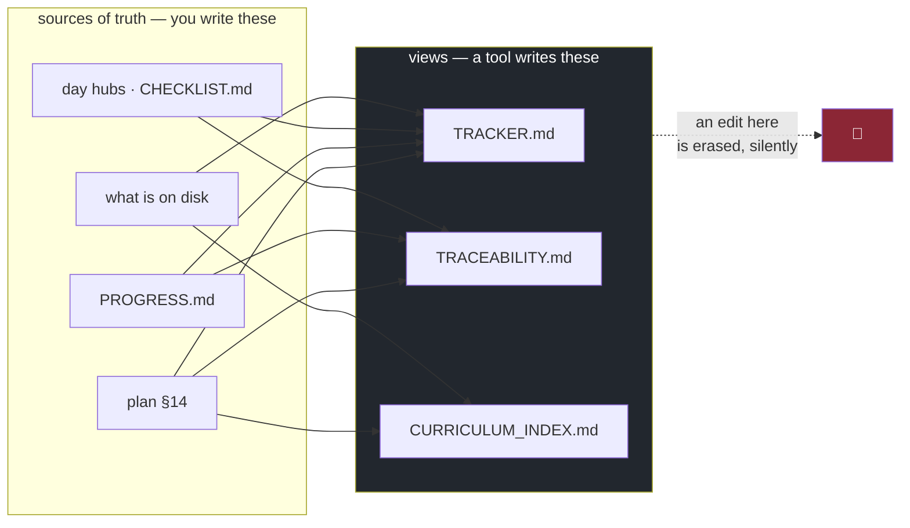

# 2.5 — Generated files, and why you never edit one

## One-line answer

Some files in this repository are **facts you write** and some are **reports worked out from those
facts**. Editing a report is not lying to the tool. It is lying to yourself, because the tool will
quietly restore the truth and nobody will tell you.

---

## The story

🎬 **The scene.** A corner shop keeps a stock book. At the end of every day somebody counts what is on
the shelves and writes the count in the book. On the last page there is a summary line: the total
value of the stock.

😬 **The naive fix.** One evening the summary looks wrong, far too low, and there is a meeting in the
morning. Somebody corrects the summary to what it obviously ought to be, and goes home.

💥 **Why it fails.** The summary was correct. The shelves really were short, because a delivery never
arrived. By writing down the *conclusion* they wanted, they deleted the only evidence that anything
was wrong, and they deleted it in the one place anybody was looking. The delivery problem carries on
for another five weeks and is eventually noticed by a customer.

💡 **The insight.** The summary was not a place where information lived. It was a **view** of
information that lived somewhere else. Editing a view does not change the world. It changes your
ability to see the world. And the more trusted the view is, the more damage the edit does, because
everybody else is reading it instead of counting the shelves.

---

## The idea in plain language

A file in a repository is one of two things, and the difference matters far more than it sounds like
it should.

**A source of truth** is a file holding facts nobody can work out from anywhere else.
`docs/PROGRESS.md` is one, because a human decided that a day was finished. `docs/PACKAGES.md` is one,
because a human observed that version on that date. So are `pyproject.toml` and the day hubs. You
write these. They are the input.

**A derived artifact** is a file worked out from sources of truth by a program. `docs/TRACKER.md`,
`docs/TRACEABILITY.md` and `docs/CURRICULUM_INDEX.md` are all derived artifacts. Nobody writes them. A
tool rewrites them, in full, every time it runs.

The rule is simple and absolute. **You never edit a derived artifact.** Not to fix a typo, not to add
a note, and not to make it say what it will say tomorrow anyway. If the report is wrong, then the
*input* is wrong, and the report is doing its job by telling you so.

### Then why are they committed at all?

That is a fair question, and it has a real answer. If a file is worked out by a program, why store it?

Because a committed derived artifact gives you two things a regenerated-on-demand one cannot.

**It is readable without running anything.** Somebody browsing the repository, on a web interface, on
a phone, six months from now, with no Python environment anywhere, can read `docs/TRACKER.md` and see
where the project is. That is the whole point of the repository being the memory.

**Its diff is a change detector.** When you commit and `docs/TRACEABILITY.md` shows an unexpected
change, something moved that you did not intend to move. A generated file that is *not* committed
loses this completely, because the drift becomes invisible. You meet the industrial version of this on
Day 60, where a program continuously compares the cluster's real state against the repository and
reports the difference. It is the same idea, with a Kubernetes cluster in place of a Markdown table.

The cost of committing them is merge conflicts and noisy diffs, and that is a real cost. The trade is
usually worth it for small text reports and usually not worth it for large binary artifacts, which is
why `.gitignore` excludes `data/` and `mlruns/`, as Addendum 02 §2 explains.

### How you can tell which kind a file is

There are three signals, listed here in order of how much you can rely on them.

| Signal | Example in this repository |
| --- | --- |
| the file says so in its first few lines | *"Do not edit by hand"*, `_Generated 2026-08-24 by scripts/trace.py_` |
| a script writes it | `scripts/trace.py` ends with `.write_text(...)` on three paths |
| its content is a rearrangement of other files | `CURRICULUM_INDEX.md` is §14 of the plan, inverted |

If all three are absent, it is a source of truth and you may edit it. If any one of them is present,
stop.

---

## Why Kriya needs it

Day 56 is *"GitOps: the repository as the desired state"*, and Day 60 is *"drift: the cluster no
longer matches the repository."*

Those two days take this part's idea to its conclusion. In a GitOps system the manifests in the
repository are the source of truth, the running cluster is the derived artifact, and a program
continuously makes reality match the file. Editing the cluster directly with `kubectl edit` is exactly
the same mistake as editing `docs/TRACKER.md`. It changes the view, the reconciler restores the truth,
and your change vanishes with no warning. On Day 60 you do it on purpose and watch it be reverted.

**Everything you will understand about that day, you can understand today, for free, with a Markdown
file.** That is why this part exists on Day 1 rather than on Day 56.

---

## The mechanism

Here are the three derived artifacts in this repository, and the tools that own them.

| File | Written by | Reads |
| --- | --- | --- |
| `docs/TRACKER.md` | `scripts/tracker.py`, via `./o tracker` or `./o done N` | plan §14 · every day folder on disk · each `CHECKLIST.md` |
| `docs/TRACEABILITY.md` | `scripts/trace.py`, via `./o trace` or `./o check` | plan §14 · every hub's `ids:` · `docs/PROGRESS.md` |
| `docs/CURRICULUM_INDEX.md` | `scripts/trace.py`, in the same run | plan §14 · the day folders, for their slugs |

Watch one regenerate. Nothing has been hand-edited here. The input genuinely changed, because
`days/day-001-what-operations-actually-is/` now exists on disk.

```bash
./o tracker
git diff --stat docs/
```

**Line by line:**

- `./o tracker` runs `scripts/tracker.py`, which rewrites `docs/TRACKER.md` from scratch. It is not a
  patch, it is a full rewrite, and that is what makes hand edits disappear rather than conflict.
- `git diff --stat docs/` summarises which tracked files changed and by how much, without printing the
  whole diff. `--stat` is the right first look at any change, because you find out *what* moved before
  you read *how*.

Observed on **2026-08-24**, immediately after this day's `parts/` folder was created:

```text
wrote docs\TRACKER.md - 1/237 written
```

```text
 docs/CURRICULUM_INDEX.md | 4 ++--
 docs/TRACKER.md          | 6 +++---
 2 files changed, 5 insertions(+), 5 deletions(-)
```

And here is the diff itself, which is the interesting part:

```diff
--- a/docs/CURRICULUM_INDEX.md
+++ b/docs/CURRICULUM_INDEX.md
-| `FND-01` | [1](../days/day-001/LESSON.md) | What operations actually is — …
+| `FND-01` | [1](../days/day-001-what-operations-actually-is/LESSON.md) | What operations actually is — …
--- a/docs/TRACKER.md
+++ b/docs/TRACKER.md
-| 1 | The production mental model and the machine | 1–10 | 0/10 | 0 | 0/10 |
+| 1 | The production mental model and the machine | 1–10 | 0/10 | 6 | 0/10 |
```

**Line by line:**

- The first diff shows `CURRICULUM_INDEX.md` picking up the real folder slug. Before the folder
  existed, `scripts/trace.py` had nothing to link to and fell back to the bare `day-001` form. The
  moment the folder appeared, the link became exact. **Nobody edited that line. The input changed and
  the view followed**, which is the whole model in one diff.
- The second shows `TRACKER.md` counting six part documents under Phase 1. That is nobody's edit
  either. The files are on disk, so the count is six. If you wanted that number to read twelve, the
  only way to get it is to write six more parts.
- Notice what did **not** change. The *Written* column still reads `0/10`, because a day only counts
  as written when it has a hub *and* a non-empty `parts/`, and at the moment of that run the hub did
  not exist yet. The report is being precise about a distinction you might not have thought to make,
  which is what a good derived artifact does for you.



---

## When it breaks

It breaks silently, which is the only interesting thing about it. Append a note to a derived artifact
and run the tool that owns it.

```text
$ printf '\n**Hand-written note.**\n' >> docs/TRACKER.md
$ ./o tracker
wrote docs\TRACKER.md - 1/237 written
$ grep -c "Hand-written note" docs/TRACKER.md
0
```

**What it says:** `wrote docs\TRACKER.md - 1/237 written`. That is the tool's ordinary success line,
identical to the one it prints when nothing has been lost.

**What it actually means:** your note was deleted. There was no warning, no prompt, no backup, and no
difference in the output between "regenerated cleanly" and "regenerated over the top of your work".

**Why is there no warning?** Because the tool does not read the file before writing it, so it has no
idea there was anything there. Making it warn would mean parsing its own output format and diffing it,
which is a surprising amount of machinery to protect against a mistake the file's own header already
warns about. It is a reasonable trade, and it is worth recognising as a *trade* rather than as an
oversight.

**The smallest fix:** `git checkout -- docs/TRACKER.md` restores the committed version. Note the trap,
though. If you had committed *after* the hand edit and *before* the regeneration, the restore would
bring your edit back, and the next `./o check` would remove it again. **The only real fix is to put
the fact in the input.**

There is a second and nastier version. Notice the path in that output: `docs\TRACKER.md`, with a
backslash. That is Python's `Path` rendering on Windows, and it is a small reminder that a script
building paths by joining strings together would already be broken here. `scripts/trace.py` and
`scripts/tracker.py` both use `pathlib`, which is the repository's house rule for exactly this reason.

---

## In production

**What a professional does differently.** They make the distinction visible in the filesystem rather
than relying on discipline. Generated files go in a directory whose name says so, such as
`generated/`, `dist/` or `build/`, or they carry a header the linter checks for, or CI regenerates
them and **fails the build if the result differs from what was committed**. That last one is the
strongest form, and it is worth knowing its name: a *"generated code is up to date"* check. You build
the same pattern on Day 14, and it is the reason a lockfile is committed and verified rather than
trusted.

**What degrades at scale.** Merge conflicts. Two people each add a day, both regenerate
`docs/TRACKER.md`, and the diffs overlap on every summary line. The conventional answers are to mark
the file as generated so that review tools collapse it, to regenerate rather than resolve during a
merge, or, past a certain size, to stop committing it at all and accept the loss of the
diff-as-detector property. There is no universally right answer, and knowing that it is a trade rather
than a rule is the professional part.

**The failure that only shows with real traffic.** A derived artifact that is *stale* rather than
wrong. Nobody edited it. The tool simply has not run since the input changed, so the report describes
a world that no longer exists, and it does so with complete confidence. Stale is worse than absent,
and it is the reason the regeneration is wired into `./o check`, which runs on every gate, rather than
left to a habit. On Day 60 the same failure has a name, **drift**, and an alert.

**The review comment a senior engineer leaves.** *"This PR hand-edits a generated file. Even if the
edit is correct today, it is gone the next time the generator runs, and the reviewer after you will
waste an hour working out why the fix keeps disappearing. Change the input."*

**The signal you would alert on.** For a derived artifact, alert on **staleness rather than on
content**: the generated output does not match what a fresh run produces. In CI that is a build
failure rather than a page. In a running system reconciled from a repository it is a genuine alert,
because it means reality and the record disagree and one of them is lying. That is Day 60.

**Blast radius.** The commands in this part rewrite three Markdown files in `docs/`. The worst case is
that you lose an uncommitted hand edit, or that you commit a regenerated file reflecting a state you
did not intend. Anybody who runs `./o check`, `./o trace`, `./o tracker` or `./o done` can trigger it,
which is to say the gate runs it on your behalf constantly. What bounds it is that all three files are
tracked, so `git diff` shows exactly what moved and `git checkout --` reverses it. **This is the first
capability in the curriculum that acts without being explicitly asked**, and it is worth registering
that even a Markdown generator needed a blast-radius sentence.

**Cost:** `0` requests and `0` tokens. In local CPU, `scripts/trace.py` and `scripts/tracker.py` each
read the plan and the day folders and write three files, which is a fraction of a second on the
reference machine (Addendum 02 §3.1) and grows with the number of days written.

**The interview question.** *"How do you handle generated code in a repository, committed or not?"*
There is no single right answer, and the interviewer knows it. They want the trade. Committing it
gives you readability without a toolchain and a diff that catches unintended change. Not committing it
gives you clean merges and no chance of staleness. The strong answer names the deciding factor:
**how often it changes, and whether anybody reads it without running the build.**

---

## Check yourself

```bash
./o trace && git status --short docs/
```

If `docs/` shows modifications you did not make, then the input changed and the view caught up. Read
the diff before committing it. That habit is the entire value of committing generated files.

**Say out loud, without scrolling up:** *`kubectl edit` on a GitOps-managed cluster and a hand edit to
`docs/TRACKER.md` are the same mistake. State the mistake in one sentence that covers both.*
