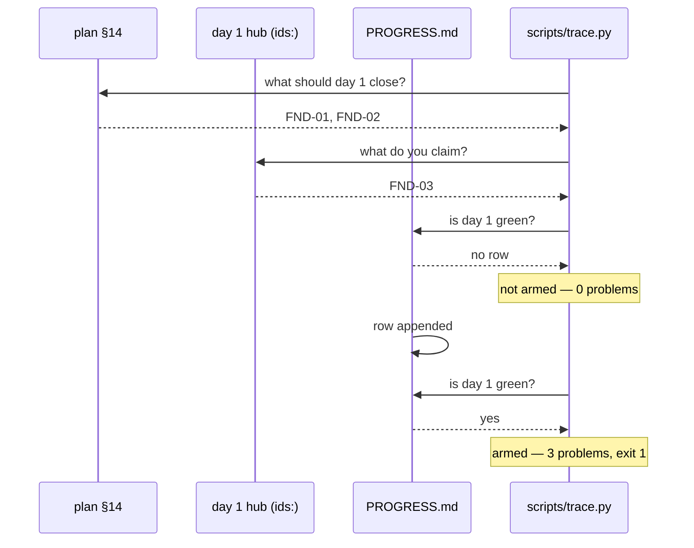

# 2.6 — Breaking the memory on purpose

## One-line answer

Make the traceability check go red by claiming an ID the plan did not assign to today — because a
consistency check you have never seen fail is indistinguishable from one that does not work, and this
one is silent by design until you claim a day is done.

---

## The story

🎬 **The scene.** A building has a fire door held open by a wedge, because it is convenient. Above it,
a sign: *"Fire door — keep shut"*. Everyone walks past it every day for two years.

😬 **The naive fix.** Assume that somebody, at some point, checked. There is a sign, so there is a
system. Signs come from systems.

💥 **Why it fails.** There is no system. There was an inspection once, before the wedge, and nothing
since. The sign is a *statement about intent* and everyone has been reading it as a *statement about
reality*. In an actual fire the door is open, and it has been open for two years, and nobody involved
was careless — they simply never distinguished "there is a rule" from "the rule is enforced".

💡 **The insight.** The only way to know whether a rule is enforced is to **break it and see what
happens**. Not think about it, not read the code, not ask. Break it. The result is either a refusal —
in which case you now know the enforcement is real and exactly what it says — or silence, in which
case you have found a hole while it is still cheap.

---

## The idea in plain language

This day is about the repository being the memory. The repository makes a specific, checkable claim:
**each day closes exactly the concept IDs the plan assigned to it — no more, no fewer.** The claim is
enforced by `scripts/trace.py`, which cross-references three separate files and refuses if they
disagree.

You are going to break that claim on purpose, and there is a subtlety that makes it worth doing
rather than reading, because **the check is deliberately silent until a day is declared green**.

Look at the logic. `scripts/trace.py` reports a problem only when a day is in `docs/PROGRESS.md`
*and* its hub disagrees with the plan. A day that is written but not yet finished is allowed to
disagree — it is a work in progress, and nagging about it would be noise. That design choice is
correct and it has a consequence you must feel rather than be told: **for the whole time you are
writing a day, this check cannot help you.** It only becomes an enforcer at the moment you claim to
be done.

That shape — a check that is inert during the work and strict at the boundary — is extremely common
in production. A deploy gate, an admission controller, a merge check. Understanding *when* a check is
armed is as important as knowing what it checks, and the way you find out is by breaking it at both
moments.

### What you are going to do

Four steps, all reversible:

1. Break the hub's `ids:` while Day 1 is **not** in `docs/PROGRESS.md`. Run the check. Observe that
   it passes — the check is not armed yet.
2. Append Day 1's row to `docs/PROGRESS.md` so the day is green. Run the check again with the *same*
   broken hub. Observe that it now refuses, and read exactly what it says.
3. Fix the hub. Run again. Watch it go green.
4. Record both observations in `docs/INCIDENTS.md`, symptom first.

Step 1 is the one people skip, and it is the one that teaches the lesson.

---

## Why Kriya needs it

Principle 11: *every gate must be able to go red.* Every day in this plan ships at least one check
you make fail on purpose before making it pass, and this is Day 1's.

There is a specific later payoff. Day 39 deploys `pulse` to a Kubernetes cluster, and from Day 56 a
GitOps reconciler continuously enforces that the cluster matches the repository. Reconcilers have
exactly the property you are about to observe here: they are silent while you work and absolute at
the boundary, and the first time one silently reverts your change you will lose an evening — unless
you have already met the shape of it on a Markdown file where nothing is at stake.

The habit also matters more than the specific check. `docs/INCIDENTS.md` currently has ten rows, and
every one of them came from somebody deliberately breaking something on Day 0. That file is the
single most valuable thing in this repository (its own header says so), and it only grows if breaking
things on purpose is normal.

---

## The mechanism

**Before you start**, make sure the repository is clean, so that anything that changes is something
you changed:

```bash
git status --short
```

**Line by line:** `--short` prints the compact two-column form — first column staged, second column
working tree. You want no output at all. If there is output, commit or stash it first; debugging a
deliberate breakage while an accidental one is in flight is how a drill becomes an incident.

### Step 1 — break the claim while the day is not green

Open `days/day-001-what-operations-actually-is/LESSON.md` and change the frontmatter line

```text
ids: [FND-01, FND-02]
```

to a wrong claim — an ID that belongs to a different day:

```text
ids: [FND-03]
```

Then run the check:

```bash
./o trace
```

**Line by line:** `./o trace` runs `scripts/trace.py`, which reads the plan's §14 for what day 1
*should* close, this hub's frontmatter for what it *claims*, and `docs/PROGRESS.md` for whether day 1
is *green*.

Observed on **2026-08-24**:

```text
traceability: 0/279 closed, 0 problem(s); index: 279 IDs
```

**Zero problems.** The hub is now claiming an ID the plan assigned to Day 2, and the check said
nothing, because Day 1 has no row in `docs/PROGRESS.md` and an unfinished day is allowed to be wrong.

**Write that down before you go on.** That silence is the first symptom, and it is the surprising one.

### Step 2 — declare the day green, with the hub still broken

```bash
printf '| 1 | 2026-08-24 | FND-01, FND-02 | 13 | pending | ✅ |\n' >> docs/PROGRESS.md
./o trace
```

**Line by line:**

- The `printf ... >>` appends Day 1's row. `>>` appends; `>` would destroy the ledger
  ([2.2](2.2-the-four-ledgers.md)). The commit column reads `pending` because the commit does not
  exist yet — you fill it in afterwards, exactly as Day 0's row was.
- The *IDs closed* column says `FND-01, FND-02` — the truth — while the hub says `FND-03`. **The two
  sources of truth now disagree**, which is precisely the state the check exists to catch.
- `./o trace` re-runs the same check. Nothing about the check changed. What changed is that the day
  is now claimed as done, so the check is armed.

Now it refuses:

```text
traceability: 0/279 closed, 3 problem(s); index: 279 IDs
```

and `docs/TRACEABILITY.md` gains a section naming each one:

```text
## 🐛 Problems
- FND-01: day 1 is green but its hub does not claim it
- FND-02: day 1 is green but its hub does not claim it
- day 1 claims IDs not assigned by the plan: ['FND-03']
```

Exit status `1`. Run the whole gate and it stops:

```bash
./o check; echo "exit=$?"
```

**Line by line:** the `;` runs `echo` regardless of the outcome, and `$?` is the exit status of the
previous command. **Getting into the habit of printing the exit status is worth more than it looks**
— a great deal of tooling communicates only through it, and a script that ignores it (Day 0,
part [4.2](../../../day-000-toolchain-skeleton-driver/parts/04-the-driver/4.2-set-euo-pipefail.md))
will happily continue past a failure.

```text
exit=1
```

**Read the three problems as three different statements.** Two of them say an assigned ID is missing
from the hub; the third says the hub claims an ID that belongs elsewhere. The check is not testing
one property, it is testing set equality in both directions, and it tells you which direction failed.
A check that said only "day 1 is wrong" would have made you go and work out which.

### Step 3 — fix it and watch it go green

Restore the hub's `ids:` line to `[FND-01, FND-02]` and run again:

```bash
./o trace && ./o check; echo "exit=$?"
```

**Line by line:** `&&` runs the second command only if the first succeeded. Chaining them this way
means you cannot accidentally read a stale green from `./o check` after `./o trace` has already
failed.

```text
traceability: 2/279 closed, 0 problem(s); index: 279 IDs
exit=0
```

**Two closed, not zero.** That is the other half of the lesson: the same mechanism that refused a
false claim is what records a true one. FND-01 and FND-02 are now closed, permanently and provably,
because three independent files agree.



---

## When it breaks

The drill itself has two ways to go wrong, and both are worth meeting.

**You forget to restore the hub.** The gate stays red, and `./o done 1` refuses to commit. The output
is the one above and the fix is to restore the `ids:` line. This is the good failure — the system
caught you.

**You restore the hub but leave the `pending` commit hash in `docs/PROGRESS.md`.** Nothing catches
this. `scripts/trace.py` reads the *day number* out of the progress row and never looks at the commit
column, so a row saying `pending` forever is perfectly acceptable to every check in this repository:

```text
traceability: 2/279 closed, 0 problem(s); index: 279 IDs
```

**What it says:** all clear.
**What it actually means:** the ledger contains a row that cannot be used for its main purpose. On
Day 107 you will need `PROGRESS.md` to tell you which commit produced a result, and `pending` is not
an answer.

**The smallest fix:** commit, then replace `pending` with the real short hash in a follow-up commit —
which is exactly what commit `2c36b16` did for Day 0, and why that commit exists at all.

**The finding worth recording:** this is a genuine hole in the gate, discovered by drill rather than
by being told. It belongs in `docs/INCIDENTS.md` with an honest last column — *"nothing yet; the check
validates day numbers and IDs but never the commit column"*. Recording a hole you have chosen not to
close is a decision; not recording it is a hole.

---

## In production

**What a professional does differently.** They rehearse the failure of the *control*, not only of the
system. Anyone can test that a service goes down when you stop it. The valuable and rarely-done drill
is: turn off the alert and confirm you notice; corrupt the backup and confirm the restore fails
loudly; break the deploy gate and confirm the bad build is refused. **Controls decay silently**,
because their normal output is nothing happening, and nothing happening looks the same whether they
work or not.

**What degrades at scale.** The number of armed-at-the-boundary checks. This repository has one gate
with five steps. A real delivery pipeline has dozens — lint, tests, coverage, licence scan, secret
scan, image scan, policy admission, canary analysis — and each one is silent until its boundary. When
a deploy is refused, the first question is *which* gate refused and why, and if the answer takes ten
minutes to find, the gates start being bypassed. Clear refusal messages naming the failing rule are a
reliability feature, which is why `scripts/trace.py` prints three specific problems rather than one
generic verdict.

**The failure that only shows with real traffic.** The check that is armed but has been passing for
the wrong reason. Imagine `scripts/trace.py` were subtly broken so that `plan_map()` returned an empty
dictionary: every day would have zero expected IDs, nothing could ever disagree, and the tool would
report `0 problem(s)` forever, cheerfully. **A check that cannot fail and a check that is passing look
identical from the outside** — which is Principle 11 in one sentence, and which is why the drill you
just did is the only real evidence the check works.

**The review comment a senior engineer leaves.** *"You added a validation rule. Show me the test where
it rejects something — a test that only proves it accepts valid input tells me nothing about whether
the rule is wired up at all."*

**The signal you would alert on.** For this gate, in CI from Day 13: the gate's own exit status, and
separately the **time since it last ran successfully**. The second is the one people forget, and it
is the fire-door signal — a gate that stopped running is worse than a gate that failed, because a
failure is visible and an absence is not.

**Blast radius.** This drill edits two tracked files — one day hub and `docs/PROGRESS.md` — and
regenerates two more. Worst case: you leave the hub broken and forget, or `>` instead of `>>`
truncates the progress ledger. Who can trigger it: you, deliberately. What bounds it: everything
touched is tracked and committed, so `git checkout -- docs/PROGRESS.md` and `git diff` recover
completely. **Do the drill before you commit the day, not after**, so the whole thing is one
`git checkout` away.

**Cost:** `0` requests, `0` tokens, `0` MB resident. Four local runs of a Python script that reads a
handful of Markdown files.

**The interview question.** *"How do you know your monitoring works?"* The answer that separates
people who have operated systems from people who have configured them: *"Because we've turned things
off and watched it fire. Anything we haven't tested that way, I'd describe as unverified rather than
working."*

---

## Check yourself

```bash
./o trace && grep -A5 "Problems" docs/TRACEABILITY.md || echo "no problems section — the file is clean"
```

Run it while the hub is broken and again after you fix it. Two different outputs from one command is
the whole point of the drill.

**Say out loud, without scrolling up:** *why did the check say nothing in step 1, and what class of
production mechanism behaves exactly the same way?*
