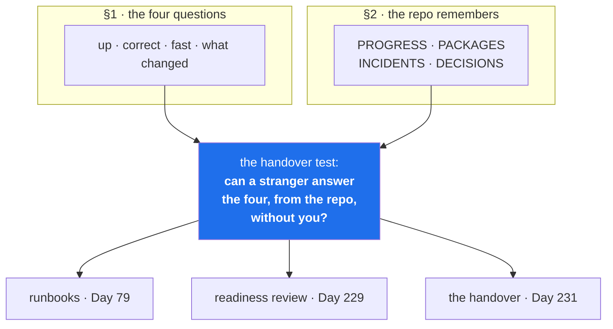

# 3.1 — The handover test

## One-line answer

Put the two halves of today together with one question: **could a competent stranger operate this
system tomorrow using only the repository?** — because the four operator questions are only worth
asking if the answers are written where someone else can find them.

---

## The story

🎬 **The scene.** Someone is leaving a job. On their last afternoon they sit with the person taking
over and talk for three hours. It is a good handover: patient, thorough, honest about the ugly parts.
Both of them feel it went well.

😬 **The naive fix.** That is the handover done. There is a document too — a page listing the systems
and who to contact.

💥 **Why it fails.** Six weeks later something breaks at night. The new person remembers there was
*something* about this service — a caveat, a reason it is configured oddly — and cannot remember what.
They have notes from the conversation, but their notes record the things that seemed important at the
time, and at the time nothing was broken, so the interesting parts were the parts about the future.
They send a message to the person who left. The reply comes at eleven the next morning.

💡 **The insight.** A conversation transfers **understanding**, and understanding is exactly what you
do not have at 3am — you have adrenaline and a search box. What survives a handover is not what was
explained; it is what was **written where the question gets asked from**. Three hours of talking and
one accurate comment in the right file are not comparable, and the comment wins.

---

## The idea in plain language

Today has two halves. Section 1 said operations is answering four questions about a running system.
Section 2 said the repository, not the conversation, is where a system's memory lives. This part is
the join: **the four answers have to be reachable from the repository by someone who has never met
you.**

That is the *handover test*, and you can run it on any system, including this one, right now. It is
not a metaphor — it is a checklist with an uncomfortable scoring rule:

| Question | Where does a stranger find the answer? | Score |
| --- | --- | --- |
| What is this system for? | a file, in the first place they would look | 🟢 / 🔴 |
| Is it up, and how would I check? | one command, written down | 🟢 / 🔴 |
| Is it correct, and how would I check? | one command, written down | 🟢 / 🔴 |
| Is it fast enough, and compared to what? | a number, written down | 🟢 / 🔴 |
| What changed most recently? | a command against the repository | 🟢 / 🔴 |
| Why is this odd thing odd? | a comment or an ADR at the odd thing | 🟢 / 🔴 |
| What has broken before? | a ledger, readable in order | 🟢 / 🔴 |

**Scoring rule: "I would explain it to them" is red.** So is "it's in the code". So is "they could
work it out". The test is specifically about what survives your absence, and you are not allowed to
be part of the answer.

### Running it on this repository, honestly

Day 1, and there is no service yet — but there is a repository, and it can be scored. The honest
result:

| Question | Answer today | Score |
| --- | --- | --- |
| What is this for? | `README.md`, then `docs/00_MASTER_PLAN.md` §1 | 🟢 |
| Is it up? | nothing is running; the analogue is `./o check` | 🟢 |
| Is it correct? | `./o check` — five checks, one command | 🟢 |
| Is it fast enough? | **no target exists** | 🔴 |
| What changed? | `git log --oneline`, and one commit per day | 🟢 |
| Why is this odd? | `pyproject.toml`'s `link-mode` comment; four ADRs | 🟢 |
| What has broken before? | `docs/INCIDENTS.md`, ten rows | 🟢 |

One red, and it is the right one to be red: **"fast enough" cannot be answered before there is
something to measure and someone to be slow for.** It goes green on Day 73, when `pulse` gets an SLO.
Writing the red down rather than fudging it is the practice — an honest gap is a work item, and a
fudged one is a surprise for somebody else.

### Why this is the synthesis rather than a summary

Because each half is nearly useless alone, and it is worth being precise about why.

**The four questions without the repository** produce an operator who is a single point of failure.
They can answer everything and the organisation cannot answer anything, so every incident routes
through one person, holidays are risky, and their departure is an outage waiting for a trigger.

**The repository without the four questions** produces beautiful documentation of the wrong things:
an architecture diagram, a glossary, an onboarding guide — and no answer to "is it up?". This failure
is extremely common and it looks like diligence, which is what makes it durable.

The join is the deliverable: **a repository organised around the questions an operator actually
asks.** That is what a runbook is (Day 79), what a readiness review checks (Day 229), and what Day 231
grades.

---

## Why Kriya needs it

Day 231 is *"The handover — operating a system somebody else built."* Day 235 is *"the audit: prove
every claim in the readiness review from the repository alone."*

Those are the two exams for this part, and they are 230 days away, which is exactly the problem. You
cannot cram for them. The repository either accumulates the answers day by day or it does not, and by
Day 231 the gap is 230 days wide and not closable in an evening.

The nearer payoff is Day 79, the first runbook. A runbook is a document for one alert, written for a
tired stranger, structured as: what fired, what it means, how to confirm, how to mitigate, how to
escalate. **That structure is the handover test applied to a single failure**, and you will write
about thirty of them.

---

## The mechanism

The mechanism is a scoring run you do by hand — but the four repository-shaped answers can be checked
with commands, and doing so is the difference between believing the repository is good and knowing it.

```bash
# 1 — what is this for?  A stranger's first two files must exist and say so.
head -5 README.md

# 2 — is it correct, in one command?
./o check >/dev/null 2>&1; echo "one-command correctness check: exit=$?"

# 3 — what changed?  One commit per day, with a message that explains itself.
git log --oneline -5

# 4 — what has broken before?  The ledger, oldest first.
awk -F'|' 'NF>5 && $2 ~ /^ *[0-9]+ *$/ {printf "%s %s\n", $2, substr($6,1,60)}' docs/INCIDENTS.md
```

**Line by line:**

- `head -5 README.md` — the first five lines. A stranger reads the top of the first file and either
  learns what this is or does not. If your README's first five lines are a badge table, that question
  is red.
- `./o check >/dev/null 2>&1` discards both output streams — `>/dev/null` for standard output,
  `2>&1` to send standard error to the same place — so that only the **exit status** remains. That is
  deliberate: the handover question is *"is there a single command that answers correctness?"*, and
  the answer is the exit code, not the prose. A stranger's script can read `$?`; it cannot read your
  terminal.
- `git log --oneline -5` — the last five changes. Read the *subjects* as a stranger would: do they say
  what changed, or do they say `update`?
- The `awk` line prints the incident number and the first sixty characters of the *first symptom*
  column. `NF>5` skips the prose lines above the table; `$2 ~ /^ *[0-9]+ *$/` keeps only rows whose
  first cell is a number, which drops the header and separator rows; `substr($6,1,60)` truncates so
  the list is scannable. **This is the artifact a stranger reads to inherit your diagnostic
  instincts**, and it is worth checking that it is readable in that form rather than only as a wide
  table.

Observed on **2026-08-24**:

```text
# ⚙️ Project Kriya

**Production operations for AI systems — MLOps, LLMOps, AIOps, AgenticOps and MCPOps — built one
day at a time on one service you actually operate.**
```

```text
one-command correctness check: exit=0
```

```text
2c36b16 day 000: record the day's commit hash in PROGRESS.md and the hub
5a8edee day 000: toolchain, skeleton and the ./o driver — closes no IDs
8f64745 init
```

```text
 1   **none — the command printed nothing at all and succeeded
 2   ``F401 [*] `os` imported but unused / --> .probe\bad.py:1:8
 3   `All checks passed!` from the linter, then `unformatted: Fi
 4   `F [100%]` then `E       assert 1 == 2` and `FAILED tests/t
 5   `FAIL day   0  1 problems` / `- CHECKLIST.md: a **Time:** l
 6   `FAIL unticked boxes remain in days/day-000-toolchain-skele
 7   **nothing. `OK all green`, exit=0**
 8   **nothing. exit=0**
 9   **nothing. exit=0, all five checks green**
 10   `C:\Users\nisha_gnzw\AppData\Local\Programs\Python\Python31
```

**Read the last block as the stranger.** Three of the ten first symptoms are **"nothing"** — the gate
was green and something was wrong anyway. A person inheriting this repository learns, in ten lines and
without meeting you, that its checks have known blind spots and roughly where. That is what a memory
is for.



---

## When it breaks

The handover test fails quietly, and the most common way is a repository that answers every question
except the one being asked. Here is the shape, as a stranger experiences it:

```text
$ ls docs/
ARCHITECTURE.md   GLOSSARY.md   ONBOARDING.md   api-reference/   design/

$ grep -ril "restart\|rollback\|on-call\|runbook" docs/
docs/ONBOARDING.md

$ grep -i -A2 "rollback" docs/ONBOARDING.md
Rollback: see the deployment team's confluence page.
```

**What it says:** documentation exists, and it mentions rollback.
**What it actually means:** the answer to *"how do I undo this?"* is a pointer to a system the
stranger may not have access to, written by a team that may not exist any more. The repository has
what someone thought a new joiner would need in week one, and none of what an operator needs at 3am.

**The smallest fix** is not writing more documentation. It is writing **one runbook for the one thing
most likely to go wrong**, in the repository, next to the code, with the actual commands in it. Then
the next one. Ten runbooks that each answer one question at 3am are worth more than a hundred pages of
architecture, and they are cheaper to write because each is written the day after you needed it.

There is a second failure mode worth naming, because it looks like success: **the repository that is
complete and wrong.** Every question is answered, every command is documented, and three of them stop
working after a refactor nobody propagated. Documentation rots faster than code because nothing
compiles it. The defence is to make the documented commands *executable* — a runbook whose commands
are run by a test, a README whose example is a script CI runs. You start this on Day 14 and it is a
recurring theme to the end.

---

## In production

**What a professional does differently.** They run the handover test on themselves, deliberately, at
a normal time. The cheapest version is a **bus-factor drill**: someone other than the owner is asked
to perform a routine operation — deploy, roll back, check an SLO — using only the repository, while
the owner is present and silent. The silence is the mechanism. Every question the stranger has to ask
out loud is a documentation gap, recorded on the spot. It takes one afternoon and finds more than any
audit.

**What degrades at scale.** The number of "obvious" facts. On a small system the undocumented context
fits in one head and the handover works by conversation. Every new component adds context, and the
growth is in the *joins* rather than the components
([1.5](../01-what-ops-is/1.5-the-five-kinds-of-ops-are-one-job.md)) — so undocumented context grows
faster than the system does. This is why the plan makes the ledger rows part of the day's checklist
rather than a good intention: recording at the moment of learning is the only rate that keeps up.

**The failure that only shows with real traffic.** Knowledge concentrated in the person who is
unavailable *because of the incident*. The person who understands the payment path is the person on
holiday, or the person already handling the other half of the outage, or the person who left in March.
Nobody discovers a bus factor of one during normal operation — by definition, that is when it is
working — which is why the drill has to be deliberate.

**The review comment a senior engineer leaves.** *"This is a good change, but the only person who
could debug it at 3am is you. Add the failure mode and the check to the runbook, or add a comment
saying what this constant is protecting against — otherwise we've traded a bug for a bus factor."*

**The signal you would alert on.** None directly — you cannot page on documentation. There are two
useful *proxies* that appear later and are worth knowing: **runbook coverage** (the fraction of alerts
that have one, which is a Phase 8 gate criterion on Day 79) and **mean time to diagnose** as distinct
from mean time to recover. If diagnosis is the dominant term in your incident timelines, the problem
is almost never the tooling — it is that the knowledge is not written down.

**Blast radius.** The four commands here are read-only inspections, with one exception already
familiar: `./o check` regenerates three files in `docs/`
([2.5](../02-the-repo-remembers/2.5-generated-files-you-never-edit.md)). Worst case is an unexpected
diff in those three files. Who can trigger it: anyone running the gate. What bounds it: git.

**Cost:** `0` requests, `0` tokens, `0` MB resident.

**The interview question.** *"If you were hit by a bus tomorrow, what would break?"* Interviewers ask
it to find out whether you have thought about your own irreplaceability as a **defect**. The weak
answer is modest ("nothing, the team's great"). The strong answer is specific: *"Two things — the
retraining pipeline's manual approval step is only documented in my head, and I'm the only one who's
actually run the restore. I'd fix the second one first, because it's the one that costs data."*

---

## Check yourself

```bash
./o check >/dev/null 2>&1; echo "correctness: exit=$?" && git log --oneline -3 && tail -1 docs/PROGRESS.md
```

Three of the seven handover questions, answered from the repository, by commands a stranger could run
on their first morning.

**Say out loud, without scrolling up:** *score this repository's seven handover questions. Name the one
that is red today, say which day turns it green, and say why fudging it would be worse than leaving it
red.*
