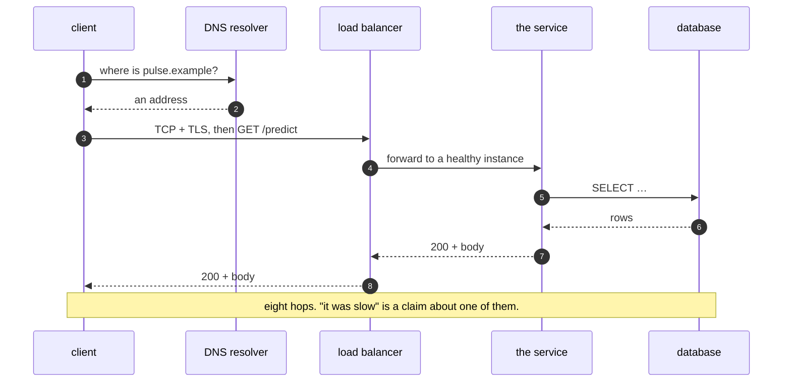

# 1.1 — A request is a path, not a function call

## One-line answer

In your editor a request looks like calling a function; in production it is a **journey through
several machines**, and every hop on that journey can be slow, can fail, and can fail in a way the
next hop cannot distinguish from success.

---

## The story

🎬 **The scene.** You post a letter. From where you stand, the action is one thing: the letter goes
in the box, and a few days later your friend has it. One action, one result.

😬 **The naive fix.** The letter does not arrive. You conclude that the postal service is broken and
complain about the postal service.

💥 **Why it fails.** There is no single postal service to be broken. Between the box and your friend's
hand there were about nine separate handovers: collection, a sorting office, a lorry, a regional
depot, a plane, another depot, a delivery office, a walker, a letterbox. Any one of them could have
dropped it, and each has a different reason and a different fix. "The postal service is broken" is not
wrong, exactly — it is just not *actionable*, because it does not name a hop.

💡 **The insight.** The single action was an illusion created by the interface. **Posting is one
gesture; delivery is a path**, and the moment something goes wrong the only useful mental model is the
path. The people who work in that system do not think "post a letter". They think "collection →
sort → trunk → sort → delivery", and when something is late they ask *which leg*.

---

## The idea in plain language

When you write code, calling something looks the same whether it is next to you or on another
continent:

- `total = add(a, b)` — a function in your own program.
- `user = db.get_user(id)` — a database on another machine.
- `reply = model.generate(prompt)` — a model in someone else's data centre.

All three are one line. Only the first one is one thing.

The difference has a name — **the network** — and the useful way to hold it is not "the network is
slow" but a short list of properties that a function call has and a network call does not:

**A function call cannot half-happen.** A network call can: the request arrives, the work is done,
and the response is lost on the way back. From your side that is indistinguishable from the work never
happening, and if you retry, the work happens twice. This one property is responsible for an enormous
fraction of production bugs, and it is why *idempotency* — an operation you can safely repeat — gets a
whole day (Day 92).

**A function call either returns or raises.** A network call has a third outcome: **nothing**. It
hangs. There is no exception and no value, just an absence that lasts until something gives up. If
nothing is configured to give up, it lasts forever. That is what a **timeout** is for, and it is Day 7.

**A function call takes as long as it takes.** A network call's duration depends on things you do not
control: the other machine's load, the state of a queue, whether a certificate needed renewing,
whether someone else is doing something expensive on the same hardware.

**A function call cannot be refused for policy reasons.** A network call can be rate-limited,
authenticated, blocked by a firewall, or told to come back later. All of those look like failures and
none of them are bugs.

### So what is "the request path"?

**The request path is the ordered list of hops a single user request passes through, and back.** For
a real system it is usually longer than people expect, and drawing it is the cheapest engineering
activity there is.

A minimal but honest path for a service like `pulse` once it is deployed:

| Hop | What can go wrong here | Met on |
| --- | --- | --- |
| the client's DNS lookup | wrong or stale answer, slow resolver | Day 7 |
| TCP connection | refused, filtered, slow handshake | Day 7 |
| TLS handshake | expired certificate, wrong hostname | Day 8 |
| ingress / load balancer | no healthy backend, its own timeout | Day 37 |
| the service process | crashed, out of memory, saturated | Days 4–6 |
| a database call | connection pool exhausted, slow query | Day 47 |
| a model inference | cold start, slow on a busy CPU | Day 110 |
| an external provider | rate-limited, degraded, changed | Day 125 |
| the response, all the way back | any of the above, in reverse | — |

**Every row is a place where the four operator questions have a different answer.** That is the whole
reason to draw the path: it converts "the service is slow" from an opinion into a question with nine
candidate answers, and the job becomes elimination rather than guesswork.

---

## Why Kriya needs it

Day 69 is *"Distributed tracing — following one request through every hop it touched."*

A **trace** is literally this part, made into data: each hop records when it started and finished and
what it called, and the pieces are stitched together by a shared identifier so you can look at one
request and see the whole path with a duration on each leg. It is the single most useful observability
tool for the question *"why was that request slow?"*, which is the Phase 7 gate.

You cannot understand a trace if you do not already think in paths, and you certainly cannot
*instrument* one. Day 69 will feel obvious or impossible depending entirely on whether today landed.

Nearer term: [Day 3](../../../day-003-pulse-v0/LESSON.md) builds the first hop of `pulse`'s path — one
process, one port, one route — and part 3.1 of that day asks you to name every component between your
browser and the code, on your own machine, with nothing deployed anywhere.

---

## The mechanism

You have a request path available right now, on your own machine, with no service running: the
loopback network. Look at a real one hop by hop.

```bash
python -m http.server 8765 --bind 127.0.0.1 &
curl -sv http://127.0.0.1:8765/ -o /dev/null
kill %1
```

**Line by line:**

- `python -m http.server 8765 --bind 127.0.0.1` starts the standard library's throwaway web server.
  `-m` runs a module as a script, so nothing is installed. `--bind 127.0.0.1` restricts it to the
  loopback address — **the machine talking to itself** — so nothing on your network can reach it.
  That matters: a server bound to `0.0.0.0` is reachable from everywhere the machine is, which is
  Day 7's subject and a genuine way to expose something by accident.
- `&` puts it in the background so the shell continues. **There is a race here and it is worth
  naming rather than papering over:** the shell returns immediately and the server may not be
  listening yet. On loopback it usually is, and if you get a refusal, run the `curl` again. The
  general problem — *is it ready yet?* — is what a readiness probe answers properly on Day 41.
- `curl -sv` makes one HTTP request and prints the conversation. `-v` is verbose: it shows the
  connection, the request headers and the response headers, which is the only reason to use `curl`
  here rather than a browser. `-s` suppresses the progress meter, which otherwise interleaves with
  the verbose output and makes it unreadable. `-o /dev/null` throws the body away so the protocol
  detail is not buried under HTML.
- `kill %1` stops the background job. **Always clean up a server you started in a lesson** — an
  orphaned process holding port 8765 is tomorrow's confusing error, and you meet exactly that error on
  Day 3.

Observed on **2026-08-24**:

```text
*   Trying 127.0.0.1:8765...
* Established connection to 127.0.0.1 (127.0.0.1 port 8765) from 127.0.0.1 port 49406
* using HTTP/1.x
> GET / HTTP/1.1
> Host: 127.0.0.1:8765
> User-Agent: curl/8.19.0
> Accept: */*
>
* Request completely sent off
* HTTP 1.0, assume close after body
< HTTP/1.0 200 OK
< Server: SimpleHTTP/0.6 Python/3.12.12
< Date: Mon, 24 Aug 2026 08:40:31 GMT
< Content-type: text/html; charset=utf-8
< Content-Length: 351
<
{ [351 bytes data]
* shutting down connection #0
```

**Read the punctuation, because it is the whole lesson.** `curl` marks each line by direction:

- `*` — something `curl` itself did. `Trying 127.0.0.1:8765` then `Connected` are **two separate
  events**, and on a real network they are separated by a DNS lookup and a TCP handshake, either of
  which can be the slow part.
- `>` — bytes sent to the server.
- `<` — bytes received back.

Four distinct phases in a request that your code would have written as one line. On loopback they all
happen at once and none can fail interestingly, which is exactly why this is worth doing on loopback
first: you see the *structure* without the noise.

**Two details in that output are worth not skipping.** The request went out as `HTTP/1.1` and the
reply came back as `HTTP/1.0` — the two ends of one conversation are not obliged to speak the same
version — and `curl`'s next line, `assume close after body`, is it changing its own behaviour because
of what the server said. And `Established connection … from 127.0.0.1 port 49406` names the *client's*
port, chosen by the operating system. Every connection consumes one of those, they are a finite
resource, and exhausting them is a real production failure with a very confusing symptom (Day 7).



---

## When it breaks

The characteristic failure is a symptom that names the *whole path* and therefore names nothing.
Here is one, produced by asking for a port where nothing is listening:

```text
$ curl -sv http://127.0.0.1:8766/
*   Trying 127.0.0.1:8766...
* connect to 127.0.0.1 port 8766 from 0.0.0.0 port 49400 failed: Connection refused
* Failed to connect to 127.0.0.1 port 8766 after 2039 ms: Could not connect to server
* closing connection #0
curl: (7) Failed to connect to 127.0.0.1 port 8766 after 2039 ms: Could not connect to server
```

**What it says:** connection refused.
**What it actually means:** something answered, and what it said was *no*. On loopback the operating
system itself sends that refusal, because nothing has claimed the port. **A refusal is an honest
failure and it is the good case** — you learn definitively that nothing is listening, rather than
being left to guess.

**But read the number: 2039 ms.** A refusal is supposed to be immediate, and on Linux it is. On this
Windows machine `curl` spent two seconds on it, because it worked through more than one candidate
address for `127.0.0.1` before giving up. Register that as a small, real fact about *your* machine:
**the same failure costs different amounts of time on different platforms**, so a timeout tuned on a
Linux CI runner may behave differently on a developer laptop. Measure on the machine you care about,
which is the whole reason Addendum 02 §3.1 records this one's numbers.

Now the bad case, which is the same request against a host that does not answer at all:

```text
$ curl -sv --connect-timeout 2 http://10.255.255.1:8766/
*   Trying 10.255.255.1:8766...
* Connection timed out after 2006 milliseconds
* closing connection #0
```

`10.255.255.1` is an address on a private range with nothing on it, and `--connect-timeout 2` is what
stops the command hanging. **Without that flag there is no bound at all** — which is the point of the
example as much as the message is.

**What it says:** a timeout.
**What it actually means:** *unknown*. Nobody said no. It is indistinguishable between: the host does
not exist, a firewall silently dropped the packets, the machine is up but the process is dead, the
process is alive but too busy to accept, or everything is fine and merely slower than two seconds.
Five different causes, one symptom, and the difference between them is *which hop* — which is the
argument for drawing the path.

**The smallest fix** is not a fix at all; it is a next step. Walk the path outward: can you resolve
the name, can you open a socket, can you complete a handshake, does the process answer. Day 7 gives
you one command per hop.

There is a third failure worth meeting now because it is the one people mishandle: **the request that
half-happened.**

```text
curl: (52) Empty reply from server
```

The connection succeeded and the server closed it without sending a response. It may have done the
work. It may have crashed halfway through doing the work. **Retrying is not obviously safe**, and if
the request created something, retrying may create it twice. This is the property from the top of this
part, met in the wild.

---

## In production

**What a professional writes instead of the teaching version.** They never call a remote thing without
three decisions written down next to the call: **a timeout** (how long before I give up), **a retry
policy** (how many times, with what delay, and is this operation safe to repeat), and **a fallback**
(what the caller gets when all of that fails). A call with none of the three is not a call, it is an
unbounded wait with an optimistic comment. Day 7 builds the timeout, Day 8 the status-code handling,
Day 130 the retry ladder for a rate-limited provider.

**What degrades at scale.** The number of hops, multiplicatively. If each of eight hops is available
99.9% of the time and they are all required, the path is available 99.2% of the time — eight times
worse than any single component, with nobody at fault. This arithmetic is why "microservices" is an
operational decision rather than a code-structure one, and why the plan spends Phase 5 on making
individual hops survivable rather than on adding more of them.

**The failure that only shows with real traffic.** **Tail latency amplification.** If a request fans
out to ten backends and waits for all ten, its latency is the *slowest* of the ten, not the average.
A backend that is slow one time in a hundred makes the fan-out slow roughly one time in ten. Nothing
is broken, no error rate moves, and the p99 you promised is gone. Day 63 (percentiles) and Day 110
(serving latency) are where this becomes measurable rather than theoretical.

**The review comment a senior engineer leaves.** *"This calls the provider inside the request path with
no timeout. When they have a bad afternoon, every one of our threads ends up parked on their socket
and we go down with them — and our status page will say the outage was ours. Bound it and decide what
`/assist` returns when it trips."*

**The signal you would alert on.** Per hop, not per system: **error rate and latency for each
outbound dependency, labelled by which one**. The single most valuable dashboard panel in any service
is "time spent in each downstream call", because it turns "we are slow" into "we are slow *there*" in
one glance. The blunt mistake is a single latency metric for the whole service, which tells you
something is wrong and nothing about where. That is trap #2 in the plan's §5.1 — *the metric that is
not a metric* — and you build the good version on Day 63.

**Blast radius.** This part starts a real network listener. Worst case: `--bind 127.0.0.1` is omitted
and the server is reachable by anything on your network, serving the contents of whatever directory
you ran it in — which on this machine would be the repository. Who can trigger it: anyone on the same
network segment. What bounds it: the explicit bind to loopback, and killing the job when you are
finished. **Check with `curl` from another device if you want to prove the bind works**; assuming it
is a habit worth not having.

**Cost:** `0` requests to any provider, `0` tokens. A Python process holding one port, a few MB of
RAM, for as long as you leave it running — which should be seconds.

**The interview question.** *"A user says the site is slow. Where do you start?"* The strong answer is
a path, walked from the user inward, naming what you would measure at each hop and which measurement
would eliminate which cause. The weak answer starts with the code.

---

## Check yourself

```bash
curl -sS -o /dev/null -w 'dns=%{time_namelookup}s connect=%{time_connect}s total=%{time_total}s\n' https://pypi.org/pypi/ruff/json
```

`-w` prints a template of `curl`'s own timings after the transfer, so one command decomposes the path
into three of its hops. Observed here on **2026-08-24**, twice in a row:

```text
dns=0.005038s connect=0.063184s total=52.926316s
dns=0.010169s connect=0.061509s total=69.040902s
```

**Read those numbers before you read the next sentence.** Name resolution and connection together
account for under a tenth of a second; the total is fifty-two and then sixty-nine. Whatever was slow
was not DNS and was not the handshake — it was the transfer, on a connection this machine does not
control. If you had only measured the total you would have had a number and no idea which hop owned
it, and the obvious guess — "DNS is slow" — would have been wrong by three orders of magnitude. **That
is the entire argument for instrumenting per hop rather than per request**, and it is why Day 69
exists.

Your numbers will differ, and they should: this is a measurement of a network, not of a program.

**Say out loud, without scrolling up:** *"connection refused" and "timeout" are both failures to reach
a service. Which one is the good news, and why?*
