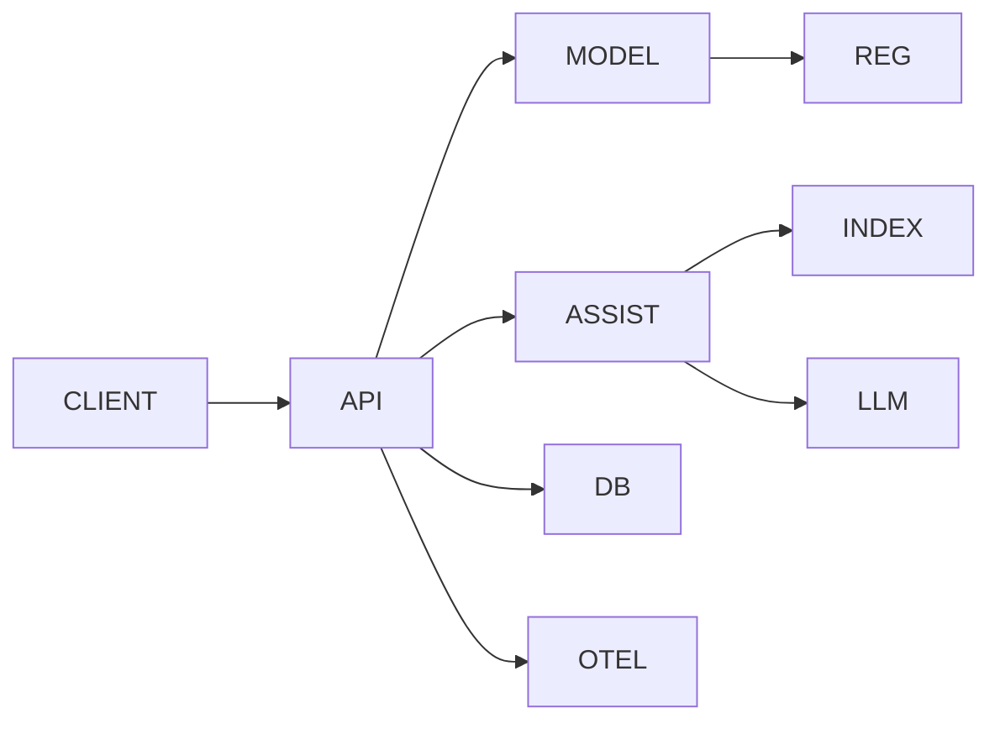
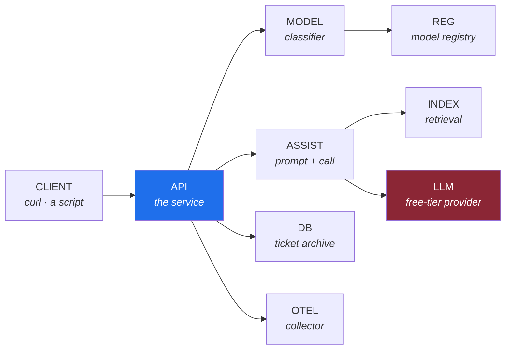

# 1.2 — Drawing the path for `pulse`, before `pulse` exists

## One-line answer

You draw the request path *before* writing the service, because the drawing is where you discover
which hops you were about to add without deciding to — and a hop you did not decide to add is a hop
nobody owns.

---

## The story

🎬 **The scene.** Someone is having a kitchen fitted. The fitter asks where the sink should go. They
say: over there, by the window, obviously.

😬 **The naive fix.** Fit the sink by the window. It is where sinks go and it looks right.

💥 **Why it fails.** The waste pipe now has to run the length of the room to reach the drain, under
the floor, at a shallow angle. It works. Twice a year it blocks, and unblocking it means lifting
floorboards. Nobody made a bad decision — the sink position was decided by looking at the room, and
the drain is not visible in the room.

💡 **The insight.** The expensive things are the connections, and connections are exactly what you
cannot see by looking at the components. **A drawing that shows only boxes reproduces the mistake.**
A drawing that shows the *lines* — what has to reach what, and how far — is the one that makes you
say "wait, why does that have to go all the way over there?" before anything is cemented in.

---

## The idea in plain language

`pulse` does not exist. That is precisely why this is the right moment to draw it: everything is free
to change, and the drawing costs nothing.

The plan (§3) says what `pulse` will be when finished. Reading it as a request path rather than as a
feature list gives you this:

**Two user-facing entry points.** `/predict` takes a support ticket and returns a priority and a
queue, using a small trained classifier. `/assist` takes a ticket and returns a drafted reply,
generated by a language model, grounded in similar past tickets.

Those two are *architecturally different animals*, and the difference is the most important thing on
today's page:

| | `/predict` | `/assist` |
| --- | --- | --- |
| where the work happens | in this process | in someone else's data centre |
| how long it takes | milliseconds, predictable | seconds, highly variable |
| what it costs | CPU | quota — requests per minute and per day |
| how it fails | an exception | a `429`, a timeout, a refusal, or a plausible wrong answer |
| can you retry it? | yes, freely | yes, but it costs quota and may still fail |
| is it deterministic? | yes | no |

**One endpoint is a function call and the other is a journey.** Everything hard about LLMOps is
already visible in that table, on Day 2, before any of it is built.

### The components, named

Nine boxes, and each one gets a short identifier because you are about to write them into a document
and check them mechanically:

| id | what it is | exists from |
| --- | --- | --- |
| `CLIENT` | a person with `curl`, or a script | Day 3 |
| `API` | the HTTP service — routing, validation, responses | Day 3 |
| `MODEL` | the tabular classifier that answers `/predict` | Day 109 |
| `ASSIST` | the code that builds a prompt and calls a model | Day 125 |
| `INDEX` | the retrieval index over past tickets | Day 139 |
| `LLM` | a free-tier language model provider, over the internet | Day 125 |
| `DB` | the ticket archive | Day 47 |
| `REG` | the model registry — the only source of truth for what is deployable | Day 105 |
| `OTEL` | the telemetry collector everything reports to | Day 61 |

Seven of the nine do not exist yet. Drawing them now is not speculation — it is the difference
between building toward a shape and discovering one.

### Why draw it rather than write it

Because the useful questions are **spatial**. Which boxes are inside your trust boundary and which
are not? Which lines cross the network? Which lines are on the request path — a user is waiting — and
which are background? You can answer all three by looking at a diagram and none of them by reading a
list.

The plan's style guide asks for a diagram *"whenever the concept is spatial, sequential, or a state
machine"* (§18.3, rule 10). A request path is all three at once.

---

## Why Kriya needs it

Day 39 is *"`pulse` on Kubernetes — the first real deploy, from image digest to served request."*

On that day you will write a Deployment, a Service and an Ingress, and each one is a *hop* in this
diagram made real. If you have not drawn the path, those three objects are three unrelated pieces of
YAML you are copying; if you have, they are the load balancer, the routing and the process, each in
its expected place. Every Kubernetes object in Phases 4 and 5 is a hop or a property of a hop.

Nearer: [Day 3](../../../day-003-pulse-v0/LESSON.md) builds `CLIENT → API` and nothing else — and
part 2.4 of that day gives `/predict` its request and response shape *before* there is a model, which
only makes sense if you have already seen why the shape is the contract and the model is an
implementation detail.

---

## The mechanism

Write the document. Create `docs/ARCHITECTURE.md` with two things in it: the diagram, and a table with
one row per box.

````markdown
# `pulse` — architecture

## The request path



## Components

| id | what it is | hard or soft |
| --- | --- | --- |
| `CLIENT` | a person or a script calling pulse | n/a |
| `API` | the HTTP service | hard |
| `MODEL` | the tabular classifier | hard for /predict |
| `ASSIST` | the LLM-backed assistant | hard for /assist |
| `INDEX` | the retrieval index | soft |
| `LLM` | a free-tier provider | hard for /assist |
| `DB` | the ticket archive | hard |
| `REG` | the model registry | soft at serving time |
| `OTEL` | the telemetry collector | soft |
````

**Line by line:**

- The outer fence uses **four** backticks so that the three-backtick Mermaid block inside it survives
  as literal text. A closing fence must be at least as long as its opening one, which is the rule that
  makes nesting possible — and it is the same rule `scripts/depth_check.py` implements when it scans
  these documents.
- `flowchart LR` declares a Mermaid flowchart running left to right. `LR` rather than `TD` because a
  request path is a journey and reads naturally along the horizontal.
- `CLIENT --> API` is one hop. The arrow direction is *who initiates*, not where data ends up —
  `API --> OTEL` means the service pushes telemetry out, and getting that direction wrong on a
  diagram is how people end up thinking a collector polls their service.
- Each identifier is short, capitalised and unique. That is not style: [4.2](../04-blast-radius/4.2-drawing-the-blast-radius-map.md)
  adds a column to this table and the check in [4.3](../04-blast-radius/4.3-the-map-is-wrong.md) reads
  these two blocks and compares them, so the ids have to be machine-findable.
- The **hard or soft** column is filled in properly in [2.1](../02-dependencies/2.1-hard-and-soft-dependencies.md).
  Today it is a placeholder you will argue with, and arguing with it is the exercise.
- Note what the table does **not** have: a technology. It says "the ticket archive", not "Postgres 17".
  A component is a *responsibility*; the thing implementing it is a decision recorded elsewhere and
  changed more often than you expect.

Rendered, the diagram looks like this — and this is the artifact, not the source:



**Two things become visible the moment it is drawn, and neither is visible in the list.**

**One box is a different colour because it is not yours.** `LLM` is outside the boundary of everything
you can deploy, restart, roll back or profile. It is the only box on the diagram whose availability is
somebody else's decision, and the only one with a quota. That distinction is invisible in a feature
list and unmissable in a drawing.

**`API` has four outgoing arrows.** Every one of them is a chance to be slow while a user waits, and
the drawing prompts the question a list does not: *do all four have to happen before we answer?*
`OTEL` should not — telemetry that blocks a response is worse than no telemetry. `REG` should not —
the registry is consulted when a model is loaded, not on every request. Realising that on a diagram
costs nothing; realising it in Phase 7, after telemetry has been made synchronous, costs a rewrite.

---

## When it breaks

The failure of this exercise is a diagram that is **beautiful and unfalsifiable**. Here is the shape,
and you have seen it in real repositories:

```text
                    ┌─────────────────┐
                    │  API Gateway    │
                    └────────┬────────┘
                             │
              ┌──────────────┼──────────────┐
              │              │              │
        ┌─────▼─────┐  ┌─────▼─────┐  ┌─────▼─────┐
        │  Service  │  │  Service  │  │  Service  │
        └───────────┘  └───────────┘  └───────────┘
                             │
                    ┌────────▼────────┐
                    │   Data Layer    │
                    └─────────────────┘
```

**What it says:** we have an architecture.
**What it actually means:** nothing checkable. There is no name that maps to a running thing, no
indication of which arrows cross a network, no statement of what is inside the trust boundary, and
crucially **no way for it to be wrong**. A drawing that cannot be wrong cannot be reviewed, and it
rots without anybody noticing because there is nothing to notice.

**The smallest fix** is the one this part builds toward: give every box an identifier that also
appears in a table, so a script can compare the two and refuse when they disagree. That check is
[4.3](../04-blast-radius/4.3-the-map-is-wrong.md), and it turns the diagram from decoration into an
artifact with a gate.

There is a second, more interesting failure: **the box that is really two things.** `API` on this
diagram will eventually be a process, a routing layer and a validation layer, and one day one of those
will be slow and the box will not help you say which. Splitting a box is cheap; the signal that it is
time is when you catch yourself saying "well, *part* of the API is fine". Day 69's traces are the tool
that tells you where the internal boundaries actually are.

---

## In production

**What a professional does differently.** They keep **two** diagrams and are strict about the
difference. A *logical* diagram shows responsibilities and does not change when you switch database
engines. A *deployment* diagram shows what actually runs where — processes, pods, nodes, regions — and
changes constantly. Mixing them produces a picture that is stale within a month and wrong in a way
nobody can localise. `docs/ARCHITECTURE.md` is the logical one; the deployment one arrives with the
Kubernetes manifests in Phase 4, and it is largely generated from them rather than drawn.

**What degrades at scale.** The single-diagram assumption. Past roughly a dozen boxes a diagram stops
being readable and starts being wallpaper, and the fix is not a bigger diagram — it is **one diagram
per question**: the request path for `/predict`, the request path for `/assist`, the training
pipeline, the telemetry flow. Four small honest drawings beat one large one, and each can be checked.

**The failure that only shows with real traffic.** The arrow you drew as background that turns out to
be on the request path. The classic version is logging: you draw `API --> OTEL` as a side-effect,
someone implements it as a synchronous write, and now every user request waits for the collector.
When the collector is slow, your service is slow, and nothing in your dashboard suggests it, because
the collector is where your dashboard comes from. **A dependency you did not think was on the request
path is the most dangerous kind**, and [2.3](../02-dependencies/2.3-the-dependency-that-fails-slowly.md)
is entirely about it.

**The review comment a senior engineer leaves.** *"Your diagram has an arrow from the API to the model
registry. Is that per request, or at startup? If it's per request, we've made a registry outage into
an API outage, and I'd like that written on the diagram rather than in someone's head."*

**The signal you would alert on.** Nothing from a document — but the diagram determines your *metric
labels*, which is a more consequential decision than it sounds. If your latency metric carries a label
for the downstream component (`dependency="LLM"`, `dependency="DB"`), you can answer "which hop?" in
one query. If it does not, no amount of dashboard work recovers it, because the information was never
recorded. Deciding the label set is a design decision made at diagram time, and getting it wrong is
trap #2 from the plan's §5.1.

**Blast radius:** none. This part creates one Markdown file in `docs/`. No process, no network, no
capability. Worth stating plainly, because the *next* part in this section starts making claims about
latency and the one after that starts making claims about failure, and by
[4.2](../04-blast-radius/4.2-drawing-the-blast-radius-map.md) the same document is describing what
happens when each box dies.

**Cost:** `0` requests, `0` tokens, `0` MB resident. A few kilobytes of Markdown.

**The interview question.** *"Draw me the architecture of the last thing you worked on."* What the
interviewer is actually testing is whether you draw *boxes* or *lines*. Candidates who draw boxes
describe an org chart. Candidates who draw lines and immediately start annotating them — this one is
synchronous, this one has a timeout, this one is somebody else's uptime — have operated something.

---

## Check yourself

```bash
grep -c '\-\->' docs/ARCHITECTURE.md
```

Count the arrows. That number, not the number of boxes, is how many things can independently go wrong
between a user and an answer.

**Say out loud, without scrolling up:** *`API` has four outgoing arrows. Which of them must complete
before the user gets a response, and which must not — and what breaks if you get that wrong?*
