# 1.3 — Latency adds up along the path

## One-line answer

A response cannot be faster than the sum of its hops, so the only useful latency budget is one that
is **allocated across the path in advance** — and the hop you cannot control has to be given its
number first, not last.

---

## The story

🎬 **The scene.** Someone has to be at an airport gate at eight in the morning. They work backwards:
security takes a while, check-in takes a while, the drive takes a while. They set an alarm.

😬 **The naive fix.** Add up the times, add fifteen minutes for safety, set the alarm for that.

💥 **Why it fails.** They miss the flight. Not because any single step took much longer than expected,
but because the drive was ten minutes over, the car park shuttle was seven minutes over, and the
security queue was twenty over. No individual step was a disaster. **The safety margin was allocated
once, to the whole journey, and the first two overruns ate it before the step that actually varies.**

💡 **The insight.** A budget for a journey is not one number. It is a number *per leg*, and the legs
you do not control need the largest share. Anyone who travels frequently does this automatically:
they do not budget "two hours to the airport", they budget "the security queue could be forty
minutes" and work outward. The variance lives in specific places, and pretending it is spread evenly
is how you miss flights.

---

## The idea in plain language

**Latency** is how long something takes, measured from the point of view of whoever is waiting. For a
request that passes through several hops, and where each hop waits for the next, the total is at
least the sum of the parts. There is no clever way around addition.

Three words you need, and people mix them up constantly:

**Latency** — how long one request takes. Measured in milliseconds.
**Throughput** — how many requests you handle per second. These are *different*, and improving one
often makes the other worse: batching ten requests together raises throughput and raises the latency
of the first one in the batch. Day 110 makes that trade real for model serving.
**Saturation** — how full the system is. A system at 50% utilisation has queues that are almost
always empty; the same system at 95% has queues that are frequently long, and **latency rises
non-linearly with utilisation, not proportionally**. This is why "we have plenty of headroom, we're
only at 90%" is one of the more expensive sentences in operations, and it is Day 85's subject.

### Allocating the budget

Suppose `pulse` promises to answer `/assist` in under three seconds for most requests. That is one
number and it is not yet useful. Turn it into a budget:

| Hop | Budget | Why that number |
| --- | --- | --- |
| network in and out | 100 ms | outside your control; measure, do not assume |
| `API` — routing, validation, serialisation | 20 ms | your own code doing small work |
| `DB` — fetch the ticket | 50 ms | one indexed lookup |
| `INDEX` — retrieve similar tickets | 200 ms | a vector search over a modest index |
| `LLM` — generate the reply | **2 400 ms** | **the hop you do not control** |
| slack | 230 ms | the margin, allocated *last*, not first |
| **total** | **3 000 ms** | the promise |

**Read the table's shape rather than its numbers.** Eighty percent of the budget goes to the one hop
you cannot profile, cannot optimise and cannot restart. That is not pessimism; it is the correct
allocation, and it has two immediate consequences that a single total would never have surfaced:

**Optimising your own code is nearly pointless here.** Halving the `API` hop from 20 ms to 10 ms
improves the total by a third of a percent. Engineers spend weeks on that hop because it is the one
they can see.

**The only real lever is the `LLM` hop, and the levers on it are not "make it faster".** They are:
cache the answer so you do not make the call (Day 133), start streaming so the *perceived* latency is
time-to-first-token rather than time-to-completion (Day 131), or answer without it and degrade
gracefully (Day 129). Every one of those is an architectural choice, and every one of them is visible
from the budget table and invisible from the total.

### Sequential and parallel

The `DB` and `INDEX` hops in that table do not depend on each other. Run them at the same time and the
path costs `max(50, 200) = 200 ms` instead of `250 ms`. On this budget that saves 50 ms — which is
worth almost nothing, and saying so is the point. **Parallelising hops is the optimisation people
reach for first and it is almost never where the time is.** Look at the budget, find the biggest
number, work on that.

There is one place parallelism changes the *shape* rather than the size, and it is worth knowing now:
if you fan out to several hops and wait for all of them, your latency is the **slowest** one, so your
p99 is dominated by whichever backend has the worst tail. That is tail latency amplification, and it
is Day 63.

---

## Why Kriya needs it

Day 73 is *"Service level objectives — the number, the window, and what it costs to promise it."*

An SLO for `pulse` will be a sentence like *"99% of `/predict` requests are answered successfully in
under 400 ms over a rolling four-week window."* Before you can write that sentence honestly you have
to know it is *achievable*, and the only way to know is to have a budget per hop and evidence for each
number. A promise made without a budget is a promise you will discover you cannot keep during the
first busy week.

Day 110 (serving latency for the model) and Day 131 (streaming and time-to-first-token) are both
direct consequences of the allocation exercise above.

---

## The mechanism

You cannot measure `pulse`'s hops — it does not exist. You **can** measure the shape of the problem,
and doing so with real numbers is what stops the budget table from being a fantasy.

```python
# lab/budget.py — allocate a latency budget across a path and see what a change is worth.
BUDGET_MS = 3_000

path = [
    ("network in + out", 100),
    ("API routing + validation", 20),
    ("DB fetch ticket", 50),
    ("INDEX retrieve similar", 200),
    ("LLM generate", 2_400),
]

spent = sum(ms for _, ms in path)
for name, ms in path:
    share = ms / spent
    saving = 0.5 * ms / spent
    print(f"{name:28s} {ms:>6,d} ms  {share:6.1%} of the path   halving it buys {saving:5.1%}")
print(f"{'spent':28s} {spent:>6,d} ms")
print(f"{'slack':28s} {BUDGET_MS - spent:>6,d} ms")
```

**Line by line:**

- `BUDGET_MS = 3_000` — the promise, as one named constant. The underscore is a digit separator, which
  Python ignores and human eyes do not; on a number with more digits it is the difference between
  reading `30000` correctly and reading it wrong.
- `path` is a list of tuples rather than a dictionary, because **order matters here** — this is a
  path, not a set — and a list preserves it explicitly rather than relying on insertion order as an
  incidental property.
- `spent = sum(ms for _, ms in path)` — a generator expression, `_` for the value being discarded.
  Summing before the loop means each row can be expressed as a share of the real total rather than of
  the budget, which is the honest denominator.
- `saving = 0.5 * ms / spent` computes **what halving that hop is worth to the total**, which is the
  entire point of the script. A hop that is 1% of the path can be made infinitely fast and buy you
  0.5%.
- `{ms:>6,d}` right-aligns in six columns with a thousands separator; `{share:6.1%}` formats as a
  percentage to one decimal place. Aligning the columns matters more than it looks: the argument this
  script is making is about *relative size*, and misaligned numbers hide it.

Run it:

```bash
uv run python days/day-002-shape-of-production-system/lab/budget.py
```

**Line by line:** `uv run` uses the project's interpreter rather than whatever `python` resolves to
(Day 0, part [1.4](../../../day-000-toolchain-skeleton-driver/parts/01-the-toolchain/1.4-the-venv-you-never-activate.md)).
The path is under this day's `lab/`, which `./o scaffold 2` creates and which the linter deliberately
ignores.

Expected output:

```text
network in + out                100 ms    3.6% of the path   halving it buys  1.8%
API routing + validation         20 ms    0.7% of the path   halving it buys  0.4%
DB fetch ticket                  50 ms    1.8% of the path   halving it buys  0.9%
INDEX retrieve similar          200 ms    7.2% of the path   halving it buys  3.6%
LLM generate                  2,400 ms   86.6% of the path   halving it buys 43.3%
spent                         2,770 ms
slack                           230 ms
```

**That last column is the whole lesson in one number.** Halving every single hop you own — network,
API, database and index together — buys 6.7%. Halving the one you do not own buys 43.3%.

**And notice the shares do not sum to 100%.** They sum to 99.9%, because each is rounded to one
decimal place. That is worth a second's attention rather than a shrug: a report whose rows do not add
up to its total is the normal state of any rounded breakdown, and knowing that is what stops you
hunting for a missing hop that does not exist.

```mermaid
gantt
    title one /assist request, 3 000 ms budget
    dateFormat X
    axisFormat %L
    section path
    network      :0, 100
    API          :100, 120
    DB           :120, 170
    INDEX        :170, 370
    LLM generate :crit, 370, 2770
    slack        :done, 2770, 3000
```



---

## When it breaks

The failure is a budget that was never allocated, discovered as a symptom nobody can localise. Here is
what it looks like in a real request, and it is worth reading carefully because the numbers are
counterintuitive:

```text
$ curl -sS -o /dev/null -w 'dns=%{time_namelookup}s connect=%{time_connect}s total=%{time_total}s\n' https://pypi.org/pypi/ruff/json
dns=0.005038s connect=0.063184s total=52.926316s
```

Observed on **2026-08-24** on this machine.

**What it says:** the request took fifty-two seconds.
**What it actually means:** name resolution took five *milliseconds* and connecting took sixty-three
milliseconds. Together they are one tenth of one percent of the total. Everything else — fifty-two and
a half seconds — happened after the connection was open, on a link this machine does not control.

**Why this matters more than it looks:** if the only number you had was `total`, the natural next
step is to start investigating DNS, because DNS is famously the cause of everything and it is easy to
check. You would have spent an hour ruling out a hop that accounted for 0.01% of the problem. **The
decomposition is not a nicety; it is the difference between an hour and a glance.**

**The smallest fix** is not to make anything faster. It is to record the breakdown at all — which for
`curl` is one `-w` flag, and for a service is one span per outbound call (Day 69).

The second failure mode is subtler and it is the one that ends up in a postmortem: **a budget that
sums correctly and is measured with the wrong statistic.** If each hop's *average* is within budget,
the total average is within budget, and your p99 can still be catastrophically over — because the
slow requests at each hop are not the same requests, and averages are blind to that entirely. Budget
in percentiles or do not budget. Day 63.

---

## In production

**What a professional writes instead of the teaching version.** They set an explicit **timeout per
hop**, derived from the budget, and they make the timeouts *decrease* as you go inward — an outer
call that allows three seconds must not wait on an inner call that allows five, or the outer timeout
is decorative. That discipline has a name, **deadline propagation**: the remaining budget travels with
the request, and each hop is told how long it has left rather than being given a fixed number in a
config file. It is one of the highest-leverage things in a distributed system and it is routinely
absent.

**What degrades at scale.** Queuing. Every number in that budget table is a *service* time — how long
the work takes when it starts. Under load, requests wait before they start, and the waiting is
invisible to the component doing the work: your database reports a 5 ms query while the caller
experiences 300 ms, because 295 of those were spent in a connection pool. **Measure at the caller,
always**, and treat a component's self-reported timing as a lower bound. Day 47 (connection pools) and
Day 85 (capacity) are where this becomes concrete.

**The failure that only shows with real traffic.** Retries turning a slow hop into an outage. A hop is
slow, the caller times out and retries, the retry adds load to the already-struggling hop, more calls
time out, and the load multiplies. This is a **retry storm**, and the arithmetic is brutal: three
retries per call means a struggling dependency receives four times its normal traffic exactly when it
can least handle it. The containment is bounded retries with exponential backoff and jitter, plus a
circuit breaker that stops calling entirely for a while. Day 130 builds it against a rate-limited
provider, and Principle 13 says the bound ships with the retry, not after it.

**The review comment a senior engineer leaves.** *"You've added a call to the index inside the request
path with a two-second timeout, on a route whose whole budget is three seconds. What is the caller's
timeout? If it's also three seconds, we've guaranteed that a slow index turns into a hard failure
rather than a degraded answer — and we said degradation was acceptable here."*

**The signal you would alert on.** **A high percentile of end-to-end latency, split by route**, and
separately **time spent per downstream dependency**. Two signals, and the division of labour matters:
the first tells you a user is having a bad time and is worth waking someone for; the second tells you
where, and is never worth waking anyone for on its own. Alert on the symptom, dashboard the cause —
Day 77. And do not alert on averages: an average latency alert will not fire during an outage that
affects five percent of users, and five percent of users is an outage.

**Blast radius:** none from this part. The script is arithmetic in a scratch file; it reads nothing and
calls nothing. The `curl` in the failure section makes one read-only request to a public index over the
internet. Worst case: it is slow, which is the point.

**Cost:** `0` model calls, `0` tokens. One HTTPS request of a few hundred kilobytes to `pypi.org`, and
a Python process that exits immediately. `0` MB resident afterwards.

**The interview question.** *"Your p99 latency is 3 seconds and your SLO is 1 second. Walk me through
how you'd find out why."* The answer they are listening for is decomposition before investigation:
break the path into hops, find which hop owns the tail, and only then start optimising — and mention
that you would check queueing at the caller before believing any component's self-reported timing.

---

## Check yourself

```bash
uv run python -c "p=[100,20,50,200,2400]; t=sum(p); print(f'largest hop = {max(p)/t:.0%} of the path')"
```

One number. If the largest hop is not the one you are working on, you are working on the wrong hop.

**Say out loud, without scrolling up:** *your `/assist` route is over budget. Name the three levers
available on the `LLM` hop, and say which one changes the user's experience without changing the
total.*
