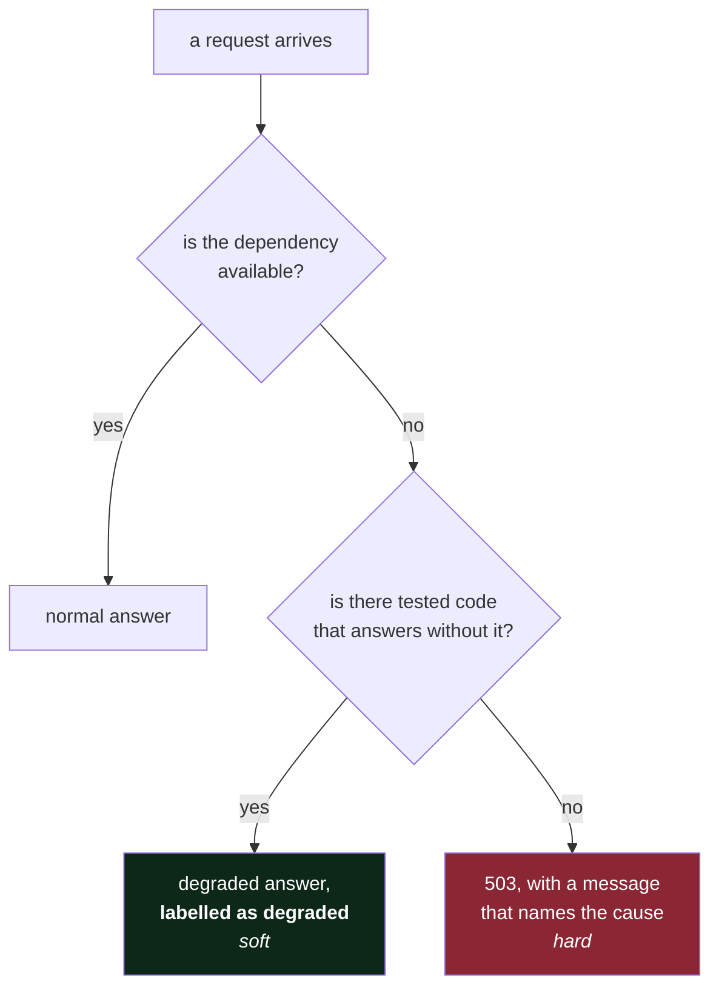

# 2.1 — Hard and soft dependencies

## One-line answer

A **hard** dependency is one whose absence means you cannot answer at all; a **soft** one is one whose
absence means you answer worse — and the classification is a decision you make, not a fact you
discover.

---

## The story

🎬 **The scene.** A café. To sell a coffee they need beans, water, electricity, a card reader and the
little machine that prints the loyalty stamp on the receipt.

😬 **The naive fix.** The card reader stops working one morning. Somebody puts a sign on the door
saying *closed due to technical problems* and everyone goes home.

💥 **Why it fails.** They could have taken cash. They could have taken card details by phone. They sold
nothing for a day because one component of the sale was unavailable and nobody had ever decided, in
advance and calmly, which components were **necessary to sell a coffee** and which were merely part of
how they normally sell a coffee. In the moment, with a queue forming, "we can't take payment" and "we
can't take *card* payment" felt like the same sentence.

💡 **The insight.** The loyalty-stamp machine is obviously optional; nobody would close over it. The
card reader felt essential and was not. **The difference between essential and habitual is invisible
during normal operation and has to be decided while nothing is broken**, because during the failure
you will not have the composure to decide it well.

---

## The idea in plain language

A **dependency** is anything your system needs that your system is not. A database. A model file. An
external API. A DNS server. A certificate authority. A directory on disk.

For each one there is exactly one question, and it is not "is it important?":

> **If this is unavailable right now, can we still give the user a useful answer?**

If the answer is *no*, it is a **hard dependency**. Its availability is your availability, multiplied
in.

If the answer is *yes, a worse one*, it is a **soft dependency**. You lose a feature or some quality,
and you stay up.

That is the entire distinction, and everything else follows from it.

### It is a decision, not a discovery

This is the part people get wrong, so it is worth being blunt: **most dependencies are hard by default
and soft by design.** Nothing about a retrieval index makes it soft. It becomes soft when somebody
writes code that catches its failure, answers without it, and labels the answer as ungrounded. Until
that code exists, the index is a hard dependency of `/assist` and your availability is capped by it,
regardless of what the architecture diagram says.

So the honest version of the classification is:

| | means |
| --- | --- |
| **hard** | we have decided this is required, or we have not yet done the work to make it optional |
| **soft** | there is code, that has been tested, that produces a useful answer without it |

A dependency labelled soft with no fallback code is a lie, and it is a lie that shows up during an
incident as *"I thought that was optional?"*

### Applying it to `pulse`

Take the nine boxes from [1.2](../01-the-request-path/1.2-drawing-the-path-for-pulse.md) and classify
them **per route**, because the same component is hard for one endpoint and irrelevant to another:

| Component | for `/healthz` | for `/predict` | for `/assist` | notes |
| --- | --- | --- | --- | --- |
| `API` | hard | hard | hard | the process itself; nothing works without it |
| `DB` | **soft** | hard | hard | health must not depend on it — see [3.2](../03-state/3.2-where-pulse-state-will-live.md) |
| `MODEL` | soft | hard | soft | `/assist` does not classify |
| `REG` | soft | soft | soft | consulted at startup, not per request |
| `INDEX` | soft | soft | **soft by design** | an ungrounded reply is worse, not absent |
| `LLM` | soft | soft | **hard** | there is no local fallback until Day 126 |
| `OTEL` | soft | soft | soft | telemetry must never block a response |

**Two rows in that table are the interesting ones.**

`DB` is soft for `/healthz` and hard for `/predict`. That is not an inconsistency — it is the single
most important design decision on the whole table, and [3.2](../03-state/3.2-where-pulse-state-will-live.md)
plus Day 41 explain why a health check that touches the database causes outages rather than detecting
them.

`LLM` is hard for `/assist` **and it is somebody else's uptime**. It is the only hard dependency on
this list that you cannot restart, cannot profile, cannot roll back and cannot page anybody about.
Day 129 (fallback across providers) and Day 126 (a local model) exist to move that row from hard to
soft, and until they do, `/assist`'s availability is bounded by a free tier.

---

## Why Kriya needs it

Day 129 is *"Routing and fallback — surviving a provider that is having a bad afternoon."*

That day builds the code that turns `LLM` from hard to soft: try the primary provider, fall back to a
second, fall back to a local model, and if all of that fails, return a clearly-labelled degraded
response rather than an error. It is a substantial piece of engineering, and its entire justification
is one cell of the table above.

Sooner: [Day 3](../../../day-003-pulse-v0/LESSON.md) writes `/healthz`, and the temptation on that day
— which nearly everybody gives in to — is to make it check the database. The reason not to is in this
part, and part 5.2 of Day 3 is about what happens when you do.

---

## The mechanism

Add the classification to `docs/ARCHITECTURE.md` so it is a written commitment rather than an
intention. Replace the placeholder *hard or soft* column from
[1.2](../01-the-request-path/1.2-drawing-the-path-for-pulse.md) with two real ones:

````markdown
## Components

| id | what it is | classification | what we do without it |
| --- | --- | --- | --- |
| `CLIENT` | a person or a script calling pulse | n/a | n/a |
| `API` | the HTTP service | hard, everywhere | nothing; this is the process |
| `MODEL` | the tabular classifier | hard for `/predict` | 503 with a clear message |
| `ASSIST` | prompt construction and the model call | hard for `/assist` | 503 with a clear message |
| `INDEX` | the retrieval index | soft | generate ungrounded, label the reply |
| `LLM` | a free-tier provider | hard for `/assist` **today** | TODO(me) Day 129 makes this soft |
| `DB` | the ticket archive | hard for `/predict` and `/assist`, **soft for `/healthz`** | 503 on data routes; health still answers |
| `REG` | the model registry | soft at serving time | serve the model already loaded |
| `OTEL` | the telemetry collector | soft, always | drop telemetry, never block the response |
````

**Line by line:**

- The **classification** column names the *route*, not just the word. "Hard" with no route is
  meaningless on a service with more than one endpoint, and writing the route is what forced the
  `/healthz` insight out into the open.
- **"what we do without it"** is the column that makes the table honest. A classification with no
  stated behaviour is an opinion; a stated behaviour is something a reviewer can check against the
  code. `INDEX` says *"generate ungrounded, label the reply"* — that is a specification, and on
  Day 139 you will be able to point at the line that implements it.
- `503` is the HTTP status for *Service Unavailable*, and it is the right one here rather than `500`
  (*Internal Server Error*): `503` says "try again, this is temporary and not your fault", which is
  both true and actionable for the caller. **Verified against the HTTP semantics specification, RFC
  9110 §15.6.4, `httpwg.org/specs/rfc9110.html#status.503`, on 2026-08-24.** Day 8 is the full
  treatment of which status means what.
- `TODO(me)` on the `LLM` row is deliberate and stays unsolved. It records that today's honest
  classification is *hard*, names the day that changes it, and refuses to pretend the fallback exists
  before it does. **A dependency table that describes the system you intend to have is worse than no
  table**, because it will be read during an incident.
- The `OTEL` row's wording — *"never block the response"* — is a **constraint on the implementation**,
  written before the implementation. That is the cheapest possible way to prevent the failure in
  [1.2](../01-the-request-path/1.2-drawing-the-path-for-pulse.md)'s production section.



**The `C` diamond is the whole part.** Soft is not a property of the dependency. It is a property of
the code path below the diamond, and if that path does not exist, the answer to the diamond is *no*
whatever your table says.

---

## When it breaks

The failure is a dependency everyone believed was soft, discovered to be hard during the incident.
The symptom is characteristic — a total outage caused by an optional component:

```text
$ curl -sS -i http://127.0.0.1:8000/healthz
HTTP/1.1 500 Internal Server Error
content-type: application/json

{"detail":"Internal Server Error"}
```

…and in the service's log, the actual cause:

```text
Traceback (most recent call last):
  File "/app/pulse/api.py", line 41, in healthz
    db.execute("SELECT 1")
  File "/app/pulse/db.py", line 22, in execute
    conn = self._pool.getconn()
psycopg.OperationalError: connection failed: could not connect to server: Connection refused
        Is the server running on host "db" (172.18.0.3) and accepting TCP connections on port 5432?
```

**What it says:** the health endpoint raised an exception because the database is unreachable.
**What it actually means:** something much worse than a database outage. The orchestrator polls
`/healthz` to decide whether the instance is alive; the endpoint is now failing; so **every instance
is marked unhealthy and restarted**, none of them recover because the database is still down, and a
degraded system becomes a completely absent one. The database being down should have cost you the data
routes. It cost you the service.

**The smallest fix:** `/healthz` returns `200` if the process can respond, and checks nothing else. A
separate endpoint — conventionally `/readyz` — reports whether dependencies are available, and the
orchestrator is told to use the two differently. Day 41 is the full treatment and Day 3 writes the
first one correctly.

**Why this is in *this* part rather than in a Kubernetes one:** the mistake is not a Kubernetes
mistake. It is a classification mistake, made in a text file, months before the cluster existed. The
table above is where it is prevented.

---

## In production

**What a professional writes instead of the teaching version.** They write the fallback path **and a
test that exercises it**, because an untested fallback is a hard dependency wearing a costume. The
test is usually the cheap kind: point the client at a port with nothing on it, assert the service
returns a degraded answer rather than an exception. Day 14 makes that a CI gate; Day 129 does it for
the provider chain. **If nothing in CI ever runs the `except` branch, you do not know it works, and
the first time it runs will be the worst possible time.**

**What degrades at scale.** Hard dependencies multiply. Four hard dependencies each at 99.9% give you
99.6% before your own code has done anything wrong — and unlike your own code, you cannot fix them.
This arithmetic is the honest argument for making things soft: every dependency you move from hard to
soft removes a term from that product. It is also the argument against adding dependencies casually,
which is [2.2](2.2-every-dependency-is-a-decision.md).

**The failure that only shows with real traffic.** The **partially** available dependency. Your
classification assumed two states — up and down — and reality has a third: up, answering, and wrong or
slow. A database that returns rows in 30 seconds is not down; your timeout will fire, your fallback
may not trigger because there was no exception until the timeout, and your users experience an outage
that no availability metric records. [2.3](2.3-the-dependency-that-fails-slowly.md) is entirely about
this third state.

**The review comment a senior engineer leaves.** *"The architecture doc says the index is a soft
dependency. I can't find the code path that runs when it's unavailable — the call has no `except` and
no timeout, so as far as I can tell it's hard. Either write the fallback or change the doc; right now
they disagree and the doc is the one people will trust at 3am."*

**The signal you would alert on.** One per dependency: **availability of the dependency as seen from
your service**, which is deliberately not the same as the dependency's own health check — the network
between you is part of what you are measuring. And then a rule about who gets woken: a **hard**
dependency being unavailable is a page, because users are affected; a **soft** one is a ticket, plus a
dashboard panel showing what fraction of responses are currently degraded. That second signal —
*degraded-response rate* — is the one teams forget, and without it a soft dependency can be down for
weeks while every availability number stays green.

**Blast radius.** This part changes one Markdown table. But the table is load-bearing in an unusual
way: it is a **specification of failure behaviour**, and getting a row wrong causes code to be written
that behaves wrongly under a condition nobody tests. Worst case: a component marked soft is treated as
optional in review, no fallback is written, and the system has a hard dependency nobody knows about.
What bounds it: the *"what we do without it"* column, which is checkable against code, and the
`TODO(me)` convention for rows that describe an intention rather than a fact.

**Cost:** `0` requests, `0` tokens, `0` MB resident.

**The interview question.** *"What are your service's dependencies, and what happens when each one is
down?"* The second half is the question. Anyone can list dependencies. The strong answer classifies
them, names the degraded behaviour for the soft ones, admits which of the "soft" ones have never
actually been tested that way, and knows which hard dependency is somebody else's uptime.

---

## Check yourself

```bash
grep -c 'hard' docs/ARCHITECTURE.md
```

Count your hard dependencies. That number, multiplied out, is the ceiling on your availability before
you have written a single bug.

**Say out loud, without scrolling up:** *what makes a dependency soft — and why is a table saying
"soft" not evidence of it?*
