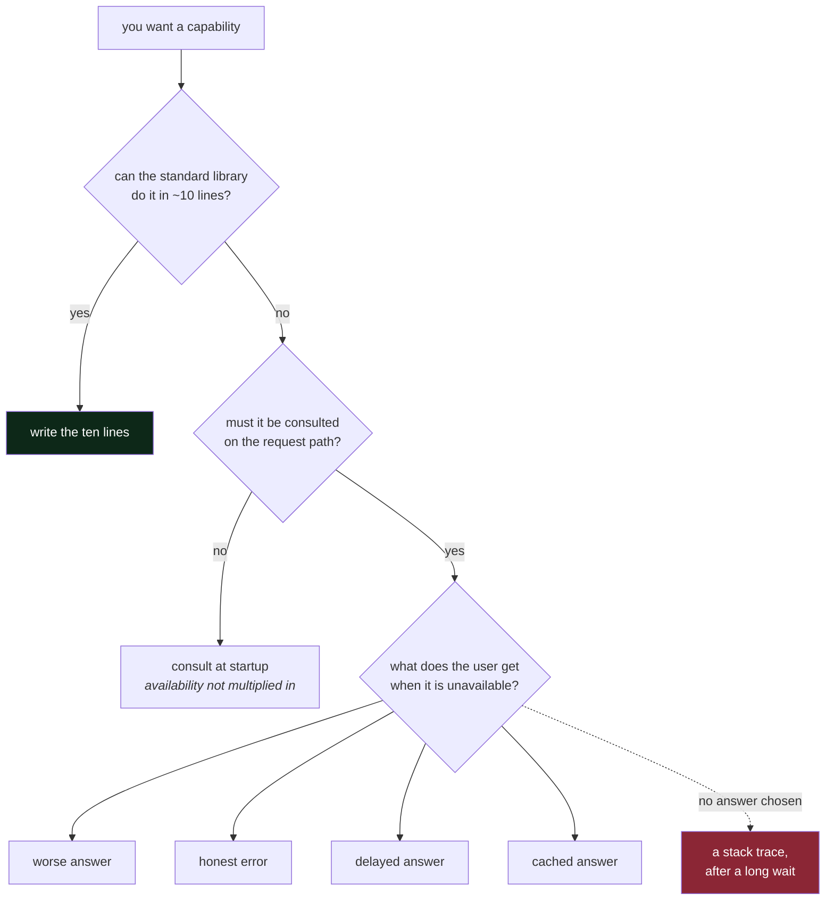

# 2.2 — Every dependency is a decision about what happens when it is gone

## One-line answer

Adding a dependency is not a convenience, it is a **permanent commitment to an availability, a
latency, a version and a failure mode you do not control** — so the moment to decide what happens
when it is gone is the moment you add it, not the moment it goes.

---

## The story

🎬 **The scene.** Someone is renovating a house and needs a specific tile. The local shop does not
have it; a supplier three counties away does, and will deliver in a week. They order it. The tile
arrives. The room looks lovely.

😬 **The naive fix.** Two years later a pipe leaks and four tiles have to be replaced. Order four more
from the same supplier.

💥 **Why it fails.** The supplier no longer makes that tile. Nothing else matches. The choice is now
between a visibly patched floor and re-tiling the whole room, and neither was a cost anybody
associated with the original decision — which felt, at the time, like *choosing a nice tile*.

💡 **The insight.** The decision was never "which tile". It was **"how much of this room's future do I
want to depend on one supplier's product line?"** — and that question is answerable at the moment of
choosing and nearly unanswerable afterwards. The cost of a dependency is not paid when you take it
on. It is paid later, by someone who may not be you, in a currency you did not think about.

---

## The idea in plain language

When you add a dependency to a system — a library, a database, an external API, a hosted model — you
are taking on **five commitments at once**, and only the first one is usually discussed:

**A capability.** The thing it does for you. This is the reason you added it, and it is the only one
in the pull request description.

**An availability.** Its uptime is now multiplied into yours if it is hard
([2.1](2.1-hard-and-soft-dependencies.md)). You have imported somebody else's operational competence,
and you cannot audit it.

**A latency.** Its slowest day is now your slowest day, on every request that touches it.

**A version.** It will change. Sometimes it will change in ways that break you, sometimes in ways that
silently alter behaviour, and sometimes it will stop existing. Someone will have to deal with that,
repeatedly, forever.

**A failure mode.** It has ways of going wrong that you now have to understand, detect and handle —
including the ones you have never seen.

The last four are the actual cost, they arrive later, and they are almost never in the discussion.

### The question that makes it a decision

There is one question, and asking it converts adding a dependency from a shrug into an engineering
decision:

> **What does the user get when this is unavailable?**

There are exactly four legitimate answers, and choosing among them *is* the design:

| Answer | What it means | Example in `pulse` |
| --- | --- | --- |
| **a worse answer** | you degrade; the feature survives | `INDEX` gone → generate ungrounded, say so |
| **an honest error** | you refuse clearly and quickly | `MODEL` gone → `503`, "classification unavailable" |
| **a delayed answer** | you queue the work and complete it later | a ticket summary generated asynchronously |
| **a cached answer** | you serve something you already had | a repeated `/assist` question |

And one illegitimate answer, which is what happens by default if you do not choose: **the user waits,
and then gets a stack trace.** That is the outcome of every dependency added without this question,
and it is the most common outcome in production software.

### Why "we'll add a fallback later" does not happen

Because the fallback is only obviously necessary while you are thinking about the dependency, and
after that it competes with features. This is Principle 13 — *blast radius before capability* — in its
dependency form: **the containment ships in the same change as the capability, never in a later one.**

There is a practical reason as well as a cultural one. The fallback is *easy* to write while you are
holding the shape of the call in your head — you know what the response looks like, so you know what
a plausible substitute looks like. Six months later that context is gone and the fallback becomes a
research task.

### Reducing the count

The cheapest dependency is the one you do not have, and there are three honest ways to avoid one:

**Write the ten lines.** A dependency that saves you ten lines of standard-library code is a bad trade
— you have swapped code you control for a supply chain, a version to track and an SBOM entry (Day 15).
The repository's own house style says this: *prefer the stdlib; do not add a dependency for what
`itertools`, `pathlib`, `dataclasses` or `collections` already does.*

**Move it off the request path.** A dependency consulted at startup is not on the path; a dependency
consulted per request is. `REG`, the model registry, is the example in `pulse`: consult it when
loading a model, never when serving one, and a registry outage stops deployments rather than stopping
the service.

**Make it a cache rather than a source.** If you can serve a stale answer, the dependency's
availability stops being multiplied into yours and becomes a *freshness* property instead. That is a
much better failure mode, and it is what Day 133 does for the LLM path.

---

## Why Kriya needs it

Day 15 is *"Build artifacts and reproducibility — the lockfile, the hash, and the first SBOM."*

An **SBOM** — software bill of materials — is a machine-readable list of everything your artifact
depends on, transitively, with versions. It exists because the fourth commitment above (*a version*)
turns out to be a security question as well as a maintenance one: when a vulnerability is announced in
a library three levels down your dependency tree, the only question that matters is *"are we using
it?"*, and answering it from memory is not possible.

`pyproject.toml` currently has two development dependencies and **zero** runtime dependencies. That is
not minimalism for its own sake — it is Principle 7's *"packages arrive on the day they are first
used"*, and [Day 3](../../../day-003-pulse-v0/LESSON.md) adds the first three. When it does, each one
gets a dated row in `docs/PACKAGES.md` saying **why**, which is this part made into a ritual.

---

## The mechanism

Two mechanisms: the question, written into the architecture document, and the actual current state of
this repository's dependency tree — because the honest way to think about dependency count is to look
at yours.

First, the decision record. When a dependency is added, the row in `docs/PACKAGES.md` answers *why*,
and the architecture table answers *what happens without it*:

````markdown
| id | classification | what we do without it | added | why this one |
| --- | --- | --- | --- | --- |
| `LLM` | hard for `/assist` today | TODO(me) Day 129 makes this soft | Day 125 | free tier, no card (Addendum 01) |
| `INDEX` | soft | generate ungrounded, label the reply | Day 139 | grounding measurably reduces invention |
````

**Line by line:**

- **`added`** records the day, which makes the table a history rather than a snapshot. On Day 232
  (upgrades and deprecations) you will want to know how old each commitment is.
- **`why this one`** is the column that survives you. Six months from now somebody will ask why the
  provider is this provider, and *"free tier, no card"* is a complete answer that also names the
  constraint it satisfies. Without it, a future reader assumes the choice was arbitrary and changes
  it.
- The `TODO(me)` stays unsolved, exactly as in [2.1](2.1-hard-and-soft-dependencies.md). It is a
  commitment with a date, not a wish.

Second, look at what this repository actually depends on today:

```bash
grep -A6 'dependencies' pyproject.toml
uv pip list | wc -l
```

**Line by line:**

- `grep -A6 'dependencies'` prints each `dependencies` line plus six lines of context, which catches
  both the empty runtime list and the `dev` group beneath it.
- `uv pip list` lists what is actually installed in `.venv` — which is not the same thing as what
  `pyproject.toml` asks for, because **every dependency drags in its own**. Piping to `wc -l` counts
  them. The gap between "two packages" and the real number is the point of running it.

Observed on **2026-08-24**:

```text
# Principle 7: packages arrive on the day they are first used, pinned with ==, and every pin gets a
# dated row in docs/PACKAGES.md. Day 0 adds no runtime dependency at all — it only installs the
# tools that make the gate work.
dependencies = []

[dependency-groups]
dev = [
    "ruff==0.16.4",
    "pytest==9.1.1",
]
```

```text
Package   Version
--------- -------
colorama  0.4.6
iniconfig 2.3.0
packaging 26.3
pluggy    1.6.0
pygments  2.21.0
pytest    9.1.1
ruff      0.16.4
```

```text
9
```

**Two packages asked for; seven installed.** `wc -l` says nine because two of those lines are the
table header — a small reminder that counting lines and counting things are different, and that a
number from a pipeline is worth eyeballing once before you trust it.

Five packages arrived without being requested: `pytest` brings `iniconfig`, `packaging`, `pluggy` and
`pygments`, and `colorama` comes along because this is Windows and something wants coloured output.
**Every one is a version this project now transitively depends on.** That ratio is small here and will
not stay small — a web framework typically brings a dozen, a machine-learning stack brings hundreds —
and it is what the lockfile pins and what the SBOM (Day 15) enumerates.



---

## When it breaks

The failure is the unchosen answer, and it looks like this from the caller's side:

```text
$ curl -sS -i http://127.0.0.1:8000/assist -d '{"ticket_id": 42}'
HTTP/1.1 500 Internal Server Error
content-type: application/json

{"detail":"Internal Server Error"}
```

…after a wait, and with this in the log:

```text
Traceback (most recent call last):
  File "/app/pulse/assist.py", line 63, in draft_reply
    resp = client.post(PROVIDER_URL, json=payload)
  File "/app/.venv/lib/python3.12/site-packages/httpx/_client.py", line 1145, in post
    return self.request(...)
httpx.ReadTimeout
```

**What it says:** a read timeout talking to the provider.
**What it actually means:** three separate failures stacked, and only the last one is the provider's:

1. **No answer was chosen.** The exception propagated to the caller as a generic `500`, which tells
   the user nothing and tells your own monitoring nothing about *which* dependency failed.
2. **The status code is wrong.** `500` means *we have a bug*. A dependency being unavailable is
   `503` — *try again later, this is temporary* — and the difference matters because clients,
   load balancers and retry policies all behave differently on the two. Day 8.
3. **The error leaked the internals and nothing else.** `{"detail":"Internal Server Error"}` is
   simultaneously too vague for the user and useless for you. What you wanted was a `503` with a
   body naming the degraded capability, and a log line carrying the dependency name as a field so it
   can be counted.

**The smallest fix** is not a retry. It is one `except` with a decision in it: catch the timeout,
return `503` with a body that says the assistant is unavailable, and increment a counter labelled with
the dependency. Retries and fallbacks come after, on Days 129 and 130 — but **the honest error is the
minimum, and it is the thing that should have shipped with the dependency.**

---

## In production

**What a professional writes instead of the teaching version.** They wrap every outbound dependency in
a thin module of their own — a function with a timeout, an exception type of their own, a metric and a
documented fallback — rather than calling the vendor's client directly from business logic. It sounds
like ceremony and it buys three concrete things: one place to change when the vendor's API moves, one
place where the timeout and retry policy live, and the ability to test the failure path by
substituting the module. `pulse` does this from Day 125, and the plan's layout puts those wrappers in
`pulse/` rather than scattering vendor calls through the routes.

**What degrades at scale.** The transitive tree. Your five installed packages become five hundred, and
the properties you signed up for are now properties of things you have never heard of: a transitive
dependency's maintainer stops maintaining it, or a minor release changes a default. The industrial
answers are a committed lockfile (you have one), an SBOM (Day 15), automated scanning (Day 29) and a
policy for how fast you patch. None of them reduce the count; they make the count *knowable*, which is
the achievable goal.

**The failure that only shows with real traffic.** The dependency that is fine until it is popular. A
free tier that comfortably serves your testing has a requests-per-minute limit that your first real
traffic spike crosses, and the failure arrives as `429 Too Many Requests` on a fraction of requests —
so it is not an outage, it is a *partial* outage that averages away and looks like flakiness. This is
the entire subject of Phase 12, and it is why Addendum 01 insists every model call path handles `429`
with `retry-after` and backoff **from the first day it exists**.

**The review comment a senior engineer leaves.** *"This adds a dependency to parse a date format we
control. The standard library does this. You've traded four lines for a version to track, an SBOM
entry, a scan finding to triage every quarter, and a supply-chain risk — for four lines."*

**The signal you would alert on.** Per dependency: **an error-rate and a latency series labelled with
the dependency's name**, emitted by *your* wrapper rather than by the vendor's client, so it measures
what you actually experience including the network in between. And the alerting rule from
[2.1](2.1-hard-and-soft-dependencies.md) applies: hard dependency failing is a page, soft dependency
failing is a ticket plus a degraded-response-rate panel. What you would **not** alert on is the
dependency's own status page — it is a useful thing to link in a runbook and a terrible thing to page
on, because it reports their view rather than yours.

**Blast radius.** This part adds no capability; it changes a Markdown table and runs two read-only
commands. The blast radius that matters is the one it is teaching about: **every dependency added to
`pulse` from Day 3 onward permanently widens the set of things that can take it down.** Who can
trigger that: anyone who writes an import. What bounds it: the `docs/PACKAGES.md` row that must be
written the same day, and the architecture table's *"what we do without it"* column, which turns the
addition into a reviewable decision rather than a line in a manifest.

**Cost:** `0` requests, `0` tokens, `0` MB resident. `uv pip list` reads the local environment.

**The interview question.** *"How do you decide whether to add a library or write it yourself?"* The
weak answer is about lines of code. The strong answer is about the five commitments: is this on the
request path, whose uptime am I importing, how often will I have to upgrade it, what is the failure
mode, and what does the user get when it is gone. Then a concrete case where you chose each way, and
why.

---

## Check yourself

```bash
uv pip list && grep -c '==' pyproject.toml
```

Compare the two numbers: what you asked for, and what you got. The difference is the part of your
supply chain you did not choose.

The `grep` prints `4` and there are only **two** pinned packages, which is worth a moment: it is also
matching `requires-python = "==3.12.*"` and the word `==` inside a comment. **A count from a text
search is a count of text, not of meaning** — and this is the smallest possible version of a mistake
that gets much more expensive when the thing being counted is alerts, errors or requests.

**Say out loud, without scrolling up:** *name the five commitments you take on with a dependency, and
say which one is usually the only one in the pull request description.*
