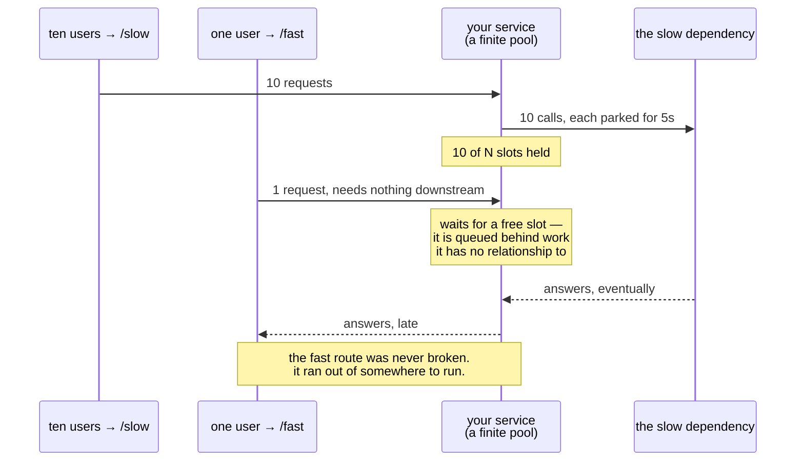

# 2.3 — The dependency that fails slowly

## One-line answer

A dependency that is **down** costs you one feature; a dependency that is **slow** costs you the whole
service — because every caller waiting on it is holding a resource, and those resources run out long
before the slow thing does.

---

## The story

🎬 **The scene.** A supermarket with eight checkouts. One of them has a till that has started taking a
very long time to process each card payment. Not failing — working, slowly. Perhaps a minute per
customer instead of ten seconds.

😬 **The naive fix.** Nothing, at first. It is one till out of eight, still serving people, and the
staff assume it will sort itself out. Nobody closes a working till.

💥 **Why it fails.** The queue at that till grows. People joining the shop see one short queue and
seven long ones and join the short one — which is short because nobody has *left* it. Within half an
hour the aisle behind it is blocked, which makes the other queues unreachable, which stops the other
seven tills serving people. **One slow till has stopped the entire shop, and every one of the other
seven is working perfectly.**

💡 **The insight.** If the till had simply **broken**, someone would have put a sign on it in thirty
seconds, the customers would have moved, and the shop would have lost one eighth of its capacity for
an afternoon. Broken is a loud, local, contained failure. **Slow is a quiet failure that spreads**,
because slowness consumes a shared resource — floor space, in the shop; threads, connections and
memory, in a service — and the shared resource is what everything else needs.

---

## The idea in plain language

[2.1](2.1-hard-and-soft-dependencies.md) assumed a dependency has two states: available and
unavailable. Real dependencies have a third, and it is the dangerous one:

| State | What your code sees | How bad |
| --- | --- | --- |
| **up** | a fast, correct answer | fine |
| **down** | a refusal, immediately | manageable — you know at once, and you can degrade |
| **slow** | eventually, an answer — or eventually, nothing | **the worst of the three** |

Slow is worse than down for a reason that is purely mechanical, and it is worth understanding exactly
rather than approximately.

### Why slow spreads and down does not

When your service calls a dependency, the call **holds resources** while it waits:

- a **thread** or a coroutine — a unit of the service's ability to do work at all;
- a **connection** — a socket, and often a slot in a connection pool of fixed size;
- **memory** — whatever the in-progress request was holding;
- a **slot in the queue** of requests the server has accepted but not answered.

Every one of those is finite. If a dependency answers in 50 ms and you handle 100 requests per second,
you need about five concurrent slots. If the same dependency slows to 5 seconds and the same traffic
arrives, you need five hundred. You do not have five hundred. So requests queue, the queue grows,
requests that have nothing to do with the slow dependency wait behind ones that do, and **the entire
service becomes unavailable because one soft dependency got slow.**

That is *resource exhaustion*, and the sequence has a name — a **cascading failure** — because it does
not stop at your service. Your callers are now waiting on you, holding *their* threads, and the same
arithmetic runs one level up.

### The three defences, in order of importance

**A timeout.** The single most important line of code around any network call. It converts *slow* into
*down*, and down is the failure mode you can handle. A call without a timeout is not a call with a
long timeout; it is a call with **no** upper bound, which means one bad afternoon at a provider can
park every thread you have, forever. Day 7.

**A bound on concurrency.** A limit on how many requests may be in flight against one dependency at a
time. Beyond that limit you fail fast rather than queue — because a queue you cannot drain is just a
slower way of failing, with the added disadvantage that the answers you eventually produce are for
requests whose users left. This is the **bulkhead** idea: partition the resource so one leak cannot
sink the ship.

**A circuit breaker.** After enough consecutive failures, stop calling entirely for a while and fail
immediately. This protects *both* sides: you stop wasting threads on a thing that is not working, and
the struggling dependency stops receiving traffic it cannot serve. Day 130 builds one.

Notice that all three are **bounds**, not fixes. None of them make the dependency faster. They contain
the blast radius, which is Principle 13, and they belong in the same change as the call.

### The trap: retries make it worse

The instinct when a call is slow is to retry. Work through it: the dependency is struggling; you time
out at three seconds and retry; now it is receiving *two* requests for every one it was already
failing to serve. With three attempts each, a struggling dependency receives four times its normal
load precisely when it can least handle it. This is a **retry storm**, and it is how a brief slowdown
becomes an outage that outlasts its cause.

Retries are still correct — they are how you survive a single lost packet — but only with three
properties: a **cap** on attempts, **exponential backoff** (each wait longer than the last), and
**jitter** (randomised waits, so a thousand clients do not all retry in the same instant). Day 130.

---

## Why Kriya needs it

Day 130 is *"Retries, backoff and the 429 storm"*, and Day 44 is *"Horizontal autoscaling, and why
more replicas do not fix a slow model."*

Day 44's title is this part's conclusion. When a service is slow because a downstream dependency is
slow, adding replicas adds *more clients* to the struggling dependency — so the autoscaler, doing
exactly what it was told, makes the outage worse and does it automatically. That is trap #4 —
*autonomy with no brake* — and understanding why requires understanding that slow spreads.

Much sooner: [Day 3](../../../day-003-pulse-v0/LESSON.md) gives `pulse` its first process and its
first port, and part 5.1 of that day is about what happens when something else is already holding the
port. Day 7 adds the first timeout, and it will be the most important line in the file.

---

## The mechanism

You can produce this failure on your own machine, with no dependencies and no service, in a way that
makes the resource exhaustion visible rather than theoretical.

```python
# lab/slow_dependency.py — one slow endpoint, a fixed pool of workers, and what happens next.
import threading
import time
from http.server import BaseHTTPRequestHandler, ThreadingHTTPServer

SLOW_SECONDS = 5.0
in_flight = 0
lock = threading.Lock()


class Handler(BaseHTTPRequestHandler):
    def do_GET(self) -> None:
        global in_flight
        with lock:
            in_flight += 1
            now = in_flight
        print(f"{self.path:8s} start  in flight: {now}", flush=True)
        if self.path == "/slow":
            time.sleep(SLOW_SECONDS)
        self.send_response(200)
        self.end_headers()
        self.wfile.write(b"ok\n")
        with lock:
            in_flight -= 1

    def log_message(self, *args: object) -> None:
        pass  # the default access log would drown the counter we care about


ThreadingHTTPServer(("127.0.0.1", 8777), Handler).serve_forever()
```

**Line by line:**

- `SLOW_SECONDS = 5.0` is the dependency's bad afternoon, simulated. Five seconds is chosen to be
  clearly slow and clearly not hung — the point is that it *succeeds*, eventually, which is what makes
  slow harder than down.
- `in_flight` with a `threading.Lock` counts concurrent requests. **The lock is not decoration:**
  `in_flight += 1` is a read, an add and a write, and two threads doing it at once can lose an
  increment. This is the smallest possible example of why concurrency is its own subject.
- `ThreadingHTTPServer` handles each request in its own thread, which is what lets you see requests
  pile up. A single-threaded server would serialise them and hide the effect — and, importantly, that
  is what a naive service *does*, which is why the effect surprises people.
- `time.sleep(SLOW_SECONDS)` on `/slow` only. `/fast` returns immediately. **Both are served by the
  same pool of threads**, and that shared pool is the shared resource from the story.
- `flush=True` is not optional and it is worth knowing why. Python buffers standard output when it
  is **not** a terminal, so the moment you redirect this server's output to a file — which is what
  every real deployment does — the counter lines sit in a buffer and appear minutes later, or never,
  if the process is killed. **This is one of the most common ways a running service appears to have
  no logs at all.** Day 67 replaces `print` with structured logging, which handles it properly.
- `log_message` is overridden to do nothing, because the default handler prints an access line per
  request to standard error and would bury the counter. Suppressing a log to see a signal is a real
  operational move and also a real operational hazard — you have just made a decision about what is
  worth recording.

Start it, then fire ten slow requests and one fast one:

```bash
uv run python days/day-002-shape-of-production-system/lab/slow_dependency.py &
for i in $(seq 1 10); do curl -s http://127.0.0.1:8777/slow >/dev/null & done
curl -sS -o /dev/null -w 'fast request took %{time_total}s\n' http://127.0.0.1:8777/fast
wait
kill %1
```

**Line by line:**

- `for i in $(seq 1 10); do ... & done` launches ten requests **in parallel** — the trailing `&`
  inside the loop is what makes them concurrent rather than sequential. Without it you would measure
  fifty seconds of politeness rather than a pile-up.
- The `curl` to `/fast` is the request that has *nothing to do with the slow dependency*. It is the
  customer at till number three. Its timing is the entire experiment.
- `-w 'fast request took %{time_total}s\n'` prints just the total, so the number is not buried.
- `wait` blocks until the background `curl`s finish, so the server is not killed mid-request — and
  `kill %1` stops the server. **Clean up**; a forgotten process on port 8777 is tomorrow's confusing
  error.

Observed on **2026-08-24** (the server's own output, and then the fast request's timing):

```text
/slow    start  in flight: 1
/slow    start  in flight: 2
/slow    start  in flight: 3
/slow    start  in flight: 4
/slow    start  in flight: 5
/slow    start  in flight: 6
/slow    start  in flight: 7
/slow    start  in flight: 8
/slow    start  in flight: 9
/slow    start  in flight: 10
/fast    start  in flight: 11
```

```text
fast request took 0.001401s
```

**Read that carefully, because it is not the dramatic result and the honest version matters more than
the tidy one.** Eleven requests in flight, ten of them parked for five seconds, and the fast route
answered in one and a half milliseconds. **Nothing collapsed.**

That is the correct finding, and it is the useful one: *slow does not automatically spread — it
spreads when the shared resource runs out.* `ThreadingHTTPServer` allocates a thread per request with
no upper bound, so on this machine ten parked threads cost essentially nothing and there was always a
slot for the eleventh request. Change either half of that and the result inverts:

| Change | What happens to `/fast` |
| --- | --- |
| a fixed worker pool of, say, four | it waits for a slow request to finish — seconds, not milliseconds |
| ten thousand concurrent slow requests instead of ten | the machine runs out of threads and everything stalls |
| a single-threaded server | it waits behind *all* the slow ones, in order |

**Which is why "we tested it and it was fine" is not evidence of anything here.** The failure is a
function of concurrency against a limit, and a test at ten concurrent requests on an unbounded pool
tests neither. Raise the loop count on your own machine until the fast request's time moves, and
write down the number where it happens — that number is your service's real concurrency limit, and
almost nobody knows theirs.



---

## When it breaks

The characteristic production symptom is a set of readings that look contradictory until you know this
part. Here is the shape, as it appears on a dashboard:

```text
error rate            0.1%   (normal)
CPU utilisation        12%   (low)
memory                 40%   (normal)
requests/sec           ~0     ← collapsed
p99 latency        timeout    ← everything is timing out
downstream "db"    p99 8.4s   ← the actual cause
```

**What it says:** the service is doing nothing, is using no CPU, and everything is timing out.
**What it actually means:** every worker is **blocked**, not busy. Blocked threads use no CPU — they
are asleep waiting on a socket — so a CPU graph, which is the first thing everybody looks at, shows a
machine that appears idle during a total outage. **Low CPU during an outage is a signature, not a
reassurance**, and recognising it saves a great deal of time.

The Python-side version, once a timeout finally exists:

```text
Traceback (most recent call last):
  File "/app/pulse/assist.py", line 63, in draft_reply
    resp = client.post(PROVIDER_URL, json=payload, timeout=3.0)
httpx.ReadTimeout
```

**What it says:** we waited three seconds and gave up.
**What it actually means:** something good. This is the timeout doing its job — converting *slow* into
*down* so the thread is returned and the service survives. An exception here is the mechanism working,
not failing, and the correct response is a `503` and a metric, not a longer timeout.

**The trap in that traceback:** the obvious "fix" is to raise the timeout, because the call *would*
have succeeded at four seconds. Doing so trades a fast honest failure for a slow one and moves you
back toward the supermarket. **A timeout is a decision about how long a user should wait, not a
guess about how long the dependency needs.** It comes from the latency budget in
[1.3](../01-the-request-path/1.3-latency-adds-up-along-the-path.md), not from observing the
dependency.

---

## In production

**What a professional writes instead of the teaching version.** Every outbound call carries a timeout
derived from the caller's remaining budget rather than a constant — **deadline propagation**, from
[1.3](../01-the-request-path/1.3-latency-adds-up-along-the-path.md). They also separate the two
timeouts that people conflate: a **connect** timeout (how long to establish a connection, which should
be short — under a second, because connecting is either fast or broken) and a **read** timeout (how
long to wait for the answer, which is the budget number). A single combined timeout hides the
distinction and is usually tuned to the larger of the two, which makes connection failures slow.

**What degrades at scale.** The queue you cannot see. Between your code and the network there are
several queues nobody put on the diagram: the connection pool, the server's accept backlog, the
event-loop task queue, the operating system's socket buffers. Under load, requests accumulate in these
and your service's own timing looks fine, because it measures from when the request *started being
handled*. The caller sees something completely different. **Measure at the caller, and measure queue
depth explicitly** — Day 63 for the histogram, Day 85 for the capacity model.

**The failure that only shows with real traffic.** Load shedding done implicitly, and therefore badly.
When you are past capacity you *will* shed load; the only question is whether you chose how. The
default is to shed by timeout — every request waits the full timeout and then fails, so you spend
100% of your capacity producing failures at the slowest possible rate. The deliberate version is to
reject immediately when the queue is over a threshold, which produces the same failure rate with the
capacity left over to serve the requests you did accept. The choice between those two is invisible
until the day it matters.

**The review comment a senior engineer leaves.** *"This call has a timeout, good — but the retry
around it has no cap and no backoff, so under a partial outage we'll multiply the load on something
that's already struggling. Cap it at two attempts, back off exponentially, add jitter, and count the
retries as their own metric so we can see a storm starting."*

**The signal you would alert on.** Three, and the third is the one people miss:

- **latency percentiles per dependency**, so slow is visible before it is fatal;
- **concurrency in flight per dependency**, against its limit — this is the resource that runs out,
  and it hits the ceiling before latency looks catastrophic, so it is the *earliest* warning you can
  get;
- **rejections and retries per second**, so you can see load shedding and retry storms as they start.

And an explicit non-alert: **do not page on CPU**. In this failure mode CPU is *low*, and a team whose
main saturation alert is CPU will get no page at all during the outage.

**Blast radius.** This part starts a real server that deliberately sleeps for five seconds per request
and a loop that fires ten concurrent requests at it. Worst case: you raise the loop count high enough
to make your own machine unresponsive — on four cores with 11.7 GiB (Addendum 02 §3.1), ten threads is
nothing and ten thousand is a bad afternoon. Who can trigger it: only you; the server binds to
`127.0.0.1` and is unreachable from the network. What bounds it: the explicit loopback bind, the fixed
loop count, and `kill %1`.

**One bound that turned out not to hold, discovered while writing this part.** Killing the server and
starting another produced *two* processes listening on 8777 at once, confirmed with
`netstat -ano | grep :8777`. Python's `HTTPServer` sets `allow_reuse_address`, and on Windows that
permits a second live socket on the same port rather than refusing — where Linux would refuse with
*address already in use*. So the reassuring error you expect may simply not arrive, and requests go to
whichever socket the operating system picks. **Check with `netstat` that the port is actually free
afterwards** instead of assuming your `kill` worked; Day 3 part 5.1 goes into this properly, because
it is the first real error a new service meets.

**Cost:** `0` model calls, `0` tokens. One Python process, a handful of threads, a few MB, for under a
minute of wall-clock. `0` MB resident once you have killed it.

**The interview question.** *"Your service went down. CPU was flat at 10% the whole time. What was
happening?"* This is a common and excellent question, and the answer is this part in one sentence:
the workers were blocked rather than busy, almost certainly waiting on something downstream. The
follow-up is what they really want: *how would you have found it faster?* — per-dependency latency and
in-flight concurrency, on the same dashboard as the error rate.

---

## Check yourself

```bash
uv run python -c "
rps, normal_ms, slow_ms = 100, 50, 5000
print(f'concurrent slots needed: normal={rps*normal_ms/1000:.0f}  slow={rps*slow_ms/1000:.0f}')"
```

Little's law, in one line: concurrency equals arrival rate times duration. A hundredfold slowdown
needs a hundredfold more slots, and you do not have them.

**Say out loud, without scrolling up:** *why is CPU low during this kind of outage, and which two
signals would have shown it before the service collapsed?*
