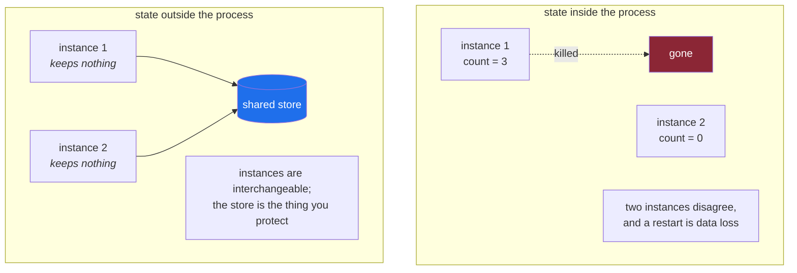

# 3.1 — "Stateless" is a claim about the process, not about the system

## One-line answer

Calling a service stateless means **you can kill any instance at any moment and lose nothing**. The
state did not disappear. It moved somewhere designed to keep it, and that somewhere is now the hard
part of your system.

---

## The story

🎬 **The scene.** The cloakroom at a theatre. You hand over your coat and get a numbered ticket. Any
attendant can serve you when you come back, because the coat is on a numbered peg and the ticket says
which one.

😬 **The naive fix.** It is a busy night, so they put a second attendant on. To be quick, the new one
starts keeping track of a few coats in her head instead of using the pegs. She will remember whose is
whose.

💥 **Why it fails.** Her shift ends and she goes home. Four people cannot get their coats, and nobody
else in the building can help them, because the information needed was never written down anywhere.
The system did not fail. It lost a *component*, which was a normal, scheduled, expected event, and the
component was holding something irreplaceable.

💡 **The insight.** The attendants were interchangeable **only because they kept nothing**. The
cloakroom is not stateless. It is full of coats. What is stateless is the *attendant*, and that is
exactly what makes attendants replaceable, addable and removable without ceremony. **You do not get
rid of state. You move it out of the parts you want to be disposable.**

---

## The idea in plain language

**State** is anything the system remembers between one request and the next. A row in a database, a
file on disk, a value in memory, a session, a counter, an uploaded image, a trained model, a cached
answer.

**A stateless process** is one that keeps none of it. Every request carries everything needed to
handle it, or the process fetches what it needs from somewhere else and forgets it again afterwards.
The test is a single sentence, and it is worth memorising, because it is the only test that matters.

> **If I kill this process right now, without warning, is anything lost?**

If nothing is lost, it is stateless. If something is lost, it is not, however the diagram is labelled.

### What "stateless" actually buys you

It is not tidiness. It is four specific operational powers, and each one is a later phase of this
plan.

| Power | Because | Day |
| --- | --- | --- |
| **restart freely** | there is nothing to preserve | 26, 41 |
| **run many copies** | any copy can serve any request | 34 |
| **scale up and down** | adding and removing copies is not a data operation | 44 |
| **deploy without downtime** | old and new copies can run side by side | 43 |

Every one of those becomes hard the instant a process remembers something. That is why "make it
stateless" is such persistent advice. It is not an aesthetic preference. It is the precondition for
four things you will want very badly by Phase 5.

### The state did not vanish

This is where the phrase misleads people. Making a process stateless does not reduce the amount of
state in the system by one byte. It **moves** that state into a component whose entire job is keeping
things, such as a database, an object store or a cache, and that component is now several things at
once.

- It is the thing that cannot be casually restarted.
- It is the thing that needs backups, and a restore somebody has actually tested.
- It is the thing that is hard to scale.
- And very often it is the single point of failure that the architecture diagram was hiding.

So "we made the service stateless" is half a sentence. The full one is *"we made the service stateless
by moving its state into X, and X is now the part of the system that needs the care."* Day 47, on
persistent storage and StatefulSets, is where that care becomes concrete.

### Four kinds of state, which behave completely differently

Lumping them together is the mistake. They differ in how bad it is to lose them, which is the only
property that matters operationally.

| Kind | Example in `pulse` | Losing it means |
| --- | --- | --- |
| **configuration** | the model version to serve, the provider URL | the process cannot start correctly, but it is in the repository |
| **durable data** | the ticket archive | permanent loss, and this is the one with backups |
| **derived data** | the retrieval index, a trained model file | expensive to lose, but rebuildable from durable data |
| **ephemeral** | a cache entry, an in-flight request | nothing, because it is regenerated on demand |

**The derived row is the interesting one**, and it is the row that machine-learning systems live in. A
trained model is not durable data, because it can be rebuilt, but rebuilding it takes hours and needs
the exact code, data and parameters that produced it. That is why the model registry on Day 105 exists
and why reproducibility on Day 107 is a real subject. Derived data is only genuinely rebuildable if
you kept everything needed to rebuild it.

---

## Why Kriya needs it

Day 39 puts `pulse` on Kubernetes as a **Deployment**, and Day 47 introduces **StatefulSets** for the
things that cannot be one.

Kubernetes makes this distinction structural rather than advisory. A Deployment assumes its pods are
interchangeable and disposable, so it will kill and recreate them, in any order, whenever it feels the
need. If your process was keeping something, Kubernetes will destroy it, not as a failure but as
normal operation, quietly, on a Tuesday. Day 45, on drains and disruption budgets, is the day you
watch a node go away on purpose.

Nearer to hand, [Day 3](../../../day-003-pulse-v0/LESSON.md)'s `pulse` is stateless *by accident*,
because it has no state yet, since it does nothing yet. Part 3.2 asks you to keep it that way
deliberately, which is a different thing and a decision worth making explicitly while it is free.

---

## The mechanism

The test in the box above is runnable. Here is a process that quietly keeps something, and then the
same process fixed.

```python
# lab/stateful.py — a counter that lives in the process. Kill it and the count is gone.
from http.server import BaseHTTPRequestHandler, HTTPServer

count = 0


class Handler(BaseHTTPRequestHandler):
    def do_GET(self) -> None:
        global count
        count += 1
        self.send_response(200)
        self.end_headers()
        self.wfile.write(f"served {count} requests\n".encode())

    def log_message(self, *args: object) -> None:
        pass


HTTPServer(("127.0.0.1", 8788), Handler).serve_forever()
```

**Line by line:**

- `count = 0` at module level is the state. It looks completely harmless, and that is the point.
  **The state that hurts you is never labelled `state`.** It is a counter, a cache, a dictionary of
  in-progress jobs, a lazily loaded config, an open file handle.
- `global count` inside the handler is the tell. Any function that reaches outside itself to change
  something that outlives the request is making the process stateful. If you are hunting for
  accidental state in a codebase you do not know, searching for `global` and for module-level mutable
  values finds most of it.
- `count += 1` is also **not thread-safe**, being the same read-modify-write race as in
  [2.3](../02-dependencies/2.3-the-dependency-that-fails-slowly.md). That is two bugs for the price of
  one line, and they are the two bugs that in-process state always brings.
- `HTTPServer` rather than `ThreadingHTTPServer`, deliberately. It is single-threaded, so the count is
  at least consistent. Making it correct required giving up concurrency, which is the trade in
  miniature.

Run it, count to three, kill it, and count again.

```bash
uv run python days/day-002-shape-of-production-system/lab/stateful.py &
curl -s http://127.0.0.1:8788/ ; curl -s http://127.0.0.1:8788/ ; curl -s http://127.0.0.1:8788/
kill %1
uv run python days/day-002-shape-of-production-system/lab/stateful.py &
curl -s http://127.0.0.1:8788/
kill %1
```

**Line by line:**

- Three `curl` commands separated by `;` run in sequence, so the count is deterministic. That is
  unlike [2.3](../02-dependencies/2.3-the-dependency-that-fails-slowly.md), where the `&` was the
  point.
- `kill %1` stops the most recent background job, and then the server is started again. **This is the
  experiment.** A restart is the most ordinary event in the life of a production process, whether it
  comes from a deploy, a node reboot, an out-of-memory kill or a scale-down, and it happens without
  asking.
- The second run's single `curl` is the measurement.

Observed on **2026-08-24**:

```text
served 1 requests
served 2 requests
served 3 requests
served 1 requests
```

**The fourth line is the whole part.** Nothing failed. There was no error, no traceback and no alert.
The process was restarted, which is normal, and the system quietly forgot. If that counter had been a
shopping basket, a partly uploaded file or a queue of jobs to retry, the loss would have been just as
silent and considerably more expensive.



---

## When it breaks

In-process state fails in a way that is much worse than losing it. With more than one instance it
becomes **inconsistent**, and the symptom is intermittent.

```text
$ for i in 1 2 3 4; do curl -s http://pulse.local/count; done
served 7 requests
served 3 requests
served 8 requests
served 4 requests
```

**What it says:** the count is jumping around.

**What it actually means:** there are two instances behind a load balancer, each with its own counter,
and each request lands on whichever one the balancer chose. Both are working perfectly and neither is
wrong. **The system has no single answer to the question**, and it never did. Adding the second
instance simply made that visible.

**What makes this genuinely nasty:** it is intermittent, so it survives testing. One instance in
development, one in CI, and the bug appears only in production, only under load, and only sometimes.
Users report it, you cannot reproduce it, and the logs from *one* instance look fine.

**The smallest fix** is not to make the counter consistent. It is to move it out into a shared store,
or to establish that nothing needs to count. Making in-process state work across instances means
distributed consensus, and that is a substantially harder problem than any of the alternatives.

The other characteristic failure is the one people meet in Kubernetes first.

```text
$ kubectl describe pod pulse-7d9f8c-x2k4p
Events:
  Type     Reason     Age   From     Message
  ----     ------     ----  ----     -------
  Normal   Killing    12s   kubelet  Stopping container pulse
  Normal   Started    3s    kubelet  Started container pulse
```

**What it says:** a pod was stopped and started. Both events are `Normal`.

**What it actually means:** exactly what it says, and that is the shock. Kubernetes did nothing wrong
and reported nothing unusual, because it recycled a pod, which is its job. If your process was holding
something, it is gone, and **nothing anywhere will tell you.** Day 40 is a whole day on reading these
events, and this is the one that teaches restraint. `Normal` really does mean normal.

---

## In production

**What a professional does differently.** They treat the statelessness claim as something to be
**tested** rather than asserted. The test is blunt and cheap: kill an instance during a normal working
afternoon and see whether anything notices. In a mature setup this is automated and continuous, using
the `chaos` family of tools, but the value is available immediately at zero cost, by restarting one
instance and watching the error rate. **A statelessness claim that has never survived a restart under
load is an untested claim.**

**What degrades at scale.** Sticky sessions, and the reasoning that produces them. When in-process
state turns out to exist, the tempting fix is to route each user back to the same instance, which is
called *session affinity*, because it makes the symptom disappear immediately. It also destroys the
four powers in the table above, because you can no longer restart freely without dropping those users'
state, scale down freely, or deploy without disruption. Affinity is a debt with a very high interest
rate, and it is usually taken on in a hurry.

**The failure that only shows with real traffic.** State that is *accidentally* shared. A module-level
dictionary used as a cache works perfectly in development, holds a few entries in staging, and grows
without bound in production because nothing evicts anything. The process gets slower, then gets killed
for using too much memory, then restarts, then does it all again. From the outside it looks like a
memory leak. It is a cache with no bound. This is Day 6's subject, covering the OOM killer and exit
137, and it begins as a decision made on a day like today.

**The review comment a senior engineer leaves.** *"This dictionary at module scope is per-instance
state. With three replicas we will have three different answers, and it will grow until the pod gets
OOM-killed. If it is a cache, give it a size limit and a TTL and say so. If it is data, put it in the
database."*

**The signal you would alert on.** For a process claiming to be stateless, it is **memory growth over
time**. A genuinely stateless process has flat memory once it is warmed up, so a slow upward slope is
the signature of accumulated state, and it is visible days before the process is killed. Alert on the
*trend* rather than the absolute value. A process at 60% of its limit and rising steadily is a
scheduled incident, and a process at 85% and flat is fine. Day 42 sets the limits, and Day 126 is
where model memory makes this urgent.

**Blast radius.** This part runs a local server twice and kills it. The worst case is a leftover
process holding port 8788, and note from
[2.3](../02-dependencies/2.3-the-dependency-that-fails-slowly.md) that on Windows a second server may
bind the same port instead of refusing, so *verify* with `netstat -ano | grep :8788` rather than
trusting the `kill`. The server binds to `127.0.0.1` and is unreachable from the network.

**Cost:** `0` model calls and `0` tokens. Two short-lived Python processes, a few MB each, leaving `0`
MB resident once killed.

**The interview question.** *"What does it mean for a service to be stateless, and is yours?"* The weak
answer defines the term. The strong answer defines it as *"I can kill any instance at any moment and
lose nothing"*, then immediately says where the state actually went and what protects it there. Best
of all, it admits the one place where the claim is not quite true, because on a real system there
always is one.

---

## Check yourself

```bash
grep -rn "^[a-z_]* = \[\]\|^[a-z_]* = {}\|^[a-z_]* = 0" pulse/ platform_ops/ 2>/dev/null || echo "no module-level mutable state — and no code yet either"
```

Run it today for the "no code yet" answer, and run it again on Day 39 for a real one. Module-level
mutable values are where accidental state hides.

**Say out loud, without scrolling up:** *state the one-sentence test for statelessness, and then say
where the state went and what now has to protect it.*
