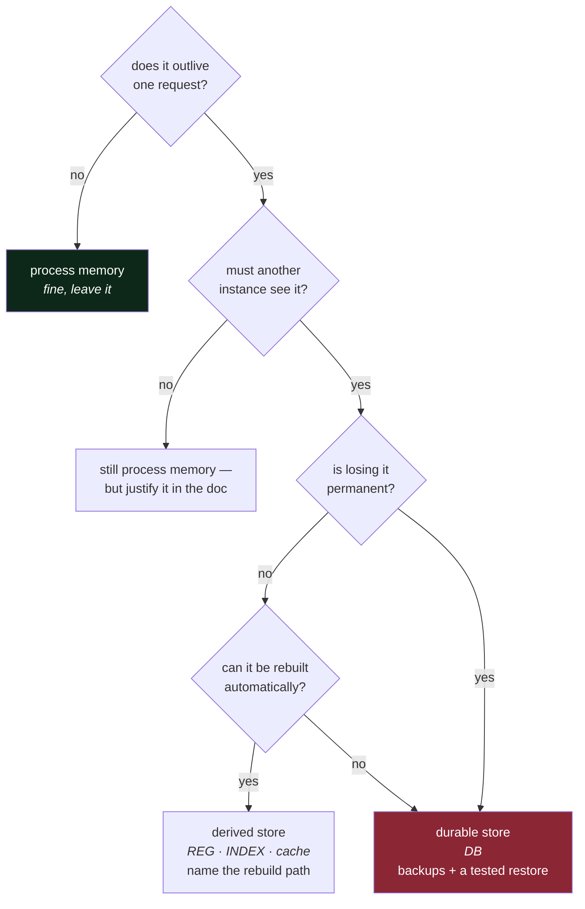

# 3.2 — Where `pulse`'s state will actually live

## One-line answer

Decide where each kind of state lives **before you write the code that produces it**, because state
that has already been written somewhere is expensive to move, and state that has not been written
anywhere yet is free to place.

---

## The story

🎬 **The scene.** Somebody has just moved into a flat. There are boxes everywhere. They need a plate,
so they unpack the plates and put them in the nearest cupboard. Then a saucepan, into the next one.
Then a coat, over the back of a chair.

😬 **The naive fix.** Carry on like that. Everything will find its own place eventually, and it is
faster than planning.

💥 **Why it fails.** Six months later the plates are across the room from the table, the saucepans are
nowhere near the hob, and the coats are still on a chair, because there is a hook but the hook is
behind the door and behind the door is now where the bin lives. **Nothing is where it is because
anybody decided it should be there.** Everything is where it is because of the order it came out of
the boxes. And now moving any one thing means moving three others.

💡 **The insight.** The cost of putting something in the right place is nearly zero *before* it has a
place. It rises steeply afterwards, not because moving one item is hard, but because other things have
arranged themselves around the wrong answer. **Placement decisions are cheap exactly once**, and that
moment is now.

---

## The idea in plain language

[3.1](3.1-stateless-is-a-claim-about-the-process.md) said that state has to live somewhere other than
the process. This part says *where*, for each of `pulse`'s four kinds, and, more usefully, gives you
the question that decides it.

The question is: **who else needs this, and what happens when it is gone?**

Three properties fall out of that question, and between them they select the storage.

| Property | Meaning | If yes |
| --- | --- | --- |
| **shared** | more than one instance has to see the same value | it cannot live in a process |
| **durable** | losing it is permanent | it needs a store with backups and a tested restore |
| **large** | it does not fit comfortably in memory or in git | it needs object storage or a volume |

### `pulse`'s state, placed

Here is the plan's §3, read as a state inventory rather than as a feature list.

| What | Kind | Shared? | Durable? | Large? | Where it lives | From |
| --- | --- | --- | --- | --- | --- | --- |
| provider URL, model version, log level | configuration | yes | no, it is in the repository | no | **the environment**, read at startup | Day 9 |
| API keys | configuration, secret | yes | no | no | **the environment**, never in git | Day 9 |
| the ticket archive | durable data | yes | **yes** | growing | **a database** (`DB`) | Day 47 |
| the trained model file | derived | yes | no, it is rebuildable | yes, tens of MB | **the model registry** (`REG`) | Day 105 |
| the retrieval index | derived | yes | no, it is rebuildable | yes | **a vector store** (`INDEX`) | Day 139 |
| a cached `/assist` answer | ephemeral | ideally | no | no | **a cache**, with a size limit and an expiry | Day 133 |
| the request currently being handled | ephemeral | no | no | no | **process memory**, and it is fine there | Day 3 |

**Read the last row as the permission it is.** Not all in-process state is a bug. State that belongs
to one request, and dies with it, is exactly where it should be. The rule from
[3.1](3.1-stateless-is-a-claim-about-the-process.md) is about state that *outlives* a request.

### The two rows that decide the shape of the system

**Configuration goes in the environment.** Not in a file inside the image, not in a constant in the
code, and not in a database. It is read at startup, from environment variables, and the process
**refuses to start** if something required is missing, rather than failing later on a request nobody
expected to fail. This is the twelve-factor rule, and it is Day 9's whole subject. The reason it
matters here is that it is what makes one artifact runnable in development and in production without
being rebuilt, which is what makes Day 10's promotion story possible.

**The database is the only genuinely durable thing.** Everything else on that list can be rebuilt,
re-fetched or regenerated. That single fact concentrates all of your backup, restore, migration and
disaster-recovery attention on exactly one component, which is a much better position than spreading
it across seven. It is also a position you only get by *deciding* it, because the default is for
durable data to leak into files, caches and model artifacts until four things are irreplaceable.

### `/healthz` and the database, decided now

[2.1](../02-dependencies/2.1-hard-and-soft-dependencies.md) classified `DB` as soft for `/healthz` and
promised the reasoning here. It is this.

A health endpoint answers the question *"should this instance receive traffic?"* If it checks the
database and the database is down, **every instance answers no at the same moment**, every instance is
removed or restarted, and a database outage, which should have cost you the data routes, has cost you
the whole service and any chance of serving a cached or degraded response. Worse, when the database
comes back there is nothing left running to notice.

So `/healthz` checks that the process can respond, and nothing else. A separate endpoint reports
dependency status for humans and dashboards. Day 41 formalises this as *liveness* versus *readiness*,
and Day 3 writes the first one.

---

## Why Kriya needs it

Day 107 asks you to **reproduce a prediction the system made months earlier**, and Day 221 asks you to
prove data lineage for an audit.

Both of those are questions about state placement. Reproducing a prediction needs the code, from git;
the exact dependency versions, from the lockfile; the model artifact, from `REG`; the data version,
from Day 87's tooling; and the input, from `DB`. That is five stores, and the question is answerable
only if each one was *placed* somewhere that keeps history rather than somewhere that keeps the current
value. **A model file on a laptop and a model file in a registry are the same bytes and completely
different answers to that question.**

Nearer to hand, [Day 3](../../../day-003-pulse-v0/LESSON.md) writes a service with no state at all,
and the temptation will be to add a small dictionary "just for now".

---

## The mechanism

Write the placement into `docs/ARCHITECTURE.md` as a third section, so that it is a commitment rather
than an intention.

````markdown
## State

| what | kind | shared | durable | where it lives | if it is lost |
| --- | --- | --- | --- | --- | --- |
| config + secrets | configuration | yes | no | environment variables, read at startup | the process refuses to start |
| ticket archive | durable | yes | **yes** | `DB` | **permanent loss — this is the backup target** |
| trained model | derived | yes | no | `REG` | retrain from a tracked run |
| retrieval index | derived | yes | no | `INDEX` | rebuild from `DB` |
| assist cache | ephemeral | yes | no | cache with a size limit and an expiry | pay for the generation again |
| in-flight request | ephemeral | no | no | process memory | that one request fails |

**One durable store.** Everything else is rebuildable, and the rebuild path is named above.
`/healthz` deliberately touches none of this — see `ADR-0007`.
````

**Line by line:**

- The **`if it is lost`** column is the one that earns its place. Every other column describes the
  present, and this one describes a *decision about a future event*. It is the column somebody will
  read during an incident, and `"rebuild from DB"` is a specification you can hold the code to.
- **`durable` is marked on exactly one row.** That is the design, stated so that it can be reviewed.
  If a second row acquires a **yes** later, that is a significant architectural change and it should
  arrive with an ADR rather than with a commit.
- The **`shared`** column decides whether something may live in a process at all. Only the last row is
  `no`, and only that row is allowed in memory.
- The cache row says *"with a size limit and an expiry"* rather than just *"a cache"*. **An unbounded
  cache is a memory leak with better branding**, and writing the bound into the specification is
  Principle 13 applied to storage, where the containment arrives with the capability.
- The closing note names an ADR that does not exist yet. Writing it is one of today's `TODO(me)`
  items, because the `/healthz` decision is exactly the kind of choice that is *expensive to reverse
  and non-obvious to a stranger*, which is the two-part filter from
  [Day 1, part 2.4](../../../day-001-what-operations-actually-is/parts/02-the-repo-remembers/2.4-the-adr-and-its-expiry-condition.md).
  ADR-0001 to ADR-0006 already exist, so yours is `ADR-0007`.



**Follow the diamonds for any piece of state and you get a placement.** The path that ends at the red
box is the expensive one, and the whole design goal is for as few things as possible to reach it.

---

## When it breaks

State placement fails silently and is discovered at restore time, which is the worst possible moment.
Here is the shape.

```text
$ ls -la /var/lib/pulse/
total 48216
drwxr-xr-x  2 pulse pulse     4096 Aug 24 02:11 .
-rw-r--r--  1 pulse pulse 49364992 Aug 24 02:11 model-current.pkl
-rw-r--r--  1 pulse pulse    12408 Aug 24 02:11 feedback.jsonl
```

**What it says:** two files in a data directory.

**What it actually means:** two completely different problems living in the same place, and only one of
them is known about.

`model-current.pkl` is derived. Losing it costs a retrain, which is annoying and survivable, *if* the
run that produced it was tracked. If it was produced by somebody running a notebook, it is not derived
at all. It is **durable and undocumented**, and it cannot be rebuilt.

`feedback.jsonl` is worse. Somebody added a feature where users rate a generated reply, and the ratings
are appended to a file on the instance's local disk. That is **durable data in an ephemeral place**.
The pod is recreated on the next deploy and the file goes with it. Nobody notices, because nothing
reads it yet, since the plan was to use it for retraining "later". The loss is discovered months
afterwards, when later arrives.

**The smallest fix** for `feedback.jsonl` is not a backup of the volume. It is recognising that the row
belongs in the durable column, which means it belongs in `DB`. **A backup of the wrong storage location
is a way of preserving a mistake.**

And here is the failure that produces the loudest noise.

```text
$ kubectl get pod pulse-7d9f8c-x2k4p
NAME                  READY   STATUS             RESTARTS   AGE
pulse-7d9f8c-x2k4p    0/1     CrashLoopBackOff   5          4m
$ kubectl logs pulse-7d9f8c-x2k4p
Traceback (most recent call last):
  File "/app/pulse/config.py", line 14, in load
    raise RuntimeError(f"missing required environment variable: {name}")
RuntimeError: missing required environment variable: PULSE_DATABASE_URL
```

**What it says:** the process will not start without a configuration value.

**What it actually means:** the configuration placement is working exactly as designed. This is the
*good* failure. It is loud, it is immediate, it happens at startup, and it names the missing thing. The
alternative, which is what happens when configuration is read lazily, is a service that starts happily
and then fails on the first request that needs the database, by which point it is in production and
serving errors. Day 9 builds the loud version deliberately.

---

## In production

**What a professional does differently.** They keep an explicit **state inventory**, meaning the table
above, maintained, and they run one specific drill against it: delete a thing and restore it. Not
theoretically. A backup that has never been restored is not a backup. It is a file with an optimistic
name, and the number of organisations that discover this during their first real data loss is much
higher than anybody would like. Day 47 is where you restore something for the first time.

**What degrades at scale.** The number of places state accumulates without anybody deciding. Every
feature adds a little, and the additions are individually reasonable: a file for temporary uploads, a
dictionary for rate-limit counters, a directory for generated reports. None of them appear on a
diagram. The countermeasure is procedural rather than technical. **The state table is part of code
review**, and a change that writes something new somewhere new either adds a row or explains why not.

**The failure that only shows with real traffic.** Local disk, on multiple instances. It works
perfectly with one instance, and with three it produces a system where each instance has a *different
partial view*. A file uploaded to instance 2 is invisible to instances 1 and 3, so a retry lands
somewhere else and reports the file missing. It is intermittent, it is not reproducible, and every
individual component is behaving correctly. The symptom is "it works most of the time", which is the
hardest symptom there is.

**The review comment a senior engineer leaves.** *"This writes user feedback to a local file. With
replicas that is a partial dataset per pod, and on the next deploy it is gone. If we want this data, it
is durable and it goes in the database. If we do not want it, do not collect it. Right now we are
collecting it and losing it, which is the worst of both."*

**The signal you would alert on.** Two, and they are unusually valuable relative to what they cost.
**Disk usage on any volume**, because a filling disk takes down everything on the machine and gives you
days of warning if somebody is watching, which is Day 5. And **age of the last successful backup**,
because that is the only signal that tells a working backup system apart from a stopped one. Notice
that the second is an *absence* alert, which is the shape recommended in
[Day 1, part 1.6](../../../day-001-what-operations-actually-is/parts/01-what-ops-is/1.6-toil-and-the-line-you-automate.md).
You alert on not having succeeded recently rather than on having failed.

**Blast radius:** none from this part. It writes one Markdown table and starts nothing. The table is a
specification with real consequences, though. A row placed in the wrong column produces code that loses
data, and the loss is silent. What bounds it is the `if it is lost` column, which is reviewable, and
the rule that a second **durable** row requires an ADR.

**Cost:** `0` requests, `0` tokens and `0` MB resident today. The rows commit you to future cost: `DB`
is part of the `core` profile at roughly 700 MB (Addendum 02 §4), and `INDEX` lands in the `llm`
profile, which is the tight one.

**The interview question.** *"Where does your service keep state?"* The strong answer is a short
inventory with a placement and a loss consequence for each item, and it ends with the sentence that
proves the thinking happened: *"exactly one of these is genuinely durable, and everything else has a
named rebuild path."* If a candidate cannot say which single component would cause permanent data loss,
they have not looked.

---

## Check yourself

```bash
grep -A10 '^## State' docs/ARCHITECTURE.md | grep -c '| \*\*yes\*\* |'
```

Count the rows marked durable. If the answer is not `1`, you have either found something worth an ADR
or made a table you will not be able to defend.

**Say out loud, without scrolling up:** *why does a health check that queries the database turn a
database outage into a total outage?*
