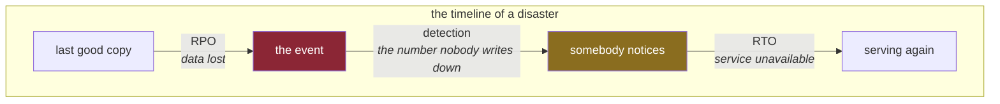

# 3.3 — What you can lose, and what you cannot

## One-line answer

For every piece of state, two numbers decide the entire design: **how much you may lose** and **how
long you may be without it** — and both are business decisions that engineers are usually left to
make by accident.

---

## The story

🎬 **The scene.** A photographer keeps their work on a laptop. They also have an external drive they
copy things to, roughly, when they remember.

😬 **The naive fix.** The laptop dies. Not a problem — there is a backup.

💥 **Why it fails.** Two questions turn out to matter and neither had an answer. *How old is the
backup?* Three weeks, so three weeks of work is gone. *How long until they can work again?* The drive
needs a machine to plug into, the software has to be reinstalled and licensed, and the raw files have
to be re-imported — four days. **The backup existed. Nobody had ever asked how much it protected or
how fast it worked**, and those two numbers were the entire value of it.

💡 **The insight.** "Do you have a backup?" is not the question. It is a yes-or-no answer to a
situation that is entirely about *how much* and *how long*. Someone who copies files nightly and can
restore in an hour, and someone who copies monthly and takes a week, both truthfully say yes — and
they have completely different systems.

---

## The idea in plain language

Two numbers, and they have standard names because they are asked constantly:

**RPO — recovery point objective.** How much data may you lose, measured in *time*. An RPO of one hour
means: after any disaster, we accept losing up to an hour of the most recent data. It is decided by
**how often you copy**.

**RTO — recovery time objective.** How long may the service be unavailable while you recover. An RTO
of four hours means: within four hours of the disaster, we are serving again. It is decided by **how
fast the restore is** — including finding the backup, provisioning somewhere to put it, and the part
everybody forgets, which is *deciding to do it*.

They are independent. You can have a wonderful RPO and a terrible RTO: a copy taken every minute, onto
a tape in a building nobody can enter until Monday.

### Why they must be decided rather than discovered

Because the cost curve is steep and non-linear. Getting RPO from a day to an hour is usually cheap;
getting it from an hour to a second means continuous replication, which changes the architecture and
often the database. Getting RTO from a week to a day is a written procedure; getting it from a day to
five minutes means a standby system that is already running, which roughly doubles the cost of the
component.

So the numbers are a **trade**, and the trade belongs to whoever owns the consequence of losing the
data. The engineering failure is not choosing badly — it is not choosing, in which case you get
whatever the tooling's defaults happen to give you, and you find out during the incident.

### For `pulse`

Using the state table from [3.2](3.2-where-pulse-state-will-live.md), and being honest that this is a
learning system where the data is synthetic:

| What | RPO — how much may be lost | RTO — how long without it | Why |
| --- | --- | --- | --- |
| config + secrets | **0** | minutes | it is in the repository and the environment; there is nothing to lose |
| ticket archive (`DB`) | **one hour** | four hours | the only durable store; the number that actually needs a decision |
| trained model (`REG`) | ∞ — it is rebuildable | one hour | serve the previous model version while retraining |
| retrieval index (`INDEX`) | ∞ — rebuildable from `DB` | four hours | `/assist` degrades to ungrounded meanwhile |
| assist cache | ∞ | 0 | losing a cache costs latency and quota, not correctness |
| in-flight requests | ∞ | 0 | the client retries |

**Read the second row against all the others.** Exactly one line needs a real conversation, because
exactly one component holds something that cannot be recreated. That is the payoff for the placement
work in [3.2](3.2-where-pulse-state-will-live.md): concentrating durability into one component
concentrates the *hard question* into one row as well.

**And read the `∞` symbols as the load-bearing claims they are.** `∞` on the index row means
*"rebuildable from `DB`"*, and that is only true if the rebuild is automated, tested and possible
without the person who wrote it. An untested rebuild path is not a rebuild path, and the row should
say `unknown` until it has been run — which is [4.3](../04-blast-radius/4.3-the-map-is-wrong.md)'s
whole complaint about maps.

### The third number nobody writes down

There is a quantity that matters as much as either and appears in almost no plan: **how long until
somebody notices.** An RPO of one hour is meaningless if the corruption started on Tuesday and was
discovered on Friday — you now need a backup from before Tuesday, which is outside the window you
designed for, and the hourly copies have all faithfully copied the corruption.

This is why *detection* time belongs next to RPO and RTO, and why the phrase "we have backups" is such
a weak reassurance against the failure mode that actually happens: **not deletion, but slow silent
corruption.** Day 90 (data validation at the boundary) is the real defence, and it is a very different
mechanism from a backup.

---

## Why Kriya needs it

Day 47 is *"Persistent storage and StatefulSets — because models and indexes are not stateless"*, and
Day 229 is the production readiness review.

The readiness review asks, in writing, what your RPO and RTO are and when the restore was last
tested. There are only two kinds of answer: a number with a date next to it, or an admission. **The
plan requires the admission rather than a guess**, which is Principle 10 — fail honestly — applied to
your own documentation.

Day 82's postmortem template has a section for data loss, and Day 235's audit asks you to prove the
claim from the repository alone.

---

## The mechanism

Add the two numbers to the state table in `docs/ARCHITECTURE.md`, and — the part that makes them real
— a date for when the restore was last exercised.

````markdown
## State — recovery objectives

| what | RPO | RTO | rebuild or restore path | last tested |
| --- | --- | --- | --- | --- |
| config + secrets | 0 | minutes | re-read from the environment; `.env.example` lists the names | **never** |
| ticket archive (`DB`) | one hour | four hours | restore the most recent dump | **never** |
| trained model (`REG`) | n/a — rebuildable | one hour | promote the previous registry version | **never** |
| retrieval index (`INDEX`) | n/a — rebuildable | four hours | rebuild from `DB` | **never** |

**`never` is the honest value today and it is the point of the column.** A path that has not been run
is a plan, not a capability. Each becomes a date on the day it is first exercised: Day 47 for the
database restore, Day 105 for the registry rollback, Day 139 for the index rebuild.
````

**Line by line:**

- **`last tested`** is the column that separates this table from a wish. Without it, every row reads
  as a capability; with it, every row reads as what it actually is today. The plan's ADR format makes
  the same move with its *"what would make us change our minds"* section — a document is honest when
  it contains something that can be embarrassing.
- **`never` is written out rather than left blank.** A blank cell is ambiguous — not applicable, not
  known, not filled in? — and ambiguity in an operational document is read optimistically under
  pressure. **Write the bad value.**
- **`n/a — rebuildable`** rather than `∞` in the RPO column, because a symbol invites the reader to
  supply their own meaning. The words say precisely why there is no number.
- The RTO for the model is *"promote the previous registry version"* rather than *"retrain"*. Those
  are different recoveries with different durations, and naming the fast one is what makes an hour
  plausible. Retraining is the slow path and belongs in a runbook, not in an RTO.
- Note there is **no row for the assist cache**. Deliberate: a component with nothing to recover does
  not need a line in a recovery table, and padding the table with rows that say "nothing to do"
  trains the reader to skim it. Every row here is a row that requires action.



**The middle arrow is the one that ruins plans.** RPO and RTO are both measured from the event, and
the clock that actually runs is the one that starts when somebody notices.

---

## When it breaks

Two failures, and the second is the one that catches careful people.

**The restore that has never been run.** The classic output:

```text
$ pg_restore -d pulse /backups/pulse-2026-08-23.dump
pg_restore: error: could not open input file "/backups/pulse-2026-08-23.dump": No such file or directory
```

**What it says:** the file is not there.
**What it actually means:** could be anything — the backup job has been failing for weeks, or writing
to a path that changed, or writing to a disk that filled, or succeeding and then being cleaned up by a
retention policy nobody reviewed. **Every one of those is invisible while backups are only ever
written and never read**, which is why the only meaningful test of a backup system is a restore.

**The smallest fix** is not to fix the path. It is the absence alert from
[Day 1, part 1.6](../../../day-001-what-operations-actually-is/parts/01-what-ops-is/1.6-toil-and-the-line-you-automate.md):
alert on *age of the most recent successful backup*, not on backup failures. A job that has stopped
running produces no failures at all.

**The backup that faithfully preserved the corruption.** This one has no error message, which is
exactly why it is worse:

```text
$ psql -d pulse -c "select count(*) from tickets where priority is null"
 count
-------
 41822
```

**What it says:** forty-one thousand rows have no priority.
**What it actually means:** a bad deploy on Tuesday wrote nulls, and it is now Friday. The hourly
backups have all worked perfectly and all contain the nulls. Recovering means finding a copy from
before Tuesday — which the retention policy may not have kept, because it was designed around an RPO
of one hour and nobody modelled a three-day detection delay.

**The smallest fix** at this point is a data repair, not a restore. The *actual* fix is upstream and
it is a validation check at the write boundary that refuses a null priority — Day 90. **A backup
protects against loss; only validation protects against wrongness**, and the second is far more
common.

---

## In production

**What a professional does differently.** They run a restore on a schedule, into a scratch environment,
and they measure it. Two things come out of that, and only one is the number: the RTO you can actually
achieve, and — more valuable — the list of steps nobody had written down. The first real restore always
discovers something: a credential that expired, a version mismatch between the dump and the server, a
step that requires a person who is on holiday. **Finding those on a Wednesday afternoon costs an
afternoon; finding them during an outage costs the RTO you promised.**

**What degrades at scale.** RTO, non-linearly with data size. A restore that takes minutes at one
gigabyte takes hours at one terabyte, and the procedure that was fine at the small size is not merely
slower at the large one — it stops fitting inside a maintenance window, which changes the *strategy*
from restore to replica-promotion. The number to watch is not the data size, it is the restore
duration, and it should be measured periodically rather than assumed to have stayed the same.

**The failure that only shows with real traffic.** Recovery that succeeds and leaves the system
inconsistent. You restore the database to an hour ago, but the object store, the search index and the
cache are all still at *now* — so the index references rows that no longer exist, and the cache serves
answers derived from data that has been rolled back. **RPO is a property of the whole system, not of
each store separately**, and multiple stores with independent backups have no common point to return
to. This is why the placement work in [3.2](3.2-where-pulse-state-will-live.md) is worth so much: with
one durable store and everything else rebuildable *from it*, there is a consistent point to return to
by construction.

**The review comment a senior engineer leaves.** *"The doc says our RPO is one hour. Our backup job
runs nightly. One of those two is wrong, and I'd rather we changed the doc than pretended — right now
anyone reading this will make a decision based on a number we don't meet."*

**The signal you would alert on.** **Age of the most recent verified backup**, where *verified* means
something actually read it — a checksum at minimum, a test restore ideally. That single signal covers
the job stopping, the job failing, the disk filling and the retention policy over-pruning, which is
four failure modes for one alert. And a deliberate non-alert: **do not page on an individual backup
failure**. One failed run inside your RPO window is not an emergency, and paging on it teaches people
to ignore the alert that matters.

**Blast radius:** none from this part — it writes a Markdown table. The blast radius it is *about* is
the largest in the curriculum: permanent data loss is the one failure with no rollback, no retry and
no mitigation. Who can trigger it: a bad migration, a bad deploy, an accidental `DROP`, a filled disk,
or a retention policy. What bounds it: exactly two things, a tested restore and a validation check at
the write boundary — and today neither exists, which is what the `never` column says out loud.

**Cost:** `0` requests, `0` tokens, `0` MB resident today. Backups cost disk, and on this machine disk
is 44 GB free of 118 GB (Addendum 02 §3.1), which is a real constraint that arrives on Day 47.

**The interview question.** *"What's your RPO and RTO, and when did you last test the restore?"* The
third clause is the question. A candidate who answers the first two from a document and then says
*"honestly, we've never done a full restore — we test the dump integrity nightly but we've never
timed an end-to-end recovery"* is giving a better answer than one who quotes confident numbers,
because they know the difference between a design and a measurement.

---

## Check yourself

```bash
grep -c 'never' docs/ARCHITECTURE.md
```

Count the untested recovery paths. Today it should be four. Every one is a promise the repository is
making that nobody has kept.

**Say out loud, without scrolling up:** *your RPO is one hour and the corruption started three days
ago. Which of the two numbers failed you, and what mechanism — not a backup — would have prevented
it?*
