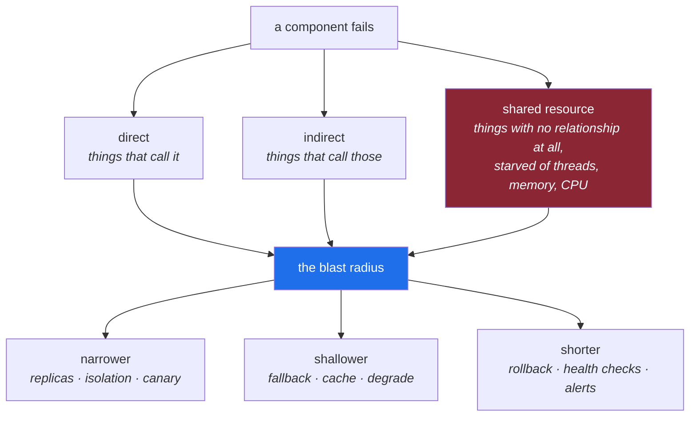

# 4.1 — What a blast radius actually is

## One-line answer

The blast radius of a component is **everything that stops being true when it fails** — and the whole
of engineering for reliability is the work of making that set smaller than it would be by default.

---

## The story

🎬 **The scene.** A house. One evening the toaster shorts out and every light in the building goes
off — upstairs, downstairs, the fridge, the boiler, the internet.

😬 **The naive fix.** Buy a better toaster.

💥 **Why it fails.** The toaster is not the problem. The problem is that the house has a single fuse
for everything, so any fault anywhere takes down everything everywhere. Next month it will be the
kettle, or a lamp, or a hairdryer. The failure will keep arriving from a different direction and the
consequence will be identical every time.

💡 **The insight.** The interesting question was never *"how do we stop appliances failing?"* — they
will. It is *"why does one appliance failing turn off the fridge?"* The answer is a design choice about
**partitioning**: modern wiring puts the lights on one circuit and the sockets on another, with a
breaker per circuit, so a failure is contained by construction. The toaster still fails. It just does
not take the house with it.

---

## The idea in plain language

**Blast radius** is a question you ask about a component: *if this fails right now, what else stops
working?*

The answer is a **set**, and the set is usually much larger than people guess, because it includes
things nobody drew an arrow to. Three kinds of member, and the third is the one that surprises:

**Direct.** Things that call it. If `DB` fails, `/predict` fails. Visible on the diagram.

**Indirect.** Things that call the things that call it. If `DB` fails, `/predict` fails, and whatever
your users do with `/predict` fails. One more hop out than people usually look.

**Shared-resource.** Things with no relationship to it at all, which fail because the failure consumed
something they also needed — the threads, the connection pool, the memory, the CPU. This is
[2.3](../02-dependencies/2.3-the-dependency-that-fails-slowly.md)'s supermarket, and it is invisible on
every architecture diagram ever drawn, because the shared resource is not a box.

### The three dimensions

"How much breaks" is not one number. Three questions, and they trade off against each other:

| Dimension | The question | Example of making it smaller |
| --- | --- | --- |
| **breadth** | how many users or features? | one replica of three failing affects a third of requests, not all |
| **depth** | how badly — degraded, or absent? | `/assist` without the index answers worse, not not-at-all |
| **duration** | for how long? | a rehearsed rollback turns an hour into minutes |

A failure that is broad, deep and long is an outage. A failure that is narrow, shallow and short is a
blip nobody files a ticket about — and it may be **the same underlying fault**, contained differently.
That is the entire claim of this part, and it is why Principle 13 says *blast radius before
capability*: the fault is not the variable you control, the containment is.

### Reducing each dimension

The mechanisms in this curriculum sort neatly into the three columns, which is a useful way to hold
two hundred days of material:

**Narrower** — more instances so one failing is a fraction (Day 34); separate the paths so `/predict`
and `/assist` do not share a pool (Day 42); canary a change to a small share of traffic before all of
it (Day 111).

**Shallower** — a soft dependency with a real fallback ([2.1](../02-dependencies/2.1-hard-and-soft-dependencies.md));
a cache that can serve a stale answer (Day 133); a degraded response that says it is degraded.

**Shorter** — a rehearsed rollback (Day 19); a health check that removes a bad instance automatically
(Day 41); an alert that fires on the symptom within a minute rather than a report that arrives
tomorrow (Day 77).

**Every single one is a choice made before the failure.** During the failure there are no levers left
except the ones you built.

### The blast radius of a *capability*, not just a component

There is a second use of the phrase, and this plan uses both. Principle 13 is about **capabilities**:
every new power arrives with its containment in the same day. An autoscaler can create instances — how
many, at most? An auto-remediator can restart things — how often, at most? An agent can call tools —
which tools, with what permissions, and who can stop it?

That version asks three questions, and this repository asks them of every new power from now until
Day 236:

> **What is the worst thing this can now do? Who can trigger it? What bounds it?**

Notice the middle question. "Who can trigger it" includes people you did not intend — a user supplying
input, a retry loop, a misconfigured cron, an attacker. A capability whose trigger is *"a string that
arrives over the network"* has a very different risk profile from one whose trigger is *"an engineer
typing a command"*, even if the action is identical.

---

## Why Kriya needs it

Day 194 is *"The approval gate — an agent that proposes, a human that disposes, and an audit trail."*

By that day `pulse` has an agent that can read telemetry, diagnose an incident and propose an action.
The question that day answers is *what is the blast radius of being wrong* — and the answer is what
determines whether the agent may act directly, act with a gate, or only ever produce a suggestion. The
whole design is downstream of the three questions above.

You need it long before then. Day 44 gives `pulse` an autoscaler, which is the first thing in the
curriculum that acts on its own; and [Day 3](../../../day-003-pulse-v0/LESSON.md) opens a network port,
which is the first capability of any kind — a thing that accepts input from outside. Part 5.2 of that
day asks the three questions about a `/healthz` endpoint, which sounds excessive until you see what a
health check that lies can do.

---

## The mechanism

The mechanism is a question asked systematically rather than a tool. For each component, three
columns; and the discipline is to fill them in for **every** box, including the ones that seem
obviously harmless.

Take `OTEL`, the telemetry collector, which is marked `soft, always` in
[2.1](../02-dependencies/2.1-hard-and-soft-dependencies.md) and is the least alarming box on the
diagram:

| Question | Answer for `OTEL` |
| --- | --- |
| **worst case** | if telemetry is written synchronously on the request path, a slow collector makes every request slow — and the dashboards that would tell you are the ones that are down |
| **who can trigger it** | the collector's own load, a full disk, a bad configuration reload, a version upgrade |
| **what bounds it** | telemetry is emitted asynchronously with a bounded buffer, and dropped when the buffer is full |

**The bound in that last cell is a design decision that has to be made now**, and it is
counterintuitive: you are choosing to **lose observability data** rather than to slow down a user's
request. Most people's instinct is the reverse, and the reverse produces an outage caused by the
monitoring system. Writing the bound into the architecture document is what makes it a decision rather
than an accident of whichever library gets used.

Do the same for the most alarming box:

| Question | Answer for `DB` |
| --- | --- |
| **worst case** | `/predict` and `/assist` both fail; if `/healthz` also queried it, every instance is restarted and the service disappears entirely |
| **who can trigger it** | a bad migration, a long query holding locks, a filled disk, a failed node, a connection pool exhausted by [2.3](../02-dependencies/2.3-the-dependency-that-fails-slowly.md)'s slow-call cascade |
| **what bounds it** | `/healthz` never touches it ([3.2](../03-state/3.2-where-pulse-state-will-live.md)); every query has a timeout; the connection pool has a maximum; `503` is returned quickly rather than waited on |

**Notice how much of the "what bounds it" column is already decided by earlier parts of today.** That
is the shape of the day: the request path, the dependency classification and the state placement were
all, in effect, blast-radius decisions taken one at a time.



---

## When it breaks

The characteristic failure is a blast radius that was **larger than the diagram implied**, and the
give-away is an incident report in which the affected list is longer than the dependency list. Here is
one, in the form it usually reaches you:

```text
INCIDENT — 02:14 to 03:31

Cause:    the telemetry collector's disk filled.
Affected: /predict (all requests, 500s)
          /assist  (all requests, 500s)
          /healthz (200, throughout)
          the dashboards used to diagnose the above
```

**What it says:** a disk filled on a component marked *soft*.
**What it actually means:** three separate design failures, each invisible until they combined:

1. **Telemetry was on the request path.** The collector blocked, so the requests blocked. `OTEL` was
   only soft in the document.
2. **The diagnosis tooling shared the failure.** The dashboards were fed by the thing that broke, so
   the first thirty minutes were spent working out why the dashboards were empty.
3. **`/healthz` kept returning `200`.** Correctly, by the rule in
   [3.2](../03-state/3.2-where-pulse-state-will-live.md) — it checks only that the process can respond,
   and the process could. So nothing was restarted and nothing was removed from the load balancer,
   which was **the right behaviour producing an unhelpful outcome**, and the reason a separate
   readiness signal exists (Day 41).

**The smallest fix** is the bound from the mechanism section: emit telemetry asynchronously, into a
bounded buffer, and drop when full. One design decision, taken today, removes failure 1 entirely and
reduces 2 to "the dashboards are missing data for an hour", which is survivable.

**The uncomfortable part** is failure 3, and it is worth sitting with: there is no rule that makes
every outcome good. `/healthz` did exactly what the design said and the design was right; the gap was
a *missing* signal, not a wrong one. Real systems accumulate these, and the way you find them is the
next part.

---

## In production

**What a professional does differently.** They ask the three questions in **code review**, not in
design review, because that is where capabilities actually arrive. The question sounds like: *"what is
the worst thing this pull request makes possible?"* It is a fast question with a short answer most of
the time, and the times the answer is long are exactly the times it needed asking. Teams that do this
well have a habit rather than a process — the phrase "what's the blast radius?" is heard often enough
that people pre-empt it.

**What degrades at scale.** Shared resources become invisible. On one machine you can see that
everything shares the CPU. In a cluster, two workloads share a node, a network, a control plane, an
image registry and a DNS service, and **none of those appear on anybody's architecture diagram**. The
biggest outages in large systems are almost always shared-infrastructure outages: DNS, certificates,
configuration distribution, the identity system. Phase 5 (Days 41–50) is largely about making the
sharing explicit — requests, limits, quality-of-service classes and disruption budgets are all
statements about what a workload may consume when things are tight.

**The failure that only shows with real traffic.** The **correlated** failure. Your blast-radius
analysis assumes components fail independently: one instance, one zone, one dependency. Real failures
correlate — all three instances run the same buggy version, all of them restart at once and stampede
the database, all of them hold certificates that expire on the same day because they were issued
together. Redundancy protects against independent failure and does nothing against correlated failure,
and telling them apart is most of the skill. Day 45 (disruption budgets) and Day 111 (canary) are both
attempts to break the correlation deliberately.

**The review comment a senior engineer leaves.** *"This adds a call to the collector inside the
handler. If the collector is slow, every request is slow — we've made our observability a hard
dependency of our availability. Make it fire-and-forget with a bounded queue, and add a counter for
dropped spans so we know when it's happening."*

**The signal you would alert on.** Not the blast radius itself — it is a property of a design, not a
measurement. What you alert on is the **containment**: the number of dropped telemetry events, the
number of rejected requests when a bulkhead is full, the number of circuit-breaker trips, the fraction
of responses currently degraded. **Every bound you add should be observable when it engages**, because
a bound that engages silently is indistinguishable from one that is not there — and you will one day
need to know which. That principle covers most of Phase 15.

**Blast radius of this part:** none. It writes nothing and runs nothing. Worth saying plainly, because
from here to Day 236 every part that introduces a capability answers the three questions, and the
habit is built by answering them even when the answer is *"nothing, and here is why"*.

**Cost:** `0` requests, `0` tokens, `0` MB resident.

**The interview question.** *"What's the blast radius of the change you shipped most recently?"* It is
a fast way to find out whether someone thinks about failure as a normal part of design. The best
answers are specific and slightly uncomfortable — *"worst case it would have written bad rows for
every ticket created in the window, and we'd have found out from the drift alert about a day later,
which is why I added the validation check in the same PR"* — because they show the containment was
part of the change rather than a later idea.

---

## Check yourself

```bash
grep -c 'soft' docs/ARCHITECTURE.md
```

Count the components you have called soft. Then pick one and answer the three questions out loud. If
"what bounds it" is empty, it is not soft yet — it is hard, and undocumented as such.

**Say out loud, without scrolling up:** *name the three kinds of thing in a blast radius, and say which
one never appears on an architecture diagram and why.*
