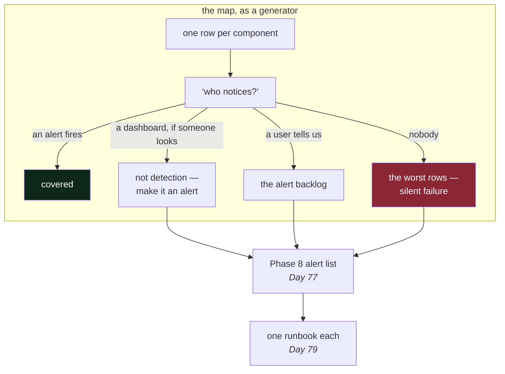

# 4.2 — Drawing the blast-radius map

## One-line answer

Go through every component in turn, declare it dead, and write down what stops working — because the
exercise costs an afternoon while nothing is running, and the same discoveries cost an outage
afterwards.

---

## The story

🎬 **The scene.** A theatre before opening night. Somebody walks the building with a clipboard and
asks, at each point, a single stupid-sounding question: *what if this fails?* What if this door will
not open. What if this light does not come on. What if the person operating the sound desk is ill.

😬 **The naive fix.** Skip it. Everything was tested last week, everyone knows their job, and the
walk-through takes an afternoon that could be spent rehearsing.

💥 **Why it fails.** On the night, a fuse goes in the corridor lighting. It is not dangerous and it is
not the stage — but the corridor is the route the cast use to reach the other wing, and nobody has
ever had to think about a second route, and half the second act happens with actors entering from the
wrong side. Everything that failed was small. What was missing was the sentence *"if this fails, we do
X"*, which takes ten seconds to write and cannot be invented in the dark.

💡 **The insight.** The walk-through does not find failures. It finds **missing answers**, and it finds
them at a moment when writing one down is free. The clipboard is not a prediction of what will go
wrong; it is a list of decisions taken while there is time to take them.

---

## The idea in plain language

A **blast-radius map** is a table with one row per component and four columns:

| Component | If it fails, what stops working | Who notices, and how | What we do |
| --- | --- | --- | --- |

That is all it is. Its value is entirely in being *complete* — a row for every box, including the
boring ones — because the whole point is to find the box whose row you cannot fill in.

### The four columns, and why each is there

**Component.** Every box on the diagram from
[1.2](../01-the-request-path/1.2-drawing-the-path-for-pulse.md), plus the ones that are not boxes:
the machine, the network, the DNS, the certificate. Shared resources have no box
([4.1](4.1-what-a-blast-radius-is.md)) and are exactly where the surprises live, so they get rows
anyway.

**If it fails, what stops working.** In terms of **user-visible capability**, not components. *"`DB`
fails"* is not an answer; *"`/predict` returns 503 and `/assist` returns 503, `/healthz` still
answers"* is. If you write it in component terms you will feel like you have answered and you will not
have.

**Who notices, and how.** The question that finds the real gaps. There are only three honest answers,
and two of them are bad:

- *an alert fires* — good;
- *a dashboard shows it, if someone looks* — this is not detection, it is availability of evidence;
- *a user tells us* — this is the answer you are looking for, because it is the row that needs work.

**What we do.** The action, in enough detail to be followed by someone who is not you. If it is more
than a couple of lines, it wants to be a runbook, and Day 79 is where the first one goes into
`runbooks/`.

### Why "who notices" is the most valuable column

Because detection time is a multiplier on everything else. A failure detected in a minute and fixed in
ten is an eleven-minute incident. The identical failure detected by a customer email on Monday morning
is a three-day incident with the same cause, the same fix and a completely different consequence.

And detection is the column you can most cheaply improve. Making `DB` more reliable is a project.
Adding an alert on `DB` connection errors is an afternoon. **The blast-radius map is, in practice, a
generator of the alert list** — you go down the "who notices" column, find the rows that say *a user
tells us*, and those become your first alerts. That is a much better way to arrive at an alert set than
the usual one, which is alerting on everything the tooling happens to expose.

---

## Why Kriya needs it

Day 79 is *"A runbook per alert — the 3am documents"*, and it is a Phase 8 gate criterion that every
alert has one.

The map you write today is the source of both lists. Its *"who notices"* column becomes the alerts;
its *"what we do"* column becomes the runbooks. Doing it in the other order — inventing alerts first
and writing runbooks for them afterwards — is how teams end up with forty alerts covering the things
that are easy to measure and none covering the things that actually break.

Day 229's readiness review asks for this table directly, and Day 231's handover assumes a stranger can
read it.

---

## The mechanism

Add the map to `docs/ARCHITECTURE.md`. Do the whole table in one sitting; the value is in the rows you
struggle with.

````markdown
## Blast radius

One row per component. **A row you cannot fill in is the finding.**

| Component | If it fails, what stops working | Who notices, and how | What we do |
| --- | --- | --- | --- |
| `API` | everything; no route answers | a user tells us — **no alert yet, Day 77** | restart; if it will not start, roll back |
| `DB` | `/predict` 503, `/assist` 503; `/healthz` still 200 | a user tells us — **no alert yet** | 503 fast, do not queue; restore is Day 47 |
| `MODEL` | `/predict` 503; `/assist` unaffected | a user tells us — **no alert yet** | serve the previous registry version |
| `ASSIST` | `/assist` 503; `/predict` unaffected | a user tells us — **no alert yet** | disable the route, return 503 with a reason |
| `INDEX` | `/assist` answers ungrounded and says so | **nobody** — this is the gap | continue degraded; count degraded responses |
| `LLM` | `/assist` 503 until Day 129 | a user tells us — **no alert yet** | 503; Day 129 adds fallback, Day 126 a local model |
| `REG` | deploys stop; serving unaffected | a deploy fails loudly | keep serving; fix before the next release |
| `OTEL` | telemetry is lost; requests unaffected **if async** | **nobody** — and the dashboards are also gone | drop spans, keep serving, count the drops |
| the machine | everything | a user tells us | Day 39 puts this on a cluster with replicas |
| the network | everything | a user tells us | nothing local; Day 7 |
| **disk full** | writes fail everywhere at once | **nobody** — this is the worst gap | Day 5 |
| **the clock** | tokens and certificates fail to validate | **nobody** | Day 8 |

**Six rows say nobody or a user tells us. Those six are the alert backlog**, and they are worked
through in Phase 8. Recording them as gaps is the deliverable; pretending otherwise is not.
````

**Line by line:**

- **The last four rows have no box on the diagram.** The machine, the network, the disk and the clock
  are shared resources — [4.1](4.1-what-a-blast-radius-is.md)'s third category — and they are the
  reason the map is a table rather than a picture. A diagram can only show things that are things.
- **`disk full` is marked as the worst gap deliberately.** It fails *everything that writes*
  simultaneously — the database, the logs, the telemetry, the temporary files — so the symptoms arrive
  from every direction at once and none of them mention disk. It is also the failure with the longest
  warning: usage climbs for days. **The longest warning and the worst detection is the combination
  that should bother you most**, and it is Day 5.
- **`the clock` looks like a joke and is not.** Token expiry, certificate validity and log correlation
  all depend on the machine's idea of the time; a clock that drifts produces authentication failures
  that look like a permissions bug. Day 8.
- **`INDEX` is the row where "nobody notices" is *by design*** — the service degrades silently, which
  is what "soft" means. That is why the action column says *count degraded responses*: the
  degraded-response rate is the signal that makes a soft dependency's failure visible without paging
  anyone, and it is the metric teams most often forget to build.
- The `OTEL` row's *"if async"* is a **conditional that must be checked against the code** once code
  exists. It is written into the table now so that the check has something to compare against; a table
  full of conditionals nobody verifies becomes [4.3](4.3-the-map-is-wrong.md)'s problem.
- Every *"no alert yet"* names the day that fixes it. **A gap with a date is a plan; a gap without one
  is a wish**, and the difference is what makes it survivable to write a table this full of holes.



---

## When it breaks

The map fails in two ways, and both are failures of honesty rather than of technique.

**The map with no gaps.** Every row says *"an alert fires"* and *"the runbook handles it"*, on a system
that has neither alerts nor runbooks. This is the more common failure by a wide margin, because the
table format invites completeness and an empty cell feels like an admission. It is an admission, and
that is the value.

**The map that stops at the boxes.** Twelve rows, one per component, and not one for the disk, the
clock, the network, the certificate, the DNS or the deployment tooling. The result looks thorough and
omits the entire class of failure that produces the worst incidents.

Here is what the second one costs, in the form it arrives:

```text
$ df -h /var/lib/postgresql
Filesystem      Size  Used Avail Use% Mounted on
/dev/sda1        40G   40G     0 100% /var/lib/postgresql

$ tail -2 /var/log/pulse/app.log
[error] could not extend file "base/16384/2619": No space left on device
[error] HINT:  Check free disk space.
```

**What it says:** the disk is full and Postgres cannot write.
**What it actually means:** every writing component failed within the same minute, and each reported a
different symptom — the database says it cannot extend a file, the application says its log write
failed, the collector says it dropped spans, and the health endpoint may be perfectly happy. **Four
symptoms, one cause, and the cause is not in any of the four messages.** An operator who has read the
disk row on the map recognises it in seconds; one who has not spends the first twenty minutes on
Postgres.

**The smallest fix** is `df -h` as the second thing you run in any confusing incident, after checking
whether the process is up. **The real fix is the alert**, on disk usage crossing 80%, which would have
fired days earlier — this failure gives more warning than almost any other and is missed more often
than almost any other, purely because nobody was looking.

---

## In production

**What a professional does differently.** They run this as a **group exercise**, out loud, and they
time-box it rather than trying to be exhaustive. The format is: someone reads a component name, someone
else says what breaks, and a third person says how we would find out — and the argument that follows is
the deliverable. Disagreement about what breaks is the single most valuable output, because it means two
engineers hold different models of the system and one of them is wrong.

**What degrades at scale.** The map's accuracy, immediately and continuously. It is a snapshot, and
systems change weekly. A blast-radius map from last quarter is a description of a system that no longer
exists, and — worse — it is *trusted*, because it looks authoritative. This is exactly the failure of the
photocopied evacuation plan showing a door that has been bricked up. There are only two defences: attach
it to something that changes with the system (a check, which is [4.3](4.3-the-map-is-wrong.md)), or
review it on a schedule that someone owns.

**The failure that only shows with real traffic.** Failures that only exist under load. Your map says
"if `INDEX` fails, `/assist` degrades" — true when the index returns an error, false when it becomes
*slow*, because then [2.3](../02-dependencies/2.3-the-dependency-that-fails-slowly.md)'s thread
exhaustion takes the whole service down and `/predict` goes with it. **A map written in terms of "fails"
covers one of three states**, and the missing one is the dangerous one. Mature maps have a column for it:
*what if it is slow rather than down?*

**The review comment a senior engineer leaves.** *"Your blast-radius table says a user tells us for six
of the twelve rows. That's honest and I appreciate it — but let's pick the two with the largest breadth
and put an alert on them this sprint, rather than carrying twelve gaps evenly."*

**The signal you would alert on.** The map *produces* the signal list rather than being one. If you want
a single starting point from the table above, it is the **disk row**: usage above a threshold, on every
volume, everywhere. It is cheap, it is universal, it gives days of warning, and it is the cause behind an
unreasonable share of confusing incidents. Day 5 builds it; and note that the correct alert is on the
*rate of growth* as well as the level, because a disk at 60% filling by 5% an hour is more urgent than a
disk that has sat at 85% for a year.

**Blast radius of this part:** none. One Markdown table, no process, no capability. The table's
*content* is a set of claims about failure behaviour that later code will be held to — and a wrong row is
worse than a missing one, because a missing row prompts a question and a wrong row prevents it.

**Cost:** `0` requests, `0` tokens, `0` MB resident.

**The interview question.** *"Pick a component of your system and tell me what happens when it fails."*
Then, if you answer well, the follow-up that matters: *"how would you know?"* Most candidates can do the
first. The second separates people who have been on call from people who have not, and the strongest
possible answer includes a case where the honest reply was *"we wouldn't have — that's why we added
the alert."*

---

## Check yourself

```bash
grep -c 'nobody\|a user tells us' docs/ARCHITECTURE.md
```

Count your detection gaps. Six is the honest number today. The count going *down* over Phases 7 and 8 is
one of the few genuinely meaningful measures of progress in this curriculum.

**Say out loud, without scrolling up:** *which four rows of the map have no box on the architecture
diagram, and why is that the point rather than an oversight?*
