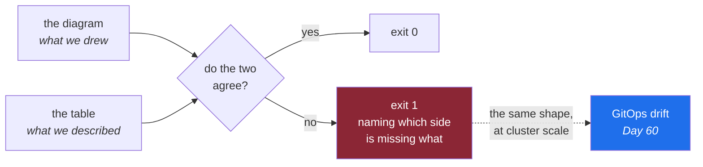

# 4.3 — The map is wrong — making the document go red

## One-line answer

A document that nothing checks is a document that drifts, so give the architecture map a check it can
fail, and then break it on purpose, because a diagram that cannot be wrong is indistinguishable from
one that is.

---

## The story

🎬 **The scene.** You are driving somewhere new and your phone tells you to turn right in two hundred
metres.

😬 **The naive fix.** Turn right. It is a good map, it is as up to date as anybody knows, and it has
been right every other time.

💥 **Why it fails.** The road was closed eight months ago and there is a bollard across it. The map was
correct when it was made. It became wrong quietly, because the street changed and the map did not, and
nothing in the world connected the two. You followed it anyway, because it was on the screen and it
had always been right before.

💡 **The insight.** A map that cannot disagree with the world will eventually disagree with the world,
**and nobody will find out**. The fix is not a better map. It is a *relationship* between the map and
the street: somebody or something that checks, and that is able to say no. That is exactly why map apps
ask you whether a road is still closed. The question is the mechanism.

---

## The idea in plain language

You have written three tables today in `docs/ARCHITECTURE.md`, covering components, state and blast
radius, plus a diagram. Right now all four are correct, because you have just written them. That is
the last moment at which it will be true for free.

The failure mode is **drift**. The system changes, the document does not, and the gap is invisible
because nothing compares them. It is precisely the failure from
[Day 1, part 2.5](../../../day-001-what-operations-actually-is/parts/02-the-repo-remembers/2.5-generated-files-you-never-edit.md),
running in the opposite direction. There, a report was overwritten by the truth. Here, the report
quietly stops matching a truth nobody recomputes.

The only durable defence is a **check that can go red**. Not a review reminder and not a calendar
entry, but a command that compares two things that should agree and exits non-zero when they do not.

### What can actually be checked

You cannot mechanically check whether a blast-radius description is *true*. That needs a human, or an
experiment. What you **can** check, cheaply, is **internal consistency**, meaning that the document
does not contradict itself.

| Claim | Checkable? | How |
| --- | --- | --- |
| every box in the diagram has a row in the components table | **yes** | compare two lists of identifiers |
| every component has a blast-radius row | **yes** | the same way |
| every soft dependency names what happens without it | **yes** | the cell is not empty |
| the blast-radius description is accurate | no | a person, or a failure drill |
| the RPO is achievable | no | a restore, timed |

**Three out of five, for about fifteen lines of shell.** That is a good trade, and it is the general
shape of automated checking. You rarely verify the interesting claim, and you very cheaply verify that
the document has not fallen apart around it.

This is Principle 4, *build first, adopt after*. You are hand-rolling a document-consistency check
today. On Day 60 you meet the industrial version, which is a GitOps reconciler comparing a cluster
against a repository, and it will be recognisable rather than magical.

---

## Why Kriya needs it

Day 60 is *"Drift: the cluster no longer matches the repository"*, and Day 56 is GitOps.

The mechanism there is the same as the one here, at a larger scale. Something declares the desired
state, something else observes the actual state, and a program compares them continuously and reports
the difference. Today's version compares a Mermaid diagram against a Markdown table. Day 60's compares
a repository against a Kubernetes cluster. **The idea is identical, and today's version costs nothing
to get wrong**, which is the reason to build it now.

Day 230, on documentation that survives you, makes the general claim: documentation that nothing checks
is documentation that will be wrong, and the only question is when.

---

## The mechanism

Write the check. It reads `docs/ARCHITECTURE.md`, pulls the node identifiers out of the Mermaid block
and the identifiers out of the components table, and refuses if the two sets differ.

```bash
#!/usr/bin/env bash
# lab/check_architecture.sh — every box in the diagram must have a row in the table, and vice versa.
set -euo pipefail
DOC="docs/ARCHITECTURE.md"

nodes=$(sed -n '/^```mermaid/,/^```$/p' "$DOC" \
        | grep -v -E '^(```|\s*flowchart|\s*subgraph|\s*end|\s*style)' \
        | grep -oE '\b[A-Z][A-Z0-9_]+\b' | sort -u)
rows=$(grep -oE '^\| `[A-Za-z0-9_]+`' "$DOC" | tr -d '|` ' | sort -u)

missing=$(comm -23 <(echo "$nodes") <(echo "$rows"))
extra=$(comm -13 <(echo "$nodes") <(echo "$rows"))

[ -z "$missing" ] || echo "FAIL in the diagram, not in the table: $(echo $missing)"
[ -z "$extra" ]   || echo "FAIL in the table, not in the diagram: $(echo $extra)"
[ -z "$missing$extra" ] || exit 1
echo "OK architecture map consistent: $(echo "$nodes" | wc -l) components"
```

**Line by line:**

- `set -euo pipefail` sets the same four safety options as `o` does, from
  [Day 0, part 4.2](../../../day-000-toolchain-skeleton-driver/parts/04-the-driver/4.2-set-euo-pipefail.md).
  Without `-e`, a failing `grep` in the middle of the script would be ignored and the check would
  report success on a broken run, which is the worst possible bug in a checking tool.
- `sed -n '/^```mermaid/,/^```$/p'` prints only the lines between the opening Mermaid fence and the
  next bare closing fence. `-n` suppresses the default printing so that only the range comes out. This
  is the cheap way to pull one block out of a Markdown file without a Markdown parser, and the
  cheapness is deliberate, because a check nobody can read is a check nobody maintains.
- The `grep -v -E '^(```|\s*flowchart|...)'` line removes Mermaid's own keywords. **This line exists
  because the first version of this script failed**, and the failure is in *When it breaks* below.
- `grep -oE '\b[A-Z][A-Z0-9_]+\b'` extracts identifiers. `-o` prints only the matched text rather than
  the whole line, and the pattern means "a capital letter followed by at least one more capital or
  digit". That is a convention rather than a rule the format enforces, which is why
  [1.2](../01-the-request-path/1.2-drawing-the-path-for-pulse.md) insisted the identifiers be short and
  uppercase. **The check works because the document was written to be checkable.**
- `sort -u` on both sides, because `comm` requires sorted input and duplicates would produce noise. A
  node appears on both sides of several arrows and has to be counted once.
- `comm -23` prints lines that are only in the first list, meaning in the diagram and absent from the
  table. `comm -13` prints lines that are only in the second. That is two directions, two distinct
  failures, reported separately, for the same reason `scripts/trace.py` separates them in
  [Day 1, part 2.6](../../../day-001-what-operations-actually-is/parts/02-the-repo-remembers/2.6-breaking-the-memory-on-purpose.md).
  A check that says only "these disagree" makes you do the diff by hand.
- `<(echo "$nodes")` is **process substitution**, which makes a command's output look like a file,
  which is what `comm` wants. Without it you would need two temporary files and some cleanup.
- `$(echo $missing)` is **unquoted deliberately**, to collapse the newlines into spaces for a one-line
  message. This is the one place in the script where an unquoted variable is correct, and it is worth
  knowing that it is a rule with an exception rather than a rule you broke.
- `exit 1` is the whole point. **The message is for you and the exit code is for CI**, and from Day 13
  the exit code is the part that matters.

Make it executable and run it.

```bash
chmod +x days/day-002-shape-of-production-system/lab/check_architecture.sh
./days/day-002-shape-of-production-system/lab/check_architecture.sh
```

**Line by line:** `chmod +x` sets the executable bit so that the file can be run directly rather than
being passed to `bash`. The `#!/usr/bin/env bash` on the first line, which is called the *shebang*, is
what tells the system which interpreter to use, and `env bash` rather than a hard-coded `/bin/bash` is
what makes it work on machines where bash lives somewhere else.

Observed on **2026-08-24**:

```text
OK architecture map consistent: 9 components
```

### Now make it go red

Add a box to the diagram and no row to the table, which is exactly what happens in real life when
somebody adds a cache and updates the picture.

```bash
# in docs/ARCHITECTURE.md, inside the mermaid block, add one line:
#     ASSIST --> CACHE
./days/day-002-shape-of-production-system/lab/check_architecture.sh; echo "exit=$?"
```

**Line by line:** the added arrow introduces a node identifier, `CACHE`, that the components table has
never heard of. `echo "exit=$?"` prints the exit status, because the status is what a pipeline reads
and the message is only for you.

```text
FAIL in the diagram, not in the table: CACHE
exit=1
```

**That is a document that can be wrong**, which is a different kind of object from the one you had ten
minutes ago. Add the `CACHE` row, run it again, and watch it go green.



---

## When it breaks

The check itself broke on its first run, and the failure is worth more than the success.

```text
$ ./check_architecture.sh
in the diagram, not in the table: LR
exit=1
```

**What it says:** there is a component called `LR` in the diagram and not in the table.

**What it actually means:** there is no such component. `LR` is the second word of `flowchart LR`,
which is the direction of the diagram, left to right, and the identifier pattern matched it because it
is two capital letters. **The check was right that the two lists differed and completely wrong about
why.**

**What it actually is:** a **false positive**, and this is the most instructive failure a check can
have. A check that fires when nothing is wrong is not a harmless annoyance. It is the mechanism by
which checks come to be ignored. One false positive is a puzzle. A false positive every run is a check
people route around, and then the real failure arrives and nobody looks.

**The smallest fix** is the `grep -v` line in the script, which excludes Mermaid's keywords before
extracting identifiers. It is one line, and it was written *after* seeing the failure rather than
before, which is the honest order and the reason the script has that line at all.

**The finding to record:** this check has a known and deliberate limitation. It matches by convention,
meaning all capitals, rather than by parsing Mermaid, so a node named `Api` would be silently ignored,
and a table row for a component the diagram calls something else would be reported as missing. **That
is a boundary, it is intentional, and it belongs in `docs/INCIDENTS.md`**, following the same
discipline as row 7 of that file, where Day 0 recorded that the linter ignores `lab/`. An intentional
gap that is written down is a decision. An intentional gap that nobody remembers is a hole.

The second failure is the one to expect on your own machine.

```text
$ ./check_architecture.sh
sed: can't read docs/ARCHITECTURE.md: No such file or directory
```

**What it actually means:** you ran it from the wrong directory. The script uses a path relative to the
repository root, which is a deliberate simplification, and it fails loudly rather than searching, which
is the right behaviour for a check. **A tool that guesses where your files are will eventually guess
wrong and check the wrong thing**, which is worse than refusing.

---

## In production

**What a professional writes instead of the teaching version.** They put the check in **CI**, so that
it runs on every change rather than when somebody remembers, and they make the failure message name the
fix rather than only the problem. *"Add a row for CACHE to the components table in
docs/ARCHITECTURE.md"* beats *"CACHE missing"*. The message is read by a person under time pressure who
did not write the check, and every word that saves them a lookup is worth writing. This check joins
`./o check` on Day 14.

**What degrades at scale.** The check's own accuracy, in both directions. As the document grows, the
convention-matching approach accumulates false positives, from a new keyword, a styled node or an
identifier that is not a component, and false negatives, from a component referred to inconsistently.
The industrial answer is to stop matching text and start generating one side from the other, deriving
the table from a machine-readable source or the diagram from the table, so that they cannot disagree by
construction. **Checking two hand-written things is always a second-best design**, and knowing that
stops you defending the check when it should be replaced.

**The failure that only shows with real traffic.** The check that is green and the document that is
wrong. This check verifies that the diagram and the table agree, and it says nothing about whether
either of them matches the system. Both can be perfectly consistent and describe a service that was
replaced last month. **Internal consistency is the cheap half, and correspondence to reality needs an
experiment.** The only real experiment is breaking the thing on purpose and seeing whether the
blast-radius row was right, which is what the fifteen failure labs in this plan are for, and why they
are not optional.

**The review comment a senior engineer leaves.** *"Good, but this check passes if both files are wrong
in the same way. What would tell us the diagram no longer matches the deployment? Right now, nothing,
and I would rather we wrote that down than assumed the green tick covers it."*

**The signal you would alert on.** In CI it is the check's exit status, which is a failed build rather
than a page. There is no runtime signal here, and inventing one would be worse than nothing. The
runtime version of this idea arrives on Day 60 as **drift**, where the two things being compared are a
repository and a live cluster, and *that* is genuinely alertable. Reality disagreeing with the record
means somebody changed the world without changing the memory, which is
[Day 1, part 2.1](../../../day-001-what-operations-actually-is/parts/02-the-repo-remembers/2.1-why-the-chat-is-not-the-memory.md)'s
nightmare with a metric attached.

**Blast radius.** The script is read-only. It reads one Markdown file, writes nothing and calls
nothing. The worst case is a false positive that wastes your time, which happened on the first run and
is recorded above. Anybody who runs it can trigger it, and from Day 14 the CI pipeline runs it on every
push. What bounds it is that it has no write path at all, and its only output is an exit code and a
message. **A check that cannot change anything is the safest kind of automation there is**, and it is
worth noticing how much value comes from something with a blast radius of zero.

**Cost:** `0` requests, `0` tokens and `0` MB resident. A few milliseconds of `sed`, `grep`, `sort` and
`comm` per run, and from Day 13 it costs a fraction of a CI minute per push.

**The interview question.** *"How do you stop documentation going stale?"* The weak answer is process:
reviews, owners, quarterly audits. The strong answer is mechanical, which is to **attach the document
to something that fails**. Generate it, check it, or test it. Then add the honest caveat that makes the
answer credible: consistency checks catch the document falling apart internally, and only an experiment
catches it disagreeing with reality.

---

## Check yourself

```bash
./days/day-002-shape-of-production-system/lab/check_architecture.sh; echo "exit=$?"
```

Run it green, break it, run it red, fix it, run it green. **Three runs, not one**, because a check you
have only ever seen pass is a check you have no evidence about, which is Principle 11.

**Say out loud, without scrolling up:** *this check went green on a document that could still be
completely wrong about the system. What exactly does a green result entitle you to believe, and what
would you have to do to earn the rest?*
