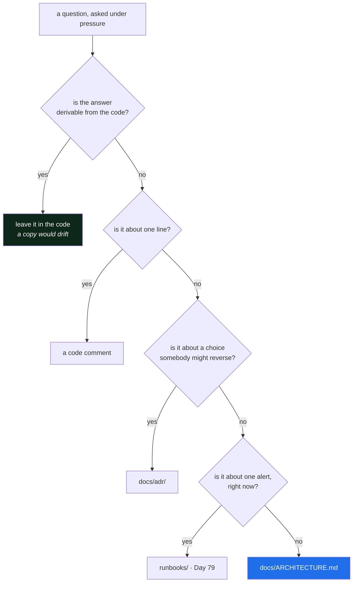

# 4.4 — The architecture document that survives you

## One-line answer

An architecture document earns its place only if it answers questions people actually ask under
pressure — so write it for the person debugging at 3am, not for the person evaluating you in a design
review.

---

## The story

🎬 **The scene.** Someone inherits a car from a relative. In the glovebox is a folder: the original
brochure, glossy, describing the trim levels and the paint options and the philosophy of the
designers.

😬 **The naive fix.** Keep the folder. It is documentation, it came with the car, and it is clearly
about this car.

💥 **Why it fails.** On a wet night the battery is flat. The folder has nothing about where the battery
is, which fuse controls the lights, what the warning symbol means, or where the jack is kept. It is
forty pages about the car and zero pages of use to somebody who has to do something to the car. The
useful document — a handbook — exists, and it is not in the glovebox, and the new owner does not know
it exists to look for it.

💡 **The insight.** Both documents are about the same object and they were written for different
readers at different moments. **The brochure is for someone deciding; the handbook is for someone
acting.** Almost all architecture documentation is a brochure, and almost every moment when someone
opens it is a handbook moment.

---

## The idea in plain language

You have written four things into `docs/ARCHITECTURE.md` today: a request path, a components table
with dependency classifications, a state table with recovery objectives, and a blast-radius map. That
document is now the single most useful thing in this repository for a stranger, and this part is about
keeping it that way — which is a question of **what it is for**, not of formatting.

The test is [Day 1, part 3.1](../../../day-001-what-operations-actually-is/parts/03-the-handover-test/3.1-the-handover-test.md)'s
handover test, applied to one file: **which questions can a stranger answer from this, under pressure,
without you?**

| Question, asked at 3am | Answered by | In today's document? |
| --- | --- | --- |
| what talks to what? | the diagram | ✅ |
| this component is down — what breaks? | the blast-radius map | ✅ |
| is this thing supposed to be optional? | the components table | ✅ |
| what will we lose if we restore? | the state table | ✅ |
| how do I check whether it is up? | — | ❌ Day 3 |
| what is the alert I just received? | — | ❌ Day 79, a runbook per alert |
| why is it built this way? | `docs/adr/` | ⚠️ ADR-0005 is a `TODO(me)` today |

Four of seven, on a day when nothing exists. The two missing rows have dates. The warning row is
today's homework.

### What belongs in it, and what does not

**Belongs:** what talks to what · what is hard and what is soft · where state lives and what its loss
costs · what breaks when each component fails · how you would find out. Every one of those is a
question asked *about a running system by somebody who did not build it.*

**Does not belong:** anything derivable from the code, because it will drift and the code will not. A
list of endpoints, a description of a function, a class diagram — all of these are the code, retyped,
and the retyped copy is the one that goes wrong. **Document what the code cannot say**: the reasons,
the alternatives rejected, the failure behaviour, the numbers you chose.

There is one boundary worth stating precisely, because it is where people put things in the wrong
place:

| Where | What goes there | Why there |
| --- | --- | --- |
| a code comment | why this line is not the obvious line | it is read when the line is read |
| `docs/ARCHITECTURE.md` | the shape, the failure behaviour, the state | it is read when the system is the question |
| `docs/adr/` | why we chose this over the alternative, and what would change our minds | it is read when someone wants to change the choice |
| `runbooks/` | what to do about one specific alert, right now | it is read at 3am by someone half awake |

Same information, four distances from the artifact, and the distance is the design.

### The three properties that make it survive

**It is in the repository.** Not a wiki, not a slide deck, not a diagram tool with an account. It moves
with the code, it is versioned with the code, and `git log` on it says who changed the shape of the
system and when. That is [Day 1, part 2.1](../../../day-001-what-operations-actually-is/parts/02-the-repo-remembers/2.1-why-the-chat-is-not-the-memory.md).

**It has a check.** [4.3](4.3-the-map-is-wrong.md) gave it one. The check verifies almost nothing
important, and it verifies it on every run, forever, which is a better deal than it sounds.

**It says what it does not know.** The `never` column in the state table, the *"nobody"* rows in the
blast-radius map, the `TODO(me)` on the `LLM` classification. **A document with no admissions in it is
a document nobody should trust**, because every real system has them and a document without them is
either new or dishonest.

---

## Why Kriya needs it

Day 230 is *"Documentation that survives you"*, Day 231 is the handover, and Day 235 is the audit that
must be answerable **from the repository alone**.

Those three days do not ask you to write documentation. They ask you to *use* documentation written
much earlier, and the material either accumulated or it did not. `docs/ARCHITECTURE.md` starting today,
on Day 2, with four tables and a check, is what makes Day 231 survivable — and it costs almost nothing
now precisely because there is so little to describe.

Immediately: [Day 3](../../../day-003-pulse-v0/LESSON.md) builds the first component on the diagram,
and the first thing it does is make one row of the components table true.

---

## The mechanism

Finish the document. Give it a header that tells a stranger how to read it and what it is not, and
record the `/healthz` decision as an ADR.

````markdown
# `pulse` — architecture

**What this is.** The shape of the system, what breaks when each part fails, and where state lives.
**Who it is for.** Somebody operating `pulse` who did not build it — including you, later.
**What it is not.** An API reference or a description of the code; both live in the code and would
drift here. Reasons for choices live in `docs/adr/`.
**Checked by** `days/day-002-shape-of-production-system/lab/check_architecture.sh`, which verifies the
diagram and the components table name the same set of things. It does **not** verify that either
matches reality — only a failure drill does that.

**Last reviewed:** 2026-08-24 · **Components that do not exist yet:** MODEL, ASSIST, INDEX, LLM, DB,
REG, OTEL — see the `from` column.

## 1 The request path
## 2 Components
## 3 State
## 4 Blast radius
````

**Line by line:**

- **"Who it is for"** is one line and it changes what gets written. Naming the reader as *someone
  operating this who did not build it* is what excludes the class diagram and includes the
  blast-radius map.
- **"What it is not"** prevents the document's slow death by accumulation. Without it, someone adds a
  section listing endpoints, someone else adds a description of the model architecture, and within a
  year it is forty pages of brochure with the handbook buried in it. **A document survives by having
  an explicit scope it can be kept to in review.**
- **"Checked by"** names the check *and its limitation*, in the same sentence. A reader who sees a
  green check assumes more than it means; saying what it does not cover is the difference between a
  reassurance and a fact.
- **"Components that do not exist yet"** is the most unusual line and the most valuable one today.
  Seven of the nine boxes are plans. Without that line the document reads as a description of a
  running system, and a stranger would go looking for a database. **Stating the tense of a document is
  part of writing it.**
- **"Last reviewed"** rather than "last updated". Updated is automatic — git knows. *Reviewed* is a
  claim that a person read the whole thing against reality on that date, which is the thing that
  actually decays and the thing no tool can infer.

And the ADR, which [3.2](../03-state/3.2-where-pulse-state-will-live.md) promised:

````markdown
# ADR-0005 — `/healthz` checks the process only, never a dependency

- **Date:** 2026-08-24 · **Day:** 2 · **Phase:** 1 · **Status:** accepted

## Context
`/healthz` is polled by whatever is supervising the process and its answer decides whether an
instance receives traffic or is restarted. `pulse` will have one durable dependency (`DB`) and
several soft ones.

## Options considered
| Option | Pros | Cons |
| --- | --- | --- |
| A. check the process only | a dependency outage never becomes a total outage | says nothing about whether the instance can do useful work |
| B. check the process and `DB` | one endpoint answers "can this serve traffic?" | a `DB` outage marks **every** instance unhealthy at once; all are restarted; none recover; the outage becomes total |
| C. two endpoints — liveness and readiness | correct, and what Kubernetes expects | two things to build and explain, before there is a supervisor to consume them |

## Decision
`/healthz` reports only that the process can respond. Dependency status gets a separate endpoint when
there is a consumer for it (Day 41).

## Consequences
**Easier:** a `DB` outage costs the data routes and nothing else. **Harder:** `/healthz` returning
`200` is not evidence the service is useful, so it must never be the only check.
**Committed to:** a second endpoint on Day 41, and an SLO written against user-visible outcomes
rather than against health checks (Day 73).

## What would make us change our minds
If a supervisor exists that can distinguish "restart this" from "stop sending traffic", option C
becomes strictly better — that is Day 41, and this ADR should be superseded there.

## Cold read
*(Re-read this later with a reviewer's hat on, and sign here.)*
````

**Line by line:**

- **Option B is stated with its genuine advantage first.** *"One endpoint answers can this serve
  traffic"* is a real benefit and the reason people choose it. An options table where the rejected
  option has no pros is the press-release failure from
  [Day 1, part 2.4](../../../day-001-what-operations-actually-is/parts/02-the-repo-remembers/2.4-the-adr-and-its-expiry-condition.md).
- **Option C is the right answer and is rejected anyway**, for a stated reason — there is no consumer
  yet. Recording that you knew the better option and deferred it, with the day it arrives, is what
  makes the ADR honest rather than a defence of a compromise.
- **The expiry condition names a specific day.** *"When a supervisor exists that can distinguish the
  two"* is observable by a stranger, and Day 41 is when it becomes true. That is the checkable
  condition the ADR format demands.
- **`Status: accepted`, not `final`.** ADRs are superseded, never edited, and this one has its
  successor's address already.



---

## When it breaks

The document fails by growing, and the failure is invisible because every individual addition is
reasonable. Here is what it looks like eighteen months later:

```text
$ wc -l docs/ARCHITECTURE.md
1847 docs/ARCHITECTURE.md

$ grep -n '^## ' docs/ARCHITECTURE.md
12:## Overview
31:## Goals and non-goals
58:## The request path
102:## Components
198:## API reference
641:## Data model
? 
889:## State
934:## Blast radius
961:## Deployment topology (2024)
1203:## Deployment topology (2025)
1544:## Appendix: the old ingestion pipeline
1702:## Glossary
```

**What it says:** a thorough document.
**What it actually means:** the four sections a stranger needs are buried between an API reference that
contradicts the code, two deployment topologies of which one is wrong and neither is labelled current,
and an appendix about a pipeline that was removed. **The document is not wrong so much as unusable**,
and its unusability is what made it wrong — nobody reads it, so nobody notices the drift, so nobody
fixes it.

**What went wrong, precisely:** the *"what it is not"* line was never written, so there was never a
basis on which to say no to a section. Every addition was defensible in isolation.

**The smallest fix** is deletion, and it is much harder than it sounds — removing documentation feels
like removing safety, exactly as with the fire plan in [4.3](4.3-the-map-is-wrong.md). The move that
makes it possible is to *move* rather than delete: the API reference belongs next to the code, the old
topology belongs in git history where it already is, and the removed pipeline belongs nowhere at all.

The other failure is smaller and more common:

```text
$ git log --oneline -3 -- docs/ARCHITECTURE.md
a91b3c2 add architecture doc
```

**What it says:** one commit, ever.
**What it actually means:** the document was written once, at the start, and the system has changed
continuously since. There is no drift *signal* here — no error, no alert — just a file whose history
stopped. **A documentation file with one commit and a repository with four hundred is a measurable
statement about how much the document can be trusted**, and it takes one command to see.

---

## In production

**What a professional does differently.** They make the document part of the **change**, not part of
the tidying. A pull request that adds a component adds its rows; a pull request that removes one
removes them. This is cultural rather than technical, and the technical support for it is small and
effective: the consistency check from [4.3](4.3-the-map-is-wrong.md) in CI, and a pull-request template
with one line — *"does this change the architecture document?"* — that has to be answered rather than
skipped.

**What degrades at scale.** Singularity. One document describing forty services is a document nobody
owns. The pattern that works is one architecture document *per service*, owned by the team that runs it,
plus one much smaller document describing how the services relate. That second document is the one that
goes stale fastest and matters most during a cross-service incident — which is exactly the failure from
[Day 1, part 1.5](../../../day-001-what-operations-actually-is/parts/01-what-ops-is/1.5-the-five-kinds-of-ops-are-one-job.md),
where every team reported their component healthy.

**The failure that only shows with real traffic.** The document that is accurate and unfindable. It
exists, it is correct, it is well written, and the person who needs it at 3am does not know it exists —
because they arrived via an alert, and the alert did not link to it. **The fix is a link from the thing
that wakes you to the thing that explains it**: every alert carries a runbook URL, every runbook links
the architecture document. Day 79 makes the link mandatory, and it is one of the highest-value habits
in this entire plan.

**The review comment a senior engineer leaves.** *"This PR adds the cache to the diagram but not to the
blast-radius table, so the check will fail — and more importantly, I don't know what happens when the
cache is down. Add the row, and say whether we serve stale, skip the cache, or fail."*

**The signal you would alert on.** None from a document, and inventing one would be worse than nothing —
a "documentation freshness" metric is gamed within a week by anyone whose review depends on it. The two
things worth tracking are both *counts you look at during a review*, not alerts: the number of
detection gaps in the blast-radius map ([4.2](4.2-drawing-the-blast-radius-map.md)), and the number of
`never` values in the recovery table ([3.3](../03-state/3.3-what-you-can-lose-and-what-you-cannot.md)).
Both should trend down over the next two hundred days, and both are honest because they measure
admissions rather than output.

**Blast radius.** This part creates two Markdown files and no capability. The genuine risk is the one
described above: a document that is trusted and wrong is more dangerous than no document, because it
substitutes for looking. Who can trigger that: anyone who edits the system without editing the
document. What bounds it: the consistency check ([4.3](4.3-the-map-is-wrong.md)), the *"last reviewed"*
date, the *"components that do not exist yet"* line, and the explicit statement of what the check does
not cover.

**Cost:** `0` requests, `0` tokens, `0` MB resident. Two Markdown files, a few kilobytes.

**The interview question.** *"What documentation do you write, and who reads it?"* The second half is
the question, and most answers stop at the first. A strong answer distinguishes readers — a comment for
the person reading the line, an ADR for the person who wants to change the decision, an architecture
document for the person who did not build it, a runbook for the person who has been woken up — and
admits which of the four the candidate's team is worst at. Almost everybody is worst at the last two.

---

## Check yourself

```bash
./days/day-002-shape-of-production-system/lab/check_architecture.sh && head -8 docs/ARCHITECTURE.md && grep -c 'TODO(me)\|never\|nobody' docs/ARCHITECTURE.md
```

Green check, a header that says who the document is for, and a count of everything it admits it does
not know. The third number is the one to be proud of today.

**Say out loud, without scrolling up:** *name the four places a piece of knowledge can live in this
repository, and say what decides which one — in a single sentence about the reader.*
