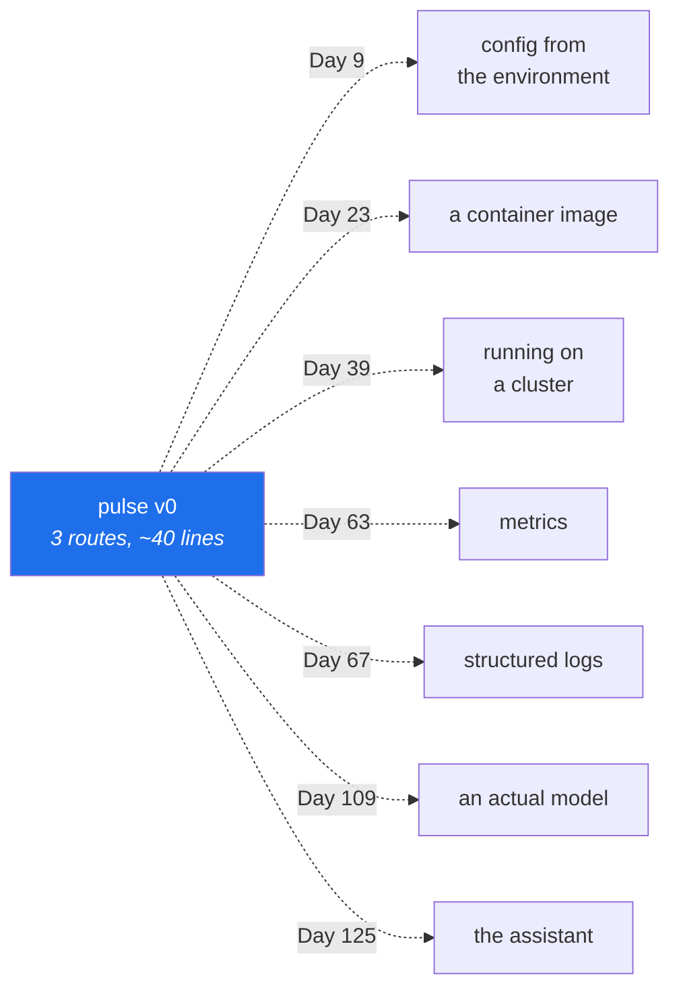

# 1.1 — Why the first version does almost nothing

## One-line answer

`pulse` v0 is three routes and no cleverness on purpose: the subject of this curriculum is
**operating** a service, and every feature you add before you can operate it is a feature you will
have to operate blind.

---

## The story

🎬 **The scene.** Someone is learning to fly a small aircraft. On the first lesson the instructor does
not talk about navigation, weather or radio procedure. They spend the hour on one thing: taxiing. Roll
forward, turn, stop, park.

😬 **The naive fix.** This feels like a waste. The interesting part is flying, the student has read
about flying, and taxiing is just driving slowly.

💥 **Why it fails.** It does not fail — that is why the instructor does it. But consider the
alternative: a student who cannot reliably control the aircraft on the ground, in the air, dealing
with weather. Every new problem now arrives on top of a foundation that is not yet automatic, and the
one that goes wrong will be the boring one, at the worst moment.

💡 **The insight.** The boring skill is not a prerequisite you get through. It is the thing that
everything else is built on, and it has to be *automatic* before the interesting part is safe. An hour
of taxiing is not an hour away from flying. It is the first hour of flying.

---

## The idea in plain language

`pulse` v0 does three things:

- **`/healthz`** — answers "this process can respond".
- **`/version`** — answers "this is what is running".
- **`/predict`** — accepts a support ticket and returns a priority and a queue, **as a fixed stub**,
  because there is no model until Day 109.

That is it. No database, no model, no authentication, no logging beyond what the server prints, no
configuration. Roughly forty lines.

### Why so little

Because of what the next hundred days do to it. Look at the ordering:

| Day | What happens to `pulse` |
| --- | --- |
| 4–6 | you learn what its process is, what signals kill it, why it might be `Killed` |
| 7–8 | you learn what its port and its HTTP status codes actually mean |
| 9 | it reads its configuration from the environment and refuses to start without it |
| 13–14 | a pipeline builds and checks it, and can refuse a change |
| 23 | it becomes a container image |
| 39 | it runs on a Kubernetes cluster |
| 63 | it emits its first metric |
| 73 | it acquires a service level objective |
| 109 | it finally gets a model |

**A hundred and six days of operations before the machine learning.** That ordering is the plan's
single most important design decision (plan §13), and the reason is stated there: *every hard problem
in MLOps and LLMOps is an ordinary distributed-systems problem in a costume, and you cannot see the
costume until you know the shape underneath it.*

Every one of those days needs something to operate. If that something is complicated, each day is
partly about the complication and partly about the subject. If it is three routes, each day is
entirely about the subject.

### What "the shape is the contract" means

The `/predict` endpoint returns a fixed answer today. It is still doing real work, because it
establishes three things that are expensive to change later:

**The request shape.** A ticket has a subject and a body, both required, both bounded in length. That
is a decision about what a client must send, and clients are the hardest thing in the world to change
once they exist.

**The response shape.** A priority, a queue, and — the interesting one — a **model version**. There is
no model, so it reads `"none"`. Putting the field in *now* means that on Day 111, when you canary a new
model against a fraction of traffic, every response already carries the information you need to tell
which model produced it. Adding that field later means changing every client.

**The failure shape.** A ticket with no body is refused with a `422` and a body naming the field. That
behaviour exists from today, before there is anything to protect.

**None of those three depend on the model existing.** That is why they are worth deciding now: they
are the parts that outlive every implementation.

### The honest caveat

There is a real cost to this approach and it should be said. A service that returns a fixed answer is
not *useful*, so you get no feedback from real users about whether the shape is right. The plan
accepts that trade because the alternative — a useful service you cannot observe, deploy or roll back
— is the situation almost everybody is actually in, and it is the one this curriculum exists to fix.

---

## Why Kriya needs it

Day 109 is *"Serving a registry model behind a latency objective"*, and it is the day `/predict` stops
being a stub.

On that day the only thing that changes is what happens *inside* the function: a model is loaded, the
ticket's fields become features, and the prediction is real. The route, the request shape, the response
shape, the validation, the tests, the container, the deployment, the metrics and the objective all
already exist and none of them change. **That is what the hundred and six days bought**, and it is only
possible because the shape was fixed on Day 3.

Nearer: Day 9 makes `pulse` read its configuration from the environment, and Day 13 puts it through a
pipeline. Both of those days assume there is a `pulse` to operate, and neither wants it to be
interesting.

---

## The mechanism

The mechanism today is a decision, not code, and it is worth seeing the shape of what you are about to
build before you build it. Three routes, and what each one is *for*:

| Route | Method | Answers the operator question | Exists so that |
| --- | --- | --- | --- |
| `/healthz` | `GET` | *is it up?* | something can poll it when nobody is watching (Day 41) |
| `/version` | `GET` | *what changed?* | you can tell what is running without asking a person (Day 16) |
| `/predict` | `POST` | *is it correct?* | there is a contract to keep, and a thing to measure (Day 63) |

**Read that middle column.** Three of the four operator questions from
[Day 1, part 1.3](../../../day-001-what-operations-actually-is/parts/01-what-ops-is/1.3-the-four-questions-an-operator-answers.md)
have a route. The fourth — *is it fast enough?* — has no route, because it is answered by measuring the
other three, and there is nothing to measure it with until Day 63. That gap is real and it is on
today's blast-radius map as *"no alert yet"*.

Here is the whole of `pulse` v0, so you know where the day is going. You write it line by line across
section 2; this is the map, not the walkthrough:

```python
# pulse/api.py — the whole service, Day 3.
from fastapi import FastAPI
from pydantic import BaseModel, Field

from pulse import __version__

app = FastAPI(title="pulse", version=__version__)


class Ticket(BaseModel):
    subject: str = Field(min_length=1, max_length=200)
    body: str = Field(min_length=1, max_length=5_000)


class Prediction(BaseModel):
    priority: str
    queue: str
    model_version: str


@app.get("/healthz")
def healthz() -> dict[str, str]:
    return {"status": "ok"}


@app.get("/version")
def version() -> dict[str, str]:
    return {"service": "pulse", "version": __version__, "model_version": "none"}


@app.post("/predict")
def predict(ticket: Ticket) -> Prediction:
    return Prediction(priority="unknown", queue="unrouted", model_version="none")
```

**Line by line:** every line of this is explained in section 2 — the application object and the first
route in [2.1](../02-the-service/2.1-the-application-object-and-the-first-route.md), `/healthz` in
[2.2](../02-the-service/2.2-healthz-the-endpoint-that-must-not-lie.md), `/version` in
[2.3](../02-the-service/2.3-version-what-is-actually-running.md), and the two models plus `/predict` in
[2.4](../02-the-service/2.4-predict-the-contract-before-the-model.md). It is reproduced here whole
because seeing the destination makes the four parts feel like construction rather than dictation. **Do
not type it yet.**

Notice what is *not* there, and that each absence has a date:



---

## When it breaks

The failure of *this idea* — starting small — is not a crash. It is a decision made on day one that
cannot be unmade, and the most common one is a response shape with no version field:

```text
$ curl -sS http://pulse.local/predict -d '{"subject":"s","body":"b"}'
{"priority":"high","queue":"billing"}
```

**What it says:** a prediction.
**What it actually means:** you cannot tell which model produced it. On the day you run two model
versions side by side — a canary, Day 111 — this response is worthless for the only question that
matters: *is the new model better?* You have per-request predictions and no way to attribute them.

**The smallest fix** is to add `model_version` to the response, and the reason it is not small is that
every client has to tolerate a new field, every stored prediction from before the change lacks it, and
your comparison can only start from the day of the change. **A field added on day one is free; the same
field added on day four hundred is a migration.**

The opposite failure is more common and worse:

```text
$ wc -l pulse/api.py
487 pulse/api.py
```

**What it says:** the first version has four hundred and eighty-seven lines.
**What it actually means:** authentication, a database, three more endpoints and a background job
arrived before anything could be deployed, observed or rolled back. When the first real problem
appears — and it will be a deployment problem or an observability problem, not a feature problem —
there is no small thing to reason about. Every debugging session now starts by ruling out four
subsystems.

**The smallest fix** does not exist; that is the point. The correction is not available afterwards,
which is why the decision is worth making deliberately today rather than by default.

---

## In production

**What a professional does differently.** They ship the **walking skeleton** first: the thinnest
possible path from a real client, through the real deployment mechanism, to a real response, in the
real environment. Not a prototype on a laptop — the actual path, doing almost nothing. What that
exercise finds is never the code; it is the certificate, the firewall rule, the permission, the
environment variable, the base image. **Those discoveries are cheap on a forty-line service and
expensive on a real one**, and they are guaranteed to happen either way.

**What degrades at scale.** The value of the small first version does not degrade — but the discipline
does. Every team starts with a thin service and every team's service grows features faster than it
grows operability, because features are visible and operability is not. The counter-measure this plan
uses is structural: `pulse` cannot gain a model until Day 109 because the plan says so, and the plan
is a contract (Principle 14). In a real team the equivalent is a readiness checklist that a service
must satisfy before it may take real traffic — which is Day 229.

**The failure that only shows with real traffic.** A stub that is *too* fast. `/predict` currently
returns in about a millisecond, so any latency budget, alert threshold or capacity estimate derived
from it is meaningless — the real endpoint will be a hundred times slower once a model is loaded.
Numbers measured against a stub are not baselines; they are the noise floor. Day 110 measures the real
thing, and the honest note today is that today's numbers describe the framework and nothing else.

**The review comment a senior engineer leaves.** *"This response doesn't say which model produced it.
Add the field now while it's free — the first time we run a canary we'll need it, and by then every
client will have to change."*

**The signal you would alert on.** Nothing yet, and it is worth being precise about why: there is no
supervisor polling `/healthz`, no metrics endpoint, and no user. The **first** signal this service will
have is whether `/healthz` answers, and the first thing that will consume it is a container health
check on Day 26 — three weeks of curriculum away. Until then the endpoint exists to be built and tested,
not to be watched, and pretending otherwise would be the check-with-no-consumer failure from
[Day 1, part 1.2](../../../day-001-what-operations-actually-is/parts/01-what-ops-is/1.2-does-it-work-versus-is-it-working.md).

**Blast radius.** Today's service opens a network port on the loopback interface and accepts arbitrary
JSON from anyone who can reach it. Worst case: it is bound to `0.0.0.0` instead of `127.0.0.1` and
anything on your network can reach it — which today costs nothing because it holds no data and does
nothing, and which is exactly the habit that costs something later. Who can trigger it: anyone who can
open a socket to the port. What bounds it: the explicit `--host 127.0.0.1`, the request-size limits in
the `Ticket` model, and the fact that there is no write path of any kind. **The first capability in
this curriculum is "accepts input from outside", and it arrives with those three bounds in the same
day.**

**Cost:** `0` model calls, `0` tokens, `0` CI minutes. About 60 MB of resident memory for the running
process, and roughly 40 MB of disk for the three packages and their transitive tree.

**The interview question.** *"How do you decide what goes into the first version of a service?"* The
answer that lands is about *paths* rather than features: the first version proves the whole path from
client to deployment to response, and it deliberately contains nothing interesting, because the point
is to find out what the path costs before anything depends on it. Then the honest part — name what you
deliberately deferred and what you deliberately did *not* defer, and be able to say why the response
schema was in the second category.

---

## Check yourself

```bash
grep -c 'def ' days/day-003-pulse-v0/parts/01-what-we-are-building/1.1-why-the-first-version-does-almost-nothing.md
```

Three route functions in the whole service. Hold that number in your head; on Day 109 the service does
something genuinely useful and this file is still short.

**Say out loud, without scrolling up:** *the `/predict` response has a `model_version` field and there
is no model. Give the two reasons it is there anyway, and name the day each one pays off.*
