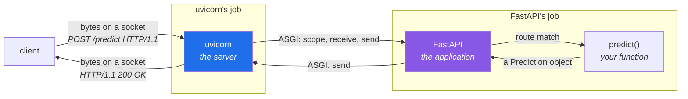

# 1.2 — What an HTTP framework actually gives you

## One-line answer

A web framework does not "run your service" — it turns bytes on a socket into a function call and back
again, and it is **two separate programs** doing that: a server that speaks HTTP, and an application
that speaks Python.

---

## The story

🎬 **The scene.** A hotel. A guest arrives at reception and says they would like a taxi to the station
at eight. The receptionist writes it down, phones a taxi firm, and later tells the guest a car will be
outside at ten to.

😬 **The naive fix.** From the guest's side there is one thing here: "the hotel arranged a taxi". If
the car does not come, the hotel is at fault, and that is where you complain.

💥 **Why it fails.** It does not fail, but it hides something that matters the moment anything goes
wrong. There are two organisations, with a boundary between them and an agreed protocol across it. If
the car does not arrive, the useful question is *which side*: did reception forget to phone, or did the
firm forget to send. The answers are completely different and the fixes are in different buildings.

💡 **The insight.** "The hotel arranged a taxi" is a true description of the *outcome* and a useless
description of the *system*. The moment you have to fix something, you need to know where the boundary
is, what crosses it, and which side you are standing on.

---

## The idea in plain language

When `pulse` answers a request, two distinct programs are involved.

**The server** owns the network. It holds the socket, accepts connections, reads the bytes, and
understands that `POST /predict HTTP/1.1\r\nHost: ...` is a request with a method, a path, headers and
a body. It knows nothing about tickets or predictions. For `pulse` this is **uvicorn**.

**The application** owns the logic. It receives a request as a structured thing — method, path,
headers, body — and returns a status code, headers and a body. It knows nothing about sockets, TCP or
the byte format of an HTTP header. For `pulse` this is **FastAPI**, and the object called `app`.

Between them is an **interface**: an agreement about how the server hands a request to the application
and gets a response back. In Python that agreement is called **ASGI** — the Asynchronous Server Gateway
Interface — and its whole content is that the application is a callable taking three arguments:

```text
async def app(scope, receive, send)
```

`scope` is a dictionary describing the request; `receive` is a function the app awaits to get the body;
`send` is a function the app calls to emit a response. **That is the entire interface**, and every ASGI
server and every ASGI framework in Python agrees on it.

### Why the boundary is worth knowing

Because it tells you where a problem is, and the two sides fail completely differently:

| Symptom | Which side | Why |
| --- | --- | --- |
| connection refused | **server** — it is not listening | the application was never reached |
| the process starts and then exits | **server** — it could not bind the port | [5.1](../05-failure/5.1-the-four-errors-of-a-first-run.md) |
| `404 Not Found` | **application** — no route matched | the server did its job perfectly |
| `422 Unprocessable Entity` | **application** — validation refused the body | ditto |
| a Python traceback in the log, `500` to the client | **application** | ditto |
| the request hangs with no response | either — and telling them apart is the skill | Day 7 |

Every row above `404` is a server problem; every row from `404` down is an application problem, and
**the server is working perfectly in all of them.** An operator who does not hold this boundary spends
the first ten minutes of every incident in the wrong program.

### What the framework actually does for you

It is worth being concrete, because "a framework" is vague and the specific services are what you are
choosing:

**Routing.** Mapping a method and a path to a function. `POST /predict` → `predict()`. Without it you
write a chain of `if` statements, which works and does not scale past about six routes.

**Deserialisation and validation.** Turning a request body of bytes into a Python object, and refusing
it if it is the wrong shape. FastAPI does this with **pydantic** — a library that builds a validator
from a class definition — and it is the single largest thing the framework saves you, because hand-written
validation is where bugs live.

**Serialisation.** Turning your return value back into JSON bytes with the right content type.

**Error translation.** Turning a validation failure into a `422` with a body naming the field, rather
than a traceback and a `500`.

**A machine-readable description of the API.** FastAPI generates an **OpenAPI** document from the
function signatures and the pydantic models — a JSON description of every route, its inputs and its
outputs. That document is what
[3.3](../03-running-it/3.3-the-interactive-docs-and-why-you-turn-them-off.md) is about, and it is more
useful than it first appears: it can generate clients, drive contract tests, and tell you when a change
broke a caller.

**What it does not do:** run your process, restart it, decide how many copies exist, keep it alive,
route traffic between instances, or make it observable. Every one of those is somebody else's job, and
they are Days 4, 26, 34, 39 and 63 respectively. **Knowing the size of the framework's job is what
stops you looking for a solution in the wrong place.**

### `async`, briefly and honestly

ASGI's `async` matters and you do not need to understand it yet. The short version: an `async` server
can hold thousands of connections that are *waiting* without needing a thread for each one, which is
exactly the resource-exhaustion problem from
[Day 2, part 2.3](../../../day-002-shape-of-production-system/parts/02-dependencies/2.3-the-dependency-that-fails-slowly.md).
`pulse`'s route functions are written as plain `def` rather than `async def`, and FastAPI runs those in
a thread pool automatically. That is the right choice today and the reason it is the right choice —
along with when it stops being — is Day 110's subject. **This is a deferred explanation with an
address**, which is the rule in plan §17.4.

---

## Why Kriya needs it

Day 39 is *"`pulse` on Kubernetes — the first real deploy"*, and Day 41 is *"Probes"*.

In a cluster the two programs from this part are joined by a third, a fourth and a fifth: a container
runtime that starts the process, a kubelet that watches it, and a Service that routes to it. When a
pod is `CrashLoopBackOff` on Day 40, the question is always *which layer* — did the container fail to
start, did the server fail to bind, or did the application fail to import? Today's boundary is the first
of those seams, and the habit of asking "which side?" is what makes Day 40 tractable.

Nearer: [5.1](../05-failure/5.1-the-four-errors-of-a-first-run.md) shows four first-run errors, and
their whole taxonomy is *server side* versus *application side*.

---

## The mechanism

You can see the boundary directly, because the ASGI interface is small enough to implement by hand. This
is a complete ASGI application with no framework at all:

```python
# lab/bare_asgi.py — an ASGI app in twelve lines. No framework.
async def app(scope, receive, send) -> None:
    assert scope["type"] == "http"
    await send(
        {
            "type": "http.response.start",
            "status": 200,
            "headers": [(b"content-type", b"text/plain")],
        }
    )
    await send({"type": "http.response.body", "body": b"hello from bare ASGI\n"})
```

**Line by line:**

- `async def app(scope, receive, send)` — the entire ASGI contract. Any server that speaks ASGI can run
  this, and any framework you use is ultimately producing a callable with this signature. `FastAPI()`
  returns one.
- `scope["type"] == "http"` — `scope` is a plain dictionary describing the connection. Its `type` can
  also be `"lifespan"` (startup and shutdown, which is where the `Waiting for application startup`
  line in [3.2](../03-running-it/3.2-reading-the-startup-output.md) comes from) or `"websocket"`. The
  assertion is a stand-in for the branching a real app does.
- `await send({...})` twice, and **the two-message structure is the interesting part**: headers and
  status go first, the body second. That split is what makes streaming possible — a response can start
  before its body is finished, which is exactly how a language model streams tokens (Day 131).
- `headers` are a list of tuples of **bytes**, not strings. HTTP is a byte protocol; the framework's
  convenience of letting you return a Python dictionary is a layer on top of this.
- `receive` is unused here because this response ignores the request body. A real app awaits it.

Run it with the same server that will run `pulse`:

```bash
uv run uvicorn bare_asgi:app --host 127.0.0.1 --port 8010
curl -sS http://127.0.0.1:8010/anything
```

**Line by line:**

- `uvicorn bare_asgi:app` — the argument is `module:attribute`. Uvicorn imports the module and looks
  for that name. It does not care that this one is not FastAPI, because **the interface is the
  contract, not the framework**. Getting either half of that argument wrong produces one of the two
  errors in [5.1](../05-failure/5.1-the-four-errors-of-a-first-run.md).
- `--host 127.0.0.1` binds to loopback only. The default is also loopback, and stating it explicitly is
  the habit worth having, because the day you deploy this the default is wrong.
- `/anything` — the path is ignored, because there is no routing. That absence is the framework's first
  job, made visible.

```text
hello from bare ASGI
```

Now the same thing with the framework, which is what you build in section 2:



---

## When it breaks

The characteristic confusion is attributing a failure to the wrong side. Here are the two errors that
look identical to a beginner and come from different programs. Both observed on **2026-08-24**.

First, a **server-side** failure — uvicorn could not load the application at all:

```text
ERROR:    Error loading ASGI app. Could not import module "pulse.app".
```

**What it says:** the module named on the command line does not exist.
**What it actually means:** you typed `pulse.app:app` and the file is `pulse/api.py`. Nothing about
your code is wrong. The server never got as far as your application, so no amount of reading `api.py`
will help.

Second, and this is the one worth staring at:

```text
ERROR:    Error loading ASGI app. Attribute "application" not found in module "pulse.api".
```

**What it says:** the module imported fine; the attribute did not exist.
**What it actually means:** the `module:attribute` argument's second half is wrong. **Notice the
message distinguishes the two halves**, which is a small kindness and a good example of what a useful
error message does: it tells you which of two adjacent things failed, so you do not have to try both.

Now an **application-side** failure, which arrives with the server working perfectly:

```text
HTTP/1.1 404 Not Found
date: Mon, 24 Aug 2026 09:39:19 GMT
server: uvicorn
```

**What it says:** not found.
**What it actually means:** uvicorn accepted the connection, parsed the request, handed it to FastAPI,
FastAPI matched it against its routing table, found nothing, generated a `404`, and uvicorn wrote it
back. **Six things worked in order to produce that failure.** The header `server: uvicorn` in the
response is the tell — a response with headers came from a running application; a connection refused
did not.

**The smallest fix** for the `404` is a correct path — that request was for `/health` and the route is
`/healthz`. **The smallest fix** for the two loading errors is the right `module:attribute`. The
diagnostic move that gets you to either in seconds is asking *which side*.

---

## In production

**What a professional writes instead of the teaching version.** They do not run uvicorn's development
invocation in production. The usual production shape is a process manager running several uvicorn
workers — `gunicorn` with a uvicorn worker class, or `uvicorn --workers N` — because one uvicorn process
uses one CPU core for Python code, and a machine with four cores serving from one process is using a
quarter of what it has. That decision interacts with everything in Phase 5 (a container per pod, a pod
per core, requests and limits) and is deliberately deferred to Day 42, where there is a cluster to
reason about. **Today one process is correct, because there is one thing to learn.**

**What degrades at scale.** The framework's conveniences, in specific and predictable ways. Automatic
validation costs CPU per request and becomes measurable on large bodies; automatic serialisation
allocates; the OpenAPI document is generated once at startup and grows with the API. None of these
matter at ten requests per second and all of them appear in a profile at ten thousand. The general rule
worth carrying: **a framework's convenience is paid for per request**, and the bill arrives at scale.

**The failure that only shows with real traffic.** Blocking code in a route that the framework runs on
its event loop. If a route is declared `async def` and then calls something synchronous and slow — a
plain database driver, a file read, `time.sleep` — it blocks the *entire* event loop, so every other
request on that worker stops, not just this one. It is the thread-exhaustion failure from
[Day 2, part 2.3](../../../day-002-shape-of-production-system/parts/02-dependencies/2.3-the-dependency-that-fails-slowly.md)
with a single shared resource instead of a pool, and it is invisible until concurrency arrives.
`pulse`'s routes are plain `def` precisely to avoid this class until Day 110 explains it properly.

**The review comment a senior engineer leaves.** *"This route is `async def` and it calls a synchronous
client. That blocks the event loop for every other request on this worker. Either make it `def` and let
the framework use a thread, or use an async client — but don't mix them."*

**The signal you would alert on.** Nothing from the framework itself today. The one framework-level
signal worth knowing exists is **event-loop lag** — how long the loop takes to get back round — which is
the direct measurement of the failure above and is invisible in CPU, memory and request-rate graphs.
It arrives on Day 110. Today's honest answer is that `pulse` emits no signals at all: uvicorn prints an
access line per request to standard output and nothing collects it, which is
[Day 2's](../../../day-002-shape-of-production-system/parts/04-blast-radius/4.2-drawing-the-blast-radius-map.md)
*"nobody notices"* row, on purpose, until Day 61.

**Blast radius.** The bare ASGI app in this part binds a loopback port and returns a constant. Worst
case is a leftover process on port 8010 — and remember from
[Day 2, part 2.3](../../../day-002-shape-of-production-system/parts/02-dependencies/2.3-the-dependency-that-fails-slowly.md)
that on Windows a second bind may *succeed* rather than refuse, so verify with `netstat -ano | grep
:8010` rather than trusting the `kill`. What bounds it: the explicit loopback bind, and the fact that
the application has no inputs, no state and no write path.

**Cost:** `0` model calls, `0` tokens. One Python process at roughly 40 MB while it runs; `0` MB
resident afterwards.

**The interview question.** *"What's the difference between uvicorn and FastAPI?"* It sounds like
trivia and it is a real filter: one is a server that speaks HTTP and owns the socket, the other is an
application framework that speaks ASGI and owns the routing and validation, and the interface between
them is why you can swap either. The follow-up that separates people who have deployed something:
*"which one would you look at first for a connection refused, and which for a 422?"*

---

## Check yourself

```bash
uv run python -c "from pulse.api import app; print(type(app)); print([r.path for r in app.routes])"
```

The application object is a Python object with a routing table you can print. It is not magic, and
seeing its routes listed — including the ones FastAPI added for you — is worth doing once.

**Say out loud, without scrolling up:** *a request returns `404`. Which of the two programs produced
it, and what does that tell you about the other one?*
