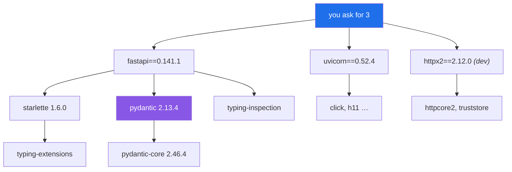

# 1.3 — Choosing the pieces, and pinning them

## One-line answer

Three packages arrive today. Each one is looked up live rather than remembered, each is pinned with
`==`, and each gets a dated row saying **why**. One of them is not the package you would have guessed,
which is the entire argument for looking.

---

## The story

🎬 **The scene.** A recipe handed down in a family says *"a tin of tomatoes"*. Somebody follows it and
it is fine. Twenty years later somebody else follows the same recipe and it comes out watery and
disappointing.

😬 **The naive fix.** Cook it for longer. Add tomato purée. Decide the recipe was never that good.

💥 **Why it fails.** The tin changed. Not the recipe and not the cook, but the tin. It used to be 400
grams and it is now 390. It used to be whole plum tomatoes and it is now chopped in juice. Nobody
announced it, nobody was wrong, and the recipe still says exactly what it always said. **The
instruction was written against a thing that moves, and it did not record which version of that thing
it meant.**

💡 **The insight.** The recipe is not wrong. It is *underspecified*, and the failure was silent because
the underspecification only started to matter after the world moved. Writing "one 400 g tin of whole
plum tomatoes" costs four words and removes the entire class of problem, forever, for everybody who
ever cooks it.

---

## The idea in plain language

`pulse` needs three packages, and Principle 7 governs how they arrive: **never invent a version
number. Look it up live, or leave a `TODO` with the exact lookup command.**

| Package | Why this one | What it is |
| --- | --- | --- |
| `fastapi` | routing, validation, serialisation and an OpenAPI document, all from function signatures | the application framework ([1.2](1.2-what-an-http-framework-gives-you.md)) |
| `uvicorn` | the ASGI server FastAPI's own documentation uses, and the one everything downstream assumes | the server |
| `httpx2` | the HTTP client `starlette.testclient` requires, and there is a story below | a development dependency, for tests only |

Two of those are obvious. The third is the interesting one, and it is the reason this part exists.

### Why "look it up" is a rule rather than advice

There are three separate failures it prevents, and they are genuinely different failures.

**A version that never existed.** You write `fastapi==0.104.1` from memory. Perhaps that release exists
and perhaps it does not. If it does not, `uv` refuses and you have lost a few minutes. This is the
harmless case.

**A version that exists and is old.** You write a version you used on another project last year. It
installs. Everything works. You are now nine months behind on security fixes and reading documentation
that describes a different API, and **nothing will tell you**, because nothing is wrong.

**A package that has been replaced.** This is the one that happened today. You reach for the package
you have always used, it installs, the tests pass, and a warning you did not read says the ecosystem
has moved underneath you.

### The one that actually happened

Writing the first test for `pulse` with `httpx==0.28.1`, which is the obvious choice and the client
everybody uses, produced four passing tests and this:

```text
StarletteDeprecationWarning: Using `httpx` with `starlette.testclient` is deprecated;
install `httpx2` instead.
```

Looked up live on **2026-08-24**: `httpx2` exists, its current version is `2.12.0`, it was released on
2026-08-18, and it describes itself as *"The next generation HTTP client"*. Switching the pin removed
the warning and the tests still pass.

**Three things are worth taking from that.**

The tests passed either way. If you judge by green ticks you learn nothing here, and you carry a
dependency that is on its way out until something breaks in six months.

**The warning was in the output and would have been skimmed.** `pytest -q` prints a warnings summary,
and it is exactly the kind of block that trains people to read the last line only. Reading it cost
seconds. Not reading it costs a confusing upgrade later.

**A recommendation from inside the library beats a habit from outside it.** `starlette` is the layer
FastAPI's test client is built on, so it knows what it wants. That is a much better signal than what
you happened to use last time.

### What `==` buys, and what it does not

`fastapi==0.141.1` means exactly that release, not `0.141.2` and not `0.142.0`. Combined with a
committed `uv.lock`, it means the **whole tree underneath** is fixed too, because `starlette`,
`pydantic`, `pydantic-core`, `typing-extensions` and the rest are pinned by hash even though you never
named them.

What that gives you is the same install today, in CI on Day 13, in a container on Day 23, and on Day
107 when you have to reproduce a six-month-old result.

What it does not give you is safety. A pinned dependency with a vulnerability stays pinned, and staying
still is a decision with its own cost. **Pinning does not mean never upgrading. It means upgrading
deliberately, on a day when you are paying attention**, which is Day 232's subject. The lockfile makes
the upgrade a reviewable diff rather than a surprise.

---

## Why Kriya needs it

Day 15 is *"Build artifacts and reproducibility: the lockfile, the hash, and the first SBOM"*, and Day
107 is *"reproduce a prediction from six months ago"*.

Day 107 is the exam. It needs the commit, the lockfile as it was on that day, the model artifact and
the data version, and the lockfile only helps if it was committed and if the pins were exact. A range
like `fastapi>=0.141` resolves to something different every time it is installed, which means a result
you cannot reproduce and cannot explain.

`docs/PACKAGES.md` is the human half of this. The lockfile records *what*, the ledger records *why*, and
on Day 232 the *why* is what tells you whether an upgrade is safe to take.

---

## The mechanism

Look them up, and then pin them.

```bash
for p in fastapi uvicorn httpx2; do
  v=$(curl -s "https://pypi.org/pypi/$p/json" | python -c "import sys,json;print(json.load(sys.stdin)['info']['version'])")
  echo "$p == $v"
done
```

**Line by line:**

- `curl -s "https://pypi.org/pypi/$p/json"` fetches PyPI's JSON metadata for a package. This is the
  authoritative source rather than a search result, and it is the **exact lookup command** that
  Principle 7 asks you to leave in a `TODO` when a lookup fails.
- `-s` suppresses the progress meter so that only the JSON reaches the pipe. Without it the meter is
  written to standard error and clutters the terminal without breaking the pipeline, which is a
  distinction worth having noticed once.
- `python -c "...['info']['version']"` reads the current release out of the metadata. Parsing JSON with
  a JSON parser rather than with `grep` is the point, because a `grep` for `"version"` matches the
  version of every release in the file rather than the current one.
- The loop keeps the three lookups identical, so that you cannot accidentally check two of them a
  different way.

Observed on **2026-08-24**:

```text
fastapi == 0.141.1
uvicorn == 0.52.4
httpx2 == 2.12.0
```

Add them, exactly.

```bash
uv add fastapi==0.141.1 uvicorn==0.52.4
uv add --dev httpx2==2.12.0
```

**Line by line:**

- `uv add` writes the pin into `pyproject.toml`, resolves the whole tree, updates `uv.lock` and
  installs into `.venv`. That is four things from one command, which is why Day 0 chose one tool to own
  the environment.
- `==` and nothing else. No `~=` and no `>=`. Ranges are how you get a build that worked yesterday and
  fails today with no change in your repository.
- **`--dev` for `httpx2`.** It exists only to let the tests make requests. Putting it in the runtime
  dependencies would ship it into the container on Day 23, which means a larger image, a wider supply
  chain on Day 29, and one more thing in the SBOM on Day 15, for no benefit. **The split between dev
  and runtime is a security and size decision rather than bookkeeping.**
- `fastapi` and `uvicorn` go in one command because they are one decision. Separate commands would make
  two commits' worth of noise out of one change.

Then check what actually arrived, because you asked for three packages and did not get three.

```bash
uv pip list
```

**Line by line:** `uv pip list` shows the installed tree rather than the requested one, and the
difference is
[Day 2, part 2.2](../../../day-002-shape-of-production-system/parts/02-dependencies/2.2-every-dependency-is-a-decision.md)'s
whole subject. Today is the day it stops being an abstraction.

Observed on **2026-08-24**, after adding the three, in the scratch project this day was written
against:

```text
+ fastapi==0.141.1
+ httpcore2==2.12.0
+ httpx2==2.12.0
+ pydantic==2.13.4
+ pydantic-core==2.46.4
+ starlette==1.6.0
+ truststore==0.10.4
+ typing-extensions==4.16.0
+ typing-inspection==0.4.4
+ uvicorn==0.52.4
```

**Ten packages, for three requests.** Two of them are worth naming, because you will meet them by name
in tracebacks for the next two hundred days. `starlette` is the layer FastAPI is built on, and it is
where `TestClient` actually lives. `pydantic` is what turns your class definitions into validators, and
its error messages are the `422` bodies in
[2.4](../02-the-service/2.4-predict-the-contract-before-the-model.md). **A traceback that names a
package you did not install is not a mystery. It is your dependency tree.**



---

## When it breaks

There are three failures, in increasing order of how long they cost you.

**A version that does not exist.** This one is loud, immediate and cheap.

```text
error: Distribution not found at: https://pypi.org/simple/fastapi/
  ╰─▶ Because there is no version of fastapi==0.999.0 and your project depends on
      fastapi==0.999.0, we can conclude that your project's requirements are unsatisfiable.
```

**What it says:** no such release.

**What it actually means:** you invented a version, and the tool caught you. **This is the best
possible outcome of guessing**, because it fails at install time, before anything is built on top of
it.

**A dependency conflict.** This one is slower, and the message is genuinely useful if you read it.

```text
  × No solution found when resolving dependencies:
  ╰─▶ Because fastapi==0.141.1 depends on starlette>=0.46.0 and you require
      starlette==0.37.0, we can conclude that your requirements are unsatisfiable.
```

**What it says:** two of your pins cannot both hold.

**What it actually means:** you pinned a transitive dependency by hand. The resolver is reporting the
*chain*, where `fastapi` needs at least `0.46.0` and you asked for `0.37.0`, and the fix is almost
always to remove your pin and let the lockfile hold it, because pinning a transitive dependency
directly means taking on a maintenance job the resolver was already doing for you.

**And the one that does not break at all.** The deprecation.

```text
============================== warnings summary ===============================
.venv\Lib\site-packages\fastapi\testclient.py:1
  ...\fastapi\testclient.py:1: StarletteDeprecationWarning: Using `httpx` with
  `starlette.testclient` is deprecated; install `httpx2` instead.
    from starlette.testclient import TestClient as TestClient  # noqa

-- Docs: https://docs.pytest.org/en/stable/how-to/capture-warnings.html
4 passed, 1 warning in 0.48s
```

**What it says:** four tests passed.

**What it actually means:** four tests passed *and* the library told you the ground has moved. The last
line is what people read, and the block above it is the one that matters. After swapping the pin:

```text
....                                                                     [100%]
4 passed in 0.45s
```

**The smallest fix** was one word in `pyproject.toml`. **The cost of not doing it** is that the warning
stays, becomes furniture, and is one day joined by a real one that also gets ignored, which is exactly
the alert-fatigue failure from
[Day 1, part 1.2](../../../day-001-what-operations-actually-is/parts/01-what-ops-is/1.2-does-it-work-versus-is-it-working.md),
at the scale of a test suite.

---

## In production

**What a professional writes instead of the teaching version.** They separate three things that
beginners run together: the **declared** dependency, which is a pin or a range in the manifest, the
**resolved** tree, which is the lockfile and is committed, and the **installed** set, which is what is
actually in the environment and can drift from both. A CI step that installs from the lockfile and then
verifies the lockfile is unchanged catches the third drifting from the second, and it is the same
*"generated artifact is up to date"* check as
[Day 1, part 2.5](../../../day-001-what-operations-actually-is/parts/02-the-repo-remembers/2.5-generated-files-you-never-edit.md).
Day 14 adds it.

**What degrades at scale.** The upgrade decision. Three direct dependencies is a set you can read. A
machine-learning service has fifty direct and six hundred underneath them, and at that point "should we
take this upgrade?" needs a policy rather than a judgement. The parts of that policy this plan builds
are an SBOM so that you know what you have (Day 15), scanning so that you know what is vulnerable (Day
29), and a pipeline that can go red so that an upgrade is testable rather than hopeful (Day 13).

**The failure that only shows with real traffic.** A dependency whose *behaviour* changed without its
API changing. The signature is identical, your tests pass, and a default moved. A timeout that used to
be infinite is now thirty seconds, a client that used to retry no longer does, a serialiser that used
to allow something now refuses. Nothing in your pipeline can see it, because nothing in your pipeline
exercises the path under load. This is the strongest argument for exact pins, and for reading
changelogs on upgrade rather than only diffs.

**The review comment a senior engineer leaves.** *"This adds `httpx` to the runtime dependencies and it
is only used in tests. That is a larger image, a wider attack surface and an extra SBOM entry we ship
to production for no reason. Move it to the dev group."*

**The signal you would alert on.** Not a runtime signal, because this is a build-time concern and the
right mechanism is a gate rather than a page. There are two gates, both arriving later: **the lockfile
is unchanged after a clean install**, which is Day 14 and a build failure, and **no dependency has a
known vulnerability above your threshold**, which is Day 29 and a build failure with an explicit
override path. What you would *not* do is alert on "a newer version is available", which fires
constantly and trains people to dismiss it.

**Blast radius.** `uv add` writes `pyproject.toml`, rewrites `uv.lock` and installs into `.venv`. The
worst case is that a resolution quietly changes a transitive version you did not intend, which is
precisely what the committed lockfile makes visible, because `git diff uv.lock` after an `add` shows
every version that moved. Anybody running `uv add` or `uv sync` can trigger it. What bounds it is that
the lockfile is committed and diffable, `.venv` is disposable and can be regenerated with one command,
and nothing here touches anything outside the project directory. **Read the `uv.lock` diff before
committing**, because it is the only place a surprise shows up.

**Cost:** `0` model calls and `0` tokens. On the network it is about 40 MB of wheels downloaded once
and then cached, and on disk it is roughly 40 MB added to `.venv`. Three lookups against `pypi.org`,
which is free and unmetered.

**The interview question.** *"How do you manage dependencies?"* The weak answer names a tool. The
strong answer names the three states, declared, locked and installed, says which one is committed and
why, and then makes the point most people miss: pinning is not about avoiding upgrades. It is about
making upgrades a deliberate, reviewable event rather than something that happens to you on a Tuesday.

---

## Check yourself

```bash
uv run python -c "import fastapi, uvicorn; print(fastapi.__version__, uvicorn.__version__)" && grep -c '==' pyproject.toml
```

The installed versions, taken from the packages themselves rather than from your manifest. If they
disagree with `pyproject.toml`, the environment has drifted and `uv sync` is the fix.

**Say out loud, without scrolling up:** *the tests passed with the deprecated package and passed with
the new one. What told you to switch, and what would have happened if you had judged only by whether
the tests were green?*
